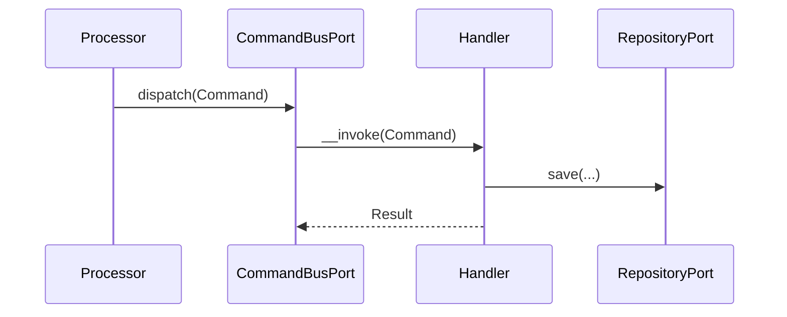

# __MODULE__ Module

## Overview

__MODULE__ manages __MODULE_PURPOSE__.

Main goals:

- __GOAL_ONE__
- __GOAL_TWO__
- __GOAL_THREE__

## API Endpoints

| Method | Path | Description |
| --- | --- | --- |
| POST | `__CREATE_PATH__` | __CREATE_DESCRIPTION__ |
| GET | `__LIST_PATH__` | __LIST_DESCRIPTION__ |
| GET | `__GET_PATH__` | __GET_DESCRIPTION__ |

## Flows

### __COMMAND_FLOW_NAME__

## Domain Model

- `__AGGREGATE__` — __AGGREGATE_DESCRIPTION__

## Persistence

- Tables: `__TABLE_ONE__`
- Doctrine mapping: `src/__MODULE__/Infrastructure/Persistence/Doctrine/Record`

## Configuration

- Service wiring: `config/modules/__MODULE_SNAKE__.yaml`
- Doctrine mapping: `config/packages/doctrine.yaml`

## Testing

- Unit: `tests/Unit/__MODULE__/`
- Integration: `tests/Integration/__MODULE__/`
- Functional: `tests/Functional/Api/`
