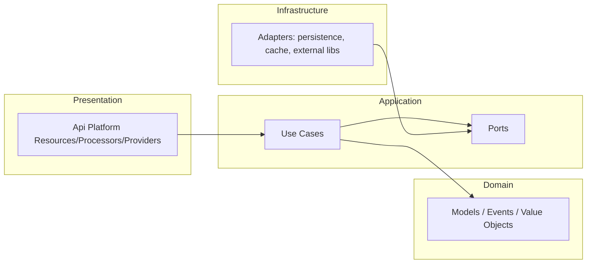

# Module Architecture Standard

This document defines how to build a complete module in this repo.
It captures the shared standards (hexagonal architecture, Api Platform,
ports/adapters, tests, and documentation). It is intentionally generic
and does not describe a specific module or protocol.

## Goals

- Provide a consistent module layout and naming scheme.
- Keep business logic in use cases, not in processors/controllers.
- Make dependencies explicit through ports and adapters.
- Ensure configuration, documentation, and tests are complete.

## Core Principles

- Hexagonal architecture (Ports and Adapters).
- One-way dependencies:
  - Presentation -> Application -> Domain
  - Infrastructure -> Application (implements ports)
  - Domain has no dependency on other layers.
- Use cases are the single entry point for business logic.
- External libraries are always behind adapters.



## Standard Directory Layout

Use this structure for any module (replace `<Module>`):
```
src/<Module>/
  Application/
    Contract/      (optional, cross-module contract types)
      <Area>/      (optional, group contract types by context)
    Port/
      Outbound/
        <Area>/      (optional, group ports by context)
      Inbound/        (optional)
        <Area>/      (optional, group ports by context)
    Service/
    UseCase/
      Command/
        <Area>/
          <UseCase>/
            <UseCase>Command.php
            <UseCase>Handler.php
            <UseCase>Result.php
      Query/
        <Area>/
          <UseCase>/
            <UseCase>Query.php
            <UseCase>Handler.php
            <UseCase>Result.php
  Domain/
    Model/
      <Aggregate>/
    ValueObject/
    Event/
    Exception/
  Infrastructure/
    Adapter/
    Persistence/Doctrine/
      Repository/
      Record/
      Mapper/              (optional)
    Cache/                (optional)
    <Context>/            (optional, dedicated integration)
      Adapter/
      Entity/             (optional)
      Repository/         (optional)
      Server/             (optional)
    Console/
    DataFixtures/
    EventSubscriber/
  Presentation/
    Api/
      Resource/
      Operation/
      Processor/
      Provider/
      Service/              (optional, presentation helpers)
      Dto/
        Input/
          <Area>/
        Output/
          <Area>/
      Validator/
        <Rule>/
      EventSubscriber/
      Serialization/
```

### Context-Oriented Subfolder Examples

Use a dedicated context folder when an integration grows beyond a single adapter.
Examples of context layouts (replace names with your domain):
```
Infrastructure/
  Persistence/Doctrine/
    Repository/
    Record/
    Mapper/

  Identity/
    Adapter/

  OAuth2/League/
    Entity/
    Repository/
    Server/

  Oidc/
    Adapter/

  Payment/
    Adapter/

  Notification/
    Adapter/
```

### Validation Subfolder Example

Custom validators use their own folder:
```
Presentation/Api/Validator/
  ValidRedirectUri/
    ValidRedirectUri.php
    ValidRedirectUriValidator.php
```

### Use Case Grouping Example

Group use cases by area to keep the Application layer readable:
```
Application/UseCase/
  Command/
    Client/
      RegisterClient/
      UpdateClient/
    Token/
      IssueToken/
      RevokeToken/
  Query/
    Client/
      GetClient/
      ListClients/
    Token/
      IntrospectToken/
```

### Presentation Subfolder Examples

Organize API concerns by area (replace with your module areas):
```
Presentation/Api/
  Resource/
    ClientResource.php
    TokenResource.php
  Operation/
    ClientOperations.php
    TokenOperations.php
  Processor/
    Client/
      CreateClientProcessor.php
      UpdateClientProcessor.php
    Token/
      IssueTokenProcessor.php
      RevokeTokenProcessor.php
  Provider/
    Client/
      ClientProvider.php
  Service/
    CookieService.php
```

## Naming Conventions

- UseCase:
  - Command: `<Action>Command`, Handler: `<Action>Handler`, Result: `<Action>Result`
  - Query: `<Action>Query`, Handler: `<Action>Handler`, Result: `<Action>Result`
- Ports: `<Capability>Port` (interfaces in Application/Port)
- Adapters: `<Capability>Adapter` or `<Entity>Repository`
- Processors: `<Action>Processor`
- Providers: `<Resource>Provider`
- DTOs: `<Action>Input`, `<Action>Output`
- Operations: `<Module>Operations` with route constants
- Contracts: keep stable enums/DTOs under `Application/Contract`, and prefer names distinct from use case results

Keep namespaces aligned with folder layout.

## Application Layer Standard

### Use Cases

- Implement business logic in handlers, not in processors.
- Use CommandBusPort for writes and QueryBusPort for reads.
- Return Result objects, not raw arrays.
- Emit domain events for significant state changes.

### Ports

- Define external dependencies as ports under Application/Port/Outbound.
- Group ports by area under `Application/Port/Outbound/<Area>` and `Application/Port/Inbound/<Area>` when it keeps the Application layer readable.
- Do not reference infrastructure classes in handlers.
- If another module is required, depend on its port and contract types, not its adapter or domain.

Example registration (config/modules/<module>.yaml):
```
<Module>\Application\Port\Outbound\FooPort:
  alias: <Module>\Infrastructure\Adapter\FooAdapter
```

### Contracts

- Expose cross-module types (enums/DTOs) under `Application/Contract`.
- Ports may reference contract types; do not expose Domain types outside the module.
- Keep contract types stable and independent from framework/persistence details.

## Presentation Layer Standard (Api Platform)

- Define resources under Presentation/Api/Resource.
- Define operations under Presentation/Api/Operation.
- Implement processors/providers under Presentation/Api/Processor and Provider.
- Use Input/Output DTOs with serialization groups.
- Use Symfony Validator constraints and custom validators for complex rules.
- Centralize error mapping via EventSubscriber when needed.

Checklist for each endpoint:
- Resource with proper route and security.
- Operation constant and metadata.
- Input/Output DTOs.
- Processor (write) or Provider (read).
- Validation rules and error mapping.
- Functional tests for success and error cases.

## Domain Layer Standard

- Models and ValueObjects enforce invariants.
- Exceptions define domain errors that map to API errors.
- Events capture significant state changes.
- Domain must not depend on Application, Presentation, or Infrastructure.

## Infrastructure Layer Standard

- Adapters implement ports for external systems:
  - Persistence (Doctrine repositories)
  - External services (vendor APIs, protocols)
  - Cache
  - Messaging/logging integrations
- Keep persistence logic in repositories (no business rules).
- Hide third party library types behind adapters.
- If a module needs a dedicated integration, create a new folder under
  Infrastructure with its own Adapter subfolder (no global External folder).

## Configuration Standards

### Service Wiring

- Each module has a config file: `config/modules/<module>.yaml`.
- Register ports with aliases to adapters.
- Register processors/providers and event subscribers.
- Keep env driven config under `config/packages` or `.env`.

### Security

- Add API access rules in `config/packages/security.yaml`.
- Keep public endpoints explicit and limited.
- Use roles or scopes per endpoint where applicable.

### Rate Limiting (Optional)

- Define limiters in `config/packages/rate_limiter.yaml`.
- Inject limiter into processors with `#[Autowire(service: 'limiter.<name>')]`.

## Documentation Standard (MODULE.md)

Each module must have `src/<Module>/MODULE.md` with:
- Overview
- API endpoints (table)
- Flows (sequence diagrams)
- Architecture
- Configuration
- Testing
- Error codes (if applicable)

Keep MODULE.md current with code changes.

## Testing Standard

- Unit: `tests/Unit/<Module>`
  - Handlers
  - Adapters
  - Domain models/value objects
- Functional: `tests/Functional/Api`
  - Endpoint contract tests
- E2E: `tests/E2E`
  - Full flows across endpoints

Minimum tests for a new endpoint:
- Processor or provider unit test
- Use case handler unit test
- Functional API test

## Module Completion Checklist

- [ ] Directory layout matches the standard.
- [ ] Use cases live in Application/UseCase.
- [ ] Ports exist for external dependencies.
- [ ] Adapters implement ports and are wired in config.
- [ ] DTOs, validators, processors/providers exist per endpoint.
- [ ] Errors are normalized and documented.
- [ ] Security rules are configured.
- [ ] Rate limiting configured where needed.
- [ ] MODULE.md updated.
- [ ] Unit + functional tests exist.

## Refactor Checklist for Existing Modules

- [ ] Move business logic out of processors/controllers into handlers.
- [ ] Replace direct infrastructure usage with ports.
- [ ] Add missing DTOs, validation, and error mapping.
- [ ] Align directory layout and naming.
- [ ] Add missing tests and documentation.
