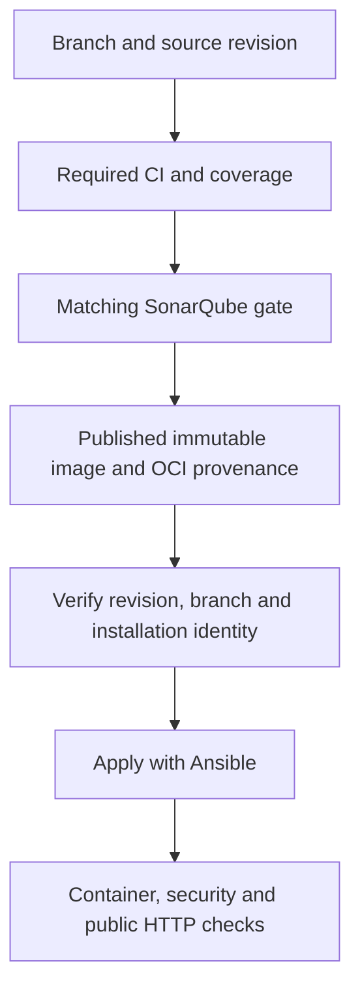

# VPS deployment

**Reading guide:** [Documentation index](docs/README.md) · [Related guide](docs/operations/current-installation.md).

Configure production and development independently, with separate directories,
Compose projects, volumes, databases, keys and URLs. The
[installation appendix](docs/operations/current-installation.md) records the current
VPS identities and the historical volume compatibility requirement.

| GitHub environment | Branch    | Installation values              | Channel   |
| ------------------ | --------- | -------------------------------- | --------- |
| `production`       | `main`    | Configured production variables  | `latest`  |
| `development`      | `develop` | Configured development variables | `develop` |

Retain the installed `COMPOSE_PROJECT_NAME` and `VOLUME_NAME_PREFIX`. A legacy
project migration must stop the old stack without deleting volumes and reuse the
same persistent data. Changing identity requires a deliberate volume migration.

## Pipeline

`.github/workflows/deploy-vps.yml` reacts to completion of CI triggered by a
push to `main` or `develop`, and to manual runs on those branches:

1. Verify the CI run, its branch and SHA, and the corresponding SonarQube quality
   gate; reject the run if the baseline has not been activated.
2. Exclude pushes that change only Markdown files or `docs/**`.
3. Start a second workflow run on the validated branch: GitHub then enforces the
   `main`/`develop` restriction of the environment. This run checks the same CI
   run ID again and rejects a branch that has advanced.
4. Build the validated commit and publish an image tagged `sha-<full SHA>` with
   OCI provenance for the repository and commit.
5. Deploy the image's immutable digest to the GitHub environment selected from
   the validated branch through the Ansible playbook.

The moving `latest` tag on `main` and `develop` tag on `develop` are still
published, but Ansible never receives them as the deployment reference.
Manual CI runs serve diagnostics and do not trigger automatic deployment; a
manual deployment rechecks the CI evidence for the requested commit or image.
`source_run_id` is passed automatically between the two workflow runs; leave it
empty for a manual run. The GitHub variables `SONAR_READY_MAIN` and
`SONAR_READY_DEVELOP` must be enabled separately after the initial scans are
validated (see [SONARQUBE.md](SONARQUBE.md)). Until then, the workflow rejects
deployment from the corresponding branch even if CI succeeds.

Ansible checks for at least 2.5 GiB of available memory and 10 GiB of free disk
space before changing the stack. It retains backups, additive migrations of the
`auth` and `main` databases, RBAC synchronization, JWT checks, a 401 check on
protected routes, and public health checks.

After dependencies start, Redis and Mercure must reach Docker's `healthy` state
before application shutdown and migration steps. Redis uses `redis-cli ping`;
Mercure inherits its image's health probe against the local administration API
`/mercure/health/ready`, which also checks persistent transport. On failure,
deployment stops and displays only their `State.Health` status and bounded probe
history, without a full container inspection or environment variables. An
application or consumer startup failure stops every managed writer and reports
bounded service state; payload-bearing logs remain private. The operation lock
remains held for reviewed recovery.

Repository Compose configurations pin Mercure `v1.0.2` by verified digest and
explicitly enable `protocol_version_compatibility 8` for current clients: JWT
`mercure.publish` / `mercure.subscribe` claims and `topic` / `authorization`
parameters. Signatures remain limited to HS256, and the `authorization` value is
redacted from logs. The historical public `/healthz` route remains for external
probes; it does not replace the internal transport probe. The standard Caddy
file replaces the old `dev.Caddyfile` removed from the image.

This transitional mode preserves the 0.x JWT rules without requiring the new
`iss` / `aud` claims. Removing it requires a coordinated migration of token
issuers and the web client to the native 1.x contracts. Any image update must
verify publishing, private subscriptions, access denial, token redaction, and
history replay before deployment. See the [versioned Mercure 1.0 migration guide](https://github.com/dunglas/mercure/blob/v1.0.0/docs/UPGRADE.md#compatibility-mode).

`python3 .github/scripts/check-mercure-contract.py` tests the versioned configurations
with dummy keys and isolated Docker resources: health, private publishing and
subscriptions, replay on a running hub, access denial, and token redaction.
CI runs this check without application secrets.

The [official 1.0.2 release](https://github.com/dunglas/mercure/releases/tag/v1.0.2)
fixes Bolt history loss after restart and ineffective history-size limits. The
explicit persistent transport uses `/data/mercure.db` with a 10,000-event cap.
`python3 ansible/tests/mercure-replay.py` is a strict isolated acceptance test:
publish private anchor/sentinel events, restart the hub, reconnect from the anchor,
and require exactly the pre-restart sentinel. It publishes nothing after restart.
It also checks anonymous subscription and out-of-scope publication denial. A
green probe alone does not validate replay; run the strict gate on each candidate
hub image. Clients must resynchronize authoritative application state when their
cursor is pruned or a reconnect cannot establish complete history.

## GitHub configuration

`production` accepts only `main`. `development` accepts only `develop`.
Connection secrets are stored in each environment even when they temporarily
have the same value.

Deployment secrets:

- `VPS_HOST`, `VPS_USER`, `VPS_SSH_KEY`
- `VPS_SSH_KNOWN_HOSTS`: complete approved OpenSSH known_hosts entries for this
  environment, verified through an authenticated operator/provider channel.
- `GHCR_TOKEN` if the workflow token is insufficient

SSH deployment fails before Ansible when the reviewed host-key secret is absent,
invalid or does not match the configured host and port. Port 22 uses the bare host;
other ports use `[host]:port`, including IPv6. Hashed entries and multiple approved
keys are supported. Strict checking uses only this reviewed file; the workflow
never obtains trust from a network scan. For a host-key rotation, verify the new
key independently and update the environment secret before redeploying. Existing
image rollbacks use the same current workflow trust gate.

Application secrets specific to each environment:

- `APP_SECRET`
- `POSTGRES_AUTH_PASSWORD`, `POSTGRES_MAIN_PASSWORD`
- `MERCURE_JWT_SECRET`
- `OAUTH_ENCRYPTION_KEY`, `WEBHOOK_ENCRYPTION_KEY`
- `BASIC_AUTH_USERS`, `BASIC_AUTH_CREDENTIALS` in `development`
- `SECURITY_LOG_PII_SALT`
- `GOOGLE_OIDC_CLIENT_SECRET`, `MICROSOFT_OIDC_CLIENT_SECRET` when the providers are enabled
- `STRIPE_SECRET_KEY`, `STRIPE_WEBHOOK_SECRET`

The `API_HOST`, `MERCURE_HOST`, `MAILPIT_HOST`, `DEFAULT_URI`,
`MERCURE_PUBLIC_URL`, `TRAEFIK_API_ROUTER_NAME`,
`TRAEFIK_MERCURE_ROUTER_NAME`, `TRAEFIK_MAILPIT_ROUTER_NAME`,
`DOCKER_PROJECT_NAME`, and `VOLUME_PREFIX` variables control Compose and
Traefik. `VPS_APP_DIR` and `VPS_HEALTHCHECK_URL` control Ansible.

Managed mode (`FIREGUARD_MANAGED_ENV=true`) renders `.env` from GitHub variables
and secrets. Deployment rejects any missing, empty, or unsafe required value
before stopping the application or running migrations.

## Development and Mailpit

`compose.dev.yaml` adds Mailpit with a persistent volume. The application can
reach its SMTP server at `smtp://mailpit:1025`.

The UI is available at the URL configured by `MAILPIT_HOST` (for example `https://mail.dev.example.com`) from
any network. Traefik terminates TLS, requires Basic Auth, and adds
`X-Robots-Tag: noindex,nofollow,noarchive` and `Cache-Control: private,no-store`.
Port `8025` is not published on the host, and the SMTP server on port `1025`
remains limited to the Docker network.

## Development fixtures

Fixtures are never loaded by a push or ordinary deployment. They clear and
rebuild the `auth` and `main` databases, including manually created accounts
and data.

To initialize or reset demo data, manually run the `Deploy VPS` workflow on
`develop` with `reset_development_fixtures` enabled. The workflow then builds
a temporary image containing fixture dependencies, backs up both databases,
stops application processes, applies migrations, reloads the baseline, and
runs the usual health checks.

Requests for any environment other than `development` are rejected. The
production application image is still built with `--no-dev` and does not
contain the fixture loader.

## OAuth, cookies, and Stripe

- Development Google and Microsoft clients use only `dev.*` callbacks and remain disabled until their dedicated credentials are configured.
- Stripe uses a development-specific key, webhook, and test-mode Price IDs.
- Cookies are host-only and `Secure`, preventing sharing between `api.*` and `dev.api.*`.
- `CORS_ALLOW_ORIGIN` and `MERCURE_CORS_ORIGINS` allow only the frontend of the same environment.

## Rollback

Manually run `Deploy VPS` on the branch for the target environment and provide
the older image in `image_ref` (a `sha-<full SHA>` tag or digest). The workflow
checks the repository and SHA OCI labels, finds a successful CI run and green
SonarQube gate for **that branch and commit**, then deploys the resolved digest.
An image without provenance or validated on the other branch is rejected.
Without `image_ref`, manual delivery rebuilds the currently selected commit.
Because paths, projects, and volumes are separate, a development rollback
does not affect production containers or databases.

All application consumers and HTTP writers stop before pre-migration snapshots,
migrations or fixture resets. Persisted transports initialize before any consumer
starts. Local snapshots include both histories and matching files. Explicitly
activated encrypted off-host backups replace new local raw snapshots; see
[backup prerequisites and isolated recovery](docs/operations/migrations-and-backups.md).

## Delivery verification flow

Delivery follows a successful check of the exact source revision, its SonarQube gate and image provenance. Ansible then applies the immutable image using the selected installation identity and health checks.

Arrows show delivery order. A validated development image never authorizes a
production deployment. The workflow defines which events publish/deploy and how
documentation-only changes are classified. Installation values are recorded in the
[appendix](docs/operations/current-installation.md); runtime secrets stay private.
