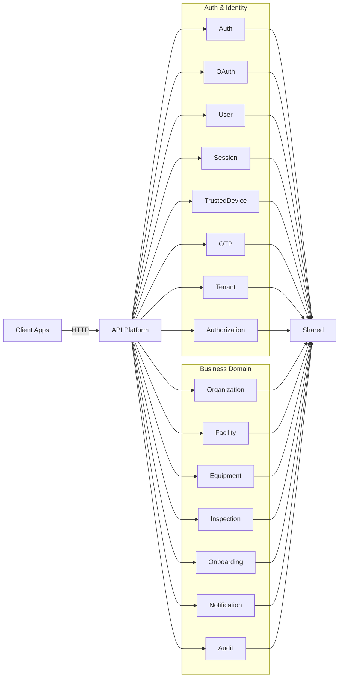

# Fireguard API

Modular API for fire safety management built with Symfony. It covers the full stack: authentication, authorization, OAuth 2.0 / OpenID Connect, and the fire safety business domain (organizations, facilities, equipment, inspections).

---

## Table of Contents

- [Overview](#overview)
- [Features](#features)
- [API surface](#api-surface)
  - [Auth](#auth)
  - [OAuth2 and OIDC](#oauth2-and-oidc)
  - [Discovery](#discovery)
  - [Administration](#administration)
  - [Business domain](#business-domain)
  - [Audit](#audit)
- [Flows](#flows)
  - [OAuth2 and OIDC core flow](#oauth2-and-oidc-core-flow)
- [Architecture](#architecture)
- [Project layout](#project-layout)
- [Configuration](#configuration)
- [Requirements](#requirements)
- [Getting started](#getting-started)
- [Development](#development)
- [Testing](#testing)
- [Code quality](#code-quality)
- [Operations](#operations)
- [Security](#security)
- [License](#license)

---

<div align="right"><a href="#fireguard-api">Back to top</a></div>

## Overview

Fireguard API is a modular platform designed around clear module boundaries and hexagonal architecture. It handles both the authentication / authorization layer and the fire safety business domain within a single deployable unit (modulith).

## Features

| Feature | Description |
| --- | --- |
| OAuth2 and OIDC | Authorization code with PKCE, client credentials, refresh token |
| Token lifecycle | Issue, introspect, revoke, refresh, and discovery metadata |
| Authentication | Login with MFA and OTP (email, SMS, TOTP) |
| Sessions | Session tracking, revocation, and trusted devices |
| Multi-tenant | Tenant-aware resources and policies |
| RBAC | Roles and permissions management |
| Organizations | Organization membership and organization-scoped RBAC |
| Facilities | Location hierarchy (site → building → floor → zone → area) |
| Equipment | Fire safety asset inventory with lifecycle management |
| Inspections | Inspection workflow, checklists, and non-conformity tracking |
| Onboarding | Guided organization onboarding flow |
| Notifications | Email and real-time (Mercure) notification delivery |
| Audit | Append-only, hash-chained security event ledger |
| API Platform | HTTP exposure, validation, and rate limiting |

---

<div align="right"><a href="#fireguard-api">Back to top</a></div>

## API surface

High-level endpoints are grouped below. See each module document for full details.

### Auth

| Method | Endpoint | Description | Auth |
| --- | --- | --- | --- |
| POST | `/api/auth/login` | User login | No |
| POST | `/api/auth/mfa/verify` | MFA verification | No |
| POST | `/api/auth/refresh` | Refresh access token | Refresh cookie |
| POST | `/api/auth/logout` | Logout and revoke tokens | Bearer access token |
| POST | `/api/auth/password/reset/request` | Request password reset | No |
| POST | `/api/auth/password/reset/confirm` | Confirm password reset | No |

### OAuth2 and OIDC

| Method | Endpoint | Description | Auth |
| --- | --- | --- | --- |
| GET | `/api/oauth2/authorize` | Authorization code + PKCE | Session |
| POST | `/api/oauth2/token` | Token issuance | Client credentials |
| POST | `/api/oauth2/token/introspect` | Token introspection | Client credentials |
| POST | `/api/oauth2/token/revoke` | Token revocation | Client credentials |
| GET | `/api/oauth2/userinfo` | OIDC UserInfo | Bearer access token |
| GET | `/api/oauth2/logout` | End session | Optional |

### Discovery

| Method | Endpoint | Description |
| --- | --- | --- |
| GET | `/api/.well-known/openid-configuration` | OpenID Provider metadata |
| GET | `/api/.well-known/jwks.json` | JSON Web Key Set |

### Administration

| Endpoint group | Description |
| --- | --- |
| `/api/users` | User management |
| `/api/tenants` | Tenant management |
| `/api/sessions` | Session management |
| `/api/trusted-devices` | Trusted device management |
| `/api/roles` | Role management |
| `/api/permissions` | Permission management |
| `/api/clients` | OAuth client management |

### Business domain

| Endpoint group | Description |
| --- | --- |
| `/api/organizations/{organizationId}/facilities` | Facility hierarchy (site, building, floor, zone, area) |
| `/api/organizations/{organizationId}/equipment` | Equipment inventory and lifecycle |
| `/api/organizations/{organizationId}/inspections` | Inspections with submit / close workflow |
| `/api/organizations/{organizationId}/checklists` | Reusable inspection checklist templates |
| `/api/organizations/{organizationId}/inspections/{id}/non-conformities` | Deficiency tracking |
| `/api/organizations` | Organization CRUD and membership |
| `/api/onboarding/organization` | Guided organization onboarding |
| `/api/notifications` | User notifications and real-time subscriptions |

### Audit

| Method | Endpoint | Description | Auth |
| --- | --- | --- | --- |
| GET | `/api/audit-events` | List audit events | `audit.read` |
| GET | `/api/audit-events/{id}` | Get audit event details | `audit.read` |

> [!NOTE]
> Full endpoint documentation is in each module file under `src/<Module>/MODULE.md`.
> A permission-to-endpoint map is maintained in `docs/permissions.md`.

---

<div align="right"><a href="#fireguard-api">Back to top</a></div>

## Flows

### OAuth2 and OIDC core flow


---

<div align="right"><a href="#fireguard-api">Back to top</a></div>

## Architecture

The codebase follows a hexagonal architecture (ports and adapters) and enforces one-way dependencies across layers.
See `ARCHITECTURE.md` for the full ruleset.



---

<div align="right"><a href="#fireguard-api">Back to top</a></div>

## Project layout

```
config/
  modules/
  packages/
migrations/
src/
  <Module>/
    Application/
    Domain/
    Infrastructure/
    Presentation/
tests/
```

---

<div align="right"><a href="#fireguard-api">Back to top</a></div>

## Configuration

Configuration is driven by environment variables in `.env` and overrides in `.env.local` (or `.env.test` for tests).

| Variable | Purpose |
| --- | --- |
| `APP_ENV`, `APP_SECRET` | Symfony environment and secret |
| `AUTH_DATABASE_URL` | Auth database connection string |
| `MAIN_DATABASE_URL` | Main database connection string |
| `OAUTH_ISSUER`, `OAUTH_ENCRYPTION_KEY` | OIDC issuer and encryption key |
| `ACCESS_TOKEN_TTL`, `TOKEN_CACHE_TTL` | Access token lifetime and cache TTL |
| `REFRESH_TOKEN_COOKIE_NAME`, `REFRESH_TOKEN_LIFETIME_SHORT`, `REFRESH_TOKEN_LIFETIME_LONG` | Refresh token cookie settings |
| `TRUSTED_DEVICE_COOKIE_NAME`, `TRUSTED_DEVICE_LIFETIME` | Trusted device cookie settings |
| `MFA_ENABLED`, `MAILER_DSN`, `MAILER_FROM`, `SMS_DSN` | MFA and notification transport |
| `CORS_ALLOW_ORIGIN`, `DEFAULT_URI` | CORS and base URL |

JWT keys are expected at:
- `config/jwt/private.key`
- `config/jwt/public.key`

Module wiring is in `config/modules/*.yaml`, with shared framework configuration in `config/packages/*.yaml`.

---

<div align="right"><a href="#fireguard-api">Back to top</a></div>

## Requirements

- PHP 8.4+
- Composer
- Databases (PostgreSQL by default, configurable)
- Docker and Docker Compose (for SonarQube only)
- Make (recommended)

## Getting started

1. Install dependencies:
   ```bash
   composer install
   ```
2. Copy environment defaults and adjust as needed:
   ```bash
   cp .env .env.local
   ```
3. Configure both databases and run migrations:
   ```bash
   make migrate-all
   ```
4. Start the application using your preferred Symfony runtime:
   ```bash
   php -S 127.0.0.1:8000 -t public
   ```

## Development

### Using Docker (Recommended)

Start the development environment with Docker:
```bash
make docker-up
```

This starts:
- **App**: http://localhost:8000
- **PostgreSQL (auth)**: localhost:5433
- **PostgreSQL (main)**: localhost:5434
- **Redis**: localhost:6379
- **Mailpit** (email testing): http://localhost:8025

Other Docker commands:
- `make docker-down` stops all services
- `make docker-shell` opens a shell in the app container
- `make docker-logs` shows app container logs

### Common Make Targets

| Command | Description |
|---------|-------------|
| `make test` | Run CS checks, static analysis, architecture rules, linting, and tests |
| `make phpunit` | Run the test suite with testdox output |
| `make phpunit-fast` | Run the test suite without testdox output |
| `make phpstan` | Run static analysis |
| `make deptrac` | Run architecture dependency rules |
| `make lint` | Validate Symfony container and YAML files |
| `make cs-lint` | Check coding style |
| `make cs-fix` | Fix coding style issues |
| `make cache-clear` | Clear and warm up cache |
| `make migrate-auth` | Apply auth database migrations |
| `make migrate-main` | Apply main database migrations |
| `make migrate-all` | Apply auth + main migrations |
| `make coverage` | Run tests with code coverage (text output) |
| `make coverage-html` | Run tests with HTML coverage report |
| `make mutation` | Run mutation testing with Infection |

## Testing

- Unit: `tests/Unit`
- Integration: `tests/Integration`
- Functional: `tests/Functional`
- End-to-end: `tests/E2E`

Run the full suite:
```bash
make phpunit
```

Run with code coverage:
```bash
make coverage-html
# Report available at var/coverage/html/index.html
```

Run mutation testing:
```bash
make mutation
# Report available at var/infection/infection.html
```

> [!NOTE]
> Use `.env.test` for test overrides. The default test auth and main databases are SQLite.

## Code Quality

### SonarQube

SonarQube support is wired via Docker Compose:
```bash
make sonar-up
make sonar-scan
```

### CI/CD

GitHub Actions workflows are configured for:
- **CI** (`.github/workflows/ci.yml`): Code style, PHPStan, Deptrac, tests, security audit
- **Release** (`.github/workflows/release.yml`): Docker image build and GitHub release creation

The CI pipeline runs on every push and pull request to `main` and `develop` branches.

## Operations

Production and staging runbooks are documented in `OPERATIONS.md`.

## Security

Security-sensitive configuration and guidance is documented in `SECURITY.md`.

## License

This project is proprietary. See internal licensing guidance for distribution and use.


