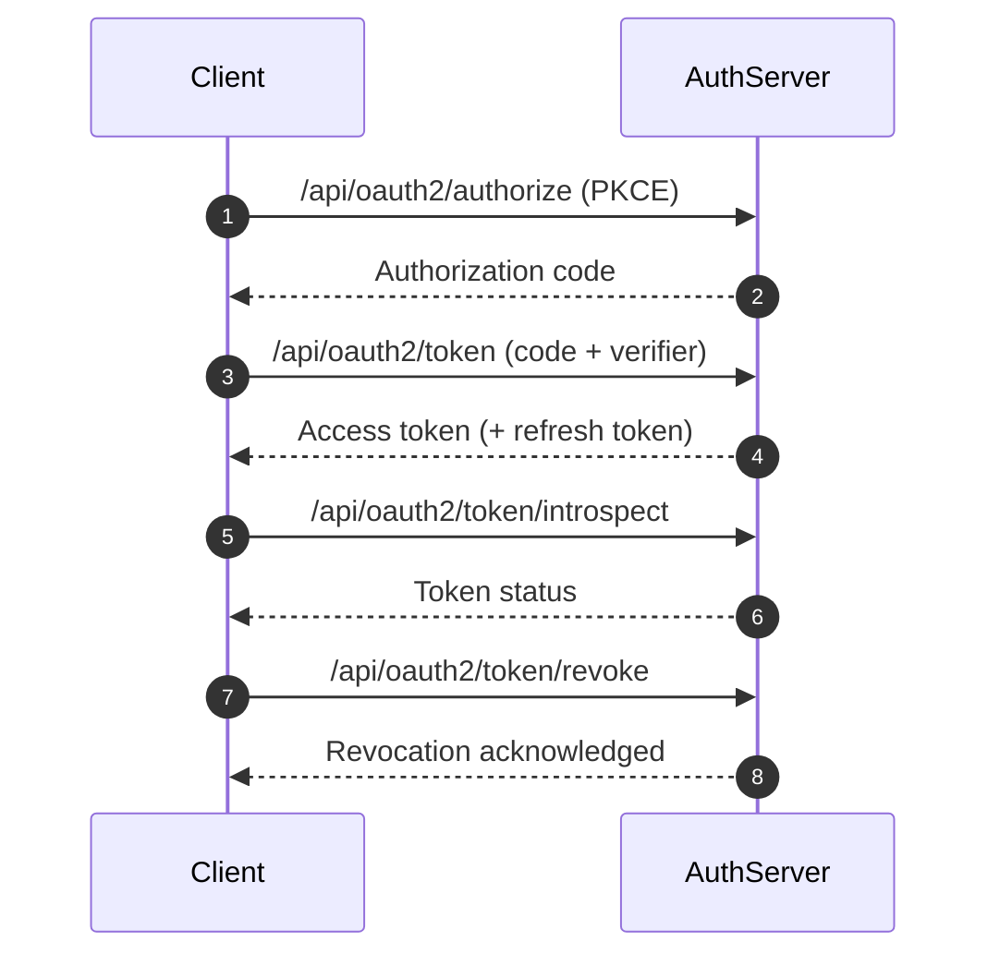
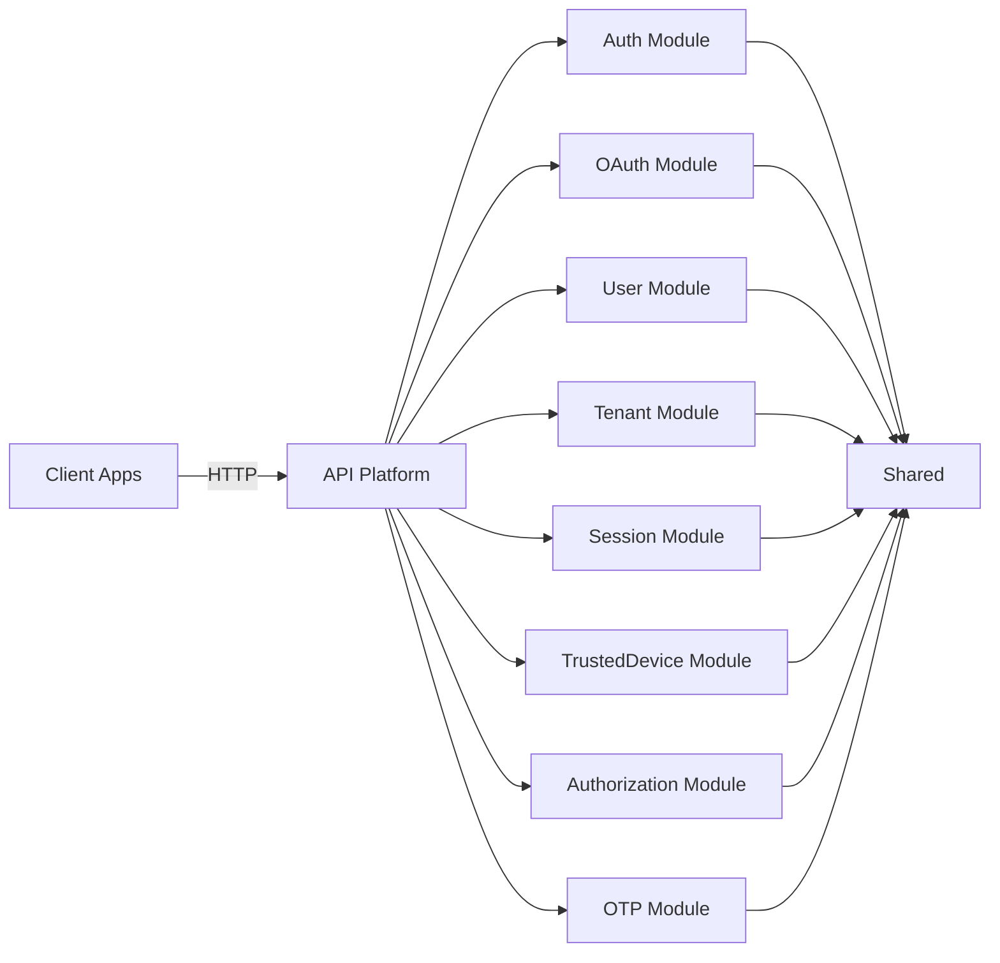

# Fireguard Auth Server Documentation

Modular authentication and authorization server built with Symfony. It provides OAuth 2.0 and OpenID Connect capabilities for APIs and SSO use cases.

---

## Table of Contents

- [Overview](#overview)
- [Features](#features)
- [API surface](#api-surface)
  - [Auth](#auth)
  - [OAuth2 and OIDC](#oauth2-and-oidc)
  - [Discovery](#discovery)
  - [Administration](#administration)
- [Flows](#flows)
  - [OAuth2 and OIDC core flow](#oauth2-and-oidc-core-flow)
- [Architecture](#architecture)
- [Project layout](#project-layout)
- [Configuration](#configuration)
- [Requirements](#requirements)
- [Getting started](#getting-started)
- [Development](#development)
- [Testing](#testing)
- [Code quality](#code-quality)
- [Operations](#operations)
- [Security](#security)
- [License](#license)

---

<div align="right"><a href="#fireguard-auth-server-documentation">Back to top</a></div>

## Overview

Fireguard Auth Server is a modular auth stack designed around clear module boundaries and hexagonal architecture.

## Features

| Feature | Description |
| --- | --- |
| OAuth2 and OIDC | Authorization code with PKCE, client credentials, refresh token |
| Token lifecycle | Issue, introspect, revoke, refresh, and discovery metadata |
| Authentication | Login with MFA and OTP (email, SMS, TOTP) |
| Sessions | Session tracking, revocation, and trusted devices |
| Multi-tenant | Tenant-aware resources and policies |
| RBAC | Roles and permissions management |
| API Platform | HTTP exposure, validation, and rate limiting |

---

<div align="right"><a href="#fireguard-auth-server-documentation">Back to top</a></div>

## API surface

High-level endpoints are grouped below. See each module document for full details.

### Auth

| Method | Endpoint | Description | Auth |
| --- | --- | --- | --- |
| POST | `/api/auth/login` | User login | No |
| POST | `/api/auth/mfa/verify` | MFA verification | No |
| POST | `/api/auth/refresh` | Refresh access token | Refresh cookie |
| POST | `/api/auth/logout` | Logout and revoke tokens | Bearer access token |

### OAuth2 and OIDC

| Method | Endpoint | Description | Auth |
| --- | --- | --- | --- |
| GET | `/api/oauth2/authorize` | Authorization code + PKCE | Session |
| POST | `/api/oauth2/token` | Token issuance | Client credentials |
| POST | `/api/oauth2/token/introspect` | Token introspection | Client credentials |
| POST | `/api/oauth2/token/revoke` | Token revocation | Client credentials |
| GET | `/api/oauth2/userinfo` | OIDC UserInfo | Bearer access token |
| GET | `/api/oauth2/logout` | End session | Optional |

### Discovery

| Method | Endpoint | Description |
| --- | --- | --- |
| GET | `/api/.well-known/openid-configuration` | OpenID Provider metadata |
| GET | `/api/.well-known/jwks.json` | JSON Web Key Set |

### Administration

| Endpoint group | Description |
| --- | --- |
| `/api/users` | User management |
| `/api/tenants` | Tenant management |
| `/api/sessions` | Session management |
| `/api/trusted-devices` | Trusted device management |
| `/api/roles` | Role management |
| `/api/permissions` | Permission management |
| `/api/clients` | OAuth client management |

> [!NOTE]
> Full endpoint documentation is in each module file under `src/<Module>/MODULE.md`.

---

<div align="right"><a href="#fireguard-auth-server-documentation">Back to top</a></div>

## Flows

### OAuth2 and OIDC core flow



---

<div align="right"><a href="#fireguard-auth-server-documentation">Back to top</a></div>

## Architecture

The codebase follows a hexagonal architecture (ports and adapters) and enforces one-way dependencies across layers.
See `ARCHITECTURE.md` for the full ruleset.



---

<div align="right"><a href="#fireguard-auth-server-documentation">Back to top</a></div>

## Project layout

```
config/
  modules/
  packages/
migrations/
src/
  <Module>/
    Application/
    Domain/
    Infrastructure/
    Presentation/
tests/
```

---

<div align="right"><a href="#fireguard-auth-server-documentation">Back to top</a></div>

## Configuration

Configuration is driven by environment variables in `.env` and overrides in `.env.local` (or `.env.test` for tests).

| Variable | Purpose |
| --- | --- |
| `APP_ENV`, `APP_SECRET` | Symfony environment and secret |
| `DATABASE_URL` | Database connection string |
| `OAUTH_ISSUER`, `OAUTH_ENCRYPTION_KEY` | OIDC issuer and encryption key |
| `ACCESS_TOKEN_TTL`, `TOKEN_CACHE_TTL` | Access token lifetime and cache TTL |
| `REFRESH_TOKEN_COOKIE_NAME`, `REFRESH_TOKEN_LIFETIME_SHORT`, `REFRESH_TOKEN_LIFETIME_LONG` | Refresh token cookie settings |
| `TRUSTED_DEVICE_COOKIE_NAME`, `TRUSTED_DEVICE_LIFETIME` | Trusted device cookie settings |
| `MFA_ENABLED`, `MAILER_DSN`, `MAILER_FROM`, `SMS_DSN` | MFA and notification transport |
| `CORS_ALLOW_ORIGIN`, `DEFAULT_URI` | CORS and base URL |

JWT keys are expected at:
- `config/jwt/private.key`
- `config/jwt/public.key`

Module wiring is in `config/modules/*.yaml`, with shared framework configuration in `config/packages/*.yaml`.

---

<div align="right"><a href="#fireguard-auth-server-documentation">Back to top</a></div>

## Requirements

- PHP 8.4+
- Composer
- Database (PostgreSQL by default, configurable)
- Docker and Docker Compose (for SonarQube only)
- Make (recommended)

## Getting started

1. Install dependencies:
   ```bash
   composer install
   ```
2. Copy environment defaults and adjust as needed:
   ```bash
   cp .env .env.local
   ```
3. Configure the database and run migrations:
   ```bash
   php bin/console doctrine:migrations:migrate
   ```
4. Start the application using your preferred Symfony runtime:
   ```bash
   php -S 127.0.0.1:8000 -t public
   ```

## Development

Common Make targets:
- `make test` runs CS checks, static analysis, architecture rules, linting, and unit tests.
- `make phpunit` runs the test suite.
- `make phpunit-fast` runs the test suite without testdox output.
- `make phpstan` runs static analysis.
- `make deptrac` runs dependency rules.
- `make lint` validates Symfony container and YAML files.
- `make cs-lint` and `make cs-fix` manage coding style.
- `make cache-clear` clears and warms up the Symfony cache.

## Testing

- Unit: `tests/Unit`
- Integration: `tests/Integration`
- Functional: `tests/Functional`
- End-to-end: `tests/E2E`

Run the full suite:
```bash
make phpunit
```

> [!NOTE]
> Use `.env.test` for test overrides. The default test database is SQLite.

## Code quality

SonarQube support is wired via Docker Compose:
```bash
make sonar-up
make sonar-scan
```

## Operations

Production and staging runbooks are documented in `OPERATIONS.md`.

## Security

Security-sensitive configuration and guidance is documented in `SECURITY.md`.

## License

This project is proprietary. See internal licensing guidance for distribution and use.
