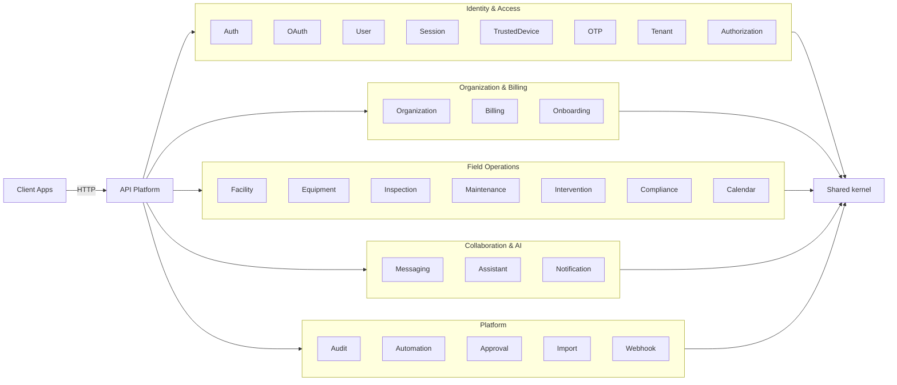

# Fireguard API

Modular API for fire safety management built with Symfony. It covers the full stack: authentication, authorization, OAuth 2.0 / OpenID Connect, and the fire safety business domain (organizations, facilities, equipment, inspections).

---

## Table of Contents

- [Overview](#overview)
- [Features](#features)
- [API surface](#api-surface)
  - [Auth](#auth)
  - [OAuth2 and OIDC](#oauth2-and-oidc)
  - [Discovery](#discovery)
  - [Administration](#administration)
  - [Organizations and billing](#organizations-and-billing)
  - [Field operations](#field-operations)
  - [Interventions, approval and automation](#interventions-approval-and-automation)
  - [Collaboration and assistant](#collaboration-and-assistant)
  - [Calendar, import and webhooks](#calendar-import-and-webhooks)
  - [Onboarding](#onboarding)
  - [Audit](#audit)
- [Flows](#flows)
  - [OAuth2 and OIDC core flow](#oauth2-and-oidc-core-flow)
- [Architecture](#architecture)
- [Project layout](#project-layout)
- [Configuration](#configuration)
- [Requirements](#requirements)
- [Getting started](#getting-started)
- [Development](#development)
- [Testing](#testing)
- [Code quality](#code-quality)
- [Operations](#operations)
- [Security](#security)
- [License](#license)

---

<div align="right"><a href="#fireguard-api">Back to top</a></div>

## Overview

Fireguard API is a modular platform designed around clear module boundaries and hexagonal architecture. It handles both the authentication / authorization layer and the fire safety business domain within a single deployable unit (modulith).

## Features

| Feature | Description |
| --- | --- |
| OAuth2 and OIDC | Authorization code with PKCE, client credentials, refresh token |
| Token lifecycle | Issue, introspect, revoke, refresh, and discovery metadata |
| Authentication | Login with MFA and OTP (email, SMS, TOTP) |
| Sessions | Session tracking, revocation, and trusted devices |
| Multi-tenant | Tenant-aware resources and policies |
| RBAC | Roles and permissions management |
| Audit | Append-only, hash-chained security event ledger |
| Organizations | Organization membership, teams, and organization-scoped RBAC |
| Billing | Stripe-hosted Checkout/Portal, subscription plans, invoices, payment method |
| Onboarding | Guided organization onboarding flow |
| Facilities | Location hierarchy (site → building → floor → zone → area) |
| Equipment | Fire safety asset inventory with lifecycle management |
| Inspections | Inspection workflow, checklists, and non-conformity tracking |
| Maintenance | Preventive maintenance schedules recomputed from inspection history |
| Interventions | Staged field-intervention workflow from draft to atomic publication, offline-friendly |
| Approval | Optional four-eyes approval workflow for regulated actions |
| Automation | Event-driven rule engine reacting to domain events (no HTTP surface) |
| Compliance | Read-only compliance rollups and "registre de sécurité" PDF export |
| Calendar | Unified calendar feed merging events, inspections, interventions, and maintenance |
| Messaging | Organization channels, direct messages, threads, reactions, presence |
| Assistant | Organization-scoped AI chat assistant (Ollama), streamed over Mercure |
| Notifications | Email and real-time (Mercure) notification delivery, unified inbox |
| Import | Bulk CSV import of equipment and facilities |
| Webhooks | Outbound event subscriptions with HMAC signing, retry, and replay |
| API Platform | HTTP exposure, validation, and rate limiting |

---

<div align="right"><a href="#fireguard-api">Back to top</a></div>

## API surface

High-level endpoints are grouped below. See each module document for full details.

### Auth

| Method | Endpoint | Description | Auth |
| --- | --- | --- | --- |
| POST | `/api/auth/login` | User login | No |
| POST | `/api/auth/mfa/verify` | MFA verification | No |
| POST | `/api/auth/refresh` | Refresh access token | Refresh cookie |
| POST | `/api/auth/logout` | Logout and revoke tokens | Bearer access token |
| POST | `/api/auth/password/reset/request` | Request password reset | No |
| POST | `/api/auth/password/reset/confirm` | Confirm password reset | No |

### OAuth2 and OIDC

| Method | Endpoint | Description | Auth |
| --- | --- | --- | --- |
| GET | `/api/oauth2/authorize` | Authorization code + PKCE | Session |
| POST | `/api/oauth2/token` | Token issuance | Client credentials |
| POST | `/api/oauth2/token/introspect` | Token introspection | Client credentials |
| POST | `/api/oauth2/token/revoke` | Token revocation | Client credentials |
| GET | `/api/oauth2/userinfo` | OIDC UserInfo | Bearer access token |
| GET | `/api/oauth2/logout` | End session | Optional |

### Discovery

| Method | Endpoint | Description |
| --- | --- | --- |
| GET | `/api/.well-known/openid-configuration` | OpenID Provider metadata |
| GET | `/api/.well-known/jwks.json` | JSON Web Key Set |

### Administration

| Endpoint group | Description |
| --- | --- |
| `/api/users` | User management |
| `/api/tenants` | Tenant management |
| `/api/sessions` | Session management |
| `/api/trusted-devices` | Trusted device management |
| `/api/roles` | Role management |
| `/api/permissions` | Permission management |
| `/api/clients` | OAuth client management |

### Organizations and billing

| Endpoint group | Description |
| --- | --- |
| `/api/organizations` | Organization CRUD, settings, legal/compliance profile, archive |
| `/api/organizations/{id}/members`, `/invitations`, `/roles` | Membership, email invitations, RBAC role assignment |
| `/api/organizations/{id}/teams` | Named member groupings, team-scoped membership |
| `/api/organizations/{id}/dashboard` (+ `/dashboard/trends/*`) | KPI overview, sparkline trends, recent interventions |
| `/api/organizations/{id}/navigation-counters` | Sidebar badge counters (open interventions / non-conformities) |
| `/api/plans` | Subscription plan catalog (quotas, marketing copy) |
| `/api/organizations/{id}/billing/checkout`, `/portal` | Stripe-hosted Checkout / Billing Portal session |
| `/api/organizations/{id}/billing/subscription`, `/payment-method`, `/invoices` | Current subscription, saved card, invoice history |
| `/api/billing/pricing` | Display pricing catalog |
| `/api/billing/webhook` | Stripe webhook — source of truth for subscription state (public, signature-verified) |

### Field operations

| Endpoint group | Description |
| --- | --- |
| `/api/organizations/{organizationId}/facilities` | Facility hierarchy (site, building, floor, zone, area), archive, move |
| `/api/organizations/{organizationId}/equipment` | Equipment inventory and lifecycle (commission / maintenance / decommission), KPIs |
| `/api/organizations/{organizationId}/inspections` | Inspections with submit / close workflow |
| `/api/organizations/{organizationId}/checklists` | Reusable, versioned inspection checklist templates |
| `/api/organizations/{organizationId}/non-conformities` | Deficiency tracking through resolution |
| `/api/maintenance/schedules` | Preventive maintenance schedules and per-equipment overrides |
| `/api/maintenance/campaigns` | Generate an intervention draft from due/overdue schedules |
| `/api/organizations/{id}/compliance`, `/facility-tree`, `/compliance/export` | Compliance rollups and "registre de sécurité" PDF export |

### Interventions, approval and automation

| Endpoint group | Description |
| --- | --- |
| `/api/interventions` | Staged field-intervention workflow (draft → work items/changes → atomic publish) |
| `/api/interventions/{id}/publications`, `/issues` | Async publication, blocking-issue checks |
| `/api/interventions/{id}/attachments` | Execution evidence file attachments |
| `/api/organizations/{organizationId}/approval-requests` | Four-eyes approval workflow for regulated actions (waive non-conformity, decommission equipment) |
| `/api/approvals/action-types` | Reference catalog of gatable action types |
| Automation | No HTTP surface — reacts to domain events (e.g. auto-drafts an intervention on a critical non-conformity) |

### Collaboration and assistant

| Endpoint group | Description |
| --- | --- |
| `/api/conversations`, `/api/direct-conversations` | Subject threads and 1-to-1 direct conversations |
| `/api/channels` | Named group channels, participants, team binding, parent/child hierarchy |
| `/api/messages/{id}` | Post/edit messages, pins, reactions, saves |
| `/api/presence` | Lightweight cache-backed online presence |
| `/api/organizations/{organizationId}/assistant/threads` | Organization-scoped AI chat threads (async generation via Ollama) |
| `/api/notifications` | User notifications, delivery preferences, unified inbox, real-time subscriptions |

### Calendar, import and webhooks

| Endpoint group | Description |
| --- | --- |
| `/api/organizations/{organizationId}/calendar/events` | Standalone calendar events (CRUD) |
| `/api/organizations/{organizationId}/calendar/feed` | Bounded, merged feed (events + inspections + interventions + maintenance) |
| `/api/imports` | Bulk CSV import of equipment/facilities, processed asynchronously |
| `/api/organizations/{organizationId}/webhooks` | Outbound event subscriptions, HMAC-signed, retried deliveries |

### Onboarding

| Endpoint group | Description |
| --- | --- |
| `/api/onboarding/organization` | Guided organization onboarding: status, start, per-step execute/skip, rollback |

### Audit

| Method | Endpoint | Description | Auth |
| --- | --- | --- | --- |
| GET | `/api/audit-events` | List audit events | `audit.read` |
| GET | `/api/audit-events/{id}` | Get audit event details | `audit.read` |

> [!NOTE]
> Full endpoint documentation is in each module file under `src/<Module>/MODULE.md`.
> A permission-to-endpoint map is maintained in `docs/permissions.md`.

---

<div align="right"><a href="#fireguard-api">Back to top</a></div>

## Flows

### OAuth2 and OIDC core flow


---

<div align="right"><a href="#fireguard-api">Back to top</a></div>

## Architecture

The codebase follows a hexagonal architecture (ports and adapters) and enforces one-way dependencies across layers.
See `ARCHITECTURE.md` for the full ruleset.



`src/` has 28 top-level namespaces: `App` (kernel bootstrap, no `MODULE.md`),
`Shared` (repo-wide kernel: health check, file storage, attachment kernel — no
business scope of its own), and 26 business modules each documented in its own
`src/<Module>/MODULE.md`: `Auth`, `OAuth`, `User`, `Session`, `TrustedDevice`,
`Otp`, `Tenant`, `Authorization`, `Audit`, `Organization`, `Billing`,
`Onboarding`, `Facility`, `Equipment`, `Inspection`, `Maintenance`,
`Intervention`, `Compliance`, `Calendar`, `Messaging`, `Assistant`,
`Notification`, `Import`, `Webhook`, `Approval`, `Automation`.

---

<div align="right"><a href="#fireguard-api">Back to top</a></div>

## Project layout

```
config/
  modules/
  packages/
migrations/
src/
  <Module>/
    Application/
    Domain/
    Infrastructure/
    Presentation/
tests/
```

---

<div align="right"><a href="#fireguard-api">Back to top</a></div>

## Configuration

Configuration is driven by environment variables in `.env` and overrides in `.env.local` (or `.env.test` for tests).

| Variable | Purpose |
| --- | --- |
| `APP_ENV`, `APP_SECRET` | Symfony environment and secret |
| `AUTH_DATABASE_URL` | Auth database connection string |
| `MAIN_DATABASE_URL` | Main database connection string |
| `OAUTH_ISSUER`, `OAUTH_ENCRYPTION_KEY` | OIDC issuer and encryption key |
| `ACCESS_TOKEN_TTL`, `TOKEN_CACHE_TTL` | Access token lifetime and cache TTL |
| `REFRESH_TOKEN_COOKIE_NAME`, `REFRESH_TOKEN_LIFETIME_SHORT`, `REFRESH_TOKEN_LIFETIME_LONG` | Refresh token cookie settings |
| `TRUSTED_DEVICE_COOKIE_NAME`, `TRUSTED_DEVICE_LIFETIME` | Trusted device cookie settings |
| `MFA_ENABLED`, `MAILER_DSN`, `MAILER_FROM`, `SMS_DSN` | MFA and notification transport |
| `CORS_ALLOW_ORIGIN`, `DEFAULT_URI` | CORS and base URL |

JWT keys are expected at:
- `config/jwt/private.key`
- `config/jwt/public.key`

Module wiring is in `config/modules/*.yaml`, with shared framework configuration in `config/packages/*.yaml`.

---

<div align="right"><a href="#fireguard-api">Back to top</a></div>

## Requirements

- PHP 8.4+
- Composer
- Databases (PostgreSQL by default, configurable)
- Docker and Docker Compose (recommended local dev environment — app, both
  PostgreSQL databases, Redis, Mailpit; also used for SonarQube)
- Make (recommended)

## Getting started

1. Install dependencies:
   ```bash
   composer install
   ```
2. Copy environment defaults and adjust as needed:
   ```bash
   cp .env .env.local
   ```
3. Configure both databases and run migrations:
   ```bash
   make migrate-all
   ```
4. Optionally load the shared sample seed data in `dev` or `test`:
  ```bash
  make seed-fixtures
  ```
5. Start the application using your preferred Symfony runtime:
   ```bash
   php -S 127.0.0.1:8000 -t public
   ```

## Development

### Using Docker (Recommended)

Start the development environment with Docker:
```bash
make docker-up
```

This starts:
- **App**: http://localhost:8000
- **PostgreSQL (auth)**: localhost:5433
- **PostgreSQL (main)**: localhost:5434
- **Redis**: localhost:6379
- **Mailpit** (email testing): http://localhost:8025

Other Docker commands:
- `make docker-down` stops all services
- `make docker-shell` opens a shell in the app container
- `make docker-logs` shows app container logs

### Common Make Targets

| Command | Description |
|---------|-------------|
| `make test` | Run CS checks, static analysis, architecture rules, linting, and tests |
| `make phpunit` | Run the test suite with testdox output |
| `make phpunit-fast` | Run the test suite without testdox output |
| `make phpunit-parallel` | Run the test suite across parallel workers (paratest) |
| `make test-db` | Create and migrate the PostgreSQL test databases |
| `make test-db-clean` | Drop the per-worker database clones left by parallel runs |
| `make phpstan` | Run static analysis |
| `make deptrac` | Run architecture dependency rules |
| `make lint` | Validate Symfony container and YAML files |
| `make cs-lint` | Check coding style |
| `make cs-fix` | Fix coding style issues |
| `make cache-clear` | Clear and warm up cache |
| `make migrate-auth` | Apply auth database migrations |
| `make migrate-main` | Apply main database migrations |
| `make migrate-all` | Apply auth + main migrations |
| `make seed-fixtures` | Load the repository seed fixtures into both databases safely |
| `make coverage` | Run tests with code coverage (text output) |
| `make coverage-html` | Run tests with HTML coverage report |
| `make mutation` | Run mutation testing with Infection |

Use `make seed-fixtures` or `php bin/console app:fixtures:load` for seeded sample data in `dev` and `test`. The command purges then reloads both databases in a coordinated two-pass load. Avoid `doctrine:fixtures:load` directly in this repository because auth and business fixtures target different entity managers.

## Testing

- Unit: `tests/Unit`
- Integration: `tests/Integration`
- Functional: `tests/Functional`
- End-to-end: `tests/E2E`

Run the full suite:
```bash
make phpunit
```

Run it across parallel workers (paratest):
```bash
make phpunit-parallel
```

Each worker clones the migrated test databases into its own `*_w<token>` copy,
so workers never share rows. That clone costs a couple of seconds per worker,
which only pays off across the whole suite — for a single testsuite or a
`--filter` run, plain `make phpunit-fast` is faster. Override the worker count
with `make phpunit-parallel PARALLEL_WORKERS=16`.

> [!WARNING]
> Do not run two parallel suites at once. Worker tokens start at 1 in every
> run, so both would claim the same `*_w1`, `*_w2`… databases and drop each
> other's mid-test. The symptom is a flood of unrelated errors that vanish when
> either run is repeated alone. CI is unaffected: each job gets its own
> PostgreSQL service.

Run with code coverage:
```bash
make coverage-html
# Report available at var/coverage/html/index.html
```

Run mutation testing:
```bash
make mutation
# Report available at var/infection/infection.html
```

> [!NOTE]
> Use `.env.test` for test overrides. The suite runs on PostgreSQL, like production —
> the repositories issue PostgreSQL-specific SQL (`TO_CHAR` day bucketing,
> `json_array_elements_text`, `SELECT … FOR UPDATE`) with no portable fallback.
> Create, migrate and seed the two test databases once, then re-run whenever a
> new migration or seed fixture lands:
>
> ```bash
> make docker-up && make test-db
> ```
>
> **No test may assume it owns the database.** The fixture baseline is seeded
> once, here — not reloaded inside every E2E test (~5s each) for DAMA to roll
> straight back. A test needing other data creates it; a test needing a table
> empty purges it; the rollback undoes either. Assert on deltas and membership,
> never on absolute row counts.
>
> That is what makes the suite affordable: the whole of it, E2E included, runs
> in **1m15 in parallel**, against roughly fifteen minutes for the E2E suite
> alone before.

## Code Quality

### Quality feedback: editor, hooks, CI

Three layers, fastest first. Each one is a net for what the previous one missed.

**1. Editor.** `.vscode/` configures format-on-save with the project's own
php-cs-fixer and ruleset, so files are conformant before they are ever staged.
VS Code prompts to install the recommended extensions on first open; the
`junstyle.php-cs-fixer` one is what makes this work. Using PhpStorm instead?
Point *Settings → PHP → Quality Tools → PHP CS Fixer* at
`vendor/bin/php-cs-fixer` with `.php-cs-fixer.dist.php`.

**2. Git hooks**, in `.githooks/`. `composer install` activates them; to do it
by hand, run `composer run-script install-git-hooks`.

| Hook | Runs | Cost |
| --- | --- | --- |
| `pre-commit` | `php-cs-fixer` on the **staged** PHP files, then re-stages them | ~3s |
| `pre-push` | `phpstan` + `deptrac` over the whole project | ~7s warm, ~35s cold |

Formatting runs per commit because it can be scoped to what you staged. PHPStan
and deptrac cannot — an edit in one class surfaces errors in another, so they
always analyse everything — which is why they run once per push instead.

**3. CI.** The only non-bypassable gate: it runs the same checks on every pull
request. The layers above are for speed, not correctness — both hooks yield to
`--no-verify`.

php-cs-fixer runs its parallel runner (configured in `.php-cs-fixer.dist.php`),
which takes a cold full-tree run from **2m17s to ~15s** — the run CI and every
fresh clone hit. A warm run costs ~2s more than sequential in process spawning,
so the `pre-commit` hook passes `--sequential`: on a handful of staged files the
spawning outweighs the work.

One caveat worth knowing: the `pre-commit` hook **rewrites what you are
committing**. If you stage part of a file with `git add -p`, the fixer
reformats the whole file and the remainder gets staged too. With format-on-save
active there is usually nothing left for it to change.

### SonarQube

SonarQube support is wired via Docker Compose:
```bash
make sonar-up
make sonar-scan
```

### CI/CD

GitHub Actions workflows are configured for:
- **CI** (`.github/workflows/ci.yml`): Code style, PHPStan, Deptrac, tests, security audit
- **Release** (`.github/workflows/release.yml`): Docker image build and GitHub release creation
- **VPS deployment** (`.github/workflows/deploy-vps.yml`): CI, Docker image build, GHCR push, Ansible deployment to a Docker Compose VPS stack

The CI pipeline runs on every push and pull request to `main` and `develop` branches.
See `DEPLOYMENT.md` for VPS setup, required GitHub secrets, and rollback notes.

## Operations

Production and staging runbooks are documented in `OPERATIONS.md`.

## Security

Security-sensitive configuration and guidance is documented in `SECURITY.md`.

## License

This project is proprietary. See internal licensing guidance for distribution and use.


