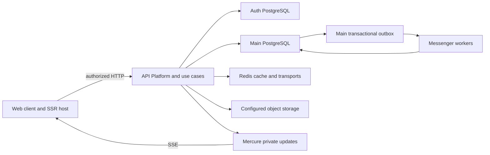

# API system overview

This runtime view shows independently owned services and persistence. It is not the module import graph.

**Authoritative references:** [Architecture](../../ARCHITECTURE.md) · [Doctrine mapping](../../config/packages/doctrine.yaml) · [Security](../../SECURITY.md).

## Runtime services

Arrows show runtime requests, storage ownership and realtime delivery. Database/cache/storage access stays behind the API; the web client owns only its browser state and local drafts.

Auth contains identity/security data; main contains business data. Doctrine's
mapping decides ownership. Shared consumption receipts are bound to the consumer's
own connection. There are no joins, foreign keys or transactions across databases.
Ports carry cross-module contracts; a background worker keeps the same ownership
and entity-manager requirements as a synchronous request.

## HTTP and realtime

API Platform resources define routes, serialization and coarse security. Processors
and providers translate into application use cases. The Stripe webhook and calendar
ICS controller are documented exceptions. Mercure sends private invalidations or
ephemeral activity; consumers still use authorized API reads for durable state.

See [authentication](../guides/authentication.md), [messaging](../guides/messaging.md)
and [async processing](../guides/async-processing.md). The
[web repository](https://github.com/DevSkyLex/fireguard-web) owns client state and SSR.
