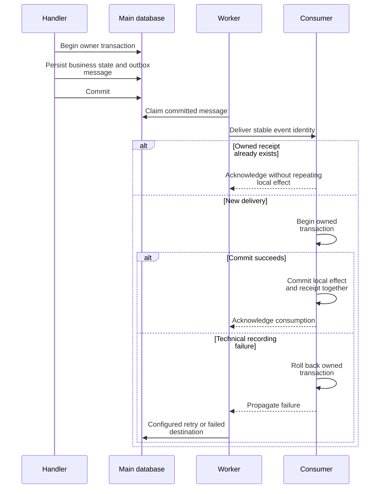

# Transactional outbox and asynchronous effects

Use this sequence for flows that explicitly own a transactional outbox. Each receipt and business transaction belongs to one database connection.

**Authoritative references:** [Shared](../../src/Shared/MODULE.md) · [Automation](../../src/Automation/MODULE.md) · [Webhook](../../src/Webhook/MODULE.md) · [Import](../../src/Import/MODULE.md).

## Commit before delivery

The producer commits an outbox message with its business state. A consumer records its owned effect and receipt so transport redelivery can be handled without repeating the local effect.

Delivery is at least once. Consumers combine their owned durable effect and receipt
where the contract supports it, so replay cannot repeat that local effect. A consumer
in auth has an auth transaction/receipt; it does not join the producer's main transaction.
External HTTP delivery has its own retry and idempotency guarantees.

## Failure semantics

Distinguish business rejection, technical recording failure and transport failure.
The owning module decides retained outcomes, retryability and reservation/lease
behavior. Automation rereads policy when executing; import uses exclusive worker
reservations and row receipts; webhooks restrict destinations and sign safe payloads.
Do not infer permission or current policy solely from an old event payload.

See [workers and scheduler](../operations/workers-and-scheduler.md) for deployment
and recovery. Retain receipts while their messages can still be replayed.
