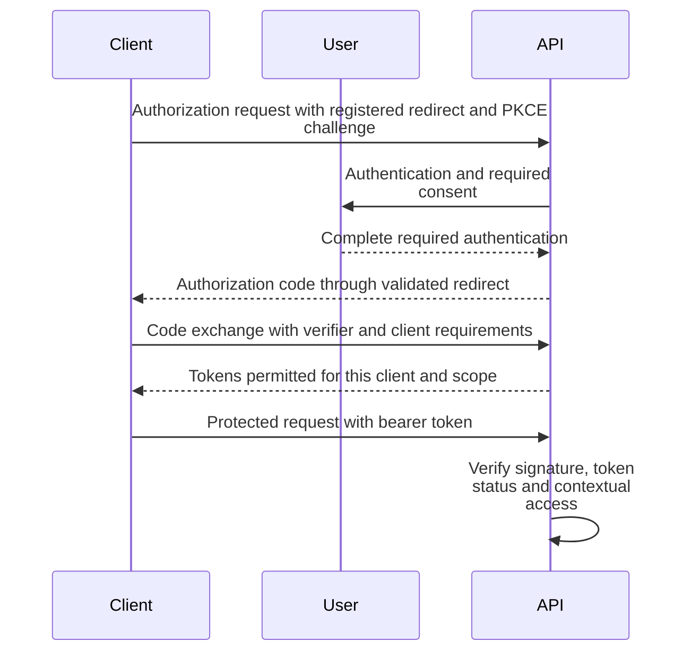

# Authentication and token lifecycles

Interactive login and OAuth authorization-code exchange have distinct entry points. Both preserve signature, session, client and tenant checks.

**Authoritative references:** [Auth](../../src/Auth/MODULE.md) · [OAuth](../../src/OAuth/MODULE.md) · [Session](../../src/Session/MODULE.md) · [Security](../../SECURITY.md).

## OAuth authorization code and PKCE

The client exchanges a server-issued authorization code using the required verifier and client credentials. Protected requests still validate the resulting bearer token and contextual access.

Use the exact routes and fields from the OAuth module/OpenAPI contract. Redirect
URIs, scopes, tenant rules and PKCE requirements are validated server-side.

## Interactive sessions

Auth owns password/MFA login and refresh cookies. Session owns tracking and
revocation. Every bearer signature is verified before claims are trusted. Session
revocation affects subsequent requests; interactive tokens require a persisted, current session anchor matching the
signed user. Issuance must complete that persistence before exposing tokens. Do not equate OAuth token-table rows
with interactive login-flow session tokens.

## Cookies and secrets

Keep refresh/trusted-device cookies secure according to their environment contract.
Avoid token-bearing logs and broad debug dumps. Configure issuer, CORS and callbacks
for the same deployment environment; store keys and provider credentials privately.
The [security runbooks](../operations/security-runbooks.md) cover deliberate rotation
and revocation. Protocol/denial tests are required for lifecycle changes.
