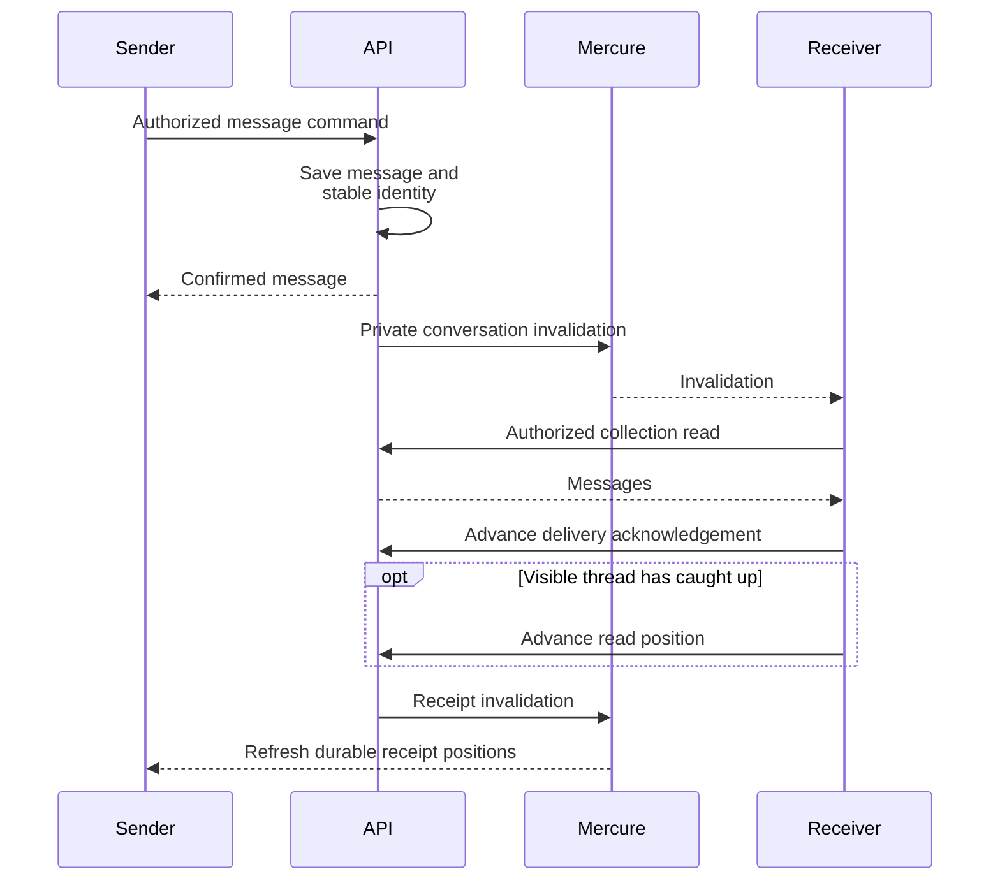

# Messaging, typing and receipts

Messaging owns durable conversation state and browser acknowledgement positions. Mercure is a private notification/activity channel, not the durable message store.

**Authoritative references:** [Messaging](../../src/Messaging/MODULE.md) · [User](../../src/User/MODULE.md) · [Mercure deployment](../../DEPLOYMENT.md).

## Delivery and reading

Durable delivery/read positions follow browser acknowledgements. Private Mercure updates notify the sender to reload those positions; persistence alone does not acknowledge receipt.

Persistence alone establishes sent, not received. Another participant's browser
acknowledges delivery after loading a message. Read positions and delivery positions
persist and are reloaded on reopening/reconnection. Receipt projections count current
participants, exclude fabricated acknowledgements and preserve DM/channel distinctions.

## Ephemeral state

Typing activity expires and includes no draft body. Presence uses its own cache and
privacy contract; User owns global preferences, and invisible members are projected
offline. Contextual authorization protects both subscription and activity endpoints.

## Failure and replay

Durable commands preserve stable client identities and optimistic concurrency where
required. A realtime publication failure must follow the owning command's documented
behavior; it cannot imply that the durable write disappeared. Private frames never
replace authorization of a read. See the module for replies, tombstones, reactions,
attachments, mentions and per-operation idempotency/error contracts.

## Messaging testing reference

Coverage scenarios and regression rationale

`UserPresenceApiTest` also covers directory-only presence reads, pinging without read rights,
private subscription JWT claims, inactive/foreign-member redaction and membership denial.
Presence handler tests verify batch identity/preference resolution, expiry, idempotent heartbeats
and isolated Mercure failures.

- Unit: `tests/Unit/Messaging` (+ the four subject-resolver adapters under
  their owning modules' `tests/Unit/<Module>/Infrastructure/Adapter/Messaging`,
  and `tests/Unit/Organization/Infrastructure/Adapter/Messaging`). Attachment
  slice: `Application/UseCase/Command/Attachment/{AddMessageAttachment,
DeleteMessageAttachment}HandlerTest`,
  `Application/UseCase/Query/Attachment/ListConversationAttachmentsHandlerTest`,
  `Presentation/Api/Processor/Attachment/MessagingMediaProcessorTest`. Pinned
  message slice (L1.3): `Domain/Model/Message/MessageTest` (pin/unpin
  idempotency + reconstitute), `Application/UseCase/Command/Message/
{PinMessage,UnpinMessage}HandlerTest`,
  `Application/UseCase/Query/Message/ListPinnedMessagesHandlerTest`,
  `Presentation/Api/Processor/Message/{PinMessageProcessor,
UnpinMessageProcessor}Test`,
  `Presentation/Api/Provider/Message/ListPinnedMessagesProviderTest`. Emoji
  reaction slice (L1.4): `Domain/ValueObject/MessagingEmojiTest` (plausible
  vs. implausible grapheme table tests), `Application/UseCase/Command/
Message/{AddReaction,RemoveReaction}HandlerTest`,
  `Presentation/Api/Processor/Message/{AddReactionProcessor,
RemoveReactionProcessor}Test`, and a dedicated
  `Presentation/Api/Factory/MessageOutputFactoryTest` covering the
  aggregation logic itself (count/`reactedByMe` per emoji, deterministic
  ordering, tombstone redaction, no-leak of another member's
  `reactedByMe`, and batching a whole page in one
  `findByMessageIds()` call). Saved messages + favorite conversations slice
  (L1.5): `Application/UseCase/Command/Message/{SaveMessage,UnsaveMessage}
HandlerTest`, `Application/UseCase/Query/Message/
ListSavedMessagesHandlerTest`, `Application/UseCase/Command/Conversation/
{FavoriteConversation,UnfavoriteConversation}HandlerTest`,
  `Presentation/Api/Processor/Message/{SaveMessageProcessor,
UnsaveMessageProcessor}Test`,
  `Presentation/Api/Provider/Message/ListSavedMessagesProviderTest`,
  `Presentation/Api/Processor/Conversation/{FavoriteConversationProcessor,
UnfavoriteConversationProcessor}Test`; `MessageOutputFactoryTest` extended
  with `isSaved` cases (marked/not-marked, survives tombstone, batched
  across a page); `ListConversationsHandlerTest`/`GetConversationHandlerTest`
  extended with `favoriteConversationIds`/`isFavorite` assertions. Unified
  inbox mention source (L1.8b):
  `Infrastructure/Adapter/Notification/MessagingInboxSourceProviderAdapterTest`
  (no organization → empty; missing `.read` permission → empty; not an
  active member → empty; cursor/limit forwarded to the repository; a
  subject-thread mention mapped to a correct `InboxItem`; the security case
  — mentioned but lacking the subject's own read permission → excluded — a
  channel mention excluded/included by participation, and included via
  `.manage` without participation; an unresolved subject type excluded;
  `isRead` derived from the read marker; snippet truncation; `countUnread()`:
  no organization/missing permission/not-an-active-member → 0, only
  accessible unread mentions counted, scan limit (200) forwarded to
  `listMentionsForMember()`), plus two new `MessagingAccessPolicyTest` cases
  for `hasReadPermission()`/`hasPermission()`.
  Direct messages slice (L2.4): `Domain/Service/DirectConversationKeyTest`
  (order-independent — A→B and B→A derive the SAME key; deterministic;
  fits the `subject_id` column length; different pairs differ),
  `Application/UseCase/Command/Conversation/GetOrCreateDirectConversation/
GetOrCreateDirectConversationHandlerTest` (first-open seeds both
  participants + both read markers; a re-open with the caller already a
  participant skips re-seeding — the read-marker-reset regression this
  guard exists for; rejects self-DM; rejects an inactive target member;
  the missing-`.read`-permission path), `Presentation/Api/Processor/
Conversation/GetOrCreateDirectConversationProcessorTest`, and a new
  `MessagingAccessPolicyTest` case for `assertCanUseMessaging()`. List
  direct conversations follow-up: `Application/UseCase/Query/Conversation/
ListDirectConversations/ListDirectConversationsHandlerTest` (scopes to the
  acting member's own participant rows; most-recently-active-first ordering;
  `isArchived` filter; pagination; propagates the missing-`.read`-permission
  exception before ever querying), `Presentation/Api/Provider/Conversation/
ListDirectConversationsProviderTest` (missing `organization` → 400; maps
  `counterpartMember`/`unreadCount`/`isFavorite` onto the page).
  Threaded replies slice (L2.5): `Domain/Model/Message/MessageTest` extended
  with `isReply()`/`parentMessageId()`/`incrementReplyCount()`/reconstitute-
  with-thread-state cases, `Application/UseCase/Command/Message/PostReply/
PostReplyHandlerTest` (persists + bumps BOTH counters + publishes +
  notifies mentions; parent not found; parent already deleted; parent
  already a reply — the single-level-threading rule; archived conversation;
  realtime-publish failure never fails the reply),
  `Application/UseCase/Query/Message/ListReplies/ListRepliesHandlerTest`
  (returns the page when authorized; parent not found; owning conversation
  not found; missing subject-read-permission), `Presentation/Api/Processor/
Message/PostReplyProcessorTest`, `Presentation/Api/Provider/Message/
ListRepliesProviderTest`, and `MessageOutputFactoryTest` extended with
  `replyCount` population + non-redaction-on-tombstone cases. Channel
  parent/child hierarchy slice (L2.6): `Domain/Model/Conversation/
ConversationTest` extended with `setParent()`/`parentConversationId()`
  (default null on a new channel, set/clear) and a reconstitute-with-parent
  case; `Application/Service/MessagingChannelHierarchyGuardTest`
  (self-parent rejected without a query; missing/non-channel parent;
  cross-organization parent; a root parent accepted; a one-level-deep
  parent accepted — grandchild, still within the limit; the resulting
  depth exceeding the maximum rejected; a multi-hop cycle — the child
  already being an ancestor of the candidate parent — rejected);
  `Application/UseCase/Command/Channel/SetChannelParent/SetChannelParentHandlerTest`
  (sets the parent after guard validation + dispatches the audited event;
  clears the parent on `null` WITHOUT consulting the guard; not-a-channel
  conversation → 404; conversation not found → 404; self-parenting →
  propagates the guard's `MessagingConflictException`);
  `Presentation/Api/Processor/Channel/SetChannelParentProcessorTest`
  (dispatches the command and maps the output's `parent` IRI; detaches on
  null; missing `id`/invalid body → 400; not-found → 404; the new
  `MessagingConflictException` → 409; `MessagingValidationException` → 422).
  Online presence slice (L2.7 — no repository/integration tier at all, since
  there is no table and no DQL to execute against a real database; every
  test mocks/stubs `CachePort` directly):
  `Application/UseCase/Command/Presence/PingPresence/PingPresenceHandlerTest`
  (writes the presence cache key with a 90s TTL; stores an ISO-8601
  timestamp verbatim; propagates the missing-`.read`-permission exception
  before ever touching the cache), `Application/UseCase/Query/Presence/
GetPresence/GetPresenceHandlerTest` (resolves a mix of online/offline
  member ids from the cache in the SAME order requested; an empty
  `memberIds` list short-circuits without any cache call; propagates the
  missing-`.read`-permission exception), `Presentation/Api/Processor/
Presence/PingPresenceProcessorTest` (dispatches the command and maps the
  timestamp; invalid body → 400; `MessagingAccessDeniedException` → 403;
  rate-limited → 429, mirroring `RequestPasswordResetProcessorTest`'s
  `InMemoryStorage`-backed rate limiter fixture but keyed by user+organization
  instead of IP), `Presentation/Api/Provider/Presence/GetPresenceProviderTest`
  (parses the comma-separated `memberIds` filter; deduplicates and trims
  ids; missing `organization` → 400; missing `memberIds` → 400 — this is
  what structurally blocks a "list all" call; more than 100 ids → 400).
- Integration: `tests/Integration/Messaging/Infrastructure/Persistence/
Doctrine/Repository/MessagingMessageRepositoryPinnedTest` executes the REAL
  `listPinnedByConversation()` DQL against the test database (conversation
  scoping, partial-index-friendly filter, most-recently-pinned-first
  ordering, unpin removing a message from the page) — a mocked QueryBuilder
  would assert call shape without ever parsing the DQL.
  `MessagingReactionRepositoryTest` (L1.4) likewise executes the REAL
  `add()`/`remove()`/`findByMessageIds()` against the test database
  (idempotent double-react, idempotent remove-on-nothing, cross-message
  batching, one member's removal never touching another member's row on
  the same message+emoji). `MessagingSavedMessageRepositoryTest`/
  `MessagingConversationFavoriteRepositoryTest` (L1.5) mirror it for
  `save()`/`unsave()`/`findSavedMessageIds()` and
  `favorite()`/`unfavorite()`/`findFavoritedConversationIds()`
  (idempotency, per-member scoping, batching).
  `MessagingMessageRepositorySavedTest` (L1.5) executes the REAL
  `listSavedByMember()` DQL — the one that caught the "cannot SELECT a
  non-root joined alias" DQL error a mocked QueryBuilder would have missed
  (see Persistence): conversation-spanning within one organization,
  cross-organization isolation, most-recently-saved-first ordering, unsave
  removing a message from the page.
  `MessagingMessageRepositoryMentionsTest` (L1.8b) executes the REAL
  `listMentionsForMember()` SQL (Postgres `json_array_elements_text` path)
  against the test database: exact-match only mentions (a similar-but-different
  id never false-positive-matches as a substring), tombstone exclusion,
  own-message exclusion, organization scoping, `before` cursor + newest-first
  ordering, and `limit` — plus `findSubjectTypesByIds()` and
  `lastReadAtByConversations()`, the seam's two other batch-lookups. The test
  connection is PostgreSQL, so these assertions run the shipping SQL itself
  — there is no fallback implementation left to diverge from it.
  `MessagingConversationRepositoryTest` (L2.4) executes the REAL
  `getOrCreate()`/`list()` DBAL/DQL: `getOrCreate()` persists the CALLER-
  supplied `visibility` instead of a hardcoded `SUBJECT` (a direct
  conversation ends up `PARTICIPANTS`, a subject thread `SUBJECT`);
  `getOrCreate()` is idempotent and order-independent for a direct pair
  (member A's key and member B's key resolve to the SAME conversation);
  `list()` excludes BOTH a channel and a direct conversation while still
  returning a subject-thread conversation — the exact regression fix #2
  exists for, and precisely the kind of bug a mocked QueryBuilder would
  never have caught.
  `MessagingMessageRepositoryRepliesTest` (L2.5) executes the REAL
  `listByConversation()`/`listRepliesByParent()`/`incrementReplyCount()`
  DQL/DBAL: pins the "provable no-op on legacy root-only data" claim for
  `listByConversation()`'s new `parentMessage IS NULL` filter; asserts
  replies are excluded from the root list; asserts `listRepliesByParent()`
  returns only THAT parent's replies, oldest first, never leaking a reply
  to a DIFFERENT parent; asserts `incrementReplyCount()`'s atomic `UPDATE`
  is visible on a fresh `find()` after `EntityManager::clear()`.
  `MessagingConversationRepositoryTest` (L2.6) executes the REAL
  `save()`/`findAggregateById()`/`findChannelById()`/`listChannelsForMember()`
  round trip — a mocked QueryBuilder would never catch a stale
  `parentConversation` mapping: a freshly created channel starts with no
  parent; setting a parent and saving survives a `save()`/
  `EntityManager::clear()`/reload round trip on BOTH the aggregate path
  (`Conversation::parentConversationId()`) and the read-model path
  (`ChannelView::$parentChannelId`); clearing the parent persists as
  `NULL`, not merely in memory; `listChannelsForMember()` (the `GET
/api/channels` list) exposes the same `parentChannelId` per row as
  `findChannelById()`, proving the hierarchy is servable from the list
  without a query per row.
- Functional: `tests/Functional/Api/MessagingApiTest.php` (thin,
  authentication-required assertions per endpoint, mirrors
  `MaintenanceApiTest`; L1.5 adds the five new save/unsave/list-saved/
  favorite/unfavorite endpoints; L2.4 adds
  `testGetOrCreateDirectConversationRequiresAuthentication`,
  `testListDirectConversationsRequiresAuthentication` (the follow-up
  `GET /api/direct-conversations` endpoint; thin, same rationale — the
  participant-scoping/ordering/counterpart-resolution logic is covered by
  the Unit tier above), plus a deliberately heavier
  `testDirectConversationDoesNotAppearInListConversations` — seeds a real
  organization/member/role and a real subject-thread + direct conversation
  directly via the ORM, authenticates with `KernelBrowser::loginUser()`
  (works against the `api` firewall even though it is `stateless: true` —
  the security token lives in the container, not the session), and asserts
  a real `GET /api/conversations` HTTP response excludes the direct
  conversation while still including the subject thread — this is the
  regression fix #2 exists for, made explicit at the HTTP boundary); L2.5
  adds `testPostReplyRequiresAuthentication`/
  `testListRepliesRequiresAuthentication` (thin, mirrors every other
  endpoint here — the non-trivial DQL/domain behavior is covered by the
  Integration/Unit tiers above instead); L2.6 adds
  `testSetChannelParentRequiresAuthentication` (thin, same rationale — the
  cycle/depth/cross-organization logic is covered by
  `MessagingChannelHierarchyGuardTest`/`SetChannelParentHandlerTest` and the
  real persistence round trip by the Integration tier below); L2.7 adds
  `testPingPresenceRequiresAuthentication`/`testGetPresenceRequiresAuthentication`
  (anonymous-access coverage; the extended presence contract is tested in `UserPresenceApiTest`).
- Run module tests: `php -d memory_limit=1G vendor/bin/phpunit tests/Unit/Messaging/`

