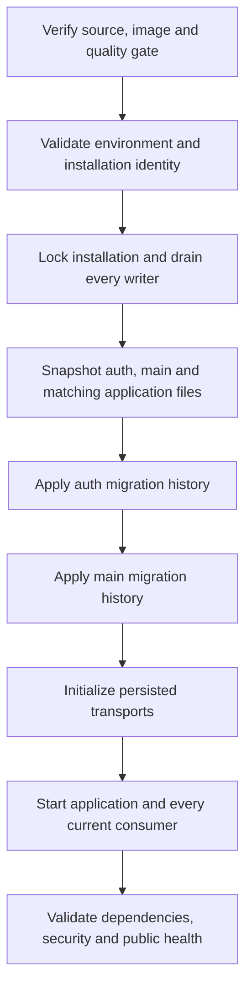

# Migrations and backups

Treat auth and main as separate backup and migration histories. A rollback of an image does not undo a persisted schema or data change.

**Authoritative references:** [Deployment](../../DEPLOYMENT.md) · [Makefile](../../Makefile) · [Doctrine mapping](../../config/packages/doctrine.yaml).

## Deployment sequence

Auth and main keep separate migration histories and backups. Apply compatible migrations before starting current workers, then validate dependency and security health.



The playbook defines the exact sequence and recovery behavior. Retain both backups,
their source revision and environment identity. Review restore compatibility before
replaying a message or changing an image. Development and production keep distinct
projects, databases, volumes and key material.

## Explicit migration configuration

```sh
php -d memory_limit=1G bin/console doctrine:migrations:status --configuration=config/migrations/auth.yaml
php -d memory_limit=1G bin/console doctrine:migrations:status --configuration=config/migrations/main.yaml
php -d memory_limit=1G bin/console doctrine:migrations:migrate --configuration=config/migrations/auth.yaml --dry-run
php -d memory_limit=1G bin/console doctrine:migrations:migrate --configuration=config/migrations/main.yaml --dry-run
```

Apply with `make migrate-auth`, `make migrate-main` or `make migrate-all` in the
deliberately selected environment. Never modify an existing migration. Validate
Doctrine mapping for both entity managers and check the owning module's rollout
requirements before starting workers compatible with the new schema.

## Backup and restore

Without activated off-host backups, managed deployment retains private consistent
pre-migration dumps and matching `files.tar`/`SHA256SUMS` under `VPS_APP_DIR/backups/`
(0700 directories, 0600 files). These local snapshots alone do not protect against
host loss. Activating the encrypted off-host helper replaces new local raw snapshots.
Neither archive includes deployment environment files or JWT key volumes. Secret
recovery must be provisioned independently in an operator-controlled encrypted store.

On migration, fixture reset or health failure, writers stay stopped and the
installation mutex remains held. An image rollback alone cannot repair schema or
data. Verify the failure and restore **both** compatible histories and matching
files, or finish forward-compatible migrations. Check secret recovery, scoped
record access, queues and scheduler execution in isolation before promotion.
Remove the reviewed `.fireguard-operation.lock` directory only after confirming no
maintenance/backup/deployment process still owns it; then start a reviewed rollout.

### Reviewed development deployment recovery

Failed development deployment `37080669400` stopped the writers after migrating
both histories, then failed when initializing several Messenger transports in one
command. The corrected playbook initializes each transport separately. A normal
rollout still refuses to acquire an existing installation lock.

For this specific incident, the manual `deploy-vps.yml` input
`reviewed_lock_recovery_run_id=37080669400` selects a guarded forward recovery.
Use it only after a normal deployment confirms the retained mutex and all other
development deployments have finished. Leave `image_ref` empty and
`reset_development_fixtures=false`; the source must be the current `develop` tip
with its exact successful CI and Sonar gate.

The helper verifies the failed job, source ancestry, immutable image digest and
revision, unchanged historical migration definitions, and the executed auth/main
versions. It also requires the fixed development installation, the original empty
lock identity and timestamps, stopped writers, no competing maintenance process
under the deployment user, and no competing container with access to its storage.
Other privileged operators must refrain from maintenance during recovery.
Missing or ambiguous evidence aborts before
releasing the mutex. It never restores or changes either database during inspection.

After repeating those checks, recovery replaces the reviewed empty lock and
immediately acquires it once. A competing owner is never removed or retried.
The regular backup, auth/main migrations, transport setup, startup and health checks
then run in full. A subsequent failure retains the new mutex; this incident-specific
input cannot release a newer lock. Uncatchable termination or host loss requires a
new manual inspection. Production, other failed runs, fixture resets and image
rollbacks are excluded from this recovery path.

## Encrypted periodic off-host snapshots

Provision `restic`, an initialized off-host repository, its independent encryption
password file (0600), and provider credentials privately. Copy
`ansible/backup.example.json` to the installation's `backup.json` (0600) and fill
the operator-reviewed values. The empty example fails closed. Select `storage_mode`
explicitly: `local` archives persistent application files; `external` additionally
requires `storage_export_argv`, which must export a version-consistent object-store
snapshot to the private `FIREGUARD_EXPORT_DIR` while writers are paused. Other
writers to that object store must be paused by the operator's export mechanism.
Set `secret_recovery_reference` to the independently tested encrypted secret store;
the helper records this reference but does not claim those secrets were restored.

`repository` accepts only off-host restic backends (`sftp:`, `s3:`, HTTPS `rest:`,
`b2:`, `azure:`, `gs:`). Optional `restic_env` supplies private provider credentials
at runtime; it is excluded from all snapshots and diagnostics. A missing binary,
destination, repository key, external export or secret-recovery reference fails
before any service is stopped. `validate` probes the repository; it never creates
one or invents backup success.

After prerequisites pass, explicitly set `FIREGUARD_BACKUP_ENABLED=true` and select
`FIREGUARD_BACKUP_CONFIG` if needed. Ansible then installs the 02:17 daily job
(host timezone) and requires an encrypted off-host snapshot before migrations.
Activation defaults to false. A periodic snapshot restores exactly the set of
writers previously running and verifies that state; a resume failure stops every
managed writer again and retains the installation mutex for reviewed recovery.
Activation does not delete existing local raw snapshots. Retire them privately
after a successful isolated recovery exercise and a reviewed retention decision.
The private manifest includes the source image, auth/main table counts, archive
checksums, storage mode and timestamp. Retention is seven daily, five weekly and
twelve monthly snapshots, grouped by installation rather than temporary archive path.
Monitor `backup-status.prom`: alert on failed attempts and a last successful snapshot
capture age greater than the accepted RPO. The completion timestamp is recorded
separately, so a long upload cannot make old source data appear recent. Upload/prune/resume failures
do not advance its last-success metric.

```sh
python3 fireguard-backup.py validate --config /operator/selected/backup.json
python3 fireguard-backup.py snapshot --config /operator/selected/backup.json --app-dir /operator/selected/installation
```

The destination, encryption key, provider access, secret store and storage export
are operator prerequisites. Repository support and synthetic tests do not establish
an installed or successful production backup service.

## Isolated restore exercise

Select an actual encrypted snapshot ID and the immutable PostgreSQL image used by
that installation. The exercise decrypts to a private temporary directory and
restores auth/main into uniquely named, disposable containers with no network,
published ports or production volumes. It rehydrates regular application files to
the private temporary directory and verifies each checksum. It verifies all public
table counts and validated database constraints, then removes only its resources.

```sh
python3 fireguard-backup.py restore-drill --config /operator/selected/backup.json \
  --app-dir /operator/selected/installation --snapshot-id SELECTED_SNAPSHOT \
  --postgres-image 'postgres:16-alpine@sha256:721873c34ceb9f8d8fc265984940dc982404c105f19ad51be9fdc5970a6080ea'
```

`restore-drill.json` records the snapshot, elapsed recovery time and verified checks.
Use that measured duration to set the installation's RTO; compare actual snapshot
age with its RPO. This database/file exercise explicitly leaves application smoke
checks and secret recovery unverified. Before promotion, restore the independent
secret store and object storage to isolated equivalents; verify authentication,
tenant denial, representative file downloads, idempotent message replay and the
next scheduled sweep. Record those checks alongside the drill evidence.

## Database Migrations

**Pre-deployment check**:

```bash
# List pending auth migrations
php -d memory_limit=1G bin/console doctrine:migrations:status --configuration=config/migrations/auth.yaml

# List pending main migrations
php -d memory_limit=1G bin/console doctrine:migrations:status --configuration=config/migrations/main.yaml

# Dry-run auth migrations (review SQL)
php -d memory_limit=1G bin/console doctrine:migrations:migrate --dry-run --configuration=config/migrations/auth.yaml

# Dry-run main migrations (review SQL)
php -d memory_limit=1G bin/console doctrine:migrations:migrate --configuration=config/migrations/main.yaml --dry-run
```

**Execute migrations**:

```bash
# Apply auth migrations
php -d memory_limit=1G bin/console doctrine:migrations:migrate --no-interaction --configuration=config/migrations/auth.yaml

# Apply main migrations
php -d memory_limit=1G bin/console doctrine:migrations:migrate --configuration=config/migrations/main.yaml --no-interaction

# Verify auth schema
php -d memory_limit=1G bin/console doctrine:schema:validate --em=auth

# Verify main schema
php -d memory_limit=1G bin/console doctrine:schema:validate --em=main
```

## Backup Strategy

The managed playbook backs up both databases before migrations. For an independent
backup, select the actual connections without putting passwords in shell history:

```sh
pg_dump --format=custom --dbname="$AUTH_DATABASE_URL" --file="$BACKUP_DIR/auth.dump"
pg_dump --format=custom --dbname="$MAIN_DATABASE_URL" --file="$BACKUP_DIR/main.dump"
```

`BACKUP_DIR` is an operator-selected private destination, not an application variable.
Use a credential mechanism supported by your PostgreSQL tooling and validate that
the URLs/options are suitable for libpq. Restore into separately selected recovery
databases first; record the schema/source version, verify access and queues, and
promote only after the recovery checks. Never treat an image rollback as a schema restore.

Back up JWT/encryption material through the installation's independently protected
secret mechanism. Keep its restore exercise separate from ordinary archives and
retain receipts for every message and snapshot that can still replay.

## Maintenance evaluation rollout

Apply main migration `Version20260920193000` before deploying evaluation-aware consumers.
Keep the main outbox worker and the existing maintenance sweep running: equipment and
compliance-policy events trigger recomputation, while the sweep repairs missed events and
initializes legacy schedules. A null `evaluatedAt` intentionally means not yet evaluated;
report generation time must not be used as data freshness. Monitor outbox backlog and
unevaluated equipment counts until the first complete sweep has finished. No existing
archived safety register is regenerated.

## Import simulation confirmation rollout

Apply main migration `Version20260921230000` before deploying confirmation consumers.
Preserve retained CSV files while a simulation or its linked real import can still be
confirmed, resumed or replayed. Both jobs intentionally reference the same immutable
bytes; cleanup must account for both references. Monitor failed main outbox deliveries
and import progress. A successful simulation does not reserve quotas or resource references.
