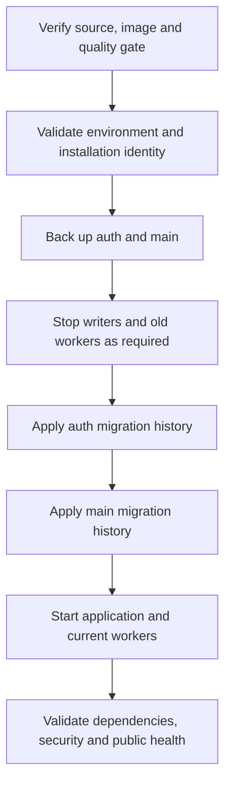

# Migrations and backups

Treat auth and main as separate backup and migration histories. A rollback of an image does not undo a persisted schema or data change.

**Authoritative references:** [Deployment](../../DEPLOYMENT.md) · [Makefile](../../Makefile) · [Doctrine mapping](../../config/packages/doctrine.yaml).

## Deployment sequence

Auth and main keep separate migration histories and backups. Apply compatible migrations before starting current workers, then validate dependency and security health.



The playbook defines the exact sequence and recovery behavior. Retain both backups,
their source revision and environment identity. Review restore compatibility before
replaying a message or changing an image. Development and production keep distinct
projects, databases, volumes and key material.

## Explicit migration configuration

```sh
php -d memory_limit=1G bin/console doctrine:migrations:status --configuration=config/migrations/auth.yaml
php -d memory_limit=1G bin/console doctrine:migrations:status --configuration=config/migrations/main.yaml
php -d memory_limit=1G bin/console doctrine:migrations:migrate --configuration=config/migrations/auth.yaml --dry-run
php -d memory_limit=1G bin/console doctrine:migrations:migrate --configuration=config/migrations/main.yaml --dry-run
```

Apply with `make migrate-auth`, `make migrate-main` or `make migrate-all` in the
deliberately selected environment. Never modify an existing migration. Validate
Doctrine mapping for both entity managers and check the owning module's rollout
requirements before starting workers compatible with the new schema.

## Backup and restore

Managed deployment retains pre-migration backups under `VPS_APP_DIR/backups/`.
Restore procedures must also account for JWT/encryption keys and configured object
storage. Store backups privately, define retention and exercise restores in isolation.
Verify schema, scoped record access and asynchronous processing after recovery.

## Database Migrations

**Pre-deployment check**:

```bash
# List pending auth migrations
php -d memory_limit=1G bin/console doctrine:migrations:status --configuration=config/migrations/auth.yaml

# List pending main migrations
php -d memory_limit=1G bin/console doctrine:migrations:status --configuration=config/migrations/main.yaml

# Dry-run auth migrations (review SQL)
php -d memory_limit=1G bin/console doctrine:migrations:migrate --dry-run --configuration=config/migrations/auth.yaml

# Dry-run main migrations (review SQL)
php -d memory_limit=1G bin/console doctrine:migrations:migrate --configuration=config/migrations/main.yaml --dry-run
```

**Execute migrations**:

```bash
# Apply auth migrations
php -d memory_limit=1G bin/console doctrine:migrations:migrate --no-interaction --configuration=config/migrations/auth.yaml

# Apply main migrations
php -d memory_limit=1G bin/console doctrine:migrations:migrate --configuration=config/migrations/main.yaml --no-interaction

# Verify auth schema
php -d memory_limit=1G bin/console doctrine:schema:validate --em=auth

# Verify main schema
php -d memory_limit=1G bin/console doctrine:schema:validate --em=main
```

## Backup Strategy

The managed playbook backs up both databases before migrations. For an independent
backup, select the actual connections without putting passwords in shell history:

```sh
pg_dump --format=custom --dbname="$AUTH_DATABASE_URL" --file="$BACKUP_DIR/auth.dump"
pg_dump --format=custom --dbname="$MAIN_DATABASE_URL" --file="$BACKUP_DIR/main.dump"
```

`BACKUP_DIR` is an operator-selected private destination, not an application variable.
Use a credential mechanism supported by your PostgreSQL tooling and validate that
the URLs/options are suitable for libpq. Restore into separately selected recovery
databases first; record the schema/source version, verify access and queues, and
promote only after the recovery checks. Never treat an image rollback as a schema restore.

Back up the required JWT/encryption material and configured object storage through
the installation's private secret/backup mechanism. Set a retention schedule that
covers recovery and queue replay, and verify it with isolated restore exercises;
the repository does not establish an installed daily/weekly/monthly backup service.

## Maintenance evaluation rollout

Apply main migration `Version20260920193000` before deploying evaluation-aware consumers.
Keep the main outbox worker and the existing maintenance sweep running: equipment and
compliance-policy events trigger recomputation, while the sweep repairs missed events and
initializes legacy schedules. A null `evaluatedAt` intentionally means not yet evaluated;
report generation time must not be used as data freshness. Monitor outbox backlog and
unevaluated equipment counts until the first complete sweep has finished. No existing
archived safety register is regenerated.

## Import simulation confirmation rollout

Apply main migration `Version20260921230000` before deploying confirmation consumers.
Preserve retained CSV files while a simulation or its linked real import can still be
confirmed, resumed or replayed. Both jobs intentionally reference the same immutable
bytes; cleanup must account for both references. Monitor failed main outbox deliveries
and import progress. A successful simulation does not reserve quotas or resource references.
