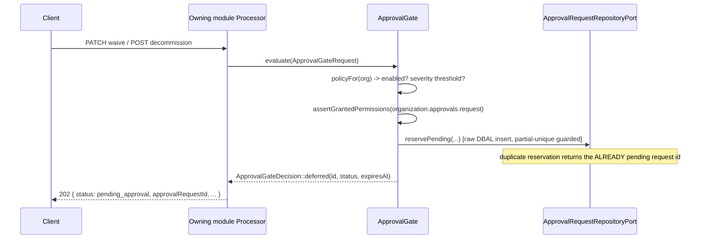
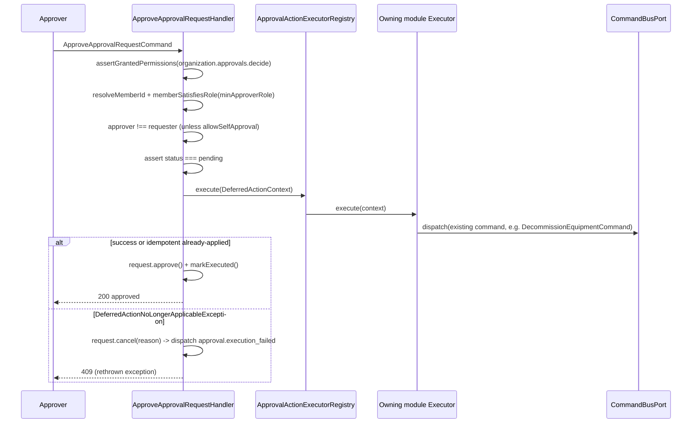

# Approval Module

## Overview

Approval gates two regulated actions — waiving a critical non-conformity and
permanently decommissioning equipment — behind a configurable, opt-in
**four-eyes** approval step. When an organization enables approval for an
action type, performing that action creates a pending `ApprovalRequest`
instead of applying immediately (the owning module's processor returns HTTP
**202**); a second authorized member then approves or rejects it. On
approval, the deferred action is re-executed through the owning module's
*existing* command, so the original domain handler re-validates state and
enforces idempotence.

Main goals:

- Enforce a second-person decision on high-consequence actions, without
  duplicating the owning modules' business rules.
- Keep the dependency direction strictly one-way: Approval depends on
  Inspection/Equipment/Organization (via ports and contracts only); those
  modules' **Domain** layers never reference Approval.
- Make the gate/executor seam reusable for future regulated action types.

## API Endpoints

| Method | Path | Description | Permission |
| --- | --- | --- | --- |
| GET | `/api/organizations/{organizationId}/approval-requests` | List approval requests (filters: `status`, `actionType`) | `organization.approvals.read` |
| GET | `/api/organizations/{organizationId}/approval-requests/{requestId}` | Get a single approval request | `organization.approvals.read` |
| POST | `/api/organizations/{organizationId}/approval-requests/{requestId}/approve` | Approve and re-execute the deferred action | `organization.approvals.decide` |
| POST | `/api/organizations/{organizationId}/approval-requests/{requestId}/reject` | Reject; the deferred action is never executed | `organization.approvals.decide` |
| GET | `/api/approvals/action-types` | Reference catalog of gatable action types | `ROLE_USER` |

Every operation requires `ROLE_USER` at the resource level; the
finer-grained permission checks are self-enforced in the application layer
by each handler through `OrganizationAuthorizationPort` (the
Webhook/Import/Maintenance convention) — processors stay thin.

**Scope before entitlement.** All four handlers decide access with
`OrganizationAuthorizationPort::resolveAccess()`, never the flat
`assertGrantedPermissions()`: `OUTSIDE_SCOPE` (no active membership) maps to
the same 404 an unknown identifier produces, and `MISSING_PERMISSION` to 403.
The decision handlers look a request up by path id *before* they know who
owns it, so collapsing both denials into 403 confirmed to an outsider that a
request exists while an unknown id answered 404 — an existence oracle across
organizations. Aligned with the Maintenance hardening (`fix(maintenance):
return 404 for schedules outside the caller's organization`) and the rule
`OrganizationAccessDecision` states in its own docblock.

**Known contract drift:** `/approve` and `/reject` are bare API Platform
`Post` operations with no `status:`, so a successful decision answers **201
Created** even though it creates nothing, while `ApprovalRequestResource`
documents 200. The tests assert 201, the behaviour as shipped; reconciling
the two is a wire change for the frontend and has not been made.

**Deviation from the lot brief's prose sketch:** the brief's narrative
description implies a flatter, unprefixed `/approval-requests` route family
with the organization resolved from a query parameter. This module instead
nests every route under `/organizations/{organizationId}/approval-requests`,
consistent with **every** other org-scoped resource in this API (Webhook,
Equipment, Inspection, Team, OrganizationRole…) — avoiding a new,
unprecedented unprefixed routing convention. The brief's "cancel" endpoint
was **not** built as a separate public operation: it exists only as an
internal `ApprovalRequest::cancel()` domain transition used by the approve
flow when the deferred action is no longer applicable — no
`CancelApprovalRequestCommand`/route exists (a pending request a requester
wants to withdraw can be left to expire, or rejected by a decider).

## Flows

### Deferred (gate returns "deferred")



### Approve



## Architecture

- **Domain** (`src/Approval/Domain`): `ApprovalRequest` (aggregate:
  approve/reject/cancel/expire/markExecuted/markExecutionFailed,
  isPending), `ApprovalRequestId`, `ApprovalStatus` (enum:
  pending|approved|rejected|cancelled|expired), domain events
  (`Domain/Event/Request`), exceptions — including the module-owned
  `ApprovalAccessDeniedException` the handlers raise instead of importing
  Organization's `OrganizationAccessDeniedException` (that cross-module
  **Domain** import is what `CrossModuleDomainBoundaryTest` ratchets; the
  `Approval => Organization` baseline came down 4 → 2 with it, the two
  survivors being `ApprovalGate` and `ApprovalExceptionMapperTrait`).
- **Application** (`src/Approval/Application`): `ApprovalActionTypes` /
  `ApprovalGateRequest` / `ApprovalGateDecision` / `ApprovalPolicy` /
  `DeferredActionContext` / `ApprovalReservation` (Contract), inbound
  `ApprovalGatePort`, outbound `ApprovalRequestRepositoryPort` /
  `ApprovalPolicyPort` / `ApprovalMemberDirectoryPort` /
  `ApprovalActionExecutorPort`, `ApprovalGate` / `ApprovalActionExecutorRegistry`
  (Service), use cases (approve/reject decisions, expiry sweep, get/list
  queries).
- **Infrastructure** (`src/Approval/Infrastructure`): Doctrine
  Record/Mapper/Repository (main entity manager; `reservePending()` uses a
  raw DBAL insert — never ORM `persist()`/`flush()` — so the partial-unique
  conflict never closes the EntityManager, mirrors
  `AutomationRunRepository::reserveRun()`), `ApprovalScheduleProvider`.
- **Presentation** (`src/Approval/Presentation`): `ApprovalRequestResource`,
  `ApprovalActionTypeCatalogResource` (reference catalog), processors,
  providers, Input/Output DTOs, `ApprovalExceptionMapperTrait`.

### Ports & adapters (`config/modules/approval.yaml`)

| Port | Adapter | Hosted in |
| --- | --- | --- |
| `ApprovalGatePort` (inbound) | `ApprovalGate` | Approval |
| `ApprovalRequestRepositoryPort` | `ApprovalRequestRepository` | Approval |
| `ApprovalPolicyPort` | `OrganizationApprovalPolicyAdapter` | Organization |
| `ApprovalMemberDirectoryPort` | `OrganizationApprovalMemberDirectoryAdapter` | Organization |
| `ApprovalActionExecutorPort` (`!tagged_iterator approval.deferred_action_executor`) | `NonConformityWaiverExecutorAdapter`, `EquipmentDecommissionExecutorAdapter` | Inspection, Equipment |
| `Organization\...\ApprovalActionTypeCatalogPort` | `ApprovalActionTypeCatalogAdapter` | Approval |

Module cycles (Approval↔Inspection, Approval↔Equipment, Approval↔Organization)
are acceptable: `deptrac.yaml` enforces LAYER boundaries only, not module
acyclicity — the same shape already exists (Organization↔Maintenance,
Organization↔Equipment via `EquipmentTypeCatalogPort`). Inspection's and
Equipment's **Domain** layers reference nothing from Approval.

## Interception & re-execution seams (the crux)

1. **Interception** — an inbound `Application\Port\Inbound\ApprovalGatePort`
   (implemented by `Application\Service\ApprovalGate`) that the owning
   modules' presentation processors consult **before** applying a regulated
   action — mirrors the `InterventionDraftFactoryPort` inbound-port
   precedent. The gate resolves the organization's policy, and either:
   - `ApprovalGateDecision::applyNow()` — the processor dispatches its
     existing command unchanged; or
   - `ApprovalGateDecision::deferred($requestId, $status, $expiresAt)` — the
     processor returns HTTP 202 with the pending request summary instead of
     dispatching, WITHOUT ever calling the original command.

   The gate never runs on the approved re-execution path, so no bypass flag
   is ever needed.

2. **Re-execution** — a tagged-iterator seam
   `Application\Port\Outbound\ApprovalActionExecutorPort`, tag
   `approval.deferred_action_executor` (mirrors
   `messaging.subject_resolver`). Each owning module hosts one adapter under
   its own `Infrastructure/Adapter/Approval/`:
   - `Inspection\Infrastructure\Adapter\Approval\NonConformityWaiverExecutorAdapter`
     re-dispatches the **existing** `UpdateNonConformityStatusCommand`
     (`status: 'waived'`).
   - `Equipment\Infrastructure\Adapter\Approval\EquipmentDecommissionExecutorAdapter`
     re-dispatches the **existing** `DecommissionEquipmentCommand`.

   `Application\Service\ApprovalActionExecutorRegistry` resolves the
   matching adapter by action type (`!tagged_iterator
   approval.deferred_action_executor`), throwing
   `ApprovalActionExecutorNotFoundException` when none is registered.

## Deferred-action re-validation & idempotence

Re-executing re-dispatches the owning module's *existing* command through
`CommandBusPort`, so its handler re-validates current state exactly as it
would for a fresh request:

- **Equipment**: `EquipmentAlreadyDecommissionedException` is unambiguous
  (decommissioned is a single terminal status) — the executor treats it as
  **idempotent success** (a second approve, or the equipment already
  decommissioned by another path, is a routine no-op). Any other conflict
  (`EquipmentNotFoundException`) is wrapped into
  `DeferredActionNoLongerApplicableException`.
- **Inspection**: `NonConformity::updateStatus()` throws
  `NonConformityAlreadyResolvedException` whether the non-conformity was
  already `done` **or** already `waived` — ambiguous on its own. The
  executor re-queries `GetNonConformityQuery` to check the *current* status:
  already-`waived` ⇒ idempotent success; anything else (already `done`, or
  the inspection/non-conformity no longer found) ⇒
  `DeferredActionNoLongerApplicableException`.

`ApproveApprovalRequestHandler` executes the deferred action **synchronously**,
while the request is still `pending` (immediate feedback to the approver):

- On success (including the idempotent-already-applied case): the request
  transitions `pending → approved` and `markExecuted()` records the
  timestamp.
- On `DeferredActionNoLongerApplicableException`: the request transitions
  `pending → cancelled` (reason recorded in `executionError`),
  `approval.execution_failed` is audited, and the processor maps the
  rethrown exception to HTTP 409. An approved-but-unapplied request can
  never exist.
- A second approve attempt on an already-decided request fails the
  `status === pending` guard (`ApprovalRequestNotPendingException`) **before**
  the executor runs again — the deferred action executes at most once per
  request.

## Gate call sites (owning modules)

- `Inspection\Presentation\Api\Processor\NonConformity\UpdateNonConformityStatusProcessor`
  — when the target status is `waived`, after the existing
  `organization.inspection.write` check, consults the gate with
  `payload: {organizationId, inspectionId, nonConformityId, severity, status: 'waived'}`.
  Non-waiver status changes are untouched.
- `Equipment\Presentation\Api\Processor\Equipment\DecommissionEquipmentProcessor`
  — after the existing `organization.equipment.write` check, consults the
  gate with `payload: {organizationId, equipmentId}`.

Both processors return a raw `Symfony\Component\HttpFoundation\JsonResponse`
(status 202) when deferred — API Platform's `SerializeProcessor`/
`RespondProcessor` pass a `Response` instance straight through — with the
body:

```json
{
  "status": "pending_approval",
  "approvalRequestId": "018f...-uuid",
  "approvalStatus": "pending",
  "expiresAt": "2026-08-01T00:00:00+00:00"
}
```

## Configuration (`approvalPolicy`)

`Organization\Domain\ValueObject\OrganizationApprovalSettings` (a new
`OrganizationSettings.approval` sub-section, mirroring `compliance`):

```json
{
  "action_rules": {
    "nc_waiver": { "enabled": true, "min_approver_role": "admin", "min_severity": "critical" },
    "equipment_decommission": { "enabled": true, "min_approver_role": "admin", "min_severity": null }
  },
  "allow_self_approval": false,
  "approval_ttl_days": 14
}
```

Only customizations are stored — every action type defaults to
**disabled** (`Organization\Domain\Catalog\OrganizationApprovalDefaults`),
so approval is strictly opt-in. `PATCH /organizations/{id}/settings` accepts
a partial `approval` section (`UpdateOrganizationApprovalInput`); a `null`
`actionRules` entry reverts that action type to "disabled".
`ValidApprovalPolicy` (class-level constraint on the input DTO) validates
the `actionRules` keys against `ApprovalActionTypeCatalogPort` (hosted here,
consumed by Organization) — the Organization domain never hardcodes
Approval's action-type list.

`minSeverity` only matters for `nc_waiver`: a waiver below the threshold
severity applies immediately even when the action type is enabled
(`ApprovalGate::belowSeverityThreshold()`, ordinal `low < medium < high <
critical`).

## Permissions

- `organization.approvals.read` — view the queue. Granted to `member` by
  default.
- `organization.approvals.request` — initiate a gated action. Granted to
  `member` by default (so enabling approval never locks out normal
  requesters); enforced by the gate **only** when approval is actually
  required for the action type.
- `organization.approvals.decide` — approve/reject. **Not** granted to
  `member` (admin-only via the `organization.*` wildcard) — mirrors
  Webhook's admin-only permissions.

Run `php bin/console app:authz:sync-permissions --update-roles` after
deploy (propagates `read`/`request` to persisted `member` roles).

## Audit

`approval.requested` / `approval.approved` / `approval.rejected` /
`approval.expired` / `approval.execution_failed` — appended to
`Audit\Infrastructure\EventSubscriber\AuditEventSubscriber` (subject type
`approval_request`).

## Expiry sweep

`Infrastructure\Scheduler\ApprovalScheduleProvider` (`#[AsSchedule('approval')]`)
triggers `ExpireStaleApprovalRequestsCommand` hourly — a clone of
`MaintenanceScheduleProvider`: stateful (missed triggers survive a restart)
and lock-guarded (`approval.expiry_sweep`). The command is dispatched
**directly onto its own `schedule://approval` transport** by the Scheduler
component itself — it never goes through `CommandBusPort` (which requires a
`HandledStamp`, unavailable for an async-routed message) and needs **no**
dedicated enqueue port (unlike `AutomationRuleQueuePort`, which exists
because Automation's trigger is an event subscriber, not a scheduler).

`ExpireStaleApprovalRequestsHandler` pages through pending requests whose
`expiresAt` has passed (`(status, expires_at)` index), transitions each to
`expired`, and dispatches `ApprovalExpiredEvent`.

**Operations:** the worker must run
`messenger:consume async scheduler_maintenance scheduler_intervention scheduler_approval`
(or equivalent) — see `OPERATIONS.md`. Without a `scheduler_approval`
consumer, pending requests never expire.

## Persistence

- Table (**main** database): `approval_requests`. Plain `organization_id`
  column (no ORM association, no FK) — mirrors `automation_runs`. Indexes:
  `(organization_id, status)`, `(organization_id, action_type, subject_id)`,
  `(status, expires_at)` (feeds the sweep). **Partial unique index**
  `(organization_id, action_type, subject_id) WHERE status = 'pending'`
  enforces at most one open request per subject+action — hand-written raw
  SQL (Doctrine ORM attributes cannot express a partial index).
- Migration: `migrations/main/Version20260718073811.php`.

## Configuration

- Service wiring: `config/modules/approval.yaml`.
- Doctrine mapping (main entity manager): `config/packages/doctrine.yaml`.
- Messenger: `config/packages/messenger.yaml` routes
  `ExpireStaleApprovalRequestsCommand` to `async` (for parity/documentation;
  the scheduler dispatches it directly onto `schedule://approval` regardless
  — see "Expiry sweep" above).
- composer.json: `"Approval\\": "src/Approval/"` PSR-4 autoload.

## Testing

- Unit: `tests/Unit/Approval`, plus executor adapter tests in
  `tests/Unit/Inspection/Infrastructure/Adapter/Approval` and
  `tests/Unit/Equipment/Infrastructure/Adapter/Approval`, and gate-consulting
  processor tests in `tests/Unit/Inspection/Presentation/Api/Processor/NonConformity`
  and `tests/Unit/Equipment/Presentation/Api/Processor/Equipment`.
- Functional: `tests/Functional/Api/ApprovalRequestApiTest.php` — the HTTP
  denial paths, seeding organizations, roles, members and `approval_requests`
  rows straight through Doctrine (mirrors `MaintenanceApiTest`): 401, 403 for
  a member without `decide`, 403 for a decider below `minApproverRole`, 403
  on self-approval, 409 already-decided, 409 `DeferredActionNoLongerApplicable`
  (with the request left `cancelled`, never `approved`), and the
  cross-organization 404s on list/get/approve/reject.
- E2E: `tests/E2E/ApprovalPresentationFlowTest.php` — the full gate over
  HTTP: enable the policy on the org settings, create equipment, POST
  decommission as a requester holding neither `decide` nor the admin tier
  (202 + `approvalRequestId`, equipment untouched), then approve as the owner
  (equipment becomes `decommissioned`) or reject (it does not, and a second
  decision conflicts).
- Run module tests: `php vendor/bin/phpunit tests/Unit/Approval`
## Error Codes

| Exception | HTTP |
| --- | --- |
| `ApprovalRequestNotFoundException` | 404 Not Found — unknown id, a request owned by another organization, **and an organization the caller is not an active member of** (`::forOrganizationScope()` on the listing) |
| `ApprovalAccessDeniedException` (member, but missing the required permission) / `SelfApprovalNotAllowedException` / `ApproverNotAuthorizedException` / `Organization\Domain\Exception\OrganizationAccessDeniedException` (still raised by `ApprovalGate`) | 403 Forbidden |
| `ApprovalRequestNotPendingException` / `DeferredActionNoLongerApplicableException` | 409 Conflict |
| `InvalidArgumentException` | 400 Bad Request |

