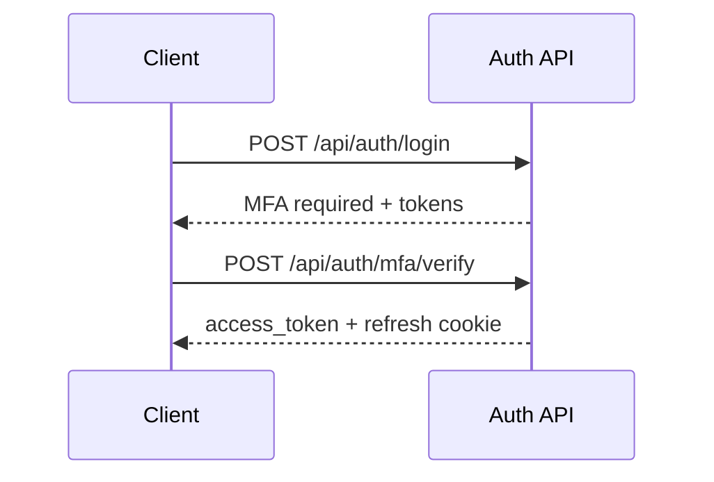
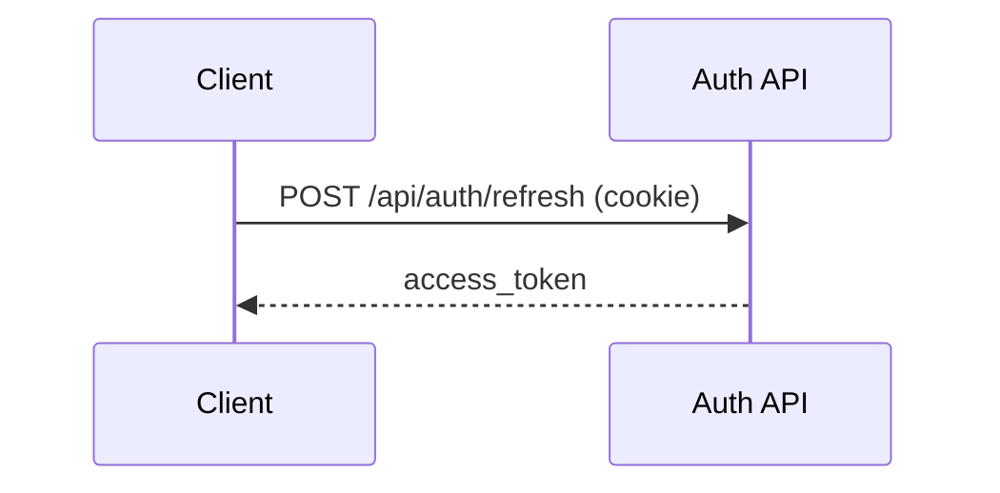

# Auth Module

Authentication module for Fireguard API. It provides user login, MFA verification, refresh token handling, and logout, while integrating with the OAuth2 and OpenID Connect stack.

## Overview

The Auth module is responsible for interactive user authentication. It issues access and refresh tokens, manages MFA challenges, and maintains secure refresh token cookies.

## Features

- Email or username authentication with password.
- Optional MFA with OTP (email, SMS, TOTP).
- Refresh token cookies with HttpOnly, SameSite, and secure defaults.
- Access tokens are minimized by default; optional email/RBAC claims via env.
- Session tracking and revocation.
- Integration with OAuth2/OpenID Connect flows.

## API Endpoints

### Authentication

#### POST `/api/auth/login`

Authenticates a user using email and password.

Request:
```json
{
  "email": "john.doe@example.com",
  "password": "SecureP@ssw0rd!",
  "remember_me": false
}
```

| Field | Type | Required | Description |
| --- | --- | --- | --- |
| `email` | string | Yes | Valid email address |
| `password` | string | Yes | User password (min 8 chars) |
| `remember_me` | boolean | No | Extend session duration (30 days) |

Success response (200):
```json
{
  "access_token": "eyJhbGciOiJSUzI1NiIsInR5cCI6IkpXVCJ9...",
  "token_type": "Bearer",
  "expires_in": 3600,
  "scope": "openid profile email"
}
```

If MFA is required (200):
```json
{
  "mfa_required": true,
  "mfa_token": "eyJ...",
  "challenge_token": "abc123..."
}
```

Notes:
- A HttpOnly refresh token cookie is set in the response.
- The refresh token cookie is not readable by JavaScript.

#### POST `/api/auth/mfa/verify`

Verifies the OTP to complete MFA.

Request:
```json
{
  "preAuthToken": "eyJ...",
  "code": "123456"
}
```

| Field | Type | Required | Description |
| --- | --- | --- | --- |
| `preAuthToken` | string | Yes | Token received in `mfa_token` |
| `code` | string | Yes | OTP/TOTP code (length: `OTP_CODE_LENGTH` for SMS/Email, `TOTP_DIGITS` for authenticator app) |

#### POST `/api/auth/mfa/resend`

Resends the MFA OTP code using the pre-auth token.

Request:
```json
{
  "preAuthToken": "eyJ..."
}
```

Response (200):
```json
{
  "mfa_required": true,
  "mfa_token": "eyJ...",
  "challenge_token": "abc123..."
}
```

Notes:
- Returns a **new** `mfa_token` and `challenge_token` to use for verification.
- Subject to cooldown and rate limiting.
- Returns `400 Bad Request` with `errorCode: "totp_not_resendable"` when the
  active challenge channel is `totp` (authenticator codes cannot be resent).

#### POST `/api/auth/refresh`

Refreshes the access token using the refresh token cookie.

Response (200):
```json
{
  "access_token": "eyJ...",
  "token_type": "Bearer",
  "expires_in": 3600
}
```

Notes:
- No request body is required.
- The refresh token is read from the HttpOnly cookie.

#### POST `/api/auth/logout`

Revokes tokens and clears the refresh token cookie.

Headers:
```http
Authorization: Bearer <access_token>
```

Response (200):
```json
{
  "success": true,
  "message": "Logout successful"
}
```

### Password Reset

#### POST `/api/auth/password/reset/request`

Request a password reset by email. An OTP code will be sent if the account exists.

Request:
```json
{
  "email": "john.doe@example.com"
}
```

| Field | Type | Required | Description |
| --- | --- | --- | --- |
| `email` | string | Yes | User's email address |

Response (200):
```json
{
  "success": true,
  "message": "If an account exists with this email, you will receive a password reset code."
}
```

Notes:
- Always returns success to prevent user enumeration
- OTP code is sent via email (15 min expiry, 5 attempts max)

#### POST `/api/auth/password/reset/confirm`

Confirm password reset using the token, code, and new password.

Request:
```json
{
  "token": "abc123...",
  "code": "123456",
  "newPassword": "NewSecureP@ss123!"
}
```

| Field | Type | Required | Description |
| --- | --- | --- | --- |
| `token` | string | Yes | Challenge token from request step |
| `code` | string | Yes | OTP code received by email |
| `newPassword` | string | Yes | New password (min 8 chars, must include uppercase, lowercase, digit, special char) |

Response (200):
```json
{
  "success": true,
  "message": "Password has been reset successfully. All active sessions have been terminated."
}
```

Error response (401):
```json
{
  "success": false,
  "message": "Invalid verification code. Please check and try again.",
  "errorCode": "invalid_code",
  "attemptsRemaining": 3
}
```

Notes:
- All active sessions are revoked on success
- All OAuth tokens are revoked on success
- Error codes: `invalid_code`, `expired`, `max_attempts_exceeded`, `invalid_token`

### OAuth2 and Discovery

This module integrates with the OAuth module for authorization, token issuance, and discovery. For full details, see `src/OAuth/MODULE.md`.

Core endpoints:
- `/api/oauth2/authorize`
- `/api/oauth2/token`
- `/api/oauth2/token/introspect`
- `/api/oauth2/token/revoke`
- `/api/oauth2/userinfo`
- `/api/oauth2/logout`
- `/api/.well-known/openid-configuration`
- `/api/.well-known/jwks.json`

## Flows

### Login with MFA



### Refresh Token



## Refresh Token Policy

- Access token TTL: `ACCESS_TOKEN_TTL` (seconds).
- Refresh token TTLs:
  - Short: `REFRESH_TOKEN_LIFETIME_SHORT` (default for non-remembered sessions).
  - Long: `REFRESH_TOKEN_LIFETIME_LONG` (used when `remember_me=true`).
- Refresh responses may rotate the refresh token when the OAuth server issues a new one.
  When a new refresh token is returned, session tracking updates the session identifiers.
- Logout revokes refresh tokens and clears the refresh token cookie.

## MFA & OTP

- `/api/auth/mfa/verify` completes MFA using a pre-auth token and OTP/TOTP code.
- General OTP flows (email/SMS challenges and TOTP setup/confirm/disable) are
  exposed in the OTP module: see `src/Otp/MODULE.md`.
- OTP endpoints require `otp_*` permissions and are intended for authenticated
  user flows or internal service usage.

### MFA channel selection

- `LoginHandler` picks the MFA channel per login attempt: if the user has an
  **ACTIVE** TOTP enrollment (checked via `Auth\Application\Port\Outbound\Mfa\TotpEnrollmentCheckPort`,
  implemented in the Otp module), the channel is `totp` and **no email is
  sent** — the user enters the current code from their authenticator app.
  Otherwise the channel falls back to `email`.
- This is an either/or choice per login, not a multi-method selector: a user
  with active TOTP no longer receives email MFA codes at login. This keeps
  the pre-auth token/challenge model (one challenge token, one channel)
  unchanged rather than introducing a method-selection step.
- `/api/auth/mfa/resend` is a no-op (`400 Bad Request`, `errorCode:
  "totp_not_resendable"`) when the active challenge's channel is `totp`,
  since TOTP codes are generated locally and cannot be "resent".
- If the `TotpEnrollmentCheckPort` check fails for any reason, login falls
  back to `email` rather than blocking the user.

## Integration Examples

Login:
```bash
curl -X POST http://localhost:8000/api/auth/login \
  -H "Content-Type: application/json" \
  -d '{"email":"john.doe@example.com","password":"SecureP@ssw0rd!","remember_me":false}'
```

Refresh (using cookie jar):
```bash
curl -X POST http://localhost:8000/api/auth/refresh \
  -H "Content-Type: application/json" \
  -b cookies.txt
```

OIDC Authorization Code + PKCE:
1. Redirect the user to `/api/oauth2/authorize` with PKCE parameters.
2. Exchange the code at `/api/oauth2/token`.
3. Use the access token for protected APIs and `/api/oauth2/userinfo`.

See `src/OAuth/MODULE.md` for the full OAuth2/OIDC flow.

## Architecture

- Presentation: Api Platform resources, processors, and providers.
- Application: Use cases and ports for login, MFA verification, refresh, and logout.
- Domain: Session and token aggregates with events.
- Infrastructure: JWT adapters, rate limiting, session tracking, and security voters.

Key folders:
- `src/Auth/Presentation/Api`
- `src/Auth/Application/UseCase`
- `src/Auth/Domain`
- `src/Auth/Infrastructure`

## Configuration

Environment variables (see `.env`):
- `MFA_ENABLED`
- `ACCESS_TOKEN_INCLUDE_EMAIL` (default: `true` for backward compatibility)
- `ACCESS_TOKEN_INCLUDE_RBAC` (default: `true` for backward compatibility)
- `REFRESH_TOKEN_COOKIE_NAME`
- `REFRESH_TOKEN_LIFETIME_SHORT`
- `REFRESH_TOKEN_LIFETIME_LONG`
- `TRUSTED_DEVICE_COOKIE_NAME`
- `TRUSTED_DEVICE_LIFETIME`
- `OAUTH_ISSUER`

Service wiring:
- `config/modules/auth.yaml`

## Testing

- Unit: `tests/Unit/Auth`
- Integration: `tests/Integration/Auth`
- End-to-end: `tests/E2E` (auth flows)

## Error Codes

- `AuthenticationException` -> invalid credentials or user state
- `AuthorizationException` -> unauthorized access
- `MfaChallengeException` -> invalid or expired MFA challenge
- `TokenRevocationException` -> token revocation failed
