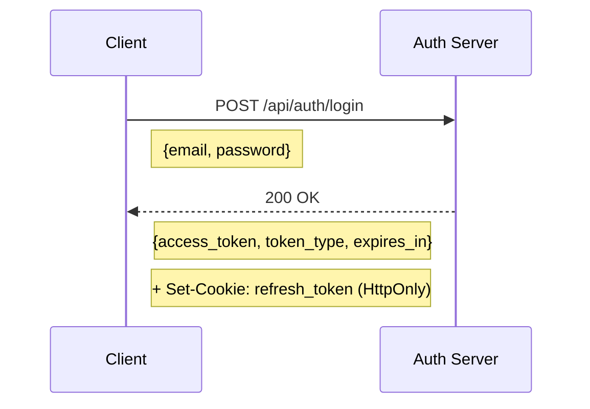
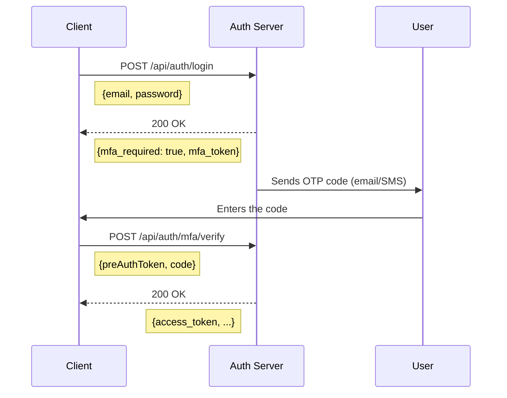
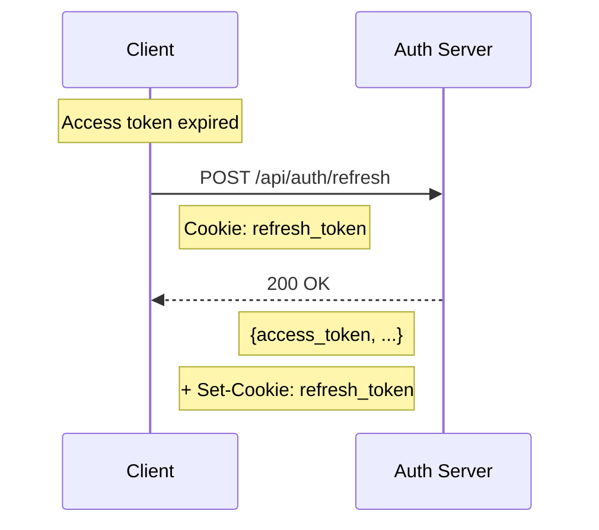
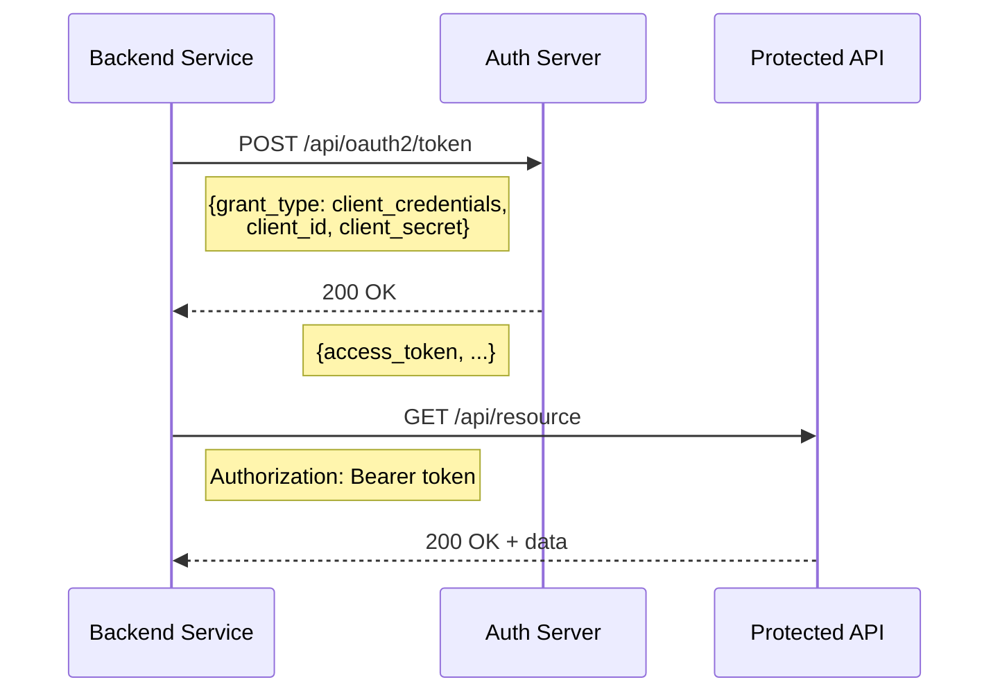

# Auth Module Documentation

Authentication module for **Fireguard Auth Server**.
Implements OAuth 2.0 (RFC 6749) and OpenID Connect Core 1.0.

---

## Table of Contents

- [Overview](#overview)
- [API Endpoints](#api-endpoints)
  - [Authentication](#authentication)
  - [OAuth2](#oauth2)
  - [Discovery](#discovery)
- [Authentication Flows](#authentication-flows)
- [Integration Examples](#integration-examples)
- [Architecture](#architecture)
- [Developer Guide](#developer-guide)
- [Configuration](#configuration)
- [Error Codes](#error-codes)

---

<div align="right"><a href="#auth-module-documentation">Back to top ⬆️</a></div>

## Overview

The Auth module provides user authentication via email/password or username with optional Multi-Factor Authentication (MFA) support. It leverages JSON Web Tokens (JWT) for stateless authentication and enhances security with HttpOnly cookies for refresh token storage.

### Features

| Feature | Description |
|---------|-------------|
| 🔐 Login email/password | Standard user authentication |
| 🎫 JWT Tokens | Access token + Refresh token (JWT) |
| 🔑 MFA | Multi-factor authentication via OTP (Email, SMS, TOTP) |
| 🍪 HttpOnly Cookies | Secure storage for Refresh Tokens against XSS |
| 📱 Sessions | Multi-device session management and revocation |
| 🔄 Token Refresh | Automatic token renewal without re-login |
| 🔓 OAuth2 | Supports `client_credentials`, `authorization_code`, etc. |
| 🆔 OpenID Connect | UserInfo endpoint, OIDC Discovery |

---

<div align="right"><a href="#auth-module-documentation">Back to top ⬆️</a></div>

## API Endpoints

### Authentication

Endpoints for direct user authentication.

#### POST `/api/auth/login`

Authenticates a user using email and password.

**Request:**
```json
{
  "email": "john.doe@example.com",
  "password": "SecureP@ssw0rd!",
  "remember_me": false
}
```

| Field | Type | Required | Description |
|-------|------|:--------:|-------------|
| `email` | string | ✅ | Valid email address |
| `password` | string | ✅ | User password (min 8 chars) |
| `remember_me` | boolean | ❌ | Extend session duration (30 days) |

**Success Response (200):**
```json
{
  "access_token": "eyJhbGciOiJSUzI1NiIsInR5cCI6IkpXVCJ9...",
  "token_type": "Bearer",
  "expires_in": 3600,
  "scope": "openid profile email"
}
```

> [!IMPORTANT]
> An **HttpOnly** `refresh_token` cookie is automatically set in the response. This cookie is not accessible via JavaScript.

**MFA Required Response (200):**
```json
{
  "mfa_required": true,
  "mfa_token": "eyJ...",
  "challenge_token": "abc123..."
}
```

---

#### POST `/api/auth/mfa/verify`

Verifies the One-Time Password (OTP) to complete the MFA process.

**Request:**
```json
{
  "preAuthToken": "eyJ...",
  "code": "123456"
}
```

| Field | Type | Required | Description |
|-------|------|:--------:|-------------|
| `preAuthToken` | string | ✅ | Token received in `mfa_token` from login response |
| `code` | string | ✅ | 6-digit OTP code |

---

#### POST `/api/auth/refresh`

Refreshes the Access Token using the Refresh Token cookie.

> [!WARNING]
> No request body is required for this endpoint.
> The refresh token is read directly from the secure **HttpOnly cookie**.

**Response (200):**
```json
{
  "access_token": "eyJ...",
  "token_type": "Bearer",
  "expires_in": 3600
}
```

---

#### POST `/api/auth/logout`

Revokes tokens (Access & Refresh) and clears the session cookie.

**Headers:**
```http
Authorization: Bearer <access_token>
```

**Response (200):**
```json
{
  "success": true,
  "message": "Logout successful"
}
```

---

<div align="right"><a href="#auth-module-documentation">Back to top ⬆️</a></div>

### OAuth2

OAuth 2.0 endpoints compliant with RFC 6749, 7009, 7662.

#### POST `/api/oauth2/token`

Issues an access token based on the provided grant type.

**Supported Grant Types:**

| Grant Type | Description |
|------------|-------------|
| `client_credentials` | Machine-to-machine authentication |
| `refresh_token` | Token renewal |
| `authorization_code` | Authorization Code Flow for web apps |

**Example (client_credentials):**
```json
{
  "grant_type": "client_credentials",
  "client_id": "your-client-id",
  "client_secret": "your-client-secret",
  "scope": "read write"
}
```

---

#### POST `/api/oauth2/token/introspect`

Introspects a token to retrieve its metadata (RFC 7662).

**Request:**
```json
{
  "token": "eyJ...",
  "token_type_hint": "access_token"
}
```

---

#### POST `/api/oauth2/token/revoke`

Revokes a token (RFC 7009).

**Request:**
```json
{
  "token": "eyJ...",
  "token_type_hint": "access_token"
}
```

---

#### GET `/api/oauth2/userinfo`

Retrieves authenticated user information (OpenID Connect).

**Headers:**
```http
Authorization: Bearer <access_token>
```

**Response:**
```json
{
  "sub": "user-uuid",
  "email": "john.doe@example.com",
  "email_verified": true,
  "name": "John Doe",
  "given_name": "John",
  "family_name": "Doe"
}
```

---

<div align="right"><a href="#auth-module-documentation">Back to top ⬆️</a></div>

### Discovery

OAuth2 Authorization Server Metadata (RFC 8414) with optional OpenID Connect extensions.

| Endpoint | Description |
|----------|-------------|
| `GET /.well-known/openid-configuration` | OpenID Provider Configuration Information |
| `GET /.well-known/jwks.json` | JSON Web Key Set (Public Keys for JWT verification) |

Notes:
- `authorization_endpoint` and `end_session_endpoint` are only published when `OAUTH_AUTHORIZE_PATH` and `OAUTH_LOGOUT_PATH` are configured (path, route name, or absolute URL).
- When not configured, metadata reflects the supported non-interactive grants (e.g. `client_credentials`, `refresh_token`).

Rate limiting:
- Token, introspection, and revocation endpoints are rate-limited via `limiter.oauth_token`, `limiter.oauth_introspection`, and `limiter.oauth_revocation` in `config/packages/rate_limiter.yaml`.

---

<div align="right"><a href="#auth-module-documentation">Back to top ⬆️</a></div>

## Authentication Flows

This section illustrates the sequences of interactions for different authentication scenarios.

### Standard Flow (No MFA)

This is the most common flow where a user logs in with email and password. Upon success, they receive an access token and a secure HttpOnly cookie containing the refresh token.



### MFA Flow

When Multi-Factor Authentication is enabled, the login process requires an additional step. The server first validates credentials and requests a second factor (OTP).



### Token Refresh Flow

Access tokens are short-lived. When an access token expires, the client can request a new one using the refresh token stored in the secure cookie, without requiring user intervention.



### OAuth2 Client Credentials Flow

This flow is used for machine-to-machine (M2M) communication where a backend service needs to authenticate itself to access protected resources, independent of any user.



---

<div align="right"><a href="#auth-module-documentation">Back to top ⬆️</a></div>

## Integration Examples

### cURL Example

```bash
# Login
curl -X POST https://auth.example.com/api/auth/login \
  -H "Content-Type: application/json" \
  -c cookies.txt \
  -d '{"email": "user@example.com", "password": "password123"}'

# Authenticated Request
curl -X GET https://api.example.com/api/resource \
  -H "Authorization: Bearer <access_token>"

# Refresh token
curl -X POST https://auth.example.com/api/auth/refresh \
  -b cookies.txt -c cookies.txt

# Logout
curl -X POST https://auth.example.com/api/auth/logout \
  -H "Authorization: Bearer <access_token>" \
  -b cookies.txt
```

### Key Integration Points

| Point | Description |
|-------|-------------|
| Cookies | Use `credentials: 'include'` (fetch) or `withCredentials: true` (XHR/Axios) |
| Authorization | Send header `Authorization: Bearer <token>` for authenticated requests |
| Content-Type | Use `application/json` for Auth endpoints; OAuth2 token endpoints also accept `application/x-www-form-urlencoded` (preferred) |
| CORS | Ensure correct CORS configuration on the server side (Allow-Origin, Allow-Credentials) |

---

<div align="right"><a href="#auth-module-documentation">Back to top ⬆️</a></div>

## Architecture

The module follows **Hexagonal Architecture** (Ports & Adapters) principles:

```
src/Auth/
├── Application/              # Application Layer (Use Cases)
│   ├── Port/                 # Ports (Interfaces)
│   │   ├── Inbound/          # Use Case Interfaces
│   │   └── Outbound/         # Infrastructure Interfaces
│   ├── UseCase/              # Business Logic
│   │   ├── Command/          # Write operations
│   │   └── Query/            # Read operations
│   └── Validation/           # Application Validation
│
├── Domain/                   # Domain Layer (Core Business)
│   ├── Aggregate/            # Aggregates Roots
│   ├── Event/                # Domain Events
│   ├── Model/                # Entities
│   ├── Service/              # Domain Services
│   └── ValueObject/          # Value Objects
│
├── Infrastructure/           # Infrastructure Layer (Adapters)
│   ├── Adapter/              # External Service Adapters
│   ├── OAuth2/               # OAuth2 Server Implementation
│   ├── Persistence/          # Doctrine Repositories
│   └── Security/             # Symfony Security Integration
│
└── Presentation/             # Presentation Layer (API)
    ├── Dto/                  # Data Transfer Objects
    ├── Http/                 # API Platform Processors/Providers
    ├── Resource/             # API Resources
    └── Serialization/        # Serialization Groups
```

---

<div align="right"><a href="#auth-module-documentation">Back to top ⬆️</a></div>

## Developer Guide

Useful information for developers working on the Auth module.

### Common Commands

| Command | Description |
|---------|-------------|
| `make test` | Run all tests (Unit, Functional, E2E) |
| `make phpstan` | Run static analysis (PHPStan) |
| `make deptrac` | Verify architectural layers dependency rules |

> [!NOTE]
> Ensure all tests pass and static analysis is clean before submitting a Pull Request.

### Testing

The module is covered by three types of tests:

1.  **Unit Tests**: `tests/Unit/Auth` - Test individual classes (Domain models, Handlers) in isolation.
2.  **Functional Tests**: `tests/Functional/Auth` - Test internal services and integration with Symfony.
3.  **E2E Tests**: `tests/E2E` - Test the full API flow (HTTP Requests -> Response) using a real database.
---

<div align="right"><a href="#auth-module-documentation">Back to top ⬆️</a></div>

## Configuration

### Environment Variables

Configuration is managed via environment variables (typically in `.env`).

```env
# JWT Configuration
JWT_SECRET_KEY=%kernel.project_dir%/config/jwt/private.key
JWT_PUBLIC_KEY=%kernel.project_dir%/config/jwt/public.key
JWT_PASSPHRASE=your-passphrase
JWT_TTL=3600

# OAuth2 Configuration
OAUTH2_ACCESS_TOKEN_TTL=3600
OAUTH2_REFRESH_TOKEN_TTL=86400
OAUTH2_REFRESH_TOKEN_REMEMBER_ME_TTL=2592000

# MFA Configuration
MFA_ENABLED=true
MFA_CODE_LENGTH=6
MFA_CODE_TTL=300
```

---

<div align="right"><a href="#auth-module-documentation">Back to top ⬆️</a></div>

## Error Codes

The API returns standard HTTP status codes along with specific error codes in the response body when applicable.

| HTTP | Code | Description |
|:----:|------|-------------|
| 400 | `invalid_request` | Invalid request (missing parameter, malformed body) |
| 401 | `invalid_credentials` | Incorrect email or password |
| 401 | `invalid_token` | Token is expired, revoked, or invalid |
| 401 | `invalid_grant` | The provided grant (code/token) is invalid |
| 403 | `account_disabled` | User account is disabled or locked |
| 403 | `mfa_required` | Multi-Factor Authentication is required to proceed |
| 429 | `rate_limit_exceeded` | Too many requests (Rate Limiting) |
