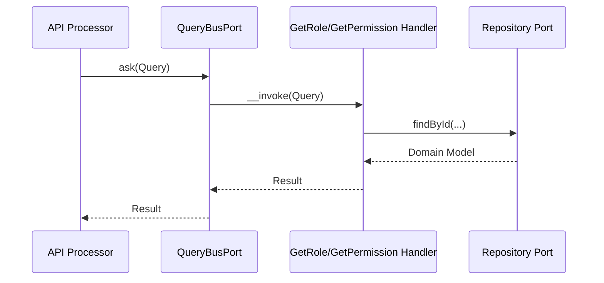
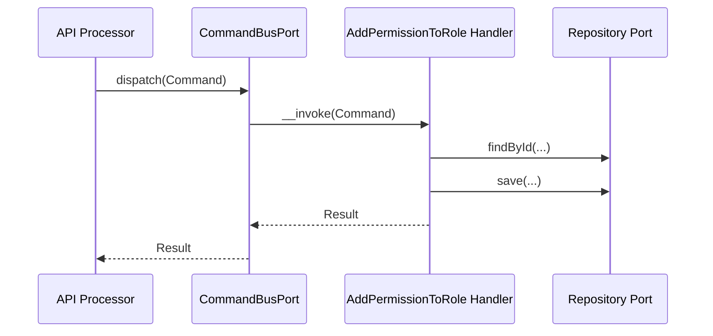

# Authorization Module

## Overview

Authorization implements RBAC and permission checks for the platform. Roles
group permissions, and role assignments are attached to subjects (users).

## API Endpoints

| Resource | Method | Path | Description |
| --- | --- | --- | --- |
| Role | GET | `/api/roles` | List roles |
| Role | GET | `/api/roles/{id}` | Get role details |
| Role | POST | `/api/roles` | Create role |
| Role | PATCH | `/api/roles/{id}` | Update role |
| Role | DELETE | `/api/roles/{id}` | Delete role (system roles are protected) |
| Role | POST | `/api/roles/{roleId}/permissions` | Add permission to role |
| Role | DELETE | `/api/roles/{roleId}/permissions/{permissionId}` | Remove permission from role |
| Permission | GET | `/api/permissions` | List permissions |
| Permission | GET | `/api/permissions/{id}` | Get permission details |
| Permission | POST | `/api/permissions` | Create permission |
| Permission | PATCH | `/api/permissions/{id}` | Update permission |
| Permission | DELETE | `/api/permissions/{id}` | Delete permission |

## Flows

### Check Permission (Query)

### Assign Permission to Role (Command)

## Architecture

- Presentation: Api Platform resources, processors, and providers.
- Application: Use cases (Command/Query), ports, and services.
- Domain: Role, Permission, RoleAssignment models with value objects.
- Infrastructure: Doctrine repositories, mappers, fixtures, and voters.

Key folders:
- `src/Authorization/Presentation/Api`
- `src/Authorization/Application/UseCase`
- `src/Authorization/Domain`
- `src/Authorization/Infrastructure`

## Configuration

- Service wiring: `config/modules/authorization.yaml`
- Voters: `Authorization\Infrastructure\Security\Voter`
- Fixtures: `Authorization\Infrastructure\DataFixtures\AuthorizationFixtures`

## Testing

- Unit: `tests/Unit/Authorization`
- Run module tests: `make test tests/Unit/Authorization`

## Error Codes

- `RoleNotFoundException` -> role not found
- `PermissionNotFoundException` -> permission not found
- `SystemRoleDeletionException` -> system role cannot be deleted
