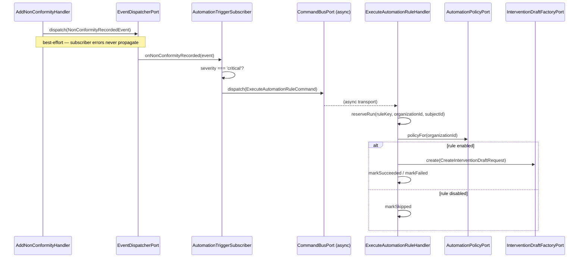

# Automation Module

## Overview

Automation is a lightweight module that turns domain events from other
modules into system-actor actions, gated by an organization's own automation
policy toggles. Lot 7 implements exactly one rule:
`auto_create_intervention_on_critical_nc` — recording a critical
non-conformity auto-creates a draft corrective intervention, when the
organization has opted in.

Main goals:

- React to domain events (trigger subscribers) without coupling the emitting
  module to Automation.
- Gate every rule behind an explicit, per-organization opt-in toggle (default
  off).
- Execute the rule's action exactly once per subject, even under Messenger
  retries or duplicate trigger dispatches.
- Never let an automation failure — or a trigger subscriber failure — affect
  the request that raised the triggering event.

No API endpoints in this lot: no new organization permissions, no read/write
resources. Everything is event-driven.

## Flows

### Trigger → execute (async)

## Domain Model

No aggregate: automation runs are a record-level idempotence/audit log
(`AutomationRunRecord`), the same treatment
`InterventionTemplateRecord`/`MaintenanceScheduleRecord` receive elsewhere.

- `AutomationRunRecord`: `id`, `ruleKey` (≤ 80 chars), `organizationId`
  (denormalized, not a foreign key), `subjectId`, `status`
  (`succeeded` | `failed` | `skipped`), `interventionId` (nullable),
  `error` (nullable), `createdAt`; unique per `(ruleKey, subjectId)`.

Domain events (`Domain/Event/Rule`): `AutomationRuleExecutedEvent`,
`AutomationRuleFailedEvent` — both carry `ruleKey`, `organizationId`,
`subjectId`, and either `interventionId` or `error`. Dispatched by
`ExecuteAutomationRuleHandler` with a system actor (no user is ever
attributed to an automation).

## Architecture

- **Application** (`src/Automation/Application`): the single use case
  (`ExecuteAutomationRuleHandler`), outbound ports
  (`AutomationRunPort`, `AutomationPolicyPort`), and contracts
  (`AutomationTriggers` — trigger event name + rule key constants;
  `AutomationPolicy` — the resolved per-organization policy DTO).
- **Domain** (`src/Automation/Domain`): the two rule-outcome events and
  `AutomationRunNotFoundException`.
- **Infrastructure** (`src/Automation/Infrastructure`): the Doctrine
  run repository/record and `AutomationTriggerSubscriber`.

### Trigger contract

`AutomationTriggers::NON_CONFORMITY_RECORDED_EVENT` holds the **exact**
event name the Shared event dispatcher assigns
`Inspection\Domain\Event\NonConformity\NonConformityRecordedEvent`
(`inspection.non_conformity_recorded_event`, per
`SymfonyEventDispatcherAdapter`'s `<module>.<snake_case_class>` convention —
verified against the event class and its dispatch site,
`AddNonConformityHandler`). The event's payload is `organizationId`,
`inspectionId`, `nonConformityId`, `severity` — **no** equipment or facility
identifier. This is why the corrective intervention draft this lot creates
has no `siteId`: the trigger simply does not carry one. A future lot that
needs it would have to either extend the event's payload or look the
non-conformity/inspection up through a new cross-module port; this lot does
neither, to stay within its "no new ports beyond what's specified" scope.

### AutomationTriggerSubscriber

Positioned exactly like `Audit\Infrastructure\EventSubscriber\AuditEventSubscriber`
(which itself already subscribes to the same `NonConformityRecordedEvent`,
independently, for the audit ledger): implements
`Symfony\Component\EventDispatcher\EventSubscriberInterface`, is
autoconfigured (no explicit tag needed), and reacts to a `critical` severity
by dispatching `ExecuteAutomationRuleCommand` through `CommandBusPort` —
routed to the `async` transport
(`config/packages/messenger.yaml`). Subscriber errors are swallowed and
logged, mirroring the Audit subscriber's `dispatchAuditEvent()` — a failure
here must never fail the non-conformity recording request itself.

### ExecuteAutomationRuleHandler

The single execution path for every automation rule, even though only one
exists today:

1. **Idempotence** — `AutomationRunPort::reserveRun()` inserts a placeholder
   run row FIRST, via a raw DBAL statement (not the ORM's
   `persist()`/`flush()` — a unique-constraint violation during an ORM
   `flush()` closes the `EntityManager`, and a duplicate claim is an
   expected, routine outcome here; mirrors
   `Intervention\Infrastructure\Adapter\Recurrence\DoctrineInterventionRecurrenceAdapter::reserveRun()`).
   A reservation miss (`null`) is a silent no-op.
2. **Policy** — `AutomationPolicyPort::policyFor()` is read fresh (never
   trusted from the trigger subscriber's own severity gate, so a future
   rule/policy shape change only needs updating here). Toggle off → the run
   is marked `skipped`, done.
3. **Action** — builds a corrective intervention draft through
   `Intervention\Application\Port\Inbound\InterventionDraftFactoryPort`:
   system actor (`actorUserId: null`), `origin:
   'automation:auto_create_intervention_on_critical_nc'`, `type:
   'inspection_campaign'` (the most defensible existing type for a
   re-inspection/verification action — mirrors
   `Maintenance\...\GenerateInspectionCampaignHandler`'s exact same choice),
   one required work item (`action: 'inspection'`, `target` a JSON object
   with `nonConformityId`/`inspectionId` — no `equipmentId`, see above),
   `priority: 'urgent'`, `dueAt = now + nonConformitySlaDays[severity] days`
   (from the resolved policy; `severity` comes from the trigger payload,
   defaulting to `critical`).
4. **Outcome** — success marks the run `succeeded` with the intervention id
   and dispatches `automation.rule_executed`; failure marks the run `failed`
   with the error and dispatches `automation.rule_failed` — deliberately
   swallowed (logged, not rethrown): the run row already guards against a
   Messenger retry producing a duplicate draft.

### Ports & adapters (`config/modules/automation.yaml`)

| Port | Adapter |
| --- | --- |
| `AutomationRunPort` (outbound) | `AutomationRunRepository` |
| `AutomationPolicyPort` (outbound, cross-module) | `Organization\Infrastructure\Adapter\Automation\OrganizationAutomationPolicyAdapter` |

`OrganizationAutomationPolicyAdapter` reads the organization's existing
`OrganizationAutomationSettings` (rule toggles) and
`OrganizationComplianceSettings::effectiveNonConformitySlaDays()` value
objects, mirroring
`Organization\Infrastructure\Adapter\Maintenance\OrganizationCompliancePolicyAdapter`.
Registered in `config/modules/organization.yaml`; aliased in
`config/modules/automation.yaml`. Never throws on an unknown/malformed
organization: falls back to "everything off, catalog SLA defaults" so a
lookup failure can never silently trigger an automation.

Reused inbound port from another module:
`Intervention\Application\Port\Inbound\InterventionDraftFactoryPort` (the
corrective intervention draft).

## Configuration

- Service wiring: `config/modules/automation.yaml`
- Doctrine mapping (main entity manager): `config/packages/doctrine.yaml`
- Messenger routing: `config/packages/messenger.yaml`
  (`ExecuteAutomationRuleCommand` → `async`)
- Module import: `config/packages/modules.yaml`
- Autoload: `composer.json` (`Automation\\` → `src/Automation/`)
- Cross-module wiring (additive): `config/modules/organization.yaml`

## Permissions

None. No API surface in this lot; the trigger subscriber and handler act as
the system, never as an authenticated user.

## Persistence

- Table: `automation_runs` (**main** database), unique
  `(rule_key, subject_id)`, index `(organization_id)`. `organization_id` is
  denormalized (no foreign key) — a lightweight run-log table, decoupled
  from the Organization module.
- Doctrine mapping: `src/Automation/Infrastructure/Persistence/Doctrine/Record`.
- Repository: `Automation\Infrastructure\Persistence\Doctrine\Repository\AutomationRunRepository`.

## Error Codes

| Exception | Notes |
| --- | --- |
| `AutomationRunNotFoundException` | Internal only (a reserved run row disappearing between `reserveRun()` and `markSucceeded()`/`markFailed()`/`markSkipped()`) — never reaches the API, since this module has none. |

## Testing

- Unit: `tests/Unit/Automation`
- Run module tests: `make test tests/Unit/Automation/`
