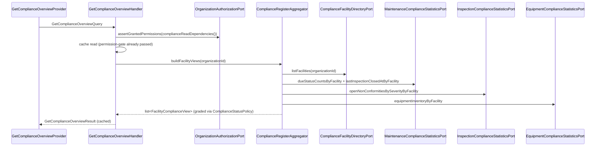
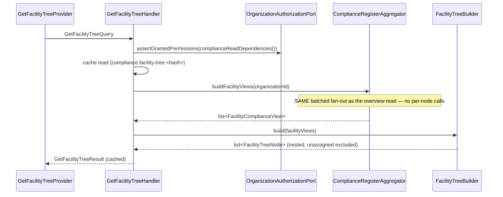

# Compliance Module

## Overview

Compliance is a **read-only** module (DB `main`, no table of its own) that
answers "is this site compliant?" per facility and for a whole organization,
by aggregating existing data through the same statistics-port pattern the
Organization dashboard uses:

- Equipment up-to-date vs overdue is **read** from the Maintenance module's
  current schedule `dueStatus` — periodicity is never recomputed here.
- Open non-conformities by severity and the last inspection date, from the
  Inspection module.
- Equipment inventory (including equipment not yet tracked by a Maintenance
  schedule row), from the Equipment module.
- Facility identity/tree, from the Facility module.

Two capabilities:

1. A permission-aware, cached JSON compliance summary — an organization
   rollup plus a per-facility breakdown, and a single-facility detail —
   gated by `organization.compliance.read`.
2. A server-side PDF "registre de sécurité" export, gated by
   `organization.compliance.export` **and** the organization's plan tier
   (`pro`/`max` only).

Reads are **live** (current snapshot at `generatedAt`, same semantics as the
dashboard overview): `maintenance_schedules` only carries the CURRENT
`dueStatus`, so reconstructing past compliance is out of scope for v1. The
exported PDF is a point-in-time snapshot; it is not persisted (regenerable at
any time), and provenance (who exported what, when, under which plan) is
captured by the `compliance.register_exported` domain event in the Audit
ledger — no dedicated export-log table.

## API Endpoints

| Method | Path | Description | Permission |
| --- | --- | --- | --- |
| GET | `/api/organizations/{organizationId}/compliance` | Organization compliance rollup + per-facility breakdown | `organization.compliance.read` (+ facilities/equipment/inspection/maintenance read) |
| GET | `/api/organizations/{organizationId}/facilities/{facilityId}/compliance` | Single-facility compliance detail | same as above |
| GET | `/api/organizations/{organizationId}/facility-tree` | Enriched facility hierarchy (Site/Building/Floor/Zone) — equipment count + compliance verdict/rate per node ("L2.9") | same as above |
| GET | `/api/organizations/{organizationId}/compliance/export` | Organization "registre de sécurité" PDF | `organization.compliance.export` **and** plan ∈ {pro, max} |
| GET | `/api/organizations/{organizationId}/facilities/{facilityId}/compliance/export` | Facility "registre de sécurité" PDF | same as above |

Every operation requires `ROLE_USER` at the resource level; fine-grained
permission checks are enforced in the Application layer (query handlers) and,
for export, in `ExportSafetyRegisterController` (mirrors the Maintenance
module's convention).

## Flows

### Compliance summary read (synchronous)

### Enriched facility tree read (synchronous)

### Safety register export (synchronous)

`ExportSafetyRegisterController` (invokable, wired via `controller:` on the
export `Get` operations — `read`/`write`/`serialize`/`output` disabled so API
Platform's state pipeline steps aside and the controller's `Response` is
returned as-is): authenticate → assert `organization.compliance.export` →
`ComplianceExportEntitlementPort::isExportEntitled()` (403
`ComplianceExportNotEntitledException` when the plan is below `pro`) → ask
the SAME query as the JSON summary → enrich the context with the
organization's document branding
(`Organization\Application\Port\Inbound\OrganizationDocumentBrandingPort`:
display name, logo inlined as a base64 `data:` URI — dompdf keeps remote
loading off — legal identity, regional settings) and reformat every date
through `Shared\Presentation\Api\Document\DocumentDateFormatter` (org
timezone + `dateFormat` pattern) → `SafetyRegisterPdfRendererPort::render()`
(Twig → dompdf) → dispatch `SafetyRegisterExportedEvent` → stream
`application/pdf` with a `Content-Disposition: attachment` header.

The template extends the common `templates/pdf/layout.html.twig` socle:
fixed header (logo when stored + organization name), fixed footer with the
legal identity block (legal name, registration number, VAT — only the filled
fields), the formatted generation date, and `X / Y` page numbering stamped by the
renderer adapter through dompdf's canvas `page_text()`
(`{PAGE_NUM}`/`{PAGE_COUNT}` substitution — adapter-side API, no
`isPhpEnabled`; CSS `counter(pages)` renders 0 in dompdf 3.x). All strings go through the Symfony translator, domain
`pdf` (`translations/pdf.{en,fr,es}.yaml`); the language is the org regional
`locale`'s language subtag (`fr-FR` → `fr`), falling back to `en` for the
locales without a catalogue. The layout carries no normative claim
(no standard or certification reference) by product decision.

## Architecture

- **Presentation** (`src/Compliance/Presentation/Api`): `ComplianceSummaryResource`
  (org rollup + facility detail, both read-only `Get`s), `FacilityTreeResource`
  (enriched facility tree, read-only `Get`), `SafetyRegisterExportResource`
  (both export `Get`s, controller-wired), `ExportSafetyRegisterController`,
  providers (incl. `GetFacilityTreeProvider`), `ComplianceSummaryOutputFactory`
  / `ComplianceSummaryOutput`, `FacilityTreeOutputFactory` / `FacilityTreeOutput`,
  `ComplianceExceptionMapperTrait`.
- **Application** (`src/Compliance/Application`): `GetComplianceOverviewHandler` /
  `GetFacilityComplianceHandler` / `GetFacilityTreeHandler` (query handlers),
  `ComplianceRegisterAggregator` (fan-out + assembly), `FacilityTreeBuilder`
  (pure reshape of the aggregator's flat views into a nested tree, zero
  additional port calls), `ComplianceStatusPolicy` (pure grading rule),
  contracts (`FacilityComplianceView`, `FacilityTreeNode`, `EquipmentComplianceRow`,
  `NonConformitySeverityBreakdown`), outbound ports.
- **Domain** (`src/Compliance/Domain`): `ComplianceStatus` enum, exceptions,
  `SafetyRegisterExportedEvent`.
- **Infrastructure** (`src/Compliance/Infrastructure`): `DompdfSafetyRegisterRenderer`
  (module-local PDF adapter; remote resource loading and inline PHP are both
  disabled in dompdf's `Options` for SSRF safety).

### Ports & adapters (`config/modules/compliance.yaml`)

| Port | Adapter |
| --- | --- |
| `SafetyRegisterPdfRendererPort` (module-local) | `DompdfSafetyRegisterRenderer` |
| `ComplianceFacilityDirectoryPort` (cross-module) | `Facility\Infrastructure\Adapter\Compliance\FacilityComplianceDirectoryAdapter` |
| `MaintenanceComplianceStatisticsPort` (cross-module) | `Maintenance\Infrastructure\Adapter\Compliance\MaintenanceComplianceStatisticsAdapter` |
| `InspectionComplianceStatisticsPort` (cross-module) | `Inspection\Infrastructure\Adapter\Compliance\InspectionComplianceStatisticsAdapter` |
| `EquipmentComplianceStatisticsPort` (cross-module) | `Equipment\Infrastructure\Adapter\Compliance\EquipmentComplianceStatisticsAdapter` |
| `ComplianceExportEntitlementPort` (cross-module) | `Organization\Infrastructure\Adapter\Export\OrganizationExportEntitlementAdapter` |
| `Organization\Application\Port\Inbound\OrganizationAuthorizationPort` *(reused, not owned)* | `Organization\Application\Service\OrganizationAuthorizationService` |
| `Organization\Application\Port\Inbound\OrganizationDocumentBrandingPort` *(reused, not owned)* | `Organization\Infrastructure\Adapter\Document\OrganizationDocumentBrandingAdapter` |
| `Assistant\Application\Port\Outbound\AssistantContextProviderPort` *(cross-module, hosted here)* | `Compliance\Infrastructure\Adapter\Assistant\ComplianceAssistantContextProviderAdapter` |

`GetFacilityTreeHandler` introduces **no new port**: it reuses the same four
ports above via `ComplianceRegisterAggregator`, plus the module-local
`FacilityTreeBuilder` service — this is the entire reason the enriched
facility tree lives in Compliance rather than Facility.

The four statistics adapters query their module's own tables directly via
the main entity manager (raw SQL: `maintenance_schedules`, `non_conformities`
joined to `inspections`, `equipment`) rather than growing their owning
module's domain-facing repository port — the grouped-by-facility aggregate
has no equivalent there, the same treatment
`Equipment\Infrastructure\Adapter\Maintenance\EquipmentMaintenanceDirectoryAdapter`
gives its own cross-module read model. `FacilityComplianceDirectoryAdapter`
and `OrganizationExportEntitlementAdapter` instead reuse their module's
existing domain-facing ports (`FacilityRepositoryPort::findByOrganizationId()`,
`OrganizationRepositoryPort` + `PlanRepositoryPort`, mirroring
`OrganizationQuotaService::resolvePlan()`).

## Grading rule (`ComplianceStatusPolicy`)

Per facility, from raw counts (pure, I/O-free):

- `non_compliant` — any equipment overdue **or** any open critical
  non-conformity (hard regulatory breach).
- `at_risk` — equipment due soon **or** an open high-severity non-conformity,
  with no hard breach.
- `compliant` — tracked equipment exists and neither of the above applies.
- `not_applicable` — no schedule-tracked equipment (nothing to assess).

The organization rollup is the **worst** non-`not_applicable` status among
its facilities (`not_applicable` only when every facility is
`not_applicable`, or the organization has no facilities). The JSON contract
and the exported PDF always expose the raw driver counts alongside the
verdict, so the grading rule stays transparent and auditable.

## Compliance percentage (`complianceRate` / `trackedEquipmentCount`)

Additive presentation data alongside the enum verdict — **not** a
replacement for it. `ComplianceStatus` (`ComplianceStatusPolicy::grade()`)
remains the sole authoritative signal; `complianceRate` never feeds back into
grading.

- **Denominator**: `trackedEquipmentCount` — equipment actually subject to a
  periodicity (`upToDateEquipmentCount + dueSoonEquipmentCount +
  overdueEquipmentCount`). It excludes `unscheduledEquipmentCount` (no
  effective periodicity to grade against) and `totalEquipmentCount`/
  `activeEquipmentCount` (raw inventory, not a grading population). This
  value already existed as `FacilityComplianceView::trackedEquipmentCount()`
  but was previously computed and dropped — serializing it costs zero new
  queries.
- **Formula**: `complianceRate = upToDateEquipmentCount /
  trackedEquipmentCount * 100`, single source of truth in
  `FacilityComplianceView::computeComplianceRate()` (static, pure), reused
  by both levels:
  - Per facility: `FacilityComplianceView::complianceRate()` calls it with
    the facility's own counts.
  - Organization rollup: `GetComplianceOverviewHandler` calls it with the
    **summed** `upToDateEquipmentCount`/`trackedEquipmentCount` totals
    across facilities — a weighted rate, not an average of per-facility
    rates (averaging would misweight a 9-equipment site the same as a
    1-equipment site).
- **Precision**: a `float` in the `[0.0, 100.0]` range, rounded to **1
  decimal place** (`round(..., 1)`), applied identically at both levels.
- **Zero-denominator case**: when `trackedEquipmentCount === 0` the rate is
  **undefined, not `0`** — a site with no tracked equipment grades
  `not_applicable`, and reporting `0%` on a regulatory document would
  misrepresent "nothing to assess" as "failing". The field is typed
  `?float` and returns `null` in that case; callers MUST NOT coerce `null`
  to `0`.
- **Contract surface**: both `totals.trackedEquipmentCount` /
  `totals.complianceRate` (organization-wide, or single-facility totals on
  the facility-detail endpoint) and each `facilities[].trackedEquipmentCount`
  / `facilities[].complianceRate` row (`ComplianceSummaryOutput`,
  `ComplianceSummaryOutputFactory`). Purely additive — every existing field
  keeps its exact name and semantics.

## Facility attribution

Non-conformities carry no `facilityId` directly — they belong to an
`Inspection`, which does carry `facilityId`. Equipment inventory and
maintenance schedules carry their own `facilityId`. Attribution is therefore:

- Equipment due-status / inventory → the equipment's own `facilityId`.
- Non-conformities → their parent inspection's `facilityId`.

Equipment/inspections with no facility bucket into a synthetic `unassigned`
pseudo-facility (constant `unassigned` across every provider-hosted adapter
and `ComplianceRegisterAggregator`), so nothing silently vanishes from the
register.

## Enriched facility tree (`GET /facility-tree`, L2.9)

The Facilities page renders a Site → Building → Floor → Zone tree with, per
node, an equipment count and a compliance indicator. `GET
/organizations/{organizationId}/facility-tree` serves exactly that, and is
owned by **Compliance, not Facility**: Facility's own `/children` and
`/descendants` endpoints (`FacilityOutput`) are left byte-for-byte unchanged,
and Facility keeps consuming nothing but `FacilityRepositoryPort` — turning
it into a cross-module hub would invert the dependency graph. Compliance
already injects all four ports this needs, so the endpoint costs **zero new
cross-module ports**.

- `FacilityTreeBuilder` (pure, I/O-free, `Application/Service`) reshapes the
  SAME flat `list<FacilityComplianceView>` that
  `ComplianceRegisterAggregator::buildFacilityViews()` already produces (one
  batched fan-out to the four statistics ports, grouped by facility-id list)
  into a nested `list<FacilityTreeNode>` — no additional port call, no
  per-node query, so a deep hierarchy costs the same as the flat summary.
- Each `FacilityTreeNode` carries `id`, `name`, `type`, `parentFacilityId`,
  `equipmentCount` (`FacilityComplianceView::totalEquipmentCount`), and the
  **reused** `status` (`ComplianceStatus`) + `complianceRate` — never
  recomputed, so there remains exactly one definition of "compliant"
  (`ComplianceStatusPolicy`).
- The synthetic `unassigned` pseudo-facility is **excluded** from the tree
  (it has no place in a real hierarchy; it only exists for the compliance
  register's "nothing vanishes" guarantee). A facility whose
  `parentFacilityId` points outside the organization's directory (or is
  `null`) becomes a root node — same defensive-cycle guard depth (32) as
  `ComplianceRegisterAggregator::buildPath()`.
- `GetFacilityTreeHandler` asserts the SAME permission set as the compliance
  overview (`OrganizationPermissionCatalog::complianceReadDependencies()`,
  i.e. `organization.compliance.read` + facilities/equipment/inspection/
  maintenance read) and caches the assembled result exactly like the other
  two query handlers (see Caching).
- Presentation: `FacilityTreeResource` (single read-only `Get`),
  `GetFacilityTreeProvider`, `FacilityTreeOutputFactory` (recursively
  serializes nodes to `{id, name, type, parentFacilityId, equipmentCount,
  status, complianceRate, children}`), `FacilityTreeOutput`.

## Assistant business-context provider (L2.2)

`Infrastructure/Adapter/Assistant/ComplianceAssistantContextProviderAdapter`
implements the Assistant module's `assistant.context_provider` tagged-
iterator seam (see `src/Assistant/MODULE.md`) — Compliance's contribution is
the SAME organization-wide compliance summary `GetComplianceOverviewHandler`
serves, reusing `ComplianceRegisterAggregator`/`ComplianceStatusPolicy`
directly (this module's own services, no new port, no new query): the
graded organization status, per-status facility counts, tracked-equipment
breakdown (up-to-date/due-soon/overdue/unscheduled), and open-non-conformity
counts by severity, rendered into one deterministic text block.

- `supports()` mirrors `GetComplianceOverviewHandler`'s own gate: ALL of
  `OrganizationPermissionCatalog::complianceReadDependencies()` must be
  granted to the asking member (`OrganizationAuthorizationPort::getUserPermissions()`,
  one round trip), or the adapter contributes nothing — the exact same
  "denied" outcome the JSON endpoint would give that member.
- `provide()` never throws: an aggregator failure or an empty facility list
  both return `AssistantContextFragment::empty()`.
- Registered + tagged (`priority: 30`, the highest of the three launch
  providers — rendered first) in `config/modules/compliance.yaml`.
  Assistant's own `config/modules/assistant.yaml` is never touched to add
  this source.
- No caching (unlike the JSON endpoint's 60s `CachePort` TTL): the async
  worker calling this runs off the request/response hot path, so the extra
  fan-out cost was judged not worth the added complexity of sharing/
  duplicating the endpoint's cache key.

## Permissions

`organization.compliance.read` / `organization.compliance.export`
(`Organization\Domain\Catalog\OrganizationPermissionCatalog`, plus the
`complianceReadDependencies()` helper mirroring `dashboardReadDependencies()`).
Only `organization.compliance.read` is included in the `member` system
role's canonical permission set (`OrganizationSystemRoleCatalog::permissionsFor()`);
`organization.compliance.export` remains admin/manager-only. Canonical
system-role permissions are merged in at **read time**
(`OrganizationSystemRoleCatalog::mergePermissions()`), so existing
organizations' `member` roles pick up the new read permission automatically —
no backfill migration is needed. Run
`app:authz:sync-permissions --update-roles` after deploy.

## Monetization

Plans are quota-only (no feature-flag concept), keyed `free`/`pro`/`max`.
`OrganizationExportEntitlementAdapter` resolves the organization's plan with
the SAME logic as `OrganizationQuotaService::resolvePlan()` (assigned plan,
falling back to the catalog default) and allow-lists `pro`/`max` for export.
The JSON summary itself is available to every organization holding
`organization.compliance.read` — the plan gate applies to the PDF export
only. If plan keys are renamed or a new tier is added, update the adapter's
allow-list.

## Persistence

**No new table.** Pure read aggregation; export provenance is captured by
the existing Audit ledger (`compliance.register_exported`), not a dedicated
table. Central audit wiring (subscribing `AuditEventSubscriber` to the new
event name) is applied separately to avoid a concurrent-edit conflict with
another in-flight lot.

## Caching

The per-facility aggregate is cached via `CachePort` with a 60s TTL, keyed
`compliance.overview.<sha256(organizationId)>` /
`compliance.facility.<sha256(organizationId|facilityId)>` /
`compliance.facility-tree.<sha256(organizationId)>` — mirrors
`GetOrganizationDashboardHandler`'s cache-key convention. Cache failures
never block a fresh read.

## Known limitations (v1)

- Equipment `dueStatus` is refreshed by Maintenance's hourly sweep, so a
  facility can read `compliant`/`overdue` up to ~1h stale — acceptable for
  monthly/annual periodicities. The register footer states the
  `generatedAt` data-as-of timestamp.
- Newly created equipment may not yet have a `maintenance_schedules` row
  (created by the hourly sweep, not synchronously): `EquipmentComplianceStatisticsPort`'s
  `totalEquipmentCount` can therefore exceed the tracked-equipment count
  reported by `MaintenanceComplianceStatisticsPort` for a short window.
- No historical reconstruction: the register is always a live snapshot.

## Configuration

- Service wiring: `config/modules/compliance.yaml`
- Cross-module wiring (additive): `config/modules/{maintenance,inspection,equipment,facility,organization}.yaml`
- Template: `templates/compliance/safety_register.html.twig` (extends the
  common `templates/pdf/layout.html.twig`); translations:
  `translations/pdf.{en,fr,es}.yaml` (domain `pdf`)
- No Doctrine mapping (no table); no messenger routing (synchronous reads/export only)

## Testing

- Unit: `tests/Unit/Compliance` — including
  `Application/Service/FacilityTreeBuilderTest.php`,
  `Application/UseCase/GetFacilityTreeHandlerTest.php`,
  `Presentation/Api/Factory/FacilityTreeOutputFactoryTest.php`,
  `Presentation/Api/Provider/GetFacilityTreeProviderTest.php`,
  `Infrastructure/Adapter/Assistant/ComplianceAssistantContextProviderAdapterTest.php`
  (L2.2 — permission-gate on/off, empty-facilities degradation, rendered
  text asserts the rollup status + counts; constructs a real
  `ComplianceRegisterAggregator` with stubbed ports, mirroring
  `GetFacilityTreeHandlerTest`'s pattern — no new DQL is introduced by this
  adapter, so no dedicated integration test was needed)
- Functional: `tests/Functional/Api/ComplianceApiTest.php` (includes the
  facility-tree endpoint auth check), `tests/Functional/Api/SafetyRegisterExportApiTest.php`
- Run module tests: `make test tests/Unit/Compliance/`
## Error Codes

| Exception | HTTP |
| --- | --- |
| `ComplianceAccessDeniedException` / `Organization\Domain\Exception\OrganizationAccessDeniedException` | 403 Forbidden |
| `ComplianceExportNotEntitledException` | 403 Forbidden ("upgrade required") |
| `ComplianceNotFoundException` | 404 Not Found |

