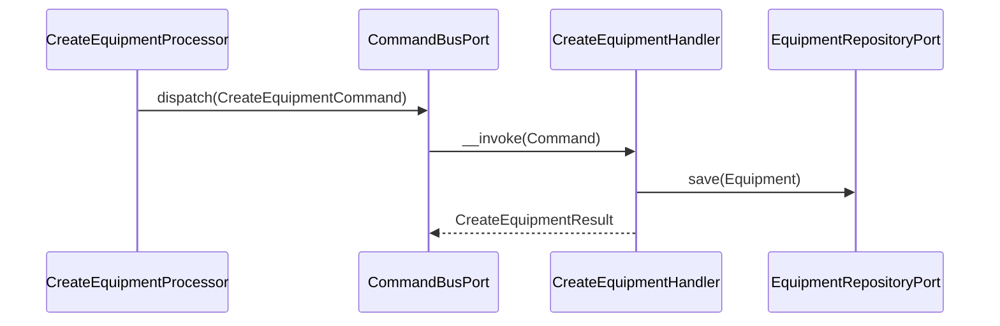
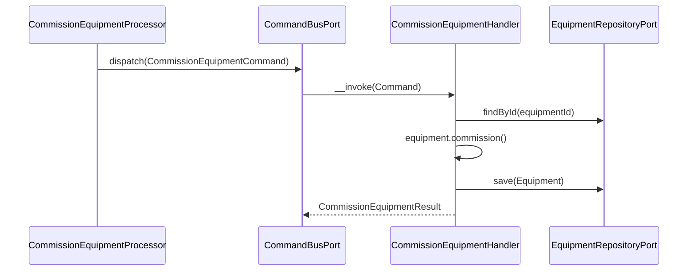
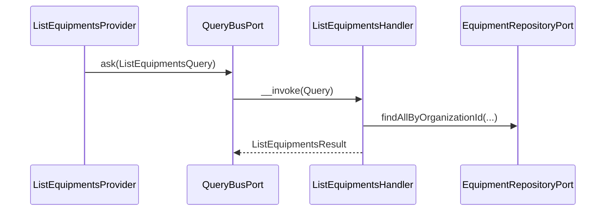

# Equipment Module

## Overview

Equipment manages the fire safety asset inventory of an organization. It tracks
physical fire safety equipment (extinguishers, smoke detectors, sprinklers, fire
alarm panels, hydrants, cameras, etc.) through a full operational lifecycle.

Main goals:

- Maintain a registry of fire safety equipment scoped to an organization.
- Enforce a controlled status machine for operational lifecycle management.
- Support facility assignment, free-form tagging, and file attachments.

## API Endpoints

| Method | Path | Description |
| --- | --- | --- |
| POST | `/api/organizations/{organizationId}/equipment` | Create equipment |
| GET | `/api/organizations/{organizationId}/equipment` | List equipment (filters: `facilityId`, `type`, `status`, `brand`, `model`, `subType`) |
| GET | `/api/organizations/{organizationId}/equipment/{equipmentId}` | Get equipment |
| PATCH | `/api/organizations/{organizationId}/equipment/{equipmentId}` | Update equipment fields |
| POST | `/api/organizations/{organizationId}/equipment/{equipmentId}/assign` | Assign to a facility |
| POST | `/api/organizations/{organizationId}/equipment/{equipmentId}/unassign` | Remove from current facility |
| POST | `/api/organizations/{organizationId}/equipment/{equipmentId}/commission` | Mark as `operational` |
| POST | `/api/organizations/{organizationId}/equipment/{equipmentId}/maintenance` | Mark as `under_maintenance` |
| POST | `/api/organizations/{organizationId}/equipment/{equipmentId}/decommission` | Permanently decommission |
| POST | `/api/organizations/{organizationId}/equipment/{equipmentId}/tags` | Add (or create) a tag |
| DELETE | `/api/organizations/{organizationId}/equipment/{equipmentId}/tags/{tagId}` | Remove a tag |
| GET | `/api/organizations/{organizationId}/equipment/{equipmentId}/attachments` | List attachments |
| POST | `/api/organizations/{organizationId}/equipment/{equipmentId}/attachments` | Upload attachment |
| DELETE | `/api/organizations/{organizationId}/equipment/{equipmentId}/attachments/{attachmentId}` | Delete attachment |

## Flows

### Create Equipment (Command)

### Commission Equipment (Command)

### List Equipment (Query)

## Domain Model

Aggregates and entities:

- `Equipment` — aggregate root
- `Tag` — lightweight label scoped to an organization, associated to equipment items
- `EquipmentAttachment` — file attachment linked to an equipment item

`Equipment` main fields:

- `id`
- `organizationId`
- `type` (`fire_extinguisher`, `smoke_detector`, `heat_detector`, `sprinkler`, `fire_alarm_panel`, `hydrant`, `fire_door`, `emergency_lighting`, `access_control`, `camera`, `gas_detector`, `other`)
- `status` (`in_stock`, `operational`, `under_maintenance`, `decommissioned`)
- `facilityId` (optional)
- `subType` (optional)
- `brand`, `model`, `serialNumber` (serialNumber is unique per organization)
- `locationLabel` (optional free-text)
- `installedAt`, `commissionedAt` (optional)

Status transitions:

- `in_stock` → `operational` (commission)
- `operational` ↔ `under_maintenance` (maintenance / commission)
- `operational` | `under_maintenance` → `decommissioned` (decommission, irreversible)

## Persistence

- Tables: `equipment`, `equipment_tags`, `tags` (main database)
- Doctrine mapping: `src/Equipment/Infrastructure/Persistence/Doctrine/Record`
- Repository implementations: `Equipment\Infrastructure\Persistence\Doctrine\Repository`

## Architecture

- Presentation: Api Platform resources, providers, processors, DTOs.
- Application: Use cases (command/query), repository ports.
- Domain: Equipment aggregate, Tag, EquipmentAttachment, value objects, domain exceptions.
- Infrastructure: Doctrine record/mapper/repository.

Key folders:
- `src/Equipment/Presentation/Api`
- `src/Equipment/Application/UseCase`
- `src/Equipment/Domain`
- `src/Equipment/Infrastructure`

## Configuration

- Service wiring: `config/modules/equipment.yaml`
- Doctrine mapping (main entity manager): `config/packages/doctrine.yaml`

## Error Codes

- `EquipmentNotFoundException` → 404
- `EquipmentSerialNumberAlreadyExistsException` → 409
- `EquipmentAlreadyDecommissionedException` → 422
- `AttachmentNotFoundException` → 404
- `TagNotFoundException` → 404

## Testing

- Unit: `tests/Unit/Equipment/`
- Run module tests: `make test tests/Unit/Equipment/`
