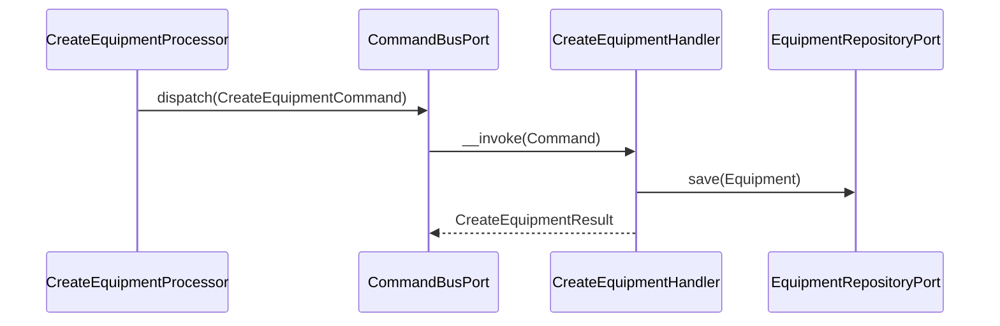
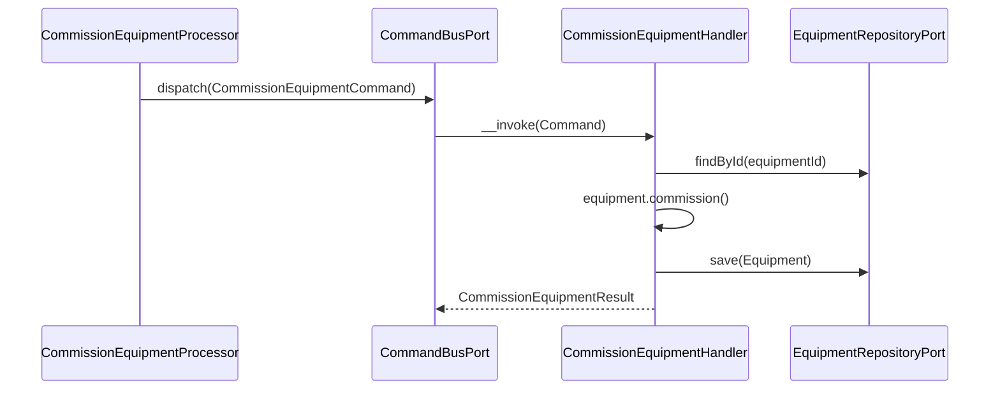
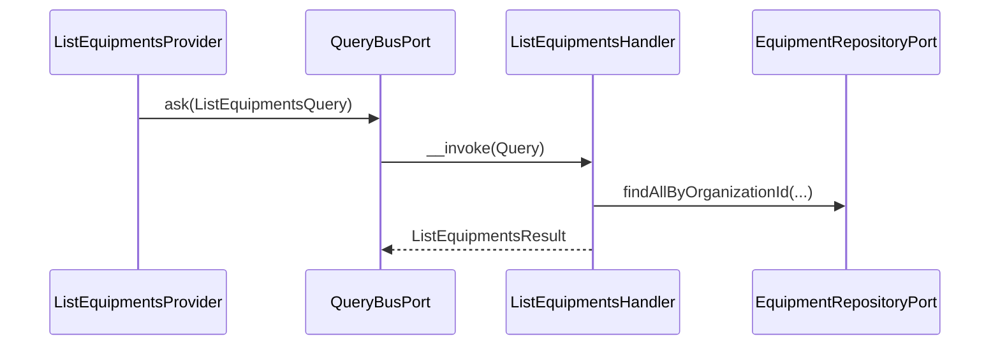

# Equipment Module

## Overview

Equipment manages the fire safety asset inventory of an organization. It tracks
physical fire safety equipment (extinguishers, smoke detectors, sprinklers, fire
alarm panels, hydrants, cameras, etc.) through a full operational lifecycle.

Main goals:

- Maintain a registry of fire safety equipment scoped to an organization.
- Enforce a controlled status machine for operational lifecycle management.
- Support facility assignment, free-form tagging, and file attachments.

## API Endpoints

| Method | Path | Description |
| --- | --- | --- |
| POST | `/api/organizations/{organizationId}/equipment` | Create equipment |
| GET | `/api/organizations/{organizationId}/equipment` | List equipment (filters: `facilityId`, `type`, `status`, `brand`, `model`, `subType`, `search`, `maintenanceDueStatus`) |
| GET | `/api/organizations/{organizationId}/equipment/kpis` | Get the four headline equipment KPI counters (L2.11): `totalAssets`, `compliant`, `dueSoon`, `openNonConformities` |
| GET | `/api/organizations/{organizationId}/equipment/{equipmentId}` | Get equipment |
| PATCH | `/api/organizations/{organizationId}/equipment/{equipmentId}` | Update equipment fields |
| POST | `/api/organizations/{organizationId}/equipment/{equipmentId}/assign` | Assign to a facility |
| POST | `/api/organizations/{organizationId}/equipment/{equipmentId}/unassign` | Remove from current facility |
| PUT | `/api/organizations/{organizationId}/equipment/{equipmentId}/plan-position` | Set or clear this equipment's position pinned on a floor plan attachment (Phase 4) |
| POST | `/api/organizations/{organizationId}/equipment/{equipmentId}/commission` | Mark as `operational` |
| POST | `/api/organizations/{organizationId}/equipment/{equipmentId}/maintenance` | Mark as `under_maintenance` |
| POST | `/api/organizations/{organizationId}/equipment/{equipmentId}/decommission` | Permanently decommission |
| POST | `/api/organizations/{organizationId}/equipment/{equipmentId}/tags` | Add (or create) a tag |
| DELETE | `/api/organizations/{organizationId}/equipment/{equipmentId}/tags/{tagId}` | Remove a tag |
| GET | `/api/organizations/{organizationId}/equipment/{equipmentId}/attachments` | List attachments |
| POST | `/api/organizations/{organizationId}/equipment/{equipmentId}/attachments` | Upload attachment (base64 JSON — see below) |
| DELETE | `/api/organizations/{organizationId}/equipment/{equipmentId}/attachments/{attachmentId}` | Delete attachment |
| GET | `/api/organizations/{organizationId}/equipment/{equipmentId}/attachments/{attachmentId}/download` | Download an attachment's raw bytes (`Content-Disposition: attachment`, never inline — see below) |
| POST | `/api/media` | Canonical multipart upload, shared with the intervention offline/field-evidence flow (`equipment`/`intervention`/`clientId`/`file`/`label` fields — see below) |
| GET / DELETE | `/api/media/{id}` | Read / delete a canonical media attachment |

Removed 2026-08-20: `GET /api/organizations/{organizationId}/equipment-types` and
`GET /api/organizations/{organizationId}/equipment-statuses` (unconsumed reference
catalogs; the frontend's localized typed registries are the source of these values).

An equipment may carry at most
`Shared\Domain\Attachment\AttachmentConstraints::MAX_ATTACHMENTS_PER_PARENT`
(**25**) attachments. `AddAttachmentHandler` reads the count through
`AttachmentRepositoryPort::countByEquipmentId()` before writing anything to
storage; the resulting `InvalidAttachmentException` is mapped centrally to
**422** by the shared `AttachmentConstraintExceptionSubscriber`, covering
both `MediaProcessor` (multipart) and `AddAttachmentProcessor` (base64
JSON) without either mapping it locally.

**Download (closed 2026-08-19).** `DownloadEquipmentAttachmentController`
serves the raw bytes on a dedicated `EquipmentAttachmentContentResource`
(`read`/`write`/`deserialize`/`serialize`/`output` disabled, mirroring
`Facility\...\FacilityAttachmentContentResource` /
`Intervention\...\InterventionAttachmentContentResource`). The coarse
`organization.equipment.read` permission — the same gate
`ListEquipmentAttachmentsProvider` already applies — is checked in the
controller, since the nested route already carries `organizationId` as a URI
variable; the per-record ownership chain (the equipment belongs to that
organization, the attachment belongs to that equipment) is delegated to
`GetEquipmentAttachmentContentHandler`, dispatched through the query bus, so
a resource-level permission check alone can never stand in for it. The bytes
are always handed to the shared `Shared\Presentation\Api\Attachment\AttachmentDownloadResponder`,
which forces `Content-Disposition: attachment` and
`X-Content-Type-Options: nosniff` — never `inline` — so a malicious upload
(e.g. an SVG carrying a `<script>` tag) is downloaded, never rendered/executed
in the app's origin.

**MIME/size validation (closed 2026-08-19).** Equipment now routes both
upload paths through the same shared policy every other generalized
attachment consumer (Facility, Intervention, Inspection, Messaging) enforces
— `Shared\Domain\Attachment\AttachmentConstraints` (10 MiB cap, the shared
image+document MIME allow-list: `image/jpeg`, `image/png`, `image/webp`,
`image/gif`, `application/pdf`):

- **`MediaProcessor`** (`POST /media`, multipart) now injects
  `Shared\Presentation\Api\Attachment\MultipartAttachmentGuard` — the exact
  kernel `FacilityMediaProcessor`/`InterventionMediaProcessor`/
  `InspectionMediaProcessor`/`MessagingMediaProcessor` already route
  through — and calls `fromRequest($request)` to extract AND validate the
  uploaded file (size read from filesystem metadata before any content is
  read into memory), **after** the equipment/intervention resolution and the
  `assertWrite()` permission check, and **after** the `clientId` idempotent-
  retry short-circuit (a replayed upload with an already-persisted client id
  returns the existing record without re-reading or re-validating the file).
  A violation surfaces as the guard's own **422**.
- **`AddAttachmentProcessor`** (`POST .../equipment/{id}/attachments`,
  base64 JSON) carries no multipart `Request` for the guard to extract from,
  so it calls `AttachmentConstraints::validate($data->mimeType,
  strlen($contents))` directly on the decoded payload — the identical policy
  and reason codes (`mime` / `size`), just applied to bytes that arrived
  JSON-encoded instead of multipart-encoded — and maps the resulting
  `InvalidAttachmentException` to **422** itself (the same translation the
  guard performs internally), since this validation runs before the command
  bus dispatch and is never bus-wrapped.

**Wire-shape decision.** `AddAttachmentInput` (`fileName`/`content` base64/
`mimeType`/`label`) was deliberately KEPT rather than aligned to the
multipart shape used by every sibling module: `fireguard-sso-web`'s
`EquipmentService.addAttachment()` (`data-access/services/equipment/
equipment.service.ts`) posts this exact base64 JSON payload today, so
changing the wire shape would be a breaking change requiring a coordinated
frontend release. The base64 path is validated with the same MIME/size
policy instead. **The plan's 2.4 frontend equipment-attachments UI lot
should target this endpoint AS-IS (base64 JSON `AddAttachmentInput`), not
the multipart shape** — `EquipmentService.uploadEvidence()` (`POST
/api/media`) remains the separate canonical/offline-evidence path, already
multipart, unchanged by this work.

## Flows

### Create Equipment (Command)

### Commission Equipment (Command)

### List Equipment (Query)

## Permission Model

This module relies on Organization-scoped permissions:

- `organization.equipment.read`
- `organization.equipment.write` (also covers tags and attachments)

### Scope versus entitlement (403 vs 404)

Every provider and processor in this module answers a denial in one of two
ways, and which one is not a stylistic choice:

| Caller | Response |
| --- | --- |
| Active member of the owning organization, lacking the permission | `403 Forbidden` |
| No active membership in the owning organization | `404 Not Found`, identical to the route's own not-found response |

The 404 is not a softer 403. These surfaces take their `organizationId` from
the URI — or resolve it from a record they just loaded by path id — **before**
they know whether the caller belongs to that organization, so a 403 at that
point confirms the organization or the record exists to someone who may not
learn even that much. That is an existence oracle: it lets a caller from
another organization enumerate valid identifiers. The out-of-scope 404
therefore reuses the *same* message the route's own "unknown id" branch
produces, so the two responses are indistinguishable.

The distinction is carried by
`Organization\Application\Port\Inbound\OrganizationAuthorizationPort::resolveAccess()`,
which returns `OrganizationAccessDecision` — `GRANTED`, `MISSING_PERMISSION`
or `OUTSIDE_SCOPE`. The membership lookup only runs when the permission is not
granted, so the authorized path costs no extra query. The flat
`hasPermission()` boolean cannot express the middle case and must not be used
for a new check here.

`tests/Architecture/Unit/PresentationAuthorizationEnforcementTest` is the
ratchet that keeps new providers and processors on this path — it fails on any
file under `Presentation/Api` that injects the port and still calls
`hasPermission()`.

## Domain Model

Aggregates and entities:

- `Equipment` — aggregate root
- `Tag` — lightweight label scoped to an organization, associated to equipment items
- `EquipmentAttachment` — file attachment linked to an equipment item

`Equipment` main fields:

- `id`
- `organizationId`
- `type` (`fire_extinguisher`, `smoke_detector`, `heat_detector`, `sprinkler`, `fire_alarm_panel`, `hydrant`, `fire_door`, `emergency_lighting`, `access_control`, `camera`, `gas_detector`, `other`)
- `status` (`in_stock`, `operational`, `under_maintenance`, `decommissioned`)
- `facilityId` (optional)
- `subType` (optional)
- `brand`, `model`, `serialNumber` (serialNumber is unique per organization)
- `locationLabel` (optional free-text — the spot *inside* a facility, not the facility)
- `facilityName` (read-only display name of the assigned facility). The module stores only
  `facilityId`; the name is resolved through `FacilityNamingPort`, batched once per listing.
  Deliberately separate from `FacilityValidationPort`: that contract throws, and a label
  lookup must not go through something whose job is to reject writes. Null when unassigned
  or unresolvable — an unresolved name is not a blank name.
- `installedAt`, `commissionedAt` (optional)
- `planPosition` (optional, `{attachmentId, x, y}`, Phase 4 — see "Plan
  position" below). Exposed on the **detail** read
  (`GET .../equipment/{id}`) only, not on the list/collection endpoints.

Status transitions:

- `in_stock` → `operational` (commission)
- `operational` ↔ `under_maintenance` (maintenance / commission)
- `operational` | `under_maintenance` → `decommissioned` (decommission, irreversible)

### Plan position (Phase 4)

Equipment gains an optional `planPosition`, pinning it at one point over a
floor plan attachment belonging to its own facility or one of that
facility's ancestors: `Equipment\Domain\ValueObject\PlanPosition`
(`attachmentId`, `x`, `y` — each coordinate a float normalized to `[0, 1]`, a
fraction of the plan image's width/height, mirroring
`Facility\Domain\ValueObject\PlanGeometry` in shape but Equipment-owned; this
module never imports Facility's Domain). Serialized on
`equipment.plan_position` (`JSONB`, main database, `Version20260816130000`)
as `{"attachmentId": "<uuid>", "x": float, "y": float}`. The free-text
`locationLabel` is untouched — it stays the offline-readable fallback when
no plan/attachment context is available.

**Write — `PUT /organizations/{organizationId}/equipment/{equipmentId}/plan-position`.**
PUT rather than assign/unassign's POST: this is an idempotent full-replace
(or clear-with-null) of one field, the same shape as Facility's own
`PUT .../plan-geometry` sibling endpoint, not a stateful transition with
side effects (maintenance-log closing, status reset) the way assign/unassign
are. `SetEquipmentPlanPositionInput` carries `attachmentId`, `x` and `y`
together: all three present sets or replaces the position, all three `null`
clears it. `SetEquipmentPlanPositionHandler` validates, through ports and
BEFORE the durable save:

1. the equipment exists and belongs to the organization
   (`EquipmentNotFoundException`, **404**),
2. the equipment is assigned to a facility — `EquipmentNotAssignedToFacilityException`,
   **409** — there is no facility whose plan the position could be validated
   against otherwise,
3. the attachment exists, is `kind: floor_plan`, and belongs to the
   equipment's own facility or one of its ancestors, delegated whole to
   `Equipment\Application\Port\Outbound\EquipmentFloorPlanValidationPort`
   (implemented by Facility — see `src/Facility/MODULE.md`'s "Equipment
   plan-position cross-module pair"): `FloorPlanAttachmentNotFoundException`
   (**404**), `FloorPlanAttachmentNotFloorPlanException` /
   `FloorPlanAttachmentNotAncestorException` (both **409**) — all three are
   contract exceptions under `Application/Contract/FloorPlan/`, since
   Facility's adapter throws them across the module boundary,
4. `EquipmentAlreadyDecommissionedException` (**409**) — a decommissioned
   asset is terminal, mirroring every other mutator on the aggregate.

`Equipment::placeOnPlan()` / `removeFromPlan()` are the aggregate mutators;
`removeFromPlan()` is idempotent (clearing an already-unset position is a
success, not an error). `Equipment::unassignFromFacility()` also clears
`planPosition` — a position bound to a facility's plan cannot outlive that
facility assignment; the same invariant is re-applied on the intervention
`apply()` offline path whenever `facility` is cleared (see "Persistence"
below).

**Read.** The equipment DETAIL output only
(`GetEquipmentResult`/`GetEquipmentHandler`, `GET .../equipment/{id}`) —
deliberately left `null` by `ListEquipmentsHandler`, since the shape is
shared between the two but only the single-item read populates it. The
plan-overlay READ that lists equipment pinned on a plan is owned by
Facility: see `src/Facility/MODULE.md`'s "Spatial zone geometry" section for
`GET .../facilities/{facilityId}/plan-overlay`'s `equipment` array, resolved
here through `Equipment\Infrastructure\Adapter\Facility\EquipmentPlanPositionAdapter`.

## Persistence

- Tables: `equipment`, `equipment_tags`, `tags` (main database)
- Doctrine mapping: `src/Equipment/Infrastructure/Persistence/Doctrine/Record`
- Migration (plan position): `migrations/main/Version20260816130000.php` —
  `plan_position JSONB NULL`, hand-written rather than Doctrine-diffed so the
  physical column is `JSONB` (indexable, used by
  `EquipmentPlanPositionAdapter`'s `->>'attachmentId'` filter) while the ORM
  mapping stays the same `json` DBAL type as the rest of the record.
- Repository implementations: `Equipment\Infrastructure\Persistence\Doctrine\Repository`
- The offline/intervention resource adapter
  (`Equipment\Infrastructure\Adapter\Intervention\EquipmentInterventionResourceAdapter`)
  accepts `planPosition` as an additional patchable field — a complete
  `{attachmentId, x, y}` object (validated through the same `PlanPosition`
  VO) or `null`. Clearing the `facility` field in the same or an earlier
  patch also clears `planPosition`, mirroring the aggregate's
  `unassignFromFacility()` invariant; the offline path does not re-validate
  attachment ownership against Facility (no cross-module port call from an
  adapter that must stay usable while genuinely offline) — that check is
  enforced only on the online `PUT .../plan-position` route.
- **Free-text search (R10)**: the `search` filter is pushed down into SQL in
  `EquipmentRepository::createListQueryBuilder()` via the shared
  `Shared\Infrastructure\Doctrine\Search\TrigramSearchExpression` builder —
  never post-filtered in memory. It emits a case-insensitive, wildcard-safe
  `LOWER(col) LIKE :search ESCAPE '\'` OR clause across `type`, `subType`,
  `brand`, `model`, `serialNumber`, `status`, `locationLabel`. The predicate
  shape (`LOWER(col) LIKE ...`) is deliberately aligned with `pg_trgm` GIN
  expression indexes (`idx_equipment_<col>_trgm`) planned for a later,
  index-only migration (R10-index) so `equipment` search stays index-backed
  at scale on PostgreSQL; no such index exists yet, and the predicate is
  fully correct without it (just a sequential scan).

## Architecture

- Presentation: Api Platform resources, providers, processors, DTOs.
- Application: Use cases (command/query), repository ports.
- Domain: Equipment aggregate, Tag, EquipmentAttachment, value objects, domain exceptions.
- Infrastructure: Doctrine record/mapper/repository.

Key folders:
- `src/Equipment/Presentation/Api`
- `src/Equipment/Application/UseCase`
- `src/Equipment/Domain`
- `src/Equipment/Infrastructure`

Cross-module contracts and lifecycle invariants:

- `EquipmentMaintenanceLogSynchronizerPort` (inbound): keeps the maintenance-log
  history in step with flat-surface status writes (canonical processor,
  intervention `apply()`, and draft publication) — a log opens on entering
  `under_maintenance` and closes on leaving it; `commissionedAt` is stamped on
  entering `operational` (preserved on re-commission, never set on drafts).
- In-service equipment (operational or under maintenance) always has a facility:
  clearing the facility while in service is refused on the flat surfaces.
- `Equipment\Infrastructure\Adapter\Facility\FacilityEquipmentDependencyAdapter`
  implements Facility's archival dependency port (active = published and not
  decommissioned).
- **Plan position cross-module pair (Phase 4)**: outbound —
  `Equipment\Application\Port\Outbound\EquipmentFloorPlanValidationPort`,
  consumed by `SetEquipmentPlanPositionHandler`, implemented by Facility
  (`Facility\Infrastructure\Adapter\Equipment\EquipmentFloorPlanValidationAdapter`,
  reusing `FacilityAttachmentAncestryGuard`). The reverse direction —
  `Equipment\Infrastructure\Adapter\Facility\EquipmentPlanPositionAdapter`
  — implements Facility's `FacilityEquipmentPlanPositionPort` for the
  plan-overlay read. See `src/Facility/MODULE.md` for the full pairing,
  including the one file allowed to import both modules' Domain layers to
  satisfy the port's typed `@throws` contract.
- **Per-equipment maintenance due status (L2.10)**: `EquipmentOutput.maintenanceDueStatus`
  (`GET .../equipment` and `GET .../equipment/{id}`) and the `maintenanceDueStatus`
  list filter are resolved cross-module through the new
  `Equipment\Application\Port\Outbound\MaintenanceDueStatusPort` (declared
  here; Equipment references only this port, never Maintenance's Domain or
  Infrastructure). Its adapter,
  `Maintenance\Infrastructure\Adapter\Equipment\EquipmentMaintenanceDueStatusAdapter`,
  is hosted in — and wired by — the Maintenance module (the module owning the
  `maintenance_schedules` read model), mirroring the existing reverse
  direction (`MaintenanceEquipmentDirectoryPort`, implemented here for
  Maintenance). Batching: `GetEquipmentHandler` and `ListEquipmentsHandler`
  each resolve the whole batch of equipment ids they need in ONE call to
  `dueStatusesForEquipment()` — never per row. Equipment ids with no
  maintenance schedule (never reconciled by the Maintenance sweep yet, or
  genuinely untracked) come back as `unscheduled`, never absent, never null.
  The `maintenanceDueStatus` filter cannot be pushed into the `equipment`
  table's SQL `WHERE` clause (the value lives in Maintenance, not here):
  `ListEquipmentsHandler::listFilteredByDueStatus()` instead loads every
  equipment matching the other filters unbounded (capped at
  `DUE_STATUS_FILTER_SCAN_LIMIT = 10_000`, a generous safety net given
  organizations are plan-quota bounded on equipment count — not a practical
  limit), resolves due status for that whole candidate set in one batch call,
  filters in memory, then paginates with `array_slice()`. **Known mismatch
  with the `/equipment` mockup**: the mockup's Status column shows
  "Compliant / Due soon / Non-conformity / Not checked" — the first, second,
  and fourth map onto `up_to_date`, `due_soon`, and `unscheduled`
  respectively, but **there is no per-equipment `overdue`-adjacent
  "Non-conformity" state**: non-conformities attach to *inspections* (see
  `src/Inspection/MODULE.md`), not to equipment. The API exposes the real
  four `MaintenanceDueStatus` values (`unscheduled`|`up_to_date`|`due_soon`|`overdue`);
  the frontend must map deliberately rather than assume a 1:1 correspondence
  with the mockup's four labels.
- **Equipment KPI endpoint (L2.11)**: `GET .../equipment/kpis`
  (`EquipmentKpiResource` / `GetEquipmentKpisProvider` /
  `GetEquipmentKpisHandler`) answers the mockup's Equipment page headline
  band — `totalAssets`, `compliant`, `dueSoon`, `openNonConformities` — as a
  single org-scoped call instead of the two endpoints the frontend previously
  had to combine.
  - `totalAssets` is every equipment record for the organization, every
    status included (`EquipmentRepositoryPort::countOverviewByOrganizationId()['total']`,
    no new query).
  - `compliant` / `dueSoon` reuse the L2.10 `MaintenanceDueStatusPort`
    exactly as instructed: the handler loads every equipment id for the
    organization (capped at the same `DUE_STATUS_SCAN_LIMIT = 10_000` safety
    net as `ListEquipmentsHandler::listFilteredByDueStatus()`), resolves due
    status for the whole candidate set in ONE batch call, and tallies
    `up_to_date` / `due_soon` in memory. Decommissioned equipment naturally
    never contributes to either bucket (Maintenance drops its schedule row,
    so it resolves to `unscheduled`), so no extra status filtering is needed.
  - **`openNonConformities` is deliberately ORGANIZATION-WIDE, not
    equipment-scoped** — the honest resolution of the same problem flagged
    under L2.10 above: non-conformities attach to inspections, not to
    equipment, and no reliable per-equipment non-conformity aggregate exists
    anywhere in the codebase. Rather than fabricate a number whose scope is
    unclear, the new
    `Equipment\Application\Port\Outbound\NonConformityStatisticsPort`
    (declared here, one method: `countOpenNonConformities(organizationId)`)
    exposes the same "non-conformities currently `open` or `in_progress`
    across the whole organization" figure the Organization dashboard and the
    Compliance register already surface. Its adapter,
    `Inspection\Infrastructure\Adapter\Equipment\EquipmentNonConformityStatisticsAdapter`,
    is hosted in — and wired by — the Inspection module (the module owning
    `non_conformities`), mirroring the L2.10 hosting convention; it composes
    two existing, already-tested `NonConformityRepositoryPort::countByOrganizationId()`
    calls (`open` + `in_progress`) rather than introducing new DQL, so it is
    covered by a mocked-port unit test, not a new integration test.
- Canonical DELETE = decommission — TERMINAL, never reversible. Idempotent: a
  repeat DELETE is a no-op; an open maintenance log is closed on the way out.
- **Decommissioning is gated by the org's four-eyes approval policy** (R17):
  `DecommissionEquipmentProcessor` consults
  `Approval\Application\Port\Inbound\ApprovalGatePort` (action type
  `equipment_decommission`) BEFORE dispatching `DecommissionEquipmentCommand`.
  If the organization requires approval, the endpoint returns **HTTP 202**
  with a pending approval request summary instead of `EquipmentOutput`, and
  the equipment stays in its current status until a second authorized
  member approves it. Approval defaults OFF (opt-in); see
  `src/Approval/MODULE.md`. `EquipmentDecommissionExecutorAdapter`
  (`src/Equipment/Infrastructure/Adapter/Approval/`) re-dispatches the same
  command on approval — the Equipment Domain never references Approval.
- Regulated actions emit domain events (`src/Equipment/Domain/Event/`)
  recorded in the audit ledger by Audit's `AuditEventSubscriber`:
  `equipment.commissioned`, `equipment.under_maintenance`,
  `equipment.returned_to_stock`, `equipment.decommissioned` (each with
  `previous_status`; in-service events carry `facility_id`). Emission sites:
  the Commission/PutUnderMaintenance/Decommission handlers (which load
  through `findPublishedById` — draft scratchpads are unreachable) and the
  canonical processor, which COLLECTS its events during the mutation and
  dispatches them only after `wrapInTransaction` commits. Idempotent repeats
  emit nothing. The intervention `apply()`/`publishDrafts` path is deferred
  to the `intervention.published` audit action.
- **Intervention service history sync** (R12): `EquipmentMaintenanceLog`
  entries are not only maintenance windows — a completed, point-in-time
  entry (`source = intervention`, `startedAt === completedAt`) is also
  synthesized whenever a published intervention mutates published equipment.
  `Equipment\Infrastructure\EventSubscriber\InterventionServiceHistorySubscriber`
  reacts to `intervention.intervention_published_event` (the same event
  `AuditEventSubscriber` records as `intervention.published`; see the
  Intervention module's audit trail) and dispatches
  `RecordInterventionServiceHistoryCommand` (sync — no async routing) to
  `RecordInterventionServiceHistoryHandler`, which reads back the
  intervention's applied equipment changes through the new outbound
  `Equipment\Application\Port\Outbound\InterventionServiceReportPort`
  (contracts under `Application/Contract/Intervention`; adapter hosted in
  Intervention, mirrors `Facility\Infrastructure\Adapter\Equipment\FacilityValidationAdapter`)
  and calls `EquipmentMaintenanceLog::recordInterventionService(...)` +
  `MaintenanceLogRepositoryPort::appendInterventionServiceEntry(...)` per
  serviced equipment. The subscriber is **best-effort**: it swallows every
  `Throwable` (logged, never rethrown) exactly like `AuditEventSubscriber`
  and `AutomationTriggerSubscriber`, since an uncaught exception here would
  abort the whole published-event fan-out and break the audit ledger row
  emitted by the same event. Idempotent via a `dedup_key` unique column on
  `equipment_maintenance_logs` (`sha1('intervention_change:' . appliedChangeId)`),
  inserted through a raw DBAL statement guarded by
  `UniqueConstraintViolationException`
  (`Equipment\Infrastructure\Persistence\Doctrine\Repository\MaintenanceLogRepository::appendInterventionServiceEntry`)
  — mirrors `AutomationRunRepository::reserveRun`, so a duplicate (at-least-once
  event redelivery, or a later publication re-reading an already-applied
  change) is a routine no-op that never poisons the EntityManager. New
  nullable fields on `EquipmentMaintenanceLog` /
  `equipment_maintenance_logs`: `source` (`status_transition` default |
  `intervention`), `interventionId`, `interventionNumber`, `workItemAction`
  (the linked work item's action, or a derived `status_change`/`update`
  fallback), `actorId` (the intervention's `responsibleId`, nullable), and
  `summary`. Surfaced read-only through the existing
  `GET /organizations/{organizationId}/equipment/{equipmentId}/maintenance-logs`
  endpoint (`ListMaintenanceLogsHandler` / `MaintenanceLogOutput`) — no new
  endpoint or permission. At-most-once delivery caveat: `publish()` only
  fires `InterventionPublishedEvent` on the delivery that durably transitions
  the publication, so a worker crash after commit but before the subscriber
  finishes loses that publication's service entries; acceptable for
  best-effort service history and consistent with the existing post-commit
  notification behavior.
- **Bulk CSV import (R13)**: `Equipment\Application\Port\Inbound\EquipmentProvisioningPort`
  is a new inbound port, hosted in this module, that lets another module
  (Import's bulk CSV import) provision one piece of equipment
  programmatically. Its implementation, `EquipmentProvisioningService`
  (`Application/Service`), dispatches the existing `CreateEquipmentCommand`
  through `CommandBusPort` — the same synchronous path the HTTP API uses, so
  the transactional plan-quota check runs intact — and translates every
  failure (`OrganizationQuotaExceededException`,
  `EquipmentSerialNumberAlreadyExistsException`, `InvalidArgumentException`,
  each raised directly or wrapped in `MessengerRuntimeException`) into a
  typed `ProvisionOutcome` (`CREATED`|`QUOTA_EXCEEDED`|`INVALID`) instead of
  rethrowing, so a caller processing many rows can continue past a single
  failed one. Mirrors `Intervention\Application\Port\Inbound\InterventionDraftFactoryPort`.
  See `src/Import/MODULE.md`.
- **Bulk CSV import v2 — dry-run mode**: `ProvisionEquipmentRequest` carries
  an optional `dryRun` (default `false`) and `quotaProjectionOffset` (default
  `0`), threaded onto `CreateEquipmentCommand`. `CreateEquipmentHandler`
  still builds and validates the `Equipment` aggregate under `dryRun`, but
  skips the transactional save and calls
  `OrganizationQuotaPort::assertProjectedCanAdd()` instead of
  `assertCanAdd()` — a lock-free projection (`getLimit()`/`getUsage()` plus
  the caller's offset) meant for a caller, such as Import's dry run, that
  persists nothing and has no insert to serialize an advisory lock against.
  See `src/Import/MODULE.md`'s dry-run section and `src/Facility/MODULE.md`
  for the sibling implementation.

## Configuration

- Service wiring: `config/modules/equipment.yaml`
- Doctrine mapping (main entity manager): `config/packages/doctrine.yaml`
- `MaintenanceDueStatusPort`'s adapter is aliased in `config/modules/maintenance.yaml`
  (adapter hosted in the Maintenance module), not here — see L2.10 above.
- `NonConformityStatisticsPort`'s adapter is aliased in `config/modules/inspection.yaml`
  (adapter hosted in the Inspection module), not here — see L2.11 above.
- `EquipmentFloorPlanValidationPort` is aliased to
  `Facility\Infrastructure\Adapter\Equipment\EquipmentFloorPlanValidationAdapter`
  here (this module owns the port); the adapter service itself is also
  registered here even though it lives in Facility's source tree, matching
  the existing `FacilityValidationAdapter` precedent.
- `Equipment\Infrastructure\Adapter\Facility\EquipmentPlanPositionAdapter`
  (implements Facility's `FacilityEquipmentPlanPositionPort`) is wired with
  `doctrine.orm.main_entity_manager` here; the port alias itself is
  registered in `config/modules/facility.yaml` (the port's owning module).

## Testing

- Unit: `tests/Unit/Equipment/`
  - `Application/UseCase/Query/Equipment/GetEquipmentKpis/GetEquipmentKpisHandlerTest`
    (L2.11) — invalid organization id, compliant/dueSoon tally from a mocked
    batch due-status map, zero-equipment case.
  - `Presentation/Api/Provider/Equipment/GetEquipmentKpisProviderTest` (L2.11)
    — auth/permission gating, wrapped `InvalidArgumentException` mapped to
    400, result-to-output mapping.
- Cross-module adapter unit test hosted in Inspection (composes existing,
  already-tested repository calls — no new DQL, so no new integration test):
  `tests/Unit/Inspection/Infrastructure/Adapter/Equipment/EquipmentNonConformityStatisticsAdapterTest`.
- Functional: `tests/Functional/Api/EquipmentApiTest::testGetEquipmentKpisRequiresAuthentication`.
- Attachment MIME/size validation (closed 2026-08-19):
  - `tests/Unit/Equipment/Presentation/Api/Processor/Media/MediaProcessorTest`
    — `testUploadRejectsAFileJustOverTheMaxSizeBeforeDispatch` (oversize, unit
    test only — see the class docblock for why the HTTP round trip cannot
    reach the boundary in this environment) and
    `testUploadRejectsADisallowedMimeTypeBeforeDispatch`, both asserting the
    command bus is never dispatched.
  - `tests/Unit/Equipment/Presentation/Api/Processor/Equipment/AddAttachmentProcessorTest`
    — `testProcessRejectsADisallowedMimeTypeWith422` and
    `testProcessRejectsAnOversizedPayloadWith422`.
  - Functional: `tests/Functional/Api/EquipmentAttachmentApiTest.php` — both
    upload paths: happy path unchanged (base64 JSON and multipart), 422 on a
    disallowed MIME type (both paths) and on an oversized base64 payload, 403
    missing-permission, 404 cross-org equipment, 401/403 unauthenticated.
- Attachment download (closed 2026-08-19):
  - `tests/Unit/Equipment/Application/UseCase/Query/Equipment/GetEquipmentAttachmentContent/GetEquipmentAttachmentContentHandlerTest`
    — the stored-bytes happy path, unknown equipment, equipment in another
    organization, unknown attachment, attachment belonging to another
    equipment (never reads the file in any failure path), and the malformed
    identifier 400.
  - Functional: `tests/Functional/Api/EquipmentAttachmentApiTest.php` —
    `testDownloadAttachmentServesBytesWithAttachmentDispositionAndNosniff`,
    401/403 unauthenticated, 403 missing `organization.equipment.read`, 404
    for a caller outside the owning organization, and 404 when the
    `equipmentId` in the path does not own the requested attachment.
- Plan position (Phase 4):
  - `Domain/ValueObject/PlanPositionTest` — coordinate-bounds validation, the
    UUID check on `attachmentId`, and the `toArray()`/`fromArray()` round trip.
  - `Application/UseCase/Command/Equipment/SetEquipmentPlanPosition/SetEquipmentPlanPositionHandlerTest`
    — every failure path (unknown equipment, no facility assignment, unknown/
    wrong-kind/non-ancestor attachment via a mocked `EquipmentFloorPlanValidationPort`,
    partial-input rejection), the happy set, and the clear.
  - `tests/Unit/Facility/Infrastructure/Adapter/Equipment/EquipmentFloorPlanValidationAdapterTest`
    (hosted in Facility, since the adapter is) — every typed exception path
    and the success path.
  - `tests/Integration/Equipment/Infrastructure/Adapter/Facility/EquipmentPlanPositionAdapterTest`
    — the `plan_position` JSONB filter, published-only, and organization
    scoping, plus the type/serial-number display label.
  - `tests/Unit/Equipment/Infrastructure/Adapter/Intervention/EquipmentInterventionResourceAdapterTest`
    — the offline `planPosition` patch: valid set, rejected for
    facility-less equipment, rejected malformed, and cleared alongside
    `facility`.
  - Functional: `tests/Functional/Api/EquipmentPlanPositionApiTest.php` — PUT
    happy path (set, then clear), 404 unknown/cross-org equipment, 403
    missing-permission, 409 unassigned-equipment, 404 unknown attachment, 400
    partial input. Overlay-side equipment inclusion is covered in
    `tests/Functional/Api/FacilityPlanGeometryApiTest.php` (Facility owns
    that endpoint).
- Run module tests: `make test tests/Unit/Equipment/`

## Error Codes

- `EquipmentNotFoundException` → 404
- `EquipmentSerialNumberAlreadyExistsException` → 409
- `EquipmentAlreadyDecommissionedException` → 409 (processors map it via `ConflictHttpException`;
  note this module's own text elsewhere says 422 — treat 409 as authoritative, matching the code)
- `AttachmentNotFoundException` → 404
- `Shared\Domain\Attachment\InvalidAttachmentException` → 422 (MIME type,
  size, or the 25-attachment-per-equipment cap; `AttachmentConstraintExceptionSubscriber`
  maps the count-cap case wherever it is thrown through the command bus,
  `MultipartAttachmentGuard` and `AddAttachmentProcessor` map the MIME/size
  case themselves before dispatch — see "API Endpoints" above)
- `TagNotFoundException` → 404
- `EquipmentNotAssignedToFacilityException` → 409 (Phase 4 — equipment has no facility to place on a plan)
- `FloorPlanAttachmentNotFoundException` → 404 (Phase 4, contract exception)
- `FloorPlanAttachmentNotFloorPlanException` → 409 (Phase 4, contract exception)
- `FloorPlanAttachmentNotAncestorException` → 409 (Phase 4, contract exception)

The three `FloorPlanAttachment*` exceptions are **contract exceptions**, not
Domain ones: they live under `Application/Contract/FloorPlan/` because they
are the typed `@throws` surface of `EquipmentFloorPlanValidationPort`, thrown
by Facility's adapter across the module boundary — and cross-module access is
restricted to `Application\Port\` and `Application\Contract\` types.
