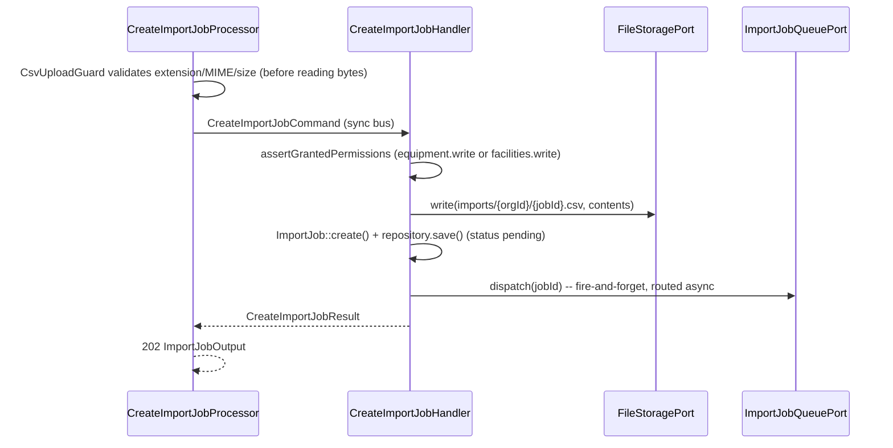

# Import Module

## Overview

Import lets an organization onboard a real fire-safety estate in bulk instead
of one-by-one entry: upload a CSV → a persisted async `ImportJob` streams the
file row by row and provisions Equipment or Facility resources **through the
existing Create use cases** (`CreateEquipmentHandler` / `CreateFacilityHandler`),
so every domain invariant and the organization's plan quota apply exactly as
they do for the HTTP API — there is no parallel creation path.

Main goals:

- Accept a multipart CSV upload, persist a `pending` job, and enqueue its
  processing on the `async` transport — the request returns `202` immediately.
- Stream the CSV row by row (bounded memory — never load every row into an
  array at once) and provision one resource per row.
- Treat a row failure (structural validation, an unknown reference, or a plan
  quota breach) as **non-fatal**: it is recorded in the job's report and the
  batch continues. The job still reaches `completed` with a partial success —
  only an unreadable/malformed file reaches `failed`.
- Make redelivery of the same job (Messenger retry after a worker crash)
  safe: an already-terminal job is a no-op, a still-`processing` job resumes
  from its persisted `processedRows` high-water mark.
- **v2 — dry-run mode**: run the entire pipeline (parsing, per-row
  validation, parent-by-code resolution, quota projection) without
  provisioning anything, so a caller can preview the outcome of a large file
  before committing to it. See "Dry-run mode" below.

## API Endpoints

| Method | Path | Description | Permission |
| --- | --- | --- | --- |
| POST | `/api/imports` | Multipart upload (`organization`, `kind`, `file`, optional `dryRun`); `202 {id, status: "pending", dryRun, ...}` | `organization.equipment.write` (kind=equipment) or `organization.facilities.write` (kind=facility) |
| GET | `/api/imports` | Org-scoped list (filters: `organization` *(required)*, `kind`; 30/page, client page size) | `organization.equipment.read` or `organization.facilities.read` (whichever matches the job's kind; either grants visibility over an unfiltered list) |
| GET | `/api/imports/{id}` | Status + counters + per-row report (`errorReport`, including `would_create` entries for a dry-run job) | matching read permission for the job's own kind |

Every operation requires `ROLE_USER` at the resource level; the finer-grained
permission checks above are self-enforced in the Application handlers
(`CreateImportJobHandler`, `GetImportJobHandler`, `ListImportJobsHandler`),
consistent with the codebase invariant that handlers — not
processors/providers — own authorization.

All three handlers decide access through
`OrganizationAuthorizationPort::resolveAccess()` rather than the flat
`assertGrantedPermissions()`, so the two denials stay distinct:

- **no active membership in the target organization** → **404**, the same
  answer an unknown identifier produces. On `GET /api/imports/{id}` this is
  the point of the rule: a 403 there would confirm to an outsider that the
  job id exists. On `POST`/`GET /api/imports`, where the caller names the
  organization itself, the 404 keeps organization identifiers from being
  probed the same way (`ImportJobNotFoundException::forOrganizationScope()`).
- **member of the organization but lacking the permission** → **403**
  (`ImportAccessDeniedException`).

The unfiltered list is granted by *either* read permission, so it gates scope
first with `isMemberOf()` and only then ORs the two `hasPermission()` calls —
`resolveAccess()` answers about one permission at a time, and a member
holding neither must still get 403 rather than 404.

## CSV format

- **Equipment** (`kind=equipment`) header: `type` (required, must be a valid
  `EquipmentType` value), `subType`, `brand`, `model`, `serialNumber`,
  `locationLabel`.
- **Facility** (`kind=facility`) header: `type` (required, `FacilityType`),
  `name` (required), `code`, `address`, `latitude`, `longitude` (both
  optional, but required together — a row with only one is `INVALID`; each
  must fall within its valid decimal-degree range, `[-90, 90]` for latitude
  and `[-180, 180]` for longitude, checked structurally by
  `FacilityRowFactory` itself — a self-contained duplicate of
  `Facility\Domain\ValueObject\FacilityCoordinates`'s own range check, not an
  import of it, so an out-of-range coordinate fails fast as a row-level
  `INVALID` without a command-bus round trip, and so a **dry-run** row can be
  validated without ever dispatching a write command), `parentCode`
  (resolved to a parent facility by exact code within the same organization;
  the parent row must already exist in the database **for a real run** —
  ordering parents before children in the file is the caller's
  responsibility. A **dry-run** additionally resolves `parentCode` against
  the rows already reported `would_create` earlier in the same file — see
  "Dry-run mode" below).
- Unknown columns are ignored. Delimiter is sniffed (comma, or semicolon for
  the French-Excel convention); a UTF-8 BOM is stripped. Max 5000 data rows
  (`CsvRowStreamer::DEFAULT_MAX_ROWS`, enforced in `CsvRowStreamer::rows()`;
  exceeding it fails the whole job — see "Error Codes"), max 5 MB upload
  (`CsvUploadGuard`, rejected at upload with 422) — both bounds exist to keep
  worker time/memory predictable.
- `type` enum membership is **not** validated by Import's own row factories —
  it is left to `CreateEquipmentHandler`/`CreateFacilityHandler` (via the
  provisioning ports below), which already report an invalid value as a
  non-fatal `INVALID` row outcome. This keeps the row factories free of any
  dependency on Equipment/Facility's Domain types.

## Dry-run mode

A `dryRun: true` multipart field (`CsvUploadGuard`/`UploadedCsv`, parsed with
`filter_var(..., FILTER_VALIDATE_BOOLEAN)`, default `false`) on `POST
/imports` creates an `ImportJob` with `ImportJob::isDryRun()` set, persisted
in the new `import_jobs.is_dry_run` column
(`migrations/main/Version20260816170000.php`). `ProcessImportJobHandler` runs
the **exact same pipeline** for a dry-run job — parsing, per-row structural
validation, parent-by-code resolution, quota projection — but persists
nothing:

- Every row builds its `ProvisionFacilityRequest`/`ProvisionEquipmentRequest`
  exactly as a real run does, then — when the job is a dry run — the handler
  rebuilds the request with `dryRun: true` and a running
  `quotaProjectionOffset` (see `Import\Application\Support\DryRunProjection`,
  a per-processing-call running count of would-create rows so far, reset to
  zero on a redelivered job — an accepted approximation, see "Out of scope").
- `FacilityProvisioningService`/`EquipmentProvisioningService` and
  `CreateFacilityHandler`/`CreateEquipmentHandler` honour `dryRun` by
  building and validating the full aggregate (so every domain invariant
  still applies) but skipping the transactional save, instead calling the
  new `OrganizationQuotaPort::assertProjectedCanAdd()` — a lock-free
  projection (`getLimit()`/`getUsage()` plus the offset), not
  `assertCanAdd()`, which takes a persistence-scoped advisory lock a dry run
  never needs and must never take (see `src/Organization/MODULE.md`).
- **Intra-file parent resolution**: `FacilityProvisioningService` resolves
  `parentCode` against the database first, exactly like a real run; when
  that fails AND the job is a dry run, it additionally checks the caller's
  `knownPendingCodes` — the codes of rows earlier in the same file already
  reported `would_create` (tracked by `DryRunProjection::facilityPendingCodes()`
  as `ProcessImportJobHandler` walks the file). A match resolves the row
  (parent id left `null` — there is no real id yet, and
  `CreateFacilityHandler`'s parent-existence/status checks are skipped when
  no id is present); no match at all is `INVALID`, same as a real run's
  unknown code. This mirrors, for a dry run, the same "order parents before
  children" convention a real import already relies on.
- **The report reuses the existing per-row mechanism rather than a parallel
  one**: `ImportRowError`/`ImportJob::errorReport()` already exists for
  real-run failures (`quota_exceeded`|`invalid`|`missing_required`).
  `ImportJob::recordRowSuccess()` now takes an optional `ImportRowError`
  entry to append; a real run still calls it with no argument (report stays
  failures-only, unchanged), while a dry run passes one coded `would_create`
  for every row that validated. `GET /imports/{id}`'s `errorReport` therefore
  already carries the full per-row outcome (`would_create`|`invalid`|
  `quota_exceeded`|`missing_required`) for a dry-run job with no separate
  endpoint or field.
- `successfulRows`/`failedRows` count the same way as a real run
  (`would_create` counts as success); `status` still reaches `completed` —
  never a distinct "dry-run-completed" status — since the batch ran to
  completion exactly as a real one would.

## Domain Model

`ImportJob` (`Domain/Model/ImportJob`) — a real aggregate (not a record-level
entity): `id`, `organizationId`, `kind` (`ImportKind`: `equipment`|`facility`),
`status` (`ImportStatus`: `pending`|`processing`|`completed`|`failed`),
`storagePath`, `originalFilename`, `dryRun` (`bool`, default `false` —
`isDryRun()`), `totalRows` (`?int`, set once counted),
`processedRows`/`successfulRows`/`failedRows` (counters), `errorReport`
(`list<ImportRowError>`), `jobError` (`?string`, catastrophic only),
`createdBy`, timestamps. State machine: `pending` -> `processing` ->
(`completed` | `failed`); every transition is guarded on the aggregate.
`recordRowSuccess(?ImportRowError $report = null)` accepts an optional entry
to append — `null` for a real run (unchanged, report stays failures-only), a
`would_create` entry for a dry run — so `errorReport` is the single mechanism
both flavors of run report through, per "Dry-run mode" above.

`ImportRowError` (`Domain/ValueObject`) — one reported row outcome:
`rowNumber`, `code` (`quota_exceeded`|`invalid`|`missing_required`|
`would_create`, the last dry-run only), `message`, optional `column`.

## Flows

### Create (synchronous)



### Process (async worker)

```mermaid
sequenceDiagram
  participant W as ProcessImportJobHandler
  participant R as ImportJobRepositoryPort
  participant FS as FileStoragePort
  participant CSV as CsvRowStreamerPort
  participant EQ as EquipmentProvisioningPort
  participant FAC as FacilityProvisioningPort
  W->>R: claim(jobId) -- raw-DBAL conditional UPDATE
  Note over W,R: pending OR processing -> processing; completed/failed -> false (no-op)
  R-->>W: false => return (already terminal)
  W->>FS: read(storagePath)
  W->>CSV: countDataRows() -> job.setTotalRows() + save()
  loop each data row (skip rowNumber <= processedRows on resume)
    W->>W: kind==equipment ? EquipmentRowFactory : FacilityRowFactory
    alt factory throws ImportRowValidationException
      W->>W: job.recordRowError(code, column, message)
    else
      Note over W: job.isDryRun()? rebuild request with dryRun:true,<br/>quotaProjectionOffset, knownPendingCodes (facility)
      W->>EQ: provision(request) / W->>FAC: provision(request)
      alt CREATED
        alt job.isDryRun()
          W->>W: DryRunProjection.record*WouldCreate() + job.recordRowSuccess(would_create)
        else
          W->>W: job.recordRowSuccess()
        end
      else QUOTA_EXCEEDED / INVALID
        W->>W: job.recordRowError(...)
      end
    end
    W->>R: save(job) every 50 processed rows
  end
  W->>W: job.complete(now) -- even if every row failed (partial success)
  W->>R: save(job)
  W-->>W: dispatch ImportJobCompletedEvent
```

A `Throwable` while reading the blob or parsing the header/row-count marks the
job `failed` (`job.fail(error, now)`) and dispatches `ImportJobFailedEvent` —
swallowed, never rethrown (the job row already records the terminal state;
rethrowing would only trigger pointless Messenger retries).

## Architecture

- **Presentation** (`src/Import/Presentation/Api`): `ImportJobResource`
  (`Post` multipart `deserialize:false`/`input:false`, `GetCollection`,
  `Get`), `CreateImportJobProcessor`, `ImportJobProvider` /
  `ImportJobCollectionProvider`, `CsvUploadGuard` + `UploadedCsv` (the CSV
  equivalent of `Shared\Presentation\Api\Attachment\MultipartAttachmentGuard`
  — the shared attachment kernel's MIME allow-list is images/PDF only, so
  bulk CSV needs its own policy), `ImportJobOutputFactory`,
  `ImportExceptionMapperTrait`.
- **Application** (`src/Import/Application`): use cases (`CreateImportJob`,
  `ProcessImportJob`, `GetImportJob`, `ListImportJobs`), outbound ports
  (`ImportJobRepositoryPort`, `ImportJobQueuePort`, `CsvRowStreamerPort`), the
  two row factories (`EquipmentRowFactory`, `FacilityRowFactory` — named
  "Factory", not "Mapper": that suffix is reserved for
  `Infrastructure/Persistence/` Doctrine record mappers in this codebase),
  and `Support/DryRunProjection` — the running "would-create" counts (per
  resource kind) and, facility-only, the pending codes `ProcessImportJobHandler`
  threads through one dry-run batch (see "Dry-run mode" above). It is a
  plain, mutable, non-port helper object local to one `processRows()` call —
  not persisted, not a port, not shared across jobs.
- **Domain** (`src/Import/Domain`): `ImportJob` aggregate, value objects
  (`ImportJobId`, `ImportKind`, `ImportStatus`, `ImportRowError`), events
  (`ImportJobCompletedEvent`, `ImportJobFailedEvent`), exceptions
  (`ImportJobNotFoundException`, `ImportRowValidationException`).
- **Infrastructure** (`src/Import/Infrastructure`): Doctrine
  record/mapper/repository, `Csv/CsvRowStreamer` (streams `fgetcsv()` rows
  from a `php://temp` handle — never materializes every row in memory at
  once), `Adapter/Messenger/MessengerImportJobQueueAdapter`.

### Ports & adapters (`config/modules/import.yaml`)

| Port | Adapter |
| --- | --- |
| `ImportJobRepositoryPort` (outbound) | `ImportJobRepository` |
| `ImportJobQueuePort` (outbound) | `MessengerImportJobQueueAdapter` |
| `CsvRowStreamerPort` (outbound) | `CsvRowStreamer` |
| `Equipment\Application\Port\Inbound\EquipmentProvisioningPort` *(cross-module, consumed here)* | `Equipment\Application\Service\EquipmentProvisioningService` |
| `Facility\Application\Port\Inbound\FacilityProvisioningPort` *(cross-module, consumed here)* | `Facility\Application\Service\FacilityProvisioningService` |

**`ImportJobQueuePort` is deliberately NOT `CommandBusPort`**: it mirrors
`Intervention\Application\Port\Outbound\PublicationQueuePort` — a
fire-and-forget dispatch straight onto the raw Symfony `MessageBusInterface`
(routed to `async` by `config/packages/messenger.yaml`). `CommandBusPort`'s
`dispatch()` waits for a `HandledStamp` and throws `NoHandlerResultException`
when a message is merely sent to a transport rather than handled inline,
which is exactly what happens for every async-routed command — so any
fire-and-forget async dispatch in this codebase needs its own dedicated
outbound port, not `CommandBusPort`.

**Cross-module reuse** — the core of "provision through the existing Create
use cases": `Equipment\Application\Port\Inbound\EquipmentProvisioningPort` and
`Facility\Application\Port\Inbound\FacilityProvisioningPort` are new **inbound**
ports hosted in their respective modules (mirroring
`Intervention\Application\Port\Inbound\InterventionDraftFactoryPort`).
`EquipmentProvisioningService`/`FacilityProvisioningService` dispatch the
existing `CreateEquipmentCommand`/`CreateFacilityCommand` through
`CommandBusPort` — the exact same synchronous path the HTTP API uses, so the
transactional quota check (`OrganizationQuotaPort::assertCanAdd()`) runs
intact — and translate every failure (raised directly, or wrapped in
`MessengerRuntimeException`/`HandlerFailedException`) into a typed
`ProvisionOutcome` (`CREATED`|`QUOTA_EXCEEDED`|`INVALID`) rather than
rethrowing, so Import's row loop never depends on — or has to catch — another
module's Domain exception. `FacilityProvisioningService` additionally
resolves an optional `parentCode` to a parent facility id via
`FacilityRepositoryPort::findByOrganizationId(..., code: $parentCode, limit:
1)` before dispatching; an unknown code is reported as a non-fatal `INVALID`
row outcome. `ProvisionOutcome` is intentionally duplicated as a
self-contained enum in each of Equipment's and Facility's own `Contract`
namespaces (rather than shared) so the two sibling modules never depend on
each other.

Import depends **only** on these two inbound ports and their `Contract`
types — never on `CreateEquipmentCommand`/`CreateFacilityCommand` or any
Equipment/Facility Domain type directly.

**Dry-run threading**: `ProvisionFacilityRequest`/`ProvisionEquipmentRequest`
(and, downstream, `CreateFacilityCommand`/`CreateEquipmentCommand`) now carry
`dryRun` and `quotaProjectionOffset`; `ProvisionFacilityRequest` additionally
carries `knownPendingCodes`. `FacilityProvisioningService`/
`EquipmentProvisioningService` pass these straight through — never
interpreting `dryRun` themselves — to `CreateFacilityHandler`/
`CreateEquipmentHandler`, which take the actual dry-run branch (build +
validate the aggregate, skip the transactional save, project the quota via
`OrganizationQuotaPort::assertProjectedCanAdd()`; see
`src/Facility/MODULE.md` / `src/Equipment/MODULE.md` / `src/Organization/MODULE.md`).

## Permissions

Reuses `organization.equipment.write` / `organization.facilities.write` (to
create an import job) and `organization.equipment.read` /
`organization.facilities.read` (to read status/list) — no catalog change, no
`app:authz:sync-permissions` run needed.

## Persistence

- Table: `import_jobs` (**main** database), index
  `(organization_id, status)`, index `(created_at)`. `organization_id` is a
  plain column (not an ORM association) with its foreign key
  (`organizations.id`, `ON DELETE CASCADE`) added directly in the migration,
  mirroring `intervention_attachments.work_item_id`'s precedent
  (`Version20260717111309`).
- Doctrine mapping: `src/Import/Infrastructure/Persistence/Doctrine/Record`.
- Repository: `Import\Infrastructure\Persistence\Doctrine\Repository\ImportJobRepository`.
  `claim()` uses a raw-DBAL conditional `UPDATE ... WHERE status IN
  ('pending', 'processing')` (not the ORM's `find()`/`flush()`), mirroring
  `AutomationRunRepository::reserveRun()` — accepting an already-`processing`
  job (not just `pending`) is deliberate: it lets a Messenger redelivery
  after a worker crash resume the same job instead of being rejected, while a
  `completed`/`failed` (terminal) job is never reclaimed.
- Migration: `migrations/main/Version20260717134458.php` (base table),
  `migrations/main/Version20260816170000.php` (adds `is_dry_run BOOLEAN NOT
  NULL DEFAULT false` — v2 dry-run mode; backfilled `false` for every
  existing job), `migrations/main/Version20260826230000.php` (drops that
  `DEFAULT`). The default existed only because `ADD COLUMN ... NOT NULL` is
  rejected on a non-empty table without one; the mapping never declared it, so
  it left `main` out of sync with its mapping. `ImportJobRecord` always writes
  the column, so nothing in the application could reach the default.

## Configuration

- Service wiring: `config/modules/import.yaml`
- Doctrine mapping (main entity manager): `config/packages/doctrine.yaml`
- Messenger routing: `config/packages/messenger.yaml`
  (`ProcessImportJobCommand` → `async`)
- Module import: `config/packages/modules.yaml`
- Autoload: `composer.json` (`Import\\` → `src/Import/`)
- Cross-module wiring (additive): `config/modules/equipment.yaml`,
  `config/modules/facility.yaml`

## Testing

- Unit: `tests/Unit/Import` (including
  `Application/Support/DryRunProjectionTest.php` and the dry-run cases in
  `ProcessImportJobHandlerTest.php` — a per-row `would_create` report, quota
  projection, intra-file parent resolution — plus the coordinate range cases
  in `FacilityRowFactoryTest.php`), the cross-module provisioning services at
  `tests/Unit/Equipment/Application/Service/EquipmentProvisioningServiceTest.php`
  and `tests/Unit/Facility/Application/Service/FacilityProvisioningServiceTest.php`
  (dry-run passthrough, intra-file pending-code resolution), the Create
  handlers' dry-run branch in `CreateFacilityHandlerTest.php` /
  `CreateEquipmentHandlerTest.php` (no repository write — the negative
  assertion is the point — and the quota-projection throw), and
  `OrganizationQuotaServiceTest.php` for `assertProjectedCanAdd()`.
- Functional: `tests/Functional/Api/ImportJobApiTest.php` — a dry-run facility
  import (valid + invalid + intra-file-parent rows) asserting the full report
  and that nothing was persisted, and a real-run regression asserting a
  facility is actually created.
- Run module tests: `make test tests/Unit/Import/`

## Error Codes

| Exception | HTTP |
| --- | --- |
| `ImportAccessDeniedException` | 403 Forbidden |
| `ImportJobNotFoundException` | 404 Not Found |
| `InvalidArgumentException` | 400 Bad Request |
| Upload rejected by `CsvUploadGuard` (missing field, wrong extension/MIME, oversize) | 400 / 422 |

`ImportExceptionMapperTrait` also still maps
`Organization\Domain\Exception\OrganizationAccessDeniedException` to 403 —
the Organization port raises it directly, though no Import handler throws it
anymore.

Row-level outcomes (`quota_exceeded`, `invalid`, `missing_required`,
`would_create`) never surface as HTTP errors — they are recorded in the
job's `errorReport` and the request that created the job already returned
`202`.

**The 5000-row cap is not one of those row-level outcomes.** It is enforced
in `CsvRowStreamer::rows()`, which throws `InvalidArgumentException` on the
5001st data row. `ProcessImportJobHandler::processRows()` calls
`countDataRows()` first, so an oversized file trips the cap before any row is
provisioned; the throw is caught by the handler's `catch (Throwable)` and
fails the **whole job** — `status: "failed"` with `jobError` reading
`Unable to process the CSV file: The CSV file exceeds the maximum of 5000
data rows.` This happens on the async worker, so `POST /api/imports` has
already answered `202`: the cap is never an HTTP status, only a terminal job
state read back from `GET /api/imports/{id}`.

## Out of scope (documented follow-ons)

- Facility assignment of imported equipment (an `AssignToFacility` step
  driven by a `facilityCode` column).
- Strict exactly-once provisioning via a per-row reservation table
  (`import_job_rows`, unique `(import_job_id, row_number)`) — today's
  crash-resume bound is "at most one in-flight batch of duplicate creates,"
  acceptable for this lot.
- CSV template reference endpoint, blob retention/GC sweep, and
  multi-delimiter/locale autodetection beyond comma/semicolon.
- **Dry-run quota projection across a redelivered job**: `DryRunProjection`
  is scoped to one `processRows()` call; a dry-run job redelivered mid-file
  after a worker crash restarts its running would-create counters at zero
  rather than reconstructing them from the rows already in the persisted
  report. Acceptable for a preview-only, non-persisting operation — the
  worst case is a slightly optimistic quota projection on the resumed tail
  of an already-rare crash-resume path, never a wrong real-run outcome.
