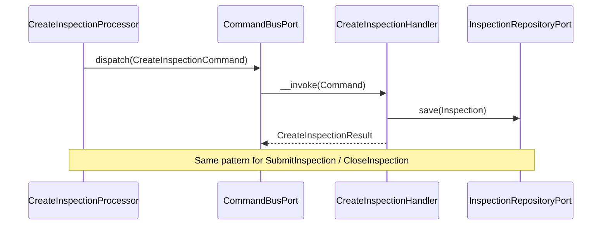
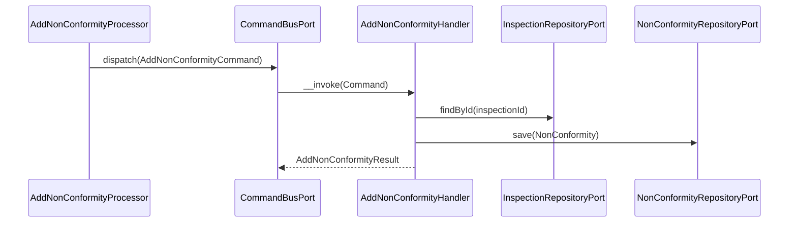
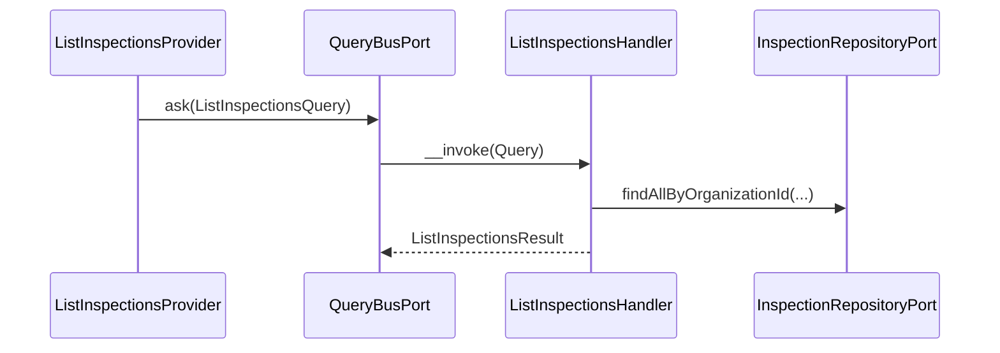

# Inspection Module

## Overview

Inspection manages the fire safety inspection lifecycle for an organization. It
covers three sub-domains: reusable checklist templates, actual inspection records
performed on equipment items, and non-conformity tracking for deficiencies found
during inspections.

Main goals:

- Record physical inspections with a controlled status machine (`draft → submitted → closed`).
- Provide reusable, versioned checklist templates that can be frozen (archived).
- Track deficiencies (non-conformities) from discovery through resolution.

## API Endpoints

Removed 2026-08-20: `GET /api/inspections/results`, `GET /api/inspections/statuses`,
`GET /api/inspections/inspector-types`, `GET /api/checklists/statuses`, and
`GET /api/non-conformities/statuses` (unconsumed reference catalogs; the frontend's
localized typed registries are the source of these values).

### Inspections

| Method | Path | Description |
| --- | --- | --- |
| POST | `/api/organizations/{organizationId}/inspections` | Create inspection (starts as `draft`) |
| GET | `/api/organizations/{organizationId}/inspections` | List inspections (filters: `equipmentId`, `facilityId`, `result`, `status`, `performedAtFrom`, `performedAtTo`, `inspectorUserId`, `checklistId`) |
| GET | `/api/organizations/{organizationId}/inspections/{inspectionId}` | Get inspection |
| POST | `/api/organizations/{organizationId}/inspections/{inspectionId}/submit` | Submit inspection (`draft → submitted`) |
| POST | `/api/organizations/{organizationId}/inspections/{inspectionId}/close` | Close inspection (`submitted → closed`) |
| GET | `/api/organizations/{organizationId}/inspections/export` | Streams a bounded CSV export of inspections (filters: `equipmentId`, `facilityId`, `result`, `status`, `performedAtFrom`, `performedAtTo`, `inspectorUserId`, `checklistId`) — B8 |
| GET | `/api/organizations/{organizationId}/inspections/{inspectionId}/report` | Streams a PDF report of one inspection (identity, checklist responses, non-conformities) — plan-gated, see PDF reports below |

**B8 — synchronous CSV exports (inspections and non-conformities).**

Two streamed, synchronous CSV export endpoints — `GET .../inspections/export` and
`GET .../non-conformities/export` — mirroring the canonical pattern
`Intervention\...\ExportInterventionsController` established: an invokable API
Platform controller (`read`/`write`/`serialize`/`deserialize`/`output` all
disabled on the `Get` operation), a query-bus round trip to a dedicated export
handler, and a `StreamedResponse` with `Content-Type: text/csv; charset=utf-8`,
`Content-Disposition: attachment`, and `X-Accel-Buffering: no`. No 202+poll —
both are bounded and fast enough to answer inline.

- **Row cap**: `ExportInspectionsHandler::MAX_EXPORT_ROWS` /
  `ExportNonConformitiesHandler::MAX_EXPORT_ROWS` — 50 000. A cheap `COUNT`
  runs before a single row is fetched; exceeding the cap answers **422**
  (`InspectionExportTooLargeException`) without ever hydrating the matched
  rows. Narrow the filters and retry.
- **Authorization**: both use `OrganizationAuthorizationPort::resolveAccess()`
  with `organization.inspection.read` — the same permission the list
  endpoints require — and, unlike those list endpoints'
  `hasPermission()`-only gate, separate `OUTSIDE_SCOPE` (**404**, same as an
  absent organization) from `MISSING_PERMISSION` (**403**). The resource-level
  `is_granted('ROLE_USER')` is only the coarse gate.
- **Filters**: each export reuses the *cheap* subset of its list endpoint's
  filters only — equality/range predicates the existing indexed query
  builders already serve. The inspection export **excludes** `inspectorType`
  (never exposed by the list provider) and free-text `search` (trigram,
  deliberately left out of the export's cost budget). The non-conformity
  export reuses the organization-wide list's full filter set (`severity`,
  `status`) since that list carries no free-text search either.
- **Bulk resolution, never per-row**: one `COUNT`, one bounded `SELECT`, then
  every display name and counter in a fixed number of additional round trips —
  `FacilityNamingPort::findNamesByIds()`, `EquipmentNamingPort::findSerialNumbersByIds()`,
  `ChecklistRepositoryPort::findNamesByIds()` (inspections only), and the two
  non-conformity counters via `NonConformityRepositoryPort::countsByInspectionIds()`
  (existing) and the new `countsOpenByInspectionIds()` (open/in-progress
  only). A name that cannot be resolved renders as the raw identifier in the
  CSV, never as a blank cell mistaken for "no value".
- **New port methods**, mirroring `InterventionWorkflowGatewayPort::countInterventions()`/`listInterventionExportCandidates()`:
  `InspectionRepositoryPort::countExportCandidates()`/`listExportCandidates()`
  (lightweight `InspectionExportCandidate` rows — never the full `Inspection`
  aggregate) and `NonConformityRepositoryPort::countExportCandidates()`/`listExportCandidates()`/`countsOpenByInspectionIds()`.
  The non-conformity `listExportCandidates()` resolves the owning
  inspection's `facilityId`/`equipmentId` in the *same* query (a mixed
  entity + scalar select against the existing `createOrganizationListQueryBuilder()`
  join), never a second round trip per row.
- **`ageInDays`** (non-conformity export only) is computed in the handler
  against `ClockPort::now()`, never in the CSV writer — the writer only
  formats, per the Presentation-layer rule.
- **CSV columns**, in order:
  - Inspections (`InspectionCsvWriter::HEADER`): `id, status, result, facility,
    equipment, checklist, performed_at, non_conformities_open,
    non_conformities_total, created_at, updated_at`.
  - Non-conformities (`NonConformityCsvWriter::HEADER`): `id, severity, status,
    age_in_days, facility, equipment, inspection_id, created_at, resolved_at`.
- **Audit**: each controller dispatches its own domain event after a
  successful export — `Inspection\Domain\Event\Export\InspectionsExportedEvent`
  / `NonConformitiesExportedEvent` — carrying `organizationId`, `actorUserId`,
  `format` (`csv`), `rowCount`, and `filterKeys` (names only, never values).
  Centralized audit wiring (`Audit\...\AuditEventSubscriber`) is untouched by
  this change; only the events are created and dispatched here.
- **Route disambiguation**: `/inspections/export` sits at the same path depth
  as `/inspections/{inspectionId}`, so `GET_INSPECTION`/`EDIT_INSPECTION`/`CANCEL_INSPECTION`
  gained an explicit UUID `requirements` constraint on `{inspectionId}` —
  mirrors `InterventionResource::UUID_PATTERN`'s `{id}` disambiguation against
  `/interventions/export`. `/non-conformities/export` needed no such
  constraint: no sibling route shares its path shape.

**PDF reports — inspection report and non-conformities report (plan-gated).**

Two synchronous PDF exports on the shared PDF socle (`templates/pdf/layout.html.twig`,
translator domain `pdf`, `OrganizationDocumentBrandingPort` for letterhead +
regional date formatting, dompdf renderer adapters with `isRemoteEnabled`/
`isPhpEnabled` off and canvas `page_text()` pagination):

- `GET .../inspections/{inspectionId}/report` —
  `ExportInspectionReportController`, reusing `GetInspectionQuery`,
  `ListInspectionResponsesQuery` (scoped by `inspectionId`, `published`
  records by default) and `ListNonConformitiesQuery`. No new business logic.
- `GET .../non-conformities/report` —
  `ExportNonConformitiesReportController`, reusing the CSV export's
  `NonConformityExportCriteriaFactory` (same `severity`/`status` filters) and
  `ExportNonConformitiesQuery` (same handler: row cap, bulk naming,
  `ageInDays`), then grouping rows by severity (critical → low) as pure
  presentation shaping. Inherits the CSV export's 422 row cap.

**Decision — entitlement gate.** Both reports are reserved to the `pro`/`max`
plans, exactly like the Compliance safety register: the controllers check
`InspectionReportEntitlementPort` (aliased to the SAME Organization adapter,
`OrganizationExportEntitlementAdapter`, so the plan allow-list lives in one
place) and answer a dedicated **403** (`InspectionReportNotEntitledException::planTooLow`)
when the plan is lower. This deliberately does **not** mirror the intervention
report (`GET /api/interventions/{id}/report`), which predates the decision and
remains ungated — the asymmetry is known and accepted; new document exports
align on the gated register, not on it.

Authorization mirrors the CSV exports: `resolveAccess()` with
`organization.inspection.read`, `OUTSIDE_SCOPE` → **404**,
`MISSING_PERMISSION` → **403**, entitlement checked only after that split so
an outsider never learns the route exists. Each export dispatches its audit
event (`inspection.report_exported` with the plan key;
`inspection.non_conformities_report_exported` with row count + filter *names*
+ plan key), wired centrally in `Audit\...\AuditEventSubscriber`. The single
inspection report deliberately uses the module's org-scoped route shape
(`/organizations/{organizationId}/inspections/{inspectionId}/report`) rather
than Intervention's bare `/interventions/{id}/report`: every Inspection read
query requires the `organizationId` up front, and the resolveAccess-before-
load ordering depends on it.

### Checklists

| Method | Path | Description |
| --- | --- | --- |
| POST | `/api/organizations/{organizationId}/checklists` | Create checklist template |
| GET | `/api/organizations/{organizationId}/checklists` | List checklists (filter: `status`) |
| GET | `/api/organizations/{organizationId}/checklists/{checklistId}` | Get checklist |
| PATCH | `/api/organizations/{organizationId}/checklists/{checklistId}` | Partially update a checklist (name, referenceCode, items) |
| POST | `/api/organizations/{organizationId}/checklists/{checklistId}/archive` | Archive (freeze) checklist |

**L1.10 — reference code, item count, update endpoint (R-latest).**

- `referenceCode` — optional human-facing code (`CHK-EXT-Q`, max 40 chars),
  unique per organization when set (`checklists.reference_code`, unique index
  `uniq_checklist_organization_reference_code (organization_id,
  reference_code)`). Nullable and Postgres treats `NULL` as distinct, so any
  number of code-less checklists coexist. A duplicate code within the same
  organization surfaces as **409 Conflict**
  (`ChecklistReferenceCodeAlreadyExistsException`), detected by catching the
  unique constraint violation on save — mirrors
  `OrganizationSlugAlreadyExistsException` in the Organization module.
- `itemCount` — scalar item count, always present on `ChecklistOutput`.
- **Breaking change**: the `GetCollection` (list) response no longer ships
  each row's full `items` array (previously it did, so clients could count
  them client-side). List rows now expose `itemCount` only; fetch a single
  checklist (`GET .../{checklistId}`) for the full item list. Create/Get/Patch/
  Archive responses are unaffected and still return the full `items` array.
- **L1.10b — the list path is now genuinely count-only (fixed a latent
  regression in L1.10).** L1.10 shrank the wire response but never removed
  the underlying hydration: `ListChecklistsHandler` still built a
  `ChecklistItemResult` for every item of every checklist, and
  `ChecklistRepository::findByOrganizationId()` ran one extra
  `checklist_items` query **per row** (an N+1) just so the provider could
  discard it all down to `count($result->items)`. Fixed:
  - `ChecklistRepositoryPort::countItemsGroupedByChecklistId(ChecklistOrganizationId, list<string> $checklistIds): array<string, int>`
    — a single grouped DQL query over `checklist_items` inner-joined to
    `checklists`, filtered by `checklists.organization_id` and by the
    requested checklist IDs, `GROUP BY checklist_items.checklist_id`.
    Mirrors `Organization\...\OrganizationMemberRepository::countActiveMembersGroupedByRoleId()`.
    A checklist with zero items is simply absent from the returned map
    (callers default missing keys to `0`); a checklist from a different
    organization never contributes, even if its ID is included in the
    requested list.
  - `ChecklistRepository::findByOrganizationId()` no longer issues the
    per-row `checklist_items` query at all — list rows are mapped via
    `ChecklistMapper::toDomain($record, [])`, so `Checklist::items()` is
    empty for every row returned by the list path.
  - `ListChecklistsHandler` no longer builds `GetChecklistResult` /
    `ChecklistItemResult` for list rows. It returns
    `PaginatedResult<ListChecklistResult>`, a new lightweight per-row result
    (`Application\UseCase\Query\Checklist\ListChecklists\ListChecklistResult`)
    carrying `itemCount: int` instead of `items: list<ChecklistItemResult>`.
    `itemCount` comes from `countItemsGroupedByChecklistId()`, defaulted to
    `0` for checklists absent from the map (`$itemCounts[$checklistId] ?? 0`).
  - `ListChecklistsProvider::mapResult()` now just copies
    `$result->itemCount` onto `ChecklistOutput->itemCount` — no more
    `count($result->items)` over a throw-away hydration.
  - Unaffected: the single-GET path (`GetChecklistHandler` /
    `ChecklistRepository::findById()`) still hydrates and returns the full
    `items` array via `GetChecklistResult` — only the list path changed.
- **Update endpoint invariants**:
  - An **archived** checklist can never be edited (`ChecklistArchivedException`,
    422/409 depending on wrapping — mirrors the existing archive-on-archived
    mapping).
  - `Inspection` only stores a bare `InspectionChecklistId` foreign key to the
    checklist row — there is no per-inspection snapshot of the checklist's
    name/items, and `Checklist::items()` is mutated **in place** (the
    repository upserts by item ID and deletes items no longer present).
    Therefore, once a checklist is referenced by at least one existing
    inspection (any status — `countByOrganizationId(..., checklistId:
    ...)` > 0), attempting to change its **item list** is rejected with
    **409 Conflict** (`ChecklistInUseException`): mutating items in place
    would retroactively change how already-recorded inspection evidence
    (including free-form `InspectionResponse.itemKey` values, which are not
    FK-linked to `checklist_items.id`) is interpreted. `name` and
    `referenceCode` remain editable on an in-use checklist. To change the
    item set, create a new checklist.
  - No automatic `version` bump was implemented: `Checklist.version` is a
    plain label on the same mutable row, so bumping it would not by itself
    protect historical data (the row content changes regardless of what the
    label says) — it was rejected as false safety. Blocking structural item
    changes on in-use checklists is the actual protection; see
    `UpdateChecklistHandler` docblock.

### Non-Conformities

| Method | Path | Description |
| --- | --- | --- |
| POST | `/api/organizations/{organizationId}/inspections/{inspectionId}/non-conformities` | Record a deficiency |
| GET | `/api/organizations/{organizationId}/inspections/{inspectionId}/non-conformities` | List non-conformities for one inspection (filters: `severity`, `status`) |
| GET | `/api/organizations/{organizationId}/non-conformities` | List non-conformities across every inspection of an organization, newest first (filters: `severity`, `status`) — B7 |
| GET | `/api/organizations/{organizationId}/non-conformities/export` | Streams a bounded CSV export of an organization's non-conformities (filters: `severity`, `status`) — B8 |
| GET | `/api/organizations/{organizationId}/non-conformities/report` | Streams a PDF report of an organization's non-conformities grouped by severity (filters: `severity`, `status`) — plan-gated, see PDF reports below |
| PATCH | `/api/organizations/{organizationId}/inspections/{inspectionId}/non-conformities/{id}/status` | Update non-conformity status |

**B7 — organization-wide non-conformity collection.**

The Compliance page needs a flat, paginated register of non-conformities
across all of an organization's inspections (newest first), not nested under
one inspection. `NonConformityResource` gained a second `GetCollection`
(`ListOrganizationNonConformitiesProvider` /
`ListOrganizationNonConformitiesHandler`), reusing the existing
`NonConformityOutput` DTO and the module's real `severity`
(`low`/`medium`/`high`/`critical`) and `status`
(`open`/`in_progress`/`done`/`waived`) enum values — the endpoint does not
introduce a "resolved" status; `done` and `waived` are the terminal states.

- Same permission and fail-closed shape as the per-inspection list:
  `organization.inspection.read`, checked in the provider via
  `OrganizationAuthorizationPort::hasPermission()` before the query bus is
  asked anything. Unlike the per-inspection list, the handler never resolves
  a single inspection's existence — organization scoping comes entirely from
  `NonConformityRepositoryPort::findByOrganizationId()`'s join to the
  inspection and organization records (mirrors
  `ListInspectionsHandler`/`InspectionRepositoryPort::findByOrganizationId()`).
- `NonConformityRepository::createOrganizationListQueryBuilder()` is a new
  private helper shared by `findByOrganizationId()` (new) and
  `countByOrganizationId()` (existing, refactored to use it) so the two can
  never drift on which rows they count versus return.
- Equipment: a non-conformity only stores its `inspectionId` — equipment
  belongs to the *inspection*. The handler batches
  `InspectionRepositoryPort::findEquipmentIdsByIds()` (new, one query
  resolving inspectionId → equipmentId for the whole page — mirrors
  `ChecklistRepositoryPort::findNamesByIds()`) then
  `EquipmentNamingPort::findSerialNumbersByIds()` (existing), so a page of
  30 rows costs three queries total, not thirty. `NonConformityOutput`
  gained nullable `equipmentId` / `equipmentSerialNumber` (same naming and
  null-when-unresolved contract as `InspectionOutput::$equipmentSerialNumber`);
  both stay `null` on the four pre-existing non-conformity endpoints, which
  do not resolve them.
- **No dedicated "reference/code" field exists on `NonConformity`.** The
  aggregate carries no ticket-style code (unlike `Checklist.referenceCode`,
  which is a real persisted, migrated column). Adding one would be a schema
  change and is out of scope here; the response's existing `id` is the only
  stable per-row identifier today. A future slice that wants a human-facing
  code needs its own migration (see `fg-api-migrations`).

### Attachments (R11b)

| Method | Path | Description |
| --- | --- | --- |
| POST | `/api/inspections/{inspectionId}/attachments` | Upload an inspection-level document |
| GET | `/api/inspections/{inspectionId}/attachments` | List an inspection's own documents (excludes non-conformity photos) |
| POST | `/api/non-conformities/{nonConformityId}/attachments` | Upload a non-conformity field-proof photo |
| GET | `/api/non-conformities/{nonConformityId}/attachments` | List a non-conformity's field-proof photos |
| GET | `/api/inspection-attachments/{id}` | Get one attachment (either kind) |
| DELETE | `/api/inspection-attachments/{id}` | Delete an attachment (requires `If-Match: "revision-N"`) |

Generalized file attachments mirroring the shared attachment kernel
(`src/Shared/MODULE.md`) and the proven `Equipment\...\EquipmentAttachment`
slice. **Single-table decision**: both inspection-level documents and
non-conformity field-proof photos (the photo *is* the evidence of the
deficiency) persist to one `inspection_attachments` table with a nullable
`non_conformity_id` discriminator, rather than two separate tables/aggregates.
Justification: a non-conformity always belongs to exactly one inspection, the
two kinds share every other column (file metadata, storage path, revision),
and callers already need "all photos for this inspection across its
non-conformities" as a natural superset query — a single table with the
discriminator keeps that trivial while `non_conformity_id IS NULL` cleanly
scopes the inspection-level-only listing.

- `Inspection\Domain\Model\Attachment\InspectionAttachment` aggregate carries
  an optional `nonConformityId`; `create()`/`reconstitute()` accept it as a
  nullable trailing parameter.
- `InspectionAttachmentRepositoryPort::findByInspectionId()` returns only
  `non_conformity_id IS NULL` rows (inspection-level); `findByNonConformityId()`
  returns only that non-conformity's photos. Both queries back the single
  `ListInspectionAttachments` use case (`ListInspectionAttachmentsQuery`
  carries an optional `nonConformityId`), which itself backs both `GET`
  endpoints above.
- `AddInspectionAttachment` similarly accepts an optional `nonConformityId`;
  when set, the handler verifies the non-conformity belongs to the target
  inspection (`NonConformityNotFoundException` otherwise) before persisting.
- `InspectionMediaProcessor` resolves the parent (inspection directly, or via
  the non-conformity's own `inspection` relation for the NC endpoint),
  enforces `organization.inspection.write`, validates the multipart upload
  through `Shared\Presentation\Api\Attachment\MultipartAttachmentGuard`, and
  dispatches through the command bus (write-then-persist with storage
  rollback on DB failure, mirroring `AddAttachmentHandler`). Delete removes
  the stored object then the row.
- Storage key: `inspection/{inspectionId}/attachments/{attachmentId}_{fileName}`
  for BOTH kinds (non-conformity photos reuse the inspection prefix — they
  belong to an inspection).
- No new permissions: reuses `organization.inspection.read` /
  `organization.inspection.write` for both inspection-level documents and
  non-conformity photos.
- **Cardinality cap**: `AttachmentConstraints::MAX_ATTACHMENTS_PER_PARENT`
  (**25**), enforced in `AddInspectionAttachmentHandler` via
  `countByInspectionId()` / `countByNonConformityId()`. The two buckets are
  counted **separately** — an inspection may hold 25 inspection-level
  documents *and* each of its non-conformities 25 field-proof photos —
  because each bucket feeds its own unpaginated list. Over the cap returns
  **422**, the same status as a MIME/size rejection, mapped centrally by the
  shared `AttachmentConstraintExceptionSubscriber` — not by the processor.

### Canonical Inspection Responses

The flat, offline-syncable surface: one row per answered checklist item. Routes
carry **no organization segment** — the owning organization is read off the row
(or off the `organization` IRI on create) and permission-checked from there,
which is why every one of them answers 404 rather than 403 outside the caller's
scope.

| Method | Path | Description |
| --- | --- | --- |
| POST | `/api/inspection-responses` | Create a response. `201`. Server-assigned id; optional `clientId` is the replay key |
| PUT | `/api/inspection-responses/{id}` | Offline create with a client-chosen id. `201`. Requires `If-None-Match: *` (`428`/`412` otherwise); `{id}` must be a UUID (`400`); a known `clientId` answers `412` |
| GET | `/api/inspection-responses` | List (filters: `organization`, `intervention`, `inspection`, `recordStatus`; `recordStatus` defaults to `draft` when `intervention` is given, `published` otherwise) |
| GET | `/api/inspection-responses/{id}` | Get one |
| PATCH | `/api/inspection-responses/{id}` | Replace `value` on a **draft**. Requires `If-Match: "revision-N"`. Bumps `revision`. `409` on a published row |
| DELETE | `/api/inspection-responses/{id}` | Delete a **draft**. `204`. Requires `If-Match`. `409` on a published row |

`recordStatus` is `draft` while the response belongs to an intervention still
being prepared, and `published` once that intervention publishes — or
immediately, for a response created outside any intervention. A published
response is a compliance trace: immutable and undeletable.

Every mutation that touches an intervention-scoped row bumps that intervention's
own revision through `InterventionScopePort::touchDraft()`, so a field client
polling `If-Match` sees the preparation move.

## Flows

### Create & Submit Inspection (Command)

### Add Non-Conformity (Command)

### List Inspections (Query)

### Non-conformity SLA escalation sweep (hourly)

`Infrastructure/Scheduler/InspectionScheduleProvider` (`#[AsSchedule('inspection')]`)
triggers `EscalateNonConformitySlaBreachesCommand` hourly on the
`scheduler_inspection` transport (DSN `schedule://inspection`); run
`messenger:consume scheduler_inspection` alongside the existing workers. The
schedule is stateful and lock-guarded (`inspection.nc_sla_sweep`), mirroring
the Maintenance module's sweep exactly.

`EscalateNonConformitySlaBreachesHandler` is idempotent and processes every
candidate page-wise:

1. Pages through unresolved non-conformities (`open`, `in_progress`) not yet
   signalled (`sla_breach_notified_at IS NULL`) through
   `NonConformitySlaPort::pageOpenUnnotified` — the owning organization is
   resolved through the join to the inspection record, never from input.
2. Resolves the owning organization's per-severity resolution SLA through
   `NonConformitySlaPolicyPort` (adapter
   `Organization\Infrastructure\Adapter\Inspection\OrganizationNonConformitySlaPolicyAdapter`,
   reading `OrganizationComplianceSettings::effectiveNonConformitySlaDays()` —
   the first consumer of the org compliance `nonConformitySlaDays` setting),
   cached per organization for the run. A breach is
   `createdAt + slaDays < now`; a severity with no SLA never breaches.
3. Escalates each breach through
   `Application/Service/NonConformitySlaNotifier` as a
   **`non_conformity.sla_breached`** notification to the organization's
   administrators — active members granted `organization.inspection.write`
   directly or through a wildcard
   (`Application/Service/NonConformitySlaRecipientResolver`, mirroring
   `MaintenanceReminderRecipientResolver`) — honoring the organization's
   `nonConformitySlaBreached` category toggle and the
   `inAppEnabled`/`emailEnabled` channel toggles. Best-effort: a delivery
   failure never fails the sweep.
4. Immediately stamps the anti-duplicate guard
   (`NonConformitySlaPort::markSlaBreachNotified`,
   `non_conformities.sla_breach_notified_at`) — **one escalation per breach
   per non-conformity**: a candidate is only selected while its stamp is
   `null`, so a repeat tick never re-announces a breach that stays
   unresolved.

Resolving the non-conformity (`done`/`waived`) removes it from the sweep
entirely. **Reopening a resolved non-conformity clears the stamp** at the
source (`NonConformityRepository::save()` detects the resolved→unresolved
transition), so a still-breached reopened non-conformity is deliberately
escalated again — mirroring how an intervention reschedule re-arms its
due-date reminders. Today `NonConformity::updateStatus()` rejects reopening
(`NonConformityAlreadyResolvedException`), so the re-arm is a persistence-level
guard for the day a reopen path exists; the documented choice stands either
way: re-notifying after a reopen is correct behavior, not a duplicate.

## Domain Model

Aggregates and entities:

- `Inspection` — aggregate root for a physical inspection event
- `Checklist` — versioned template of items to verify
- `ChecklistItem` — a single named verification point within a checklist
- `NonConformity` — a deficiency found during an inspection

`Inspection` main fields:

- `id`
- `organizationId`
- `equipmentId`
- `inspector` (VO: `id` + `InspectorType`: `user` | `external`)
- `result` (`pass`, `fail`, `partial`)
- `status` (`draft`, `submitted`, `closed`)
- `facilityId` (optional)
- `equipmentSerialNumber`, `facilityName`, `checklistName` (read-only, resolved on read through
  `EquipmentNamingPort` / `FacilityNamingPort` / `ChecklistRepositoryPort::findNamesByIds`,
  batched once per listing). The checklist needs no port — it is this module's own aggregate. The module stores
  only identifiers; these exist because a UUID names nothing to the agent standing in front of
  the device. Both are deliberately separate from the validation ports — those throw, and a
  label lookup running on every list page must not go through a contract whose job is to
  reject writes. Null when unresolvable; consumers fall back to the identifier rather than
  render a blank.
- `checklistId` (optional)
- `notes`, `signature` (optional)
- `performedAt`

Status transitions:

- `draft` → `submitted` (submit)
- `submitted` → `closed` (close)

`NonConformity` main fields:

- `id`, `inspectionId`
- `severity` (`low`, `medium`, `high`, `critical`)
- `status` (`open`, `in_progress`, `done`, `waived`)
- Once `done` or `waived`, the non-conformity is immutable.
- **A closed inspection freezes the report, not the remediation.** The two
  non-conformity write paths are deliberately asymmetric, and the asymmetry is
  the contract:
  - `POST .../non-conformities` on a `closed` inspection is refused —
    `AddNonConformityHandler` raises `InspectionAlreadyClosedException` → **409**.
    A closed inspection is a terminal record of what was found; nothing new
    may be appended to it.
  - `PATCH .../non-conformities/{id}/status` on a `closed` inspection is
    **allowed** — `UpdateNonConformityStatusHandler` deliberately performs no
    parent-status check. Remediation routinely outlives the closure of the
    report that raised it: a deficiency is fixed, waived, or escalated weeks
    later. Three consequences make this load-bearing rather than an oversight:
    1. `NonConformityWaiverExecutorAdapter` re-dispatches
       `UpdateNonConformityStatusCommand` when a `nc_waiver` approval is
       granted — up to `approvalTtlDays` (default 14, max 90) after the ask.
       The parent inspection may well have closed in between; a parent-status
       check would make approved waivers fail to apply, and would surface as a
       hard executor failure rather than
       `DeferredActionNoLongerApplicableException`.
    2. The organization-wide counters
       (`NonConformityRepository::countOverviewByOrganizationId()` and
       siblings) join non-conformities to their inspection with **no filter on
       inspection status**, so a closed inspection's rows keep feeding
       `openCount`, `overdueCount` and `criticalOpenCount`. Freezing them would
       strand those counters permanently.
    3. Closing an inspection does not require its non-conformities to be
       resolved (`CloseInspectionHandler` checks only the inspection's own
       status), so a closed inspection with open findings is a normal state,
       not a corrupt one.

  The only immutability rule on a non-conformity is its own terminal status
  (`done`/`waived` → 409), enforced in `NonConformity::updateStatus()`. Both
  halves are pinned by `tests/Functional/Api/InspectionApiTest.php`
  (`testAddNonConformityOnAClosedInspectionReturnsConflict` and
  `testUpdateNonConformityStatusIsStillAllowedOnAClosedInspection`).
- **Waiving is gated by the org's four-eyes approval policy** (R17): when the
  target status is `waived`, `UpdateNonConformityStatusProcessor` consults
  `Approval\Application\Port\Inbound\ApprovalGatePort` (action type
  `nc_waiver`, payload includes the non-conformity's `severity`) BEFORE
  dispatching `UpdateNonConformityStatusCommand`. If the organization
  requires approval for this severity, the endpoint returns **HTTP 202**
  with a pending approval request summary instead of the usual
  `NonConformityOutput`, and the status is left unchanged until a second
  authorized member approves it. Approval defaults OFF (opt-in); see
  `src/Approval/MODULE.md`. `NonConformityWaiverExecutorAdapter`
  (`src/Inspection/Infrastructure/Adapter/Approval/`) re-dispatches the same
  command on approval — the Inspection Domain never references Approval.
  Waiving therefore crosses **two** entitlements: `organization.inspection.write`
  (checked by the processor before anything else) and, only when the gate
  actually defers, `organization.approvals.request` (asserted inside
  `ApprovalGate`). A caller holding the first but not the second gets **403** —
  `UpdateNonConformityStatusProcessor` maps the `OrganizationAccessDeniedException`
  the gate raises, mirroring `ApprovalExceptionMapperTrait` on Approval's own
  endpoints; before that mapping existed it escaped as a 500.

`Checklist` main fields:

- `id`, `organizationId`, `name`, `version`
- `referenceCode` (optional, unique per organization) — see L1.10 above.
- `items` (`list<ChecklistItem>`)
- `status` (`active` | `archived`) — archived checklists cannot be used for new inspections.

## Persistence

- Tables: `inspections`, `checklists`, `checklist_items`, `non_conformities` (main database)
- `non_conformities.sla_breach_notified_at` (nullable, migration
  `migrations/main/Version20260827100000.php`) is the SLA escalation sweep's
  anti-duplicate stamp — see the sweep section above.
- Doctrine mapping: `src/Inspection/Infrastructure/Persistence/Doctrine/Record`
- Repository implementations: `Inspection\Infrastructure\Persistence\Doctrine\Repository`
- Table: `inspection_attachments` (main database, R11b) — `inspection_id` FK
  `ON DELETE CASCADE` (not null), `non_conformity_id` FK `ON DELETE CASCADE`
  (nullable discriminator — see Attachments above), unique `storage_path`,
  `revision` (ETag). Migration: `migrations/main/Version20260717111309.php`
  (shared across the three R11b attachment tables). Repository:
  `Inspection\Infrastructure\Persistence\Doctrine\Repository\InspectionAttachmentRepository`.
  Object cleanup on hard parent delete is deferred (same accepted gap as
  `equipment_attachments`) since inspections are terminal via `closed`/
  `cancelled`, not hard-deleted.

## Architecture

- Presentation: Api Platform resources, providers, processors, DTOs.
- Application: Use cases (command/query), repository ports.
- Domain: Inspection, Checklist, NonConformity aggregates, value objects, domain exceptions.
- Infrastructure: Doctrine record/mapper/repository.

Key folders:
- `src/Inspection/Presentation/Api`
- `src/Inspection/Application/UseCase`
- `src/Inspection/Domain`
- `src/Inspection/Infrastructure`

Cross-module contracts and lifecycle invariants:

- The inspection lifecycle is `draft -> submitted -> closed`, plus the logical
  annulment `draft/submitted -> cancelled` (non-conformities preserved). Both
  `closed` and `cancelled` are terminal and immutable on every write surface of
  the INSPECTION itself (canonical PATCH, intervention `apply()`, and adding a
  non-conformity). This does not extend to the status of an already-recorded
  non-conformity, which stays mutable after closure by design — see the
  non-conformity invariant under "Domain Model" above.
- Canonical DELETE = cancel — never force-close. Idempotent: a repeat DELETE on
  a cancelled inspection is a no-op; deleting a `closed` inspection is refused
  (HTTP 409). Cancellation goes through the DELETE verb: the canonical PATCH does
  not accept `cancelled`.
- `Inspection\Infrastructure\Adapter\Facility\FacilityInspectionDependencyAdapter`
  implements Facility's archival dependency port (in-progress = published
  draft/submitted).
- **Equipment KPI's open-non-conformity counter (L2.11)**:
  `Inspection\Infrastructure\Adapter\Equipment\EquipmentNonConformityStatisticsAdapter`
  implements the Equipment module's
  `Equipment\Application\Port\Outbound\NonConformityStatisticsPort` — a
  single method, `countOpenNonConformities(organizationId)`, deliberately
  ORGANIZATION-WIDE (non-conformities attach to inspections, not to
  equipment, so no per-equipment aggregate exists). The adapter composes two
  already-tested `NonConformityRepositoryPort::countByOrganizationId()` calls
  (`open` + `in_progress`) rather than introducing new DQL, mirroring the
  "open" status grouping already used by
  `InspectionComplianceStatisticsAdapter::OPEN_STATUSES` and
  `NonConformityRepositoryPort::countOverdueByOrganizationId()`'s default.
  See `src/Equipment/MODULE.md`'s L2.11 section.
- **Calendar unified feed**:
  `Inspection\Infrastructure\Adapter\Calendar\InspectionCalendarFeedAdapter`
  implements the Calendar module's
  `Calendar\Application\Port\Outbound\Feed\InspectionCalendarFeedPort`
  (`findBetween(organizationId, from, to, limit)`), reusing
  `InspectionRepositoryPort::findByOrganizationId()` (already filters to
  `recordStatus = 'published'`, and already supports the `performedAt`
  range + sort + hard-limit needed here) rather than a new query. Registered
  in `config/modules/inspection.yaml`; aliased in
  `config/modules/calendar.yaml`. See `src/Calendar/MODULE.md`.
- **Assistant business-context provider (L2.2)**:
  `Inspection\Infrastructure\Adapter\Assistant\InspectionAssistantContextProviderAdapter`
  implements the Assistant module's `assistant.context_provider` tagged-
  iterator seam (`Assistant\Application\Port\Outbound\AssistantContextProviderPort`
  — see `src/Assistant/MODULE.md`), feeding the assistant's "List the open
  non-conformities" suggested prompt. `supports()` gates on
  `organization.inspection.read`
  (`OrganizationAuthorizationPort::hasPermission()`, non-throwing). `provide()`
  composes the exact open+in-progress TOTAL from the already-tested
  `NonConformityRepositoryPort::countOverviewByOrganizationId()` with up to 8
  individual rows (description, severity, status, due date) from a
  DEDICATED DQL query directly against `NonConformityRecord` — no
  equivalent exists on the repository port, the same treatment
  `InspectionComplianceStatisticsAdapter` gives its own cross-module read
  model — ordered most-severe-first via a portable searched `CASE WHEN`
  (never a platform-specific `NULLS LAST`), then soonest-due, then oldest.
  Never throws (an internal failure returns
  `AssistantContextFragment::empty()`). Registered + tagged (`priority: 20`)
  in `config/modules/inspection.yaml`; Assistant's own `config/modules/assistant.yaml`
  is never touched to add this source. **This is the only one of the three
  L2.2 launch providers with genuinely new DQL** — see Testing below for the
  dedicated integration test that executes it for real (never mocks the
  QueryBuilder).
- Regulated actions emit domain events (`src/Inspection/Domain/Event/`)
  recorded in the audit ledger by Audit's `AuditEventSubscriber`:
  `inspection.submitted` / `closed` / `cancelled` and
  `inspection.non_conformity_recorded` / `non_conformity_status_changed`
  (same-status updates are no-ops and emit nothing).
  Emission sites: the Submit/Close/Cancel/AddNC/UpdateNCStatus handlers and
  the canonical processor (published records only — drafts are intervention
  scratchpads and never emit; the intervention `apply()` path is deferred to
  the `intervention.published` audit action because it runs inside the
  publication transaction while the ledger commits on the auth database).
  The canonical processor COLLECTS its events during the mutation and
  dispatches them only after `wrapInTransaction` commits, so a rollback can
  never leave a phantom row in the append-only ledger. The lifecycle
  commands (submit/close/cancel) load through
  `InspectionRepositoryPort::findPublishedById`, so draft scratchpads are
  not reachable (nor auditable) through the classic endpoints. A `result`
  edit on a published submitted inspection is deliberately not a dedicated
  audit action: the `submitted` and `closed` events both carry the result,
  bracketing any interim change.

**Architecture debt — cross-module `Organization\Domain` imports (3).** The
`CrossModuleDomainBoundaryTest` ratchet baseline for `Inspection =>
Organization` was raised 2 → 3 on 2026-08-18, for
`UpdateNonConformityStatusProcessor` catching
`Organization\Domain\Exception\OrganizationAccessDeniedException`. It has to:
`ApprovalGatePort::evaluate()` signals the missing
`organization.approvals.request` entitlement by throwing that class, and
without the catch it escaped the gated waiver path as a **500** instead of a
**403**. Approval's own `ApprovalExceptionMapperTrait` maps the identical
class for the identical reason (`Approval => Organization`, baseline 4), so
this is the established treatment at a Presentation boundary rather than a
new deviation. Deliberate, documented debt: the eventual fix is the approval
gate reporting refusal through its own `Application/Contract/` type instead
of a foreign domain exception — then this baseline shrinks back. The other
two imports are `OrganizationQuotaResource` / `OrganizationQuotaExceededException`
on the inspection-creation quota path.

Refreshed 2026-08-27: after the quota-contract migration shrank the baseline
to 1, it was raised 1 -> 2 for
`Application/Service/NonConformitySlaRecipientResolver` importing
`Organization\Domain\ValueObject\OrganizationId` — forced by
`OrganizationMemberRepositoryPort::findByOrganizationId()`, whose signature is
typed with that value object. The identical import for the identical reason
already exists in `MaintenanceReminderRecipientResolver`,
`InterventionReviewerRecipientResolver` and
`InterventionRecurrenceRecipientResolver`; it shrinks back the day the member
port is retyped with an `Application/Contract` identifier.

### A foreign organization answers 404, never 403

`CanonicalInspectionProvider`, `InspectionResponseProvider` and
`InspectionResponseProcessor` gated on `hasPermission()` alone until
2026-08-26. That answered **404** for an organization id that does not exist and
**403** for a real one the caller does not belong to — letting an outsider
enumerate organization ids by diffing the status.

They now use `resolveAccess()`, which separates the two: `OUTSIDE_SCOPE` (not an
active member, whether or not the organization exists) answers 404,
`MISSING_PERMISSION` answers 403. Twenty-five sibling surfaces already did this,
including `CanonicalFacilityProvider` and `CanonicalEquipmentProvider` — these
three were the stragglers.

`InspectionApiTest::testCanonicalInspectionCollectionDoesNotRevealForeignOrganizations`
freezes it against a seeded organization the caller is not a member of. It
failed with `403 is not identical to 404` before the fix.

The same oracle existed one level down, on the **inspection and attachment ids
themselves**, and was closed in the same pass:
`CanonicalInspectionMutationProcessor`, `InspectionMediaProcessor` and
`InspectionMediaProvider` loaded a record by GLOBAL id — the routes carry no
organization segment — then permission-checked against that record's own
organization. A foreign inspection answered 403 while an absent one answered
404. Six gates converted; `testCanonicalInspectionMutationDoesNotRevealForeignInspections`
freezes the DELETE path and failed with `403 is not identical to 404` before.

**Never gate one of these surfaces on `hasPermission()` alone.** It cannot tell
"absent" from "not yours", and that difference is the oracle. `hasPermission()`
is fine only where the organization id comes from the URI and no separate
existence lookup precedes it, so both cases already collapse to one answer.

**Architecture debt — `Presentation` reaching into a sibling's `Infrastructure` (4).**
Down from 5 on 2026-08-26, then to **0** later the same day. The module's
`Presentation` no longer imports any sibling's `Infrastructure`, and
`PresentationInfrastructureBoundaryTest` now has an **empty baseline** —
repo-wide, not just here.

Two shapes closed it, and neither was the "publish an `Application\Port\Inbound`
lookup port on Organization" fix this section used to predict:

- **The `OrganizationRecord` reads were redundant, not abstractable.** They
  answered 404 for an organization that does not exist, which is the same 404,
  with the same message, that `resolveAccess()` already answers for one the
  caller is not a member of. Deleting the lookup removes a query and changes
  no status. `CanonicalInspectionMutationProcessor` lost its three first (they
  were `instanceof` checks on a property the ORM already types
  `?OrganizationRecord`), then `CanonicalInspectionProvider`,
  `InspectionResponseProvider` and finally `InspectionResponseProcessor`.
- **The `InterventionRecord` read moved behind a port.**
  `Inspection\Application\Port\Outbound\InterventionScopePort` is declared here
  and implemented by `Intervention\Infrastructure\Adapter\Inspection\InterventionScopeAdapter`
  — the same direction as `FacilityValidationPort` and `EquipmentValidationPort`.
  The decision that surrounded the read moved with it, into
  `Application\UseCase\Command\Response\`.

Closing them did **not** remove the coupling underneath: `InspectionRecord` and
`InspectionResponseRecord` both declare
`#[ORM\ManyToOne(targetEntity: OrganizationRecord::class)]`, which is
schema-level and outlives any Presentation cleanup.

### The canonical inspection mutations run on use cases (2026-08-26)

`CanonicalInspectionMutationProcessor` was 343 lines holding three
`persist`/`flush`/`remove` sites, the published status machine, the
draft/published split, the three audit events and their post-commit
dispatch. It is now HTTP translation only, and **holds no entity manager**.

| Concern | Where it lives now |
| --- | --- |
| `PATCH /api/inspections/{id}` | `Application/UseCase/Command/Inspection/PatchCanonicalInspection/` |
| `DELETE /api/inspections/{id}` | `Application/UseCase/Command/Inspection/DeleteCanonicalInspection/` |
| Read one, for the gate | `Application/UseCase/Query/Inspection/GetCanonicalInspection/` |
| Status machine, draft/published split, revision bump, idempotent cancel | `Domain/Model/Inspection/CanonicalInspection` |
| Persistence | `Infrastructure/…/Repository/CanonicalInspectionRepository` (port: `CanonicalInspectionRepositoryPort`) |
| Intervention revision touch | `InterventionScopePort` (shared with the responses surface) |

**Two Domain models over one table, on purpose.** `Inspection` is the
aggregate the organization-scoped commands drive; it is loaded through
`findPublishedById()` so it never sees an intervention scratchpad, and
`InspectionRepository::save()` deliberately leaves `record_status`,
`intervention_id` and `revision` untouched — which is exactly why it cannot
serve the canonical surface: it can never bump the revision the `If-Match`
contract is built on. `CanonicalInspection` carries those three columns and
the canonical rules.

**Those rules differ from the aggregate's, and the divergence is inherited
rather than introduced.** Three differences, all pre-dating this refactor:

| Situation | Canonical surface | `Inspection` aggregate |
| --- | --- | --- |
| Patching `result`/`notes`/`signature` on a **submitted** record | allowed | `Inspection::edit()` refuses anything past draft |
| Illegal status jump (`draft → closed`) | **422** | **409** (`InspectionNotSubmittedException` via `POST …/close`) |
| A draft scratchpad record | skips the lifecycle entirely, never audited | invisible — `findPublishedById()` filters it out |

Reconciling them changes published statuses; that is a product decision, not
a refactor's side effect. `CanonicalInspection`'s docblock and
`CanonicalInspectionValidationException`'s carry the same warning.

**The canonical DELETE contract**, unchanged and now stated by
`DeleteCanonicalInspectionHandler`: a draft scratchpad row is hard-deleted; a
published one is logically annulled to `cancelled`, preserving its
non-conformities; `closed` is terminal and answers 409; a repeat DELETE is an
idempotent no-op that does **not** bump the revision. Only the middle case
reaches the audit ledger.

**Audit events are still dispatched after the commit**, now by the handlers
rather than the processor. The ledger is on the `auth` database and commits
independently, so an event dispatched inside the transaction could describe a
mutation `main` then rolled back — a phantom row in an append-only,
hash-chained ledger. `PatchCanonicalInspectionHandlerTest::testARolledBackMutationAuditsNothing`
freezes it.

**A pre-existing inconsistency, recorded rather than fixed.**
`InspectionRepository` pushes `performedAt`/`createdAt`/`updatedAt` through
`DATABASE_STORAGE_TIMEZONE` on the way in and out; the canonical write path
never did — the processor assigned a bare `new DateTimeImmutable()`.
`CanonicalInspectionRepository` reproduces that deliberately, because adding
the normalisation would silently shift every canonically-written `updated_at`
wherever the storage timezone differs from PHP's. Its docblock says so.

**What deliberately stayed in the processor**: the authorization gate (the
permission depends on the request — a scratchpad inside an intervention is
gated on `mutationPermission()`, and a row loaded by GLOBAL id must answer
404 rather than 403 outside the caller's organization), `MergePatchFields`
(absent-key versus explicit-null is a fact about the HTTP body that a
deserialized DTO has already lost — it travels into the command as `has*`
flags), and the output (`CanonicalInspectionProvider` joins names the write
path has no reason to carry).

### The canonical inspection READS run on use cases too (2026-08-26)

`CanonicalInspectionProvider` hand-assembled its collection DQL and reached
`$record->nonConformities->count()` once per row. It is now query translation
only, and **holds no entity manager**.

| Concern | Where it lives now |
| --- | --- |
| `GET /api/inspections/{id}` | `Application/UseCase/Query/Inspection/ReadCanonicalInspection/` |
| `GET /api/inspections` | `Application/UseCase/Query/Inspection/ListCanonicalInspections/` |
| Which organization the two filters name | `Application/UseCase/Query/Inspection/ResolveCanonicalInspectionScope/` |
| The filter clause itself | `CanonicalInspectionRepository::filtered()`, behind `findReadByFilters()` / `countReadByFilters()` |

**A read projection, not the mutation model.** `CanonicalInspectionReadView`
carries what the wire contract shows — `performed_at`, the inspector quartet,
`facility_id`, `checklist_id`; `CanonicalInspection` carries what the canonical
PATCH may change, plus the invariants guarding it. Hydrating the second to
answer the first is how a list endpoint ends up paying for a write path, so
`findReadById()` and `findReadByFilters()` sit next to `findById()` rather than
replacing it.

**One N+1 removed on the way.** `$record->nonConformities->count()` fired once
per row; the handler now calls
`NonConformityRepositoryPort::countsByInspectionIds()` **once for the whole
page** — the port already existed. The item read uses the same call, so the
detail and the listing can never report a different number for the same row.
This is the defect L1.10b fixed on the checklist listing, in the same shape.

The response is unchanged: the counts are identical, and the eleven assertions
of `tests/Integration/…/CanonicalInspectionProviderTest` — written against the
hand-written DQL and the lazy count — pass unmodified. Only the provider's
construction in the test helper changed, and it now builds the real handlers
over the real repositories.

**Same two-query shape as the responses surface**: resolve the organization,
gate on it, then list. The gate must run before any row is read.

### The inspection-response READS run on use cases too (2026-08-26)

`InspectionResponseProvider` hand-assembled its collection DQL — organization
scoping, the intervention and inspection filters, the `recordStatus` default
and the paging — and resolved the owning organization from whichever filter
the caller supplied. It is now query translation only, and **holds no entity
manager**.

| Concern | Where it lives now |
| --- | --- |
| `GET /api/inspection-responses/{id}` | `Application/UseCase/Query/Response/GetInspectionResponse/` (shared with the processor) |
| `GET /api/inspection-responses` | `Application/UseCase/Query/Response/ListInspectionResponses/` |
| Which organization the three filters name | `Application/UseCase/Query/Response/ResolveInspectionResponseScope/` |
| The filter clause itself | `InspectionResponseRepository::filtered()`, behind `findByFilters()` / `countByFilters()` |

**Two queries, not one, and the order is the point.** The organization has to
be resolved BEFORE the permission gate can run, and the gate has to run before
any row is read — reading a page for a caller who may not see it and
discarding it afterwards is both wasteful and the wrong shape. So the provider
resolves, gates, then lists.

**The `recordStatus` default moved into the handler** and is documented there
as contract rather than convenience: a caller scoped to an intervention is
looking at what a field client is preparing (drafts), anyone else at the
compliance record (published). An explicit `recordStatus` always wins.

**The count and the page share one WHERE clause** (`InspectionResponseRepository::filtered()`).
A paginator whose total is computed over different rows than its page is the
classic way to ship a listing that says 12 and shows 7.

**What deliberately stayed in the provider**: the authorization gate, the IRI
parsing, and the pagination clamp — whose bounds mirror the
`paginationMaximumItemsPerPage` / `paginationItemsPerPage` declared on the
resource, and where a non-numeric value falls back to the default rather than
failing.

**Non-regression, measured rather than argued.** The eight assertions of
`tests/Integration/…/InspectionResponseProviderTest` predate this change and
were written against the hand-written DQL. They pass unmodified; only the
provider's construction in the test helper changed, and it now builds the real
handlers over the real repositories, so the DQL under test is still the DQL
that runs.

### Canonical inspection responses run on use cases (2026-08-26)

`InspectionResponseProcessor` was 261 lines holding five `persist`/`flush`/`remove`
calls, the draft/published lifecycle rules, the offline replay guard, and a
direct `++$intervention->revision`. It is now HTTP translation only: it parses
IRIs and headers, runs the authorization gate, dispatches, and maps a Result to
an Output. **It holds no entity manager and opens no transaction** — and
`config/modules/inspection.yaml` deliberately names none for it.

| Concern | Where it lives now |
| --- | --- |
| Create (POST + offline PUT) | `Application/UseCase/Command/Response/CreateInspectionResponse/` |
| Edit a draft's value | `Application/UseCase/Command/Response/UpdateInspectionResponse/` |
| Delete a draft | `Application/UseCase/Command/Response/DeleteInspectionResponse/` |
| Read one, for the gate | `Application/UseCase/Query/Response/GetInspectionResponse/` |
| Draft/published invariants, revision bump | `Domain/Model/Response/InspectionResponse` |
| Persistence | `Infrastructure/…/Repository/InspectionResponseRepository` (port: `InspectionResponseRepositoryPort`) |
| Intervention ownership + revision touch | `InterventionScopePort` |

**Two things deliberately stayed in the processor.**

The **authorization gate**, because the permission it needs is a function of the
request — `organization.inspection.write`, or whatever
`InterventionResourceManager::mutationPermission()` resolves for an
intervention-scoped row — and because `OUTSIDE_SCOPE` must answer 404 while
`MISSING_PERMISSION` answers 403. Every sibling processor in this module gates
the same way. It is the reason the processor still imports
`Intervention\Domain\Exception\*`, which `CrossModuleDomainBoundaryTest` counts
and has not changed.

The **one remaining catch**, because a duplicate `clientId` answers **412** from
`PUT /inspection-responses/{id}` and **409** from `POST`, and the request shape
is the only thing that knows which. `InspectionResponseClientIdAlreadyExistsException`
is therefore deliberately absent from `api_platform.exception_to_status`; every
other failure is mapped there.

**The gate order is a contract**, frozen by
`InspectionResponseApiTest::testPatchOnAnUnknownResponseAnswersNotFoundEvenWithoutIfMatch`:
the response is read first (404), then the permission gate speaks (403/404),
then `If-Match` is parsed (428/412). Reading `If-Match` earlier — the natural
shape, and what `InterventionWorkItemProcessor` does — turns a 404 on an unknown
id into a 428 for a caller that omitted the header.

**Optimistic concurrency is checked twice, on purpose.** `RevisionGuard` compares
`If-Match` against a scope read that runs on the query bus, i.e. in a different
transaction from the mutation. The aggregate re-compares it inside the handler's
transaction and raises `InspectionRevisionMismatchException` (412, same
wording), which closes the window between the two.

**One status changed, and it was decided rather than inherited.**
`PUT /api/inspection-responses/{id}` with a malformed identifier answered **201**
and persisted the garbage id verbatim; it now answers **400**. The identifier is
an `InspectionResponseId` value object, and `clientId` — the same field, filled
from the same URI — already carried `#[Assert\Uuid]` in the POST body. The PUT
route bypassed that constraint only because the processor overwrote `clientId`
*after* validation ran. **Reads did not narrow**: `GET`, `PATCH` and `DELETE`
still answer 404 for an unparseable id, because the query and both mutation
handlers turn `InvalidValueException` into "not found". Both halves are asserted
in `InspectionResponseApiTest`.

**One known ordering change, not worth contorting for.** A create carrying *both*
a malformed `inspection` IRI *and* a duplicate `clientId` used to answer 409 and
now answers 500 — `ResourceIriParser::id()` throws a bare
`InvalidArgumentException`, which nothing maps, and it is now evaluated before
the replay guard rather than after. The 500 on a malformed IRI is pre-existing
and reachable on its own; only which of the two failures wins moved.

## Configuration

- Service wiring: `config/modules/inspection.yaml`
- Doctrine mapping (main entity manager): `config/packages/doctrine.yaml`
- `Equipment\Application\Port\Outbound\NonConformityStatisticsPort`'s adapter
  (`EquipmentNonConformityStatisticsAdapter`) is aliased here — see L2.11 above.
- `Inspection\Application\Port\Outbound\InterventionScopePort` is aliased to
  `Intervention\Infrastructure\Adapter\Inspection\InterventionScopeAdapter`,
  registered in **this** module's file: the port is declared by the consumer,
  the adapter belongs to the owner.
- The three `Response` command handlers each name
  `@inspection.main_transaction_manager` explicitly. Autowiring would hand over
  the default transaction manager, which opens a transaction on the `auth`
  connection while the writes go to `main` — a rollback that rolls nothing back.
- `InspectionResponseProcessor`, `CanonicalInspectionMutationProcessor`,
  `InspectionResponseProvider` and `CanonicalInspectionProvider` name **no**
  `$entityManager`, and must not: none of them holds one.
- `Inspection\Application\Port\Outbound\CanonicalInspectionRepositoryPort` is
  aliased to `CanonicalInspectionRepository`, wired to `main` explicitly. It is
  a **second** port over the `inspections` table, next to
  `InspectionRepositoryPort` — see the architecture section for why one cannot
  serve both.
- `PatchCanonicalInspectionHandler` and `DeleteCanonicalInspectionHandler` name
  `@inspection.main_transaction_manager`, same reason as the response handlers.
- `Inspection\Application\Port\Outbound\NonConformitySlaPort` is aliased to
  `DoctrineNonConformitySlaAdapter`, wired to `main` explicitly;
  `Inspection\Application\Port\Outbound\Compliance\NonConformitySlaPolicyPort`
  is aliased to the Organization-owned
  `OrganizationNonConformitySlaPolicyAdapter` (registered in
  `config/modules/organization.yaml`) — the port is declared by the consumer,
  the adapter belongs to the owner, mirroring `MaintenanceCompliancePolicyPort`.
- The SLA escalation sweep runs on the `scheduler_inspection` transport the
  Scheduler component registers for `InspectionScheduleProvider`.

## Testing

- Unit: `tests/Unit/Inspection/`
  - `Application/UseCase/Command/Attachment/{Add,Delete}InspectionAttachment`,
    `Application/UseCase/Query/Attachment/ListInspectionAttachments` — both
    inspection-level and non-conformity-scoped flows, non-conformity/inspection
    mismatch rejection, storage rollback on DB failure.
  - `Presentation/Api/Processor/Attachment/InspectionMediaProcessorTest`,
    `Presentation/Api/Provider/Attachment/InspectionMediaProviderTest` —
    both upload/list routes, permission enforcement, revision guard on delete.
  - `Domain/Model/Checklist/ChecklistTest` — reference code normalization
    (trim/blank-to-null/length), `update()` partial semantics, archived
    rejection.
  - `Application/UseCase/Command/Checklist/UpdateChecklist/UpdateChecklistHandlerTest`
    — not-found/org-mismatch, archived rejection, `ChecklistInUseException`
    when items change on a checklist already referenced by an inspection,
    item replacement when unreferenced, duplicate reference code mapped
    from `UniqueConstraintViolationException`.
  - `Presentation/Api/Processor/Checklist/UpdateChecklistProcessorTest` —
    PATCH "no field provided" rejection, dispatch + re-fetch round trip,
    conflict mapping for archived/in-use/duplicate-code, messenger unwrap.
  - `Application/UseCase/Query/Checklist/ListChecklists/ListChecklistsHandlerTest`
    (L1.10b) — `itemCount` sourced from `countItemsGroupedByChecklistId()`,
    including the "checklist absent from the grouped-query map" case
    defaulting to `0`; empty result page.
  - `Presentation/Api/Provider/Checklist/ListChecklistsProviderTest` —
    updated for L1.10b: the mocked query bus now returns `ListChecklistResult`
    (not `GetChecklistResult`/`ChecklistItemResult`), pinning that
    `ChecklistOutput->itemCount` is copied straight from `itemCount` and
    `ChecklistOutput->items` stays empty on the list path.
  - `Infrastructure/Adapter/Equipment/EquipmentNonConformityStatisticsAdapterTest`
    (L2.11) — sums the `open` + `in_progress` counts from a mocked
    `NonConformityRepositoryPort` (no new DQL, so no new integration test is
    needed here).
  - `Infrastructure/Adapter/Assistant/InspectionAssistantContextProviderAdapterTest`
    (L2.2) — `supports()` on/off the permission gate, and `provide()`
    degrading to an empty fragment when the repository throws. Deliberately
    does NOT mock the QueryBuilder/DQL — see the integration test below.
  - `Domain/Model/Inspection/CanonicalInspectionTest` — the canonical rules
    with no container and no mocks: the transition table, terminal-state
    immutability, the scratchpad bypass, `result`-before-`status` validation
    order, explicit-null erasure versus absent key, and the idempotent cancel
    that must not bump the revision.
  - `Application/UseCase/Command/Inspection/{Patch,Delete}CanonicalInspection`
    and `Application/UseCase/Query/Inspection/GetCanonicalInspection` — the
    orchestration: which event is dispatched for which transition, the three
    paths that must dispatch **nothing** (scratchpad, no-status-change,
    idempotent repeat DELETE), the post-commit guarantee (a rolled-back
    transaction audits nothing), and the revision re-check inside the
    handler's own transaction.
  - `Presentation/Api/Processor/Inspection/CanonicalInspectionMutationProcessorTest`
    — what the processor still owns: the gate order (404 before 428), which
    permission a scratchpad row asks the intervention for, 404 rather than 403
    outside the organization, and the merge-patch `has*` flags.
  - `Application/UseCase/Query/Inspection/{ReadCanonicalInspection,ListCanonicalInspections,ResolveCanonicalInspectionScope}`
    — the `recordStatus` default, the equipment filter, the one-based page
    turned into an offset, the empty page that asks for no counts at all, and
    the non-conformity counts coming from ONE grouped call with a row absent
    from the map meaning zero rather than a missing key.
  - `Application/UseCase/Query/Response/{ListInspectionResponses,ResolveInspectionResponseScope}`
    — the `recordStatus` default (published by default, drafts when scoped to
    an intervention, explicit always wins), the one-based page turned into an
    offset, the empty page that still carries its total, and the precedence
    between the three scoping filters including the inspection FALLBACK that
    only runs when the first two produced nothing.
  - `Presentation/Api/Provider/InspectionResponse/InspectionResponseProviderTest`
    — what the provider still owns: the view-to-output projection, the gate's
    404-not-403 split, the IRI filters it parses, and the pagination clamp.
  - `Application/UseCase/Command/Response/{Create,Update,Delete}InspectionResponse`
    and `Application/UseCase/Query/Response/GetInspectionResponse` — the
    lifecycle rules that used to sit in the processor: draft-only edit and
    delete, the revision re-check, the replay guard firing **before** any scope
    is read, the three scope conflicts, `touchDraft()` called with the right
    intervention (and never on a rejected path), and a malformed identifier
    resolving to "not found" rather than "invalid".
  - `Presentation/Api/Processor/InspectionResponse/InspectionResponseProcessorTest`
    — what the processor still owns: 412 vs 409 for a duplicate `clientId`
    (with the failure delivered double-wrapped, as the real bus delivers it),
    404 before the revision guard, and the stored revision travelling into the
    command rather than the header's value.
- Functional: `tests/Functional/Api/CanonicalInspectionApiTest` — the whole
  `PATCH`/`DELETE /api/inspections/{id}` contract, one HTTP request per test:
  200 + bumped revision on a legal transition, 422 on an illegal one and on a
  null non-nullable field, 409 on both terminal-state paths, 204 for the
  cancel / the scratchpad hard-delete / the idempotent repeat, 412 on a stale
  revision, 404 before 428 on an unknown id, 404 on a malformed one, 404 for a
  foreign organization (never 403), and 403 for a member without write.
- Functional: `tests/Functional/Api/InspectionResponseApiTest` — the whole
  `/inspection-responses` contract, one HTTP request per test: 201 on create,
  409/412 on a known `clientId`, 200 + bumped revision on PATCH, 204 on DELETE,
  409 on both published paths, 412 on a stale revision, 404 before 428 on an
  unknown id, 404 for a foreign organization (never 403), 403 for a member
  without write, and **400 for a malformed PUT identifier** — the one status
  this refactor moved, asserted rather than assumed.
- Integration (real database):
  `tests/Integration/Inspection/Infrastructure/Persistence/Doctrine/Repository/CanonicalInspectionRepositoryTest`
  — that `findById()` carries the three columns the aggregate does not, that
  `save()` writes the six mutable ones and **leaves `record_status` and
  `intervention_id` alone** (a PATCH that silently published a scratchpad row
  would be invisible in the response and permanent in the table), and that
  `save()` on an absent row inserts nothing.
  `tests/Integration/Inspection/Infrastructure/Persistence/Doctrine/Repository/InspectionResponseRepositoryTest`
  — save/find/delete round trip, `save()` updating in place on a replayed id,
  `existsByClientId()`, and `InspectionRepository::findScope()`, whose scalar
  projection over `IDENTITY(i.organization)` plus the canonical
  `intervention_id` column nothing but a real query can prove.
  `tests/Integration/Inspection/Infrastructure/Adapter/Assistant/InspectionAssistantContextProviderAdapterTest`
  (L2.2) — executes the adapter's DQL for real: severity ordering
  (critical → high → low), resolved (`done`)/foreign-organization rows
  excluded, and the symmetric case (the foreign-org row IS reported when
  queried from ITS OWN organization) — pinning that organization-scoping
  comes from the query's join, never from trusting the caller.
  `tests/Integration/Inspection/Infrastructure/Persistence/Doctrine/Repository/InspectionAttachmentRepositoryTest`
  (round-trip of both discriminator states, `findByInspectionId` excludes
  non-conformity photos).
  `tests/Integration/Inspection/Infrastructure/Persistence/Doctrine/Repository/ChecklistRepositoryIntegrationTest`
  (L1.10b) — executes `countItemsGroupedByChecklistId()` for real: an
  in-organization checklist with items is counted, a zero-item checklist is
  absent from the map, and a foreign-organization checklist never
  contributes even when its ID is explicitly included in the requested list
  (organization-scoping is enforced by the join, not by trusting the
  caller's ID list). Also pins that `findByOrganizationId()` returns
  checklists with an empty `items()` (no per-row hydration).
  `Application/UseCase/Query/NonConformity/ListOrganizationNonConformities/ListOrganizationNonConformitiesHandlerTest`
  (B7) — org-scoped filters/pagination/sorting passed through, equipment
  batching via `findEquipmentIdsByIds()` + `EquipmentNamingPort`, unresolved
  equipment/serial degrading to `null`, empty page.
  `Presentation/Api/Provider/NonConformity/ListOrganizationNonConformitiesProviderTest`
  (B7) — authentication/permission gating, filter passthrough, pagination
  envelope.
- Functional: `tests/Functional/Api/InspectionAttachmentApiTest.php`,
  `tests/Functional/Api/InspectionApiTest.php` (checklist endpoints, including
  `PATCH .../checklists/{id}`, and B7's
  `GET /organizations/{organizationId}/non-conformities`).
  The five non-conformity endpoints carry the full contract matrix there:
  201/200 success shapes, 403 for a member missing
  `organization.inspection.{read,write}`, 404 for a cross-organization
  inspection or a non-conformity addressed under an inspection that does not
  own it, 409 for reopening a resolved row and for adding to a closed
  inspection, and the closed-inspection asymmetry above. The gated waiver runs
  against the REAL `ApprovalGate` (no mock): an organization seeded with
  `settings.approval.action_rules.nc_waiver.enabled = true` at the `critical`
  threshold yields the live **202** body
  (`{status: 'pending_approval', approvalRequestId, approvalStatus, expiresAt}`)
  with the row left `open`; a `low` finding below that threshold applies
  immediately (**200**); a repeated ask returns the request already pending
  instead of opening a duplicate; and a caller with
  `organization.inspection.write` but without `organization.approvals.request`
  gets **403**.
- Run module tests: `make test tests/Unit/Inspection/`

## Error Codes

- `InspectionNotFoundException` → 404
- `InspectionAlreadySubmittedException` → 409
- `InspectionAlreadyClosedException` → 409
- `InspectionNotSubmittedException` → 409 (close attempted before submit)
- `ChecklistNotFoundException` → 404
- `ChecklistArchivedException` → 409 (archive-on-archived and update-on-archived both map to Conflict)
- `ChecklistInUseException` → 409 (item change rejected: checklist referenced by an existing inspection)
- `ChecklistReferenceCodeAlreadyExistsException` → 409 (duplicate reference code within the organization)
- `NonConformityNotFoundException` → 404
- `NonConformityAlreadyResolvedException` → 409 (reopening a `done`/`waived` row)
- `InspectionResponseNotFoundException` → 404 (also the answer for a malformed
  identifier on a read or a mutation — see the architecture section)
- `InspectionResponseConflictException` → 409 (published response edited or
  deleted; inspection or intervention outside the organization; inspection
  prepared by a different intervention)
- `CanonicalInspectionConflictException` → 409 (a PATCH on a closed or
  cancelled inspection; a DELETE-as-cancel on a closed one)
- `CanonicalInspectionValidationException` → 422 (a non-nullable merge-patch
  field sent as null; an illegal published status transition). **422 here,
  409 for the same jump through the aggregate** — see the architecture section
- `InspectionRevisionMismatchException` → 412 (`If-Match` lost the race
  between the scope read and the mutation's transaction)
- `InspectionResponseClientIdAlreadyExistsException` → **deliberately unmapped**.
  `InspectionResponseProcessor` catches this one and answers 412 from
  `PUT /inspection-responses/{id}`, 409 from `POST` — the status is a function
  of the request shape, not of domain state
- `OrganizationAccessDeniedException` (raised by `ApprovalGate` on the gated
  waiver path) → 403
