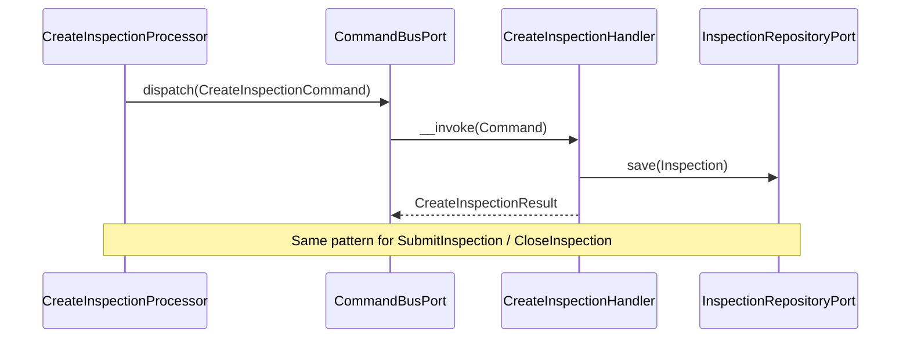
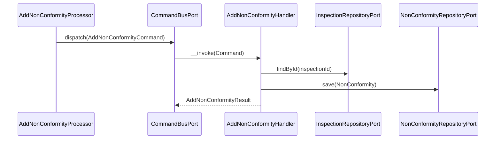
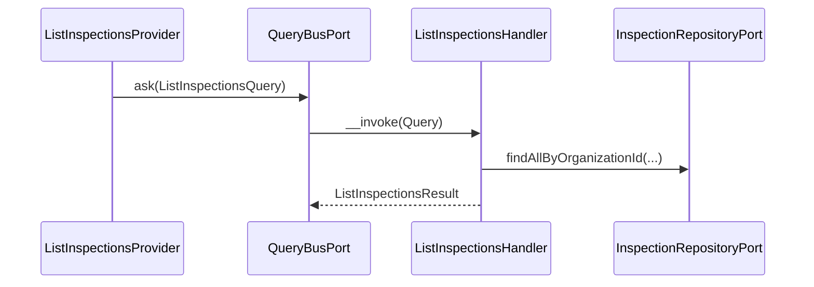

# Inspection Module

## Overview

Inspection manages the fire safety inspection lifecycle for an organization. It
covers three sub-domains: reusable checklist templates, actual inspection records
performed on equipment items, and non-conformity tracking for deficiencies found
during inspections.

Main goals:

- Record physical inspections with a controlled status machine (`draft → submitted → closed`).
- Provide reusable, versioned checklist templates that can be frozen (archived).
- Track deficiencies (non-conformities) from discovery through resolution.

## API Endpoints

### Inspections

| Method | Path | Description |
| --- | --- | --- |
| POST | `/api/organizations/{organizationId}/inspections` | Create inspection (starts as `draft`) |
| GET | `/api/organizations/{organizationId}/inspections` | List inspections (filters: `equipmentId`, `facilityId`, `result`, `status`, `performedAtFrom`, `performedAtTo`, `inspectorUserId`, `checklistId`) |
| GET | `/api/organizations/{organizationId}/inspections/{inspectionId}` | Get inspection |
| POST | `/api/organizations/{organizationId}/inspections/{inspectionId}/submit` | Submit inspection (`draft → submitted`) |
| POST | `/api/organizations/{organizationId}/inspections/{inspectionId}/close` | Close inspection (`submitted → closed`) |

### Checklists

| Method | Path | Description |
| --- | --- | --- |
| POST | `/api/organizations/{organizationId}/checklists` | Create checklist template |
| GET | `/api/organizations/{organizationId}/checklists` | List checklists (filter: `status`) |
| GET | `/api/organizations/{organizationId}/checklists/{checklistId}` | Get checklist |
| PATCH | `/api/organizations/{organizationId}/checklists/{checklistId}` | Partially update a checklist (name, referenceCode, items) |
| POST | `/api/organizations/{organizationId}/checklists/{checklistId}/archive` | Archive (freeze) checklist |

**L1.10 — reference code, item count, update endpoint (R-latest).**

- `referenceCode` — optional human-facing code (`CHK-EXT-Q`, max 40 chars),
  unique per organization when set (`checklists.reference_code`, unique index
  `uniq_checklist_organization_reference_code (organization_id,
  reference_code)`). Nullable and Postgres treats `NULL` as distinct, so any
  number of code-less checklists coexist. A duplicate code within the same
  organization surfaces as **409 Conflict**
  (`ChecklistReferenceCodeAlreadyExistsException`), detected by catching the
  unique constraint violation on save — mirrors
  `OrganizationSlugAlreadyExistsException` in the Organization module.
- `itemCount` — scalar item count, always present on `ChecklistOutput`.
- **Breaking change**: the `GetCollection` (list) response no longer ships
  each row's full `items` array (previously it did, so clients could count
  them client-side). List rows now expose `itemCount` only; fetch a single
  checklist (`GET .../{checklistId}`) for the full item list. Create/Get/Patch/
  Archive responses are unaffected and still return the full `items` array.
- **L1.10b — the list path is now genuinely count-only (fixed a latent
  regression in L1.10).** L1.10 shrank the wire response but never removed
  the underlying hydration: `ListChecklistsHandler` still built a
  `ChecklistItemResult` for every item of every checklist, and
  `ChecklistRepository::findByOrganizationId()` ran one extra
  `checklist_items` query **per row** (an N+1) just so the provider could
  discard it all down to `count($result->items)`. Fixed:
  - `ChecklistRepositoryPort::countItemsGroupedByChecklistId(ChecklistOrganizationId, list<string> $checklistIds): array<string, int>`
    — a single grouped DQL query over `checklist_items` inner-joined to
    `checklists`, filtered by `checklists.organization_id` and by the
    requested checklist IDs, `GROUP BY checklist_items.checklist_id`.
    Mirrors `Organization\...\OrganizationMemberRepository::countActiveMembersGroupedByRoleId()`.
    A checklist with zero items is simply absent from the returned map
    (callers default missing keys to `0`); a checklist from a different
    organization never contributes, even if its ID is included in the
    requested list.
  - `ChecklistRepository::findByOrganizationId()` no longer issues the
    per-row `checklist_items` query at all — list rows are mapped via
    `ChecklistMapper::toDomain($record, [])`, so `Checklist::items()` is
    empty for every row returned by the list path.
  - `ListChecklistsHandler` no longer builds `GetChecklistResult` /
    `ChecklistItemResult` for list rows. It returns
    `PaginatedResult<ListChecklistResult>`, a new lightweight per-row result
    (`Application\UseCase\Query\Checklist\ListChecklists\ListChecklistResult`)
    carrying `itemCount: int` instead of `items: list<ChecklistItemResult>`.
    `itemCount` comes from `countItemsGroupedByChecklistId()`, defaulted to
    `0` for checklists absent from the map (`$itemCounts[$checklistId] ?? 0`).
  - `ListChecklistsProvider::mapResult()` now just copies
    `$result->itemCount` onto `ChecklistOutput->itemCount` — no more
    `count($result->items)` over a throw-away hydration.
  - Unaffected: the single-GET path (`GetChecklistHandler` /
    `ChecklistRepository::findById()`) still hydrates and returns the full
    `items` array via `GetChecklistResult` — only the list path changed.
- **Update endpoint invariants**:
  - An **archived** checklist can never be edited (`ChecklistArchivedException`,
    422/409 depending on wrapping — mirrors the existing archive-on-archived
    mapping).
  - `Inspection` only stores a bare `InspectionChecklistId` foreign key to the
    checklist row — there is no per-inspection snapshot of the checklist's
    name/items, and `Checklist::items()` is mutated **in place** (the
    repository upserts by item ID and deletes items no longer present).
    Therefore, once a checklist is referenced by at least one existing
    inspection (any status — `countByOrganizationId(..., checklistId:
    ...)` > 0), attempting to change its **item list** is rejected with
    **409 Conflict** (`ChecklistInUseException`): mutating items in place
    would retroactively change how already-recorded inspection evidence
    (including free-form `InspectionResponse.itemKey` values, which are not
    FK-linked to `checklist_items.id`) is interpreted. `name` and
    `referenceCode` remain editable on an in-use checklist. To change the
    item set, create a new checklist.
  - No automatic `version` bump was implemented: `Checklist.version` is a
    plain label on the same mutable row, so bumping it would not by itself
    protect historical data (the row content changes regardless of what the
    label says) — it was rejected as false safety. Blocking structural item
    changes on in-use checklists is the actual protection; see
    `UpdateChecklistHandler` docblock.

### Non-Conformities

| Method | Path | Description |
| --- | --- | --- |
| POST | `/api/organizations/{organizationId}/inspections/{inspectionId}/non-conformities` | Record a deficiency |
| GET | `/api/organizations/{organizationId}/inspections/{inspectionId}/non-conformities` | List non-conformities for one inspection (filters: `severity`, `status`) |
| GET | `/api/organizations/{organizationId}/non-conformities` | List non-conformities across every inspection of an organization, newest first (filters: `severity`, `status`) — B7 |
| PATCH | `/api/organizations/{organizationId}/inspections/{inspectionId}/non-conformities/{id}/status` | Update non-conformity status |

**B7 — organization-wide non-conformity collection.**

The Compliance page needs a flat, paginated register of non-conformities
across all of an organization's inspections (newest first), not nested under
one inspection. `NonConformityResource` gained a second `GetCollection`
(`ListOrganizationNonConformitiesProvider` /
`ListOrganizationNonConformitiesHandler`), reusing the existing
`NonConformityOutput` DTO and the module's real `severity`
(`low`/`medium`/`high`/`critical`) and `status`
(`open`/`in_progress`/`done`/`waived`) enum values — the endpoint does not
introduce a "resolved" status; `done` and `waived` are the terminal states.

- Same permission and fail-closed shape as the per-inspection list:
  `organization.inspection.read`, checked in the provider via
  `OrganizationAuthorizationPort::hasPermission()` before the query bus is
  asked anything. Unlike the per-inspection list, the handler never resolves
  a single inspection's existence — organization scoping comes entirely from
  `NonConformityRepositoryPort::findByOrganizationId()`'s join to the
  inspection and organization records (mirrors
  `ListInspectionsHandler`/`InspectionRepositoryPort::findByOrganizationId()`).
- `NonConformityRepository::createOrganizationListQueryBuilder()` is a new
  private helper shared by `findByOrganizationId()` (new) and
  `countByOrganizationId()` (existing, refactored to use it) so the two can
  never drift on which rows they count versus return.
- Equipment: a non-conformity only stores its `inspectionId` — equipment
  belongs to the *inspection*. The handler batches
  `InspectionRepositoryPort::findEquipmentIdsByIds()` (new, one query
  resolving inspectionId → equipmentId for the whole page — mirrors
  `ChecklistRepositoryPort::findNamesByIds()`) then
  `EquipmentNamingPort::findSerialNumbersByIds()` (existing), so a page of
  30 rows costs three queries total, not thirty. `NonConformityOutput`
  gained nullable `equipmentId` / `equipmentSerialNumber` (same naming and
  null-when-unresolved contract as `InspectionOutput::$equipmentSerialNumber`);
  both stay `null` on the four pre-existing non-conformity endpoints, which
  do not resolve them.
- **No dedicated "reference/code" field exists on `NonConformity`.** The
  aggregate carries no ticket-style code (unlike `Checklist.referenceCode`,
  which is a real persisted, migrated column). Adding one would be a schema
  change and is out of scope here; the response's existing `id` is the only
  stable per-row identifier today. A future slice that wants a human-facing
  code needs its own migration (see `fg-api-migrations`).

### Attachments (R11b)

| Method | Path | Description |
| --- | --- | --- |
| POST | `/api/inspections/{inspectionId}/attachments` | Upload an inspection-level document |
| GET | `/api/inspections/{inspectionId}/attachments` | List an inspection's own documents (excludes non-conformity photos) |
| POST | `/api/non-conformities/{nonConformityId}/attachments` | Upload a non-conformity field-proof photo |
| GET | `/api/non-conformities/{nonConformityId}/attachments` | List a non-conformity's field-proof photos |
| GET | `/api/inspection-attachments/{id}` | Get one attachment (either kind) |
| DELETE | `/api/inspection-attachments/{id}` | Delete an attachment (requires `If-Match: "revision-N"`) |

Generalized file attachments mirroring the shared attachment kernel
(`src/Shared/MODULE.md`) and the proven `Equipment\...\EquipmentAttachment`
slice. **Single-table decision**: both inspection-level documents and
non-conformity field-proof photos (the photo *is* the evidence of the
deficiency) persist to one `inspection_attachments` table with a nullable
`non_conformity_id` discriminator, rather than two separate tables/aggregates.
Justification: a non-conformity always belongs to exactly one inspection, the
two kinds share every other column (file metadata, storage path, revision),
and callers already need "all photos for this inspection across its
non-conformities" as a natural superset query — a single table with the
discriminator keeps that trivial while `non_conformity_id IS NULL` cleanly
scopes the inspection-level-only listing.

- `Inspection\Domain\Model\Attachment\InspectionAttachment` aggregate carries
  an optional `nonConformityId`; `create()`/`reconstitute()` accept it as a
  nullable trailing parameter.
- `InspectionAttachmentRepositoryPort::findByInspectionId()` returns only
  `non_conformity_id IS NULL` rows (inspection-level); `findByNonConformityId()`
  returns only that non-conformity's photos. Both queries back the single
  `ListInspectionAttachments` use case (`ListInspectionAttachmentsQuery`
  carries an optional `nonConformityId`), which itself backs both `GET`
  endpoints above.
- `AddInspectionAttachment` similarly accepts an optional `nonConformityId`;
  when set, the handler verifies the non-conformity belongs to the target
  inspection (`NonConformityNotFoundException` otherwise) before persisting.
- `InspectionMediaProcessor` resolves the parent (inspection directly, or via
  the non-conformity's own `inspection` relation for the NC endpoint),
  enforces `organization.inspection.write`, validates the multipart upload
  through `Shared\Presentation\Api\Attachment\MultipartAttachmentGuard`, and
  dispatches through the command bus (write-then-persist with storage
  rollback on DB failure, mirroring `AddAttachmentHandler`). Delete removes
  the stored object then the row.
- Storage key: `inspection/{inspectionId}/attachments/{attachmentId}_{fileName}`
  for BOTH kinds (non-conformity photos reuse the inspection prefix — they
  belong to an inspection).
- No new permissions: reuses `organization.inspection.read` /
  `organization.inspection.write` for both inspection-level documents and
  non-conformity photos.

## Flows

### Create & Submit Inspection (Command)

### Add Non-Conformity (Command)

### List Inspections (Query)

## Domain Model

Aggregates and entities:

- `Inspection` — aggregate root for a physical inspection event
- `Checklist` — versioned template of items to verify
- `ChecklistItem` — a single named verification point within a checklist
- `NonConformity` — a deficiency found during an inspection

`Inspection` main fields:

- `id`
- `organizationId`
- `equipmentId`
- `inspector` (VO: `id` + `InspectorType`: `user` | `external`)
- `result` (`pass`, `fail`, `partial`)
- `status` (`draft`, `submitted`, `closed`)
- `facilityId` (optional)
- `equipmentSerialNumber`, `facilityName`, `checklistName` (read-only, resolved on read through
  `EquipmentNamingPort` / `FacilityNamingPort` / `ChecklistRepositoryPort::findNamesByIds`,
  batched once per listing). The checklist needs no port — it is this module's own aggregate. The module stores
  only identifiers; these exist because a UUID names nothing to the agent standing in front of
  the device. Both are deliberately separate from the validation ports — those throw, and a
  label lookup running on every list page must not go through a contract whose job is to
  reject writes. Null when unresolvable; consumers fall back to the identifier rather than
  render a blank.
- `checklistId` (optional)
- `notes`, `signature` (optional)
- `performedAt`

Status transitions:

- `draft` → `submitted` (submit)
- `submitted` → `closed` (close)

`NonConformity` main fields:

- `id`, `inspectionId`
- `severity` (`low`, `medium`, `high`, `critical`)
- `status` (`open`, `in_progress`, `done`, `waived`)
- Once `done` or `waived`, the non-conformity is immutable.
- **Waiving is gated by the org's four-eyes approval policy** (R17): when the
  target status is `waived`, `UpdateNonConformityStatusProcessor` consults
  `Approval\Application\Port\Inbound\ApprovalGatePort` (action type
  `nc_waiver`, payload includes the non-conformity's `severity`) BEFORE
  dispatching `UpdateNonConformityStatusCommand`. If the organization
  requires approval for this severity, the endpoint returns **HTTP 202**
  with a pending approval request summary instead of the usual
  `NonConformityOutput`, and the status is left unchanged until a second
  authorized member approves it. Approval defaults OFF (opt-in); see
  `src/Approval/MODULE.md`. `NonConformityWaiverExecutorAdapter`
  (`src/Inspection/Infrastructure/Adapter/Approval/`) re-dispatches the same
  command on approval — the Inspection Domain never references Approval.

`Checklist` main fields:

- `id`, `organizationId`, `name`, `version`
- `referenceCode` (optional, unique per organization) — see L1.10 above.
- `items` (`list<ChecklistItem>`)
- `status` (`active` | `archived`) — archived checklists cannot be used for new inspections.

## Persistence

- Tables: `inspections`, `checklists`, `checklist_items`, `non_conformities` (main database)
- Doctrine mapping: `src/Inspection/Infrastructure/Persistence/Doctrine/Record`
- Repository implementations: `Inspection\Infrastructure\Persistence\Doctrine\Repository`
- Table: `inspection_attachments` (main database, R11b) — `inspection_id` FK
  `ON DELETE CASCADE` (not null), `non_conformity_id` FK `ON DELETE CASCADE`
  (nullable discriminator — see Attachments above), unique `storage_path`,
  `revision` (ETag). Migration: `migrations/main/Version20260717111309.php`
  (shared across the three R11b attachment tables). Repository:
  `Inspection\Infrastructure\Persistence\Doctrine\Repository\InspectionAttachmentRepository`.
  Object cleanup on hard parent delete is deferred (same accepted gap as
  `equipment_attachments`) since inspections are terminal via `closed`/
  `cancelled`, not hard-deleted.

## Architecture

- Presentation: Api Platform resources, providers, processors, DTOs.
- Application: Use cases (command/query), repository ports.
- Domain: Inspection, Checklist, NonConformity aggregates, value objects, domain exceptions.
- Infrastructure: Doctrine record/mapper/repository.

Key folders:
- `src/Inspection/Presentation/Api`
- `src/Inspection/Application/UseCase`
- `src/Inspection/Domain`
- `src/Inspection/Infrastructure`

Cross-module contracts and lifecycle invariants:

- The inspection lifecycle is `draft -> submitted -> closed`, plus the logical
  annulment `draft/submitted -> cancelled` (non-conformities preserved). Both
  `closed` and `cancelled` are terminal and immutable on every write surface
  (canonical PATCH, intervention `apply()`).
- Canonical DELETE = cancel — never force-close. Idempotent: a repeat DELETE on
  a cancelled inspection is a no-op; deleting a `closed` inspection is refused
  (HTTP 409). Cancellation goes through the DELETE verb: the canonical PATCH does
  not accept `cancelled`.
- `Inspection\Infrastructure\Adapter\Facility\FacilityInspectionDependencyAdapter`
  implements Facility's archival dependency port (in-progress = published
  draft/submitted).
- **Equipment KPI's open-non-conformity counter (L2.11)**:
  `Inspection\Infrastructure\Adapter\Equipment\EquipmentNonConformityStatisticsAdapter`
  implements the Equipment module's
  `Equipment\Application\Port\Outbound\NonConformityStatisticsPort` — a
  single method, `countOpenNonConformities(organizationId)`, deliberately
  ORGANIZATION-WIDE (non-conformities attach to inspections, not to
  equipment, so no per-equipment aggregate exists). The adapter composes two
  already-tested `NonConformityRepositoryPort::countByOrganizationId()` calls
  (`open` + `in_progress`) rather than introducing new DQL, mirroring the
  "open" status grouping already used by
  `InspectionComplianceStatisticsAdapter::OPEN_STATUSES` and
  `NonConformityRepositoryPort::countOverdueByOrganizationId()`'s default.
  See `src/Equipment/MODULE.md`'s L2.11 section.
- **Calendar unified feed**:
  `Inspection\Infrastructure\Adapter\Calendar\InspectionCalendarFeedAdapter`
  implements the Calendar module's
  `Calendar\Application\Port\Outbound\Feed\InspectionCalendarFeedPort`
  (`findBetween(organizationId, from, to, limit)`), reusing
  `InspectionRepositoryPort::findByOrganizationId()` (already filters to
  `recordStatus = 'published'`, and already supports the `performedAt`
  range + sort + hard-limit needed here) rather than a new query. Registered
  in `config/modules/inspection.yaml`; aliased in
  `config/modules/calendar.yaml`. See `src/Calendar/MODULE.md`.
- **Assistant business-context provider (L2.2)**:
  `Inspection\Infrastructure\Adapter\Assistant\InspectionAssistantContextProviderAdapter`
  implements the Assistant module's `assistant.context_provider` tagged-
  iterator seam (`Assistant\Application\Port\Outbound\AssistantContextProviderPort`
  — see `src/Assistant/MODULE.md`), feeding the mockup's "List the open
  non-conformities" suggestion. `supports()` gates on
  `organization.inspection.read`
  (`OrganizationAuthorizationPort::hasPermission()`, non-throwing). `provide()`
  composes the exact open+in-progress TOTAL from the already-tested
  `NonConformityRepositoryPort::countOverviewByOrganizationId()` with up to 8
  individual rows (description, severity, status, due date) from a
  DEDICATED DQL query directly against `NonConformityRecord` — no
  equivalent exists on the repository port, the same treatment
  `InspectionComplianceStatisticsAdapter` gives its own cross-module read
  model — ordered most-severe-first via a portable searched `CASE WHEN`
  (never a platform-specific `NULLS LAST`), then soonest-due, then oldest.
  Never throws (an internal failure returns
  `AssistantContextFragment::empty()`). Registered + tagged (`priority: 20`)
  in `config/modules/inspection.yaml`; Assistant's own `config/modules/assistant.yaml`
  is never touched to add this source. **This is the only one of the three
  L2.2 launch providers with genuinely new DQL** — see Testing below for the
  dedicated integration test that executes it for real (never mocks the
  QueryBuilder).
- Regulated actions emit domain events (`src/Inspection/Domain/Event/`)
  recorded in the audit ledger by Audit's `AuditEventSubscriber`:
  `inspection.submitted` / `closed` / `cancelled` and
  `inspection.non_conformity_recorded` / `non_conformity_status_changed`
  (same-status updates are no-ops and emit nothing).
  Emission sites: the Submit/Close/Cancel/AddNC/UpdateNCStatus handlers and
  the canonical processor (published records only — drafts are intervention
  scratchpads and never emit; the intervention `apply()` path is deferred to
  the `intervention.published` audit action because it runs inside the
  publication transaction while the ledger commits on the auth database).
  The canonical processor COLLECTS its events during the mutation and
  dispatches them only after `wrapInTransaction` commits, so a rollback can
  never leave a phantom row in the append-only ledger. The lifecycle
  commands (submit/close/cancel) load through
  `InspectionRepositoryPort::findPublishedById`, so draft scratchpads are
  not reachable (nor auditable) through the classic endpoints. A `result`
  edit on a published submitted inspection is deliberately not a dedicated
  audit action: the `submitted` and `closed` events both carry the result,
  bracketing any interim change.

## Configuration

- Service wiring: `config/modules/inspection.yaml`
- Doctrine mapping (main entity manager): `config/packages/doctrine.yaml`
- `Equipment\Application\Port\Outbound\NonConformityStatisticsPort`'s adapter
  (`EquipmentNonConformityStatisticsAdapter`) is aliased here — see L2.11 above.

## Error Codes

- `InspectionNotFoundException` → 404
- `InspectionAlreadySubmittedException` → 422
- `InspectionAlreadyClosedException` → 422
- `InspectionNotSubmittedException` → 422 (close attempted before submit)
- `ChecklistNotFoundException` → 404
- `ChecklistArchivedException` → 409 (archive-on-archived and update-on-archived both map to Conflict)
- `ChecklistInUseException` → 409 (item change rejected: checklist referenced by an existing inspection)
- `ChecklistReferenceCodeAlreadyExistsException` → 409 (duplicate reference code within the organization)
- `NonConformityNotFoundException` → 404
- `NonConformityAlreadyResolvedException` → 422

## Testing

- Unit: `tests/Unit/Inspection/`
  - `Application/UseCase/Command/Attachment/{Add,Delete}InspectionAttachment`,
    `Application/UseCase/Query/Attachment/ListInspectionAttachments` — both
    inspection-level and non-conformity-scoped flows, non-conformity/inspection
    mismatch rejection, storage rollback on DB failure.
  - `Presentation/Api/Processor/Attachment/InspectionMediaProcessorTest`,
    `Presentation/Api/Provider/Attachment/InspectionMediaProviderTest` —
    both upload/list routes, permission enforcement, revision guard on delete.
  - `Domain/Model/Checklist/ChecklistTest` — reference code normalization
    (trim/blank-to-null/length), `update()` partial semantics, archived
    rejection.
  - `Application/UseCase/Command/Checklist/UpdateChecklist/UpdateChecklistHandlerTest`
    — not-found/org-mismatch, archived rejection, `ChecklistInUseException`
    when items change on a checklist already referenced by an inspection,
    item replacement when unreferenced, duplicate reference code mapped
    from `UniqueConstraintViolationException`.
  - `Presentation/Api/Processor/Checklist/UpdateChecklistProcessorTest` —
    PATCH "no field provided" rejection, dispatch + re-fetch round trip,
    conflict mapping for archived/in-use/duplicate-code, messenger unwrap.
  - `Application/UseCase/Query/Checklist/ListChecklists/ListChecklistsHandlerTest`
    (L1.10b) — `itemCount` sourced from `countItemsGroupedByChecklistId()`,
    including the "checklist absent from the grouped-query map" case
    defaulting to `0`; empty result page.
  - `Presentation/Api/Provider/Checklist/ListChecklistsProviderTest` —
    updated for L1.10b: the mocked query bus now returns `ListChecklistResult`
    (not `GetChecklistResult`/`ChecklistItemResult`), pinning that
    `ChecklistOutput->itemCount` is copied straight from `itemCount` and
    `ChecklistOutput->items` stays empty on the list path.
  - `Infrastructure/Adapter/Equipment/EquipmentNonConformityStatisticsAdapterTest`
    (L2.11) — sums the `open` + `in_progress` counts from a mocked
    `NonConformityRepositoryPort` (no new DQL, so no new integration test is
    needed here).
  - `Infrastructure/Adapter/Assistant/InspectionAssistantContextProviderAdapterTest`
    (L2.2) — `supports()` on/off the permission gate, and `provide()`
    degrading to an empty fragment when the repository throws. Deliberately
    does NOT mock the QueryBuilder/DQL — see the integration test below.
- Integration (real database):
  `tests/Integration/Inspection/Infrastructure/Adapter/Assistant/InspectionAssistantContextProviderAdapterTest`
  (L2.2) — executes the adapter's DQL for real: severity ordering
  (critical → high → low), resolved (`done`)/foreign-organization rows
  excluded, and the symmetric case (the foreign-org row IS reported when
  queried from ITS OWN organization) — pinning that organization-scoping
  comes from the query's join, never from trusting the caller.
  `tests/Integration/Inspection/Infrastructure/Persistence/Doctrine/Repository/InspectionAttachmentRepositoryTest`
  (round-trip of both discriminator states, `findByInspectionId` excludes
  non-conformity photos).
  `tests/Integration/Inspection/Infrastructure/Persistence/Doctrine/Repository/ChecklistRepositoryIntegrationTest`
  (L1.10b) — executes `countItemsGroupedByChecklistId()` for real: an
  in-organization checklist with items is counted, a zero-item checklist is
  absent from the map, and a foreign-organization checklist never
  contributes even when its ID is explicitly included in the requested list
  (organization-scoping is enforced by the join, not by trusting the
  caller's ID list). Also pins that `findByOrganizationId()` returns
  checklists with an empty `items()` (no per-row hydration).
  `Application/UseCase/Query/NonConformity/ListOrganizationNonConformities/ListOrganizationNonConformitiesHandlerTest`
  (B7) — org-scoped filters/pagination/sorting passed through, equipment
  batching via `findEquipmentIdsByIds()` + `EquipmentNamingPort`, unresolved
  equipment/serial degrading to `null`, empty page.
  `Presentation/Api/Provider/NonConformity/ListOrganizationNonConformitiesProviderTest`
  (B7) — authentication/permission gating, filter passthrough, pagination
  envelope.
- Functional: `tests/Functional/Api/InspectionAttachmentApiTest.php`,
  `tests/Functional/Api/InspectionApiTest.php` (checklist endpoints, including
  `PATCH .../checklists/{id}`, and B7's
  `GET /organizations/{organizationId}/non-conformities`).
- Run module tests: `make test tests/Unit/Inspection/`
