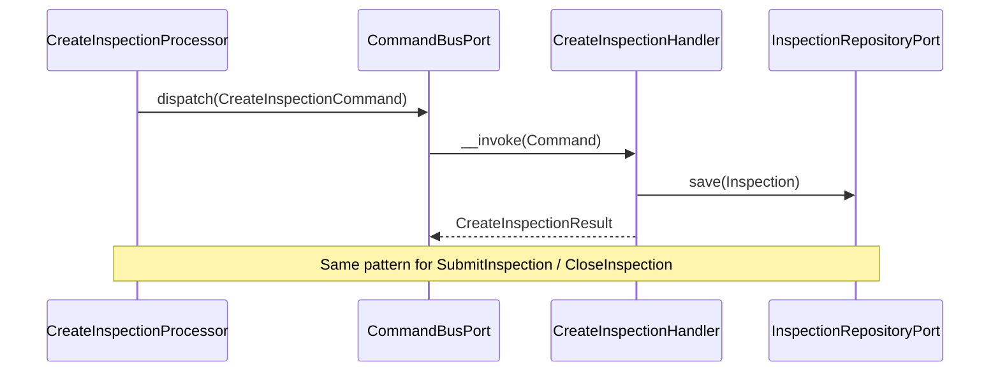
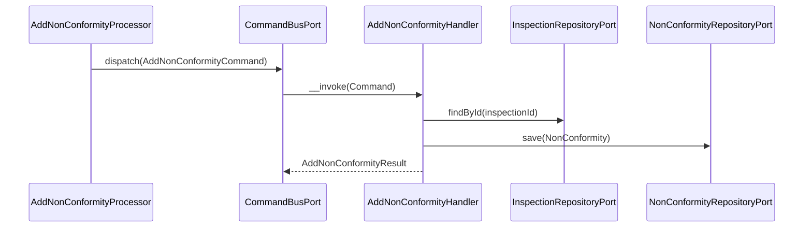
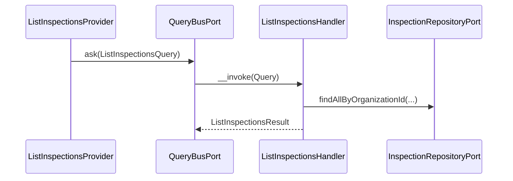

# Inspection Module

## Overview

Inspection manages the fire safety inspection lifecycle for an organization. It
covers three sub-domains: reusable checklist templates, actual inspection records
performed on equipment items, and non-conformity tracking for deficiencies found
during inspections.

Main goals:

- Record physical inspections with a controlled status machine (`draft → submitted → closed`).
- Provide reusable, versioned checklist templates that can be frozen (archived).
- Track deficiencies (non-conformities) from discovery through resolution.

## API Endpoints

### Inspections

| Method | Path | Description |
| --- | --- | --- |
| POST | `/api/organizations/{organizationId}/inspections` | Create inspection (starts as `draft`) |
| GET | `/api/organizations/{organizationId}/inspections` | List inspections (filters: `equipmentId`, `facilityId`, `result`, `status`) |
| GET | `/api/organizations/{organizationId}/inspections/{inspectionId}` | Get inspection |
| POST | `/api/organizations/{organizationId}/inspections/{inspectionId}/submit` | Submit inspection (`draft → submitted`) |
| POST | `/api/organizations/{organizationId}/inspections/{inspectionId}/close` | Close inspection (`submitted → closed`) |

### Checklists

| Method | Path | Description |
| --- | --- | --- |
| POST | `/api/organizations/{organizationId}/checklists` | Create checklist template |
| GET | `/api/organizations/{organizationId}/checklists` | List checklists (filter: `status`) |
| GET | `/api/organizations/{organizationId}/checklists/{checklistId}` | Get checklist |
| POST | `/api/organizations/{organizationId}/checklists/{checklistId}/archive` | Archive (freeze) checklist |

### Non-Conformities

| Method | Path | Description |
| --- | --- | --- |
| POST | `/api/organizations/{organizationId}/inspections/{inspectionId}/non-conformities` | Record a deficiency |
| GET | `/api/organizations/{organizationId}/inspections/{inspectionId}/non-conformities` | List non-conformities (filters: `severity`, `status`) |
| PATCH | `/api/organizations/{organizationId}/inspections/{inspectionId}/non-conformities/{id}/status` | Update non-conformity status |

## Flows

### Create & Submit Inspection (Command)

### Add Non-Conformity (Command)

### List Inspections (Query)

## Domain Model

Aggregates and entities:

- `Inspection` — aggregate root for a physical inspection event
- `Checklist` — versioned template of items to verify
- `ChecklistItem` — a single named verification point within a checklist
- `NonConformity` — a deficiency found during an inspection

`Inspection` main fields:

- `id`
- `organizationId`
- `equipmentId`
- `inspector` (VO: `id` + `InspectorType`: `user` | `external`)
- `result` (`pass`, `fail`, `partial`)
- `status` (`draft`, `submitted`, `closed`)
- `facilityId` (optional)
- `checklistId` (optional)
- `notes`, `signature` (optional)
- `performedAt`

Status transitions:

- `draft` → `submitted` (submit)
- `submitted` → `closed` (close)

`NonConformity` main fields:

- `id`, `inspectionId`
- `severity` (`low`, `medium`, `high`, `critical`)
- `status` (`open`, `in_progress`, `done`, `waived`)
- Once `done` or `waived`, the non-conformity is immutable.

`Checklist` main fields:

- `id`, `organizationId`, `name`, `version`
- `items` (`list<ChecklistItem>`)
- `status` (`active` | `archived`) — archived checklists cannot be used for new inspections.

## Persistence

- Tables: `inspections`, `checklists`, `checklist_items`, `non_conformities` (main database)
- Doctrine mapping: `src/Inspection/Infrastructure/Persistence/Doctrine/Record`
- Repository implementations: `Inspection\Infrastructure\Persistence\Doctrine\Repository`

## Architecture

- Presentation: Api Platform resources, providers, processors, DTOs.
- Application: Use cases (command/query), repository ports.
- Domain: Inspection, Checklist, NonConformity aggregates, value objects, domain exceptions.
- Infrastructure: Doctrine record/mapper/repository.

Key folders:
- `src/Inspection/Presentation/Api`
- `src/Inspection/Application/UseCase`
- `src/Inspection/Domain`
- `src/Inspection/Infrastructure`

## Configuration

- Service wiring: `config/modules/inspection.yaml`
- Doctrine mapping (main entity manager): `config/packages/doctrine.yaml`

## Error Codes

- `InspectionNotFoundException` → 404
- `InspectionAlreadySubmittedException` → 422
- `InspectionAlreadyClosedException` → 422
- `InspectionNotSubmittedException` → 422 (close attempted before submit)
- `ChecklistNotFoundException` → 404
- `ChecklistArchivedException` → 422
- `NonConformityNotFoundException` → 404
- `NonConformityAlreadyResolvedException` → 422

## Testing

- Unit: `tests/Unit/Inspection/`
- Run module tests: `make test tests/Unit/Inspection/`
