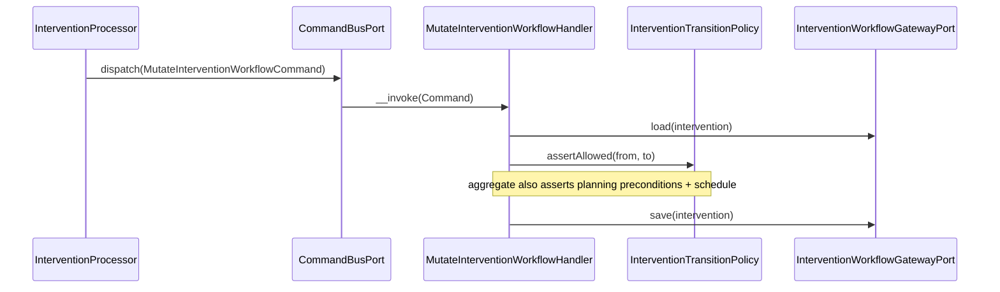

# Intervention Module

## Overview

Intervention coordinates organization-scoped **field interventions**: the workflow
that takes a fire-safety operation from `draft` to `published`, producing real
facilities, equipment and inspections only when the intervention is published.

An intervention is a **staged workspace**. While it is being prepared and executed
it holds *draft* operational resources (work items describing facilities/equipment
to create, inspections to run) and *proposed changes*. Publication is an atomic,
asynchronous step that either fully materializes those drafts into the owning
modules (Facility, Equipment, Inspection) or leaves every record untouched.

Main goals:

- Drive an intervention through a controlled status machine
  (`draft → planned → in_progress → submitted → changes_requested → published`,
  plus `abandoned`) with strong aggregate invariants.
- Hold draft work items and proposed changes off to the side until review.
- Surface blocking **issues** (validation) before publication.
- Publish atomically and asynchronously through a message queue, materializing
  draft resources into Facility / Equipment / Inspection via outbound ports.

## API Endpoints

All paths are prefixed with `/api`. Interventions are organization-scoped through
the required `organization` query parameter on the collection (not a nested URI).
Every operation requires `ROLE_USER`; finer-grained membership/permission checks
are enforced in the application layer (`InterventionMemberPolicy`).

### Interventions

| Method | Path | Description |
| --- | --- | --- |
| POST | `/interventions` | Create intervention (starts as `draft`) |
| GET | `/interventions` | List (filters: `organization` *(required)*, `name` *(trigram, partial, case-insensitive)*, `responsible`, `participant`, `member` *(responsible OR participant)*, `type`, `status`, `priority` *(400 on an unknown value)*, `site`, `label`, `responsible` — these six accept **repeated values** (`status[]=draft&status[]=planned`, OR-combined per filter via `IN()`; the single scalar form stays accepted), `number` *(exact match; accepts an optional case-insensitive `FG-` prefix; 400 unless the remainder is a positive integer)*, `dueAtAfter`, `dueAtBefore`, `plannedStartAtAfter`, `plannedStartAtBefore`, `due=overdue` *(shortcut restricting to `dueAt` in the past AND status not in `InterventionStatus::closedValues()` i.e. not `published`/`abandoned` — the exact definition `GET /interventions/statistics`'s `overdue` count uses; composes with `dueAtAfter`/`dueAtBefore`; 400 on any other value)*; sortable on `name`, `status`, `type`, `priority`, `plannedStartAt`, `dueAt`, `createdAt`, `updatedAt` via `order[field]`, default `updatedAt DESC`; 30/page, client page size) |
| GET | `/interventions/{id}` | Get intervention |
| PATCH | `/interventions/{id}` | Update fields and/or apply a **status transition** (`status`) |
| PUT | `/interventions/{id}` | Upsert (offline replay path; `201`) |
| DELETE | `/interventions/{id}` | Delete intervention |
| GET | `/interventions/{id}/issues` | List computed validation issues (blocker/warning/recommendation) |

### Work items (draft scope)

| Method | Path | Description |
| --- | --- | --- |
| POST | `/intervention-work-items` | Add a work item to an intervention |
| GET | `/intervention-work-items` | List (filters: `intervention` *(required)*, `assignee`, `source`, `action`, `status`) |
| GET | `/intervention-work-items/{id}` | Get work item |
| PATCH | `/intervention-work-items/{id}` | Update work item (status: `planned → in_progress → completed`/`skipped`) |
| PUT | `/intervention-work-items/{id}` | Upsert (offline replay path; `201`) |
| DELETE | `/intervention-work-items/{id}` | Delete work item |

### Proposed changes (review)

| Method | Path | Description |
| --- | --- | --- |
| POST | `/intervention-changes` | Propose a change to an existing resource |
| GET | `/intervention-changes` | List (filters: `intervention` *(required)*, `resource`, `status`) |
| GET | `/intervention-changes/{id}` | Get change |
| PATCH | `/intervention-changes/{id}` | Update change status (`proposed → rejected` only — `applied` is set exclusively by the publication worker, never through this endpoint) |
| PUT | `/intervention-changes/{id}` | Upsert (offline replay path; `201`) |
| DELETE | `/intervention-changes/{id}` | Delete change |

### Publication (async)

| Method | Path | Description |
| --- | --- | --- |
| POST | `/publications` | Request publication of an intervention (`202 Accepted`, queued) |
| GET | `/publications/{id}` | Poll publication status (pending → succeeded/failed) |

### Activity feed (comments + system events)

| Method | Path | Description |
| --- | --- | --- |
| GET | `/interventions/{interventionId}/activities` | List the intervention's activity feed, oldest first (30/page, client page size) |
| POST | `/interventions/{interventionId}/comments` | Add a member comment to the intervention |

System activities (`created`, `status_changed`) are recorded automatically by
the workflow gateway inside the same transaction as the underlying mutation —
there is no direct write endpoint for them. `InterventionOutput.commentsCount`
exposes the running comment count on the intervention itself.

**Mentions**: comment bodies may contain `@{memberUuid}` tokens (a plain-text
form that survives rich-text sanitization). After the comment is persisted,
each mentioned member — deduplicated, author excluded — is notified
best-effort (`intervention.comment_mention`) through
`InterventionNotificationService::mentioned()`, which verifies the member is
active AND belongs to the intervention's organization (the ids come from user
input) and delivers in-app + email, each channel honoring its own
organization toggle.

### Labels

| Method | Path | Description |
| --- | --- | --- |
| POST | `/intervention-labels` | Create a label (`organization`, `name`, `color`) |
| GET | `/intervention-labels` | List an organization's labels (filter: `organization` *(required)*; ordered `name ASC`; 30/page, client page size) |
| PATCH | `/intervention-labels/{id}` | Update `name` and/or `color` |
| DELETE | `/intervention-labels/{id}` | Delete a label |

Labels are small, reusable `{name, color}` organization-scoped tags
(`name` ≤ 50 chars, `color` a `#rrggbb` hex string), unique per
`(organization, name)` — a duplicate name yields `409 Conflict`. Interventions
carry a `labelIds` array (uuids) on create/update (`CreateInterventionInput`,
`UpdateInterventionInput`); `PATCH` replaces the full assigned set when the
field is present in the merge-patch body. Assigning a label from another
organization is rejected with `422`. Labels are metadata editable in any
non-terminal intervention status (blocked only when `published`/`abandoned`,
via the same `assertMutable` path as other edits) — they are **not** subject
to the `draft`-only planning freeze. `InterventionOutput.labels` exposes the
assigned set as embedded `{id, name, color}` summaries (not IRIs) for
rendering chips without extra requests. Deleting a label removes its
assignments but never the interventions it was attached to.

### Templates

| Method | Path | Description |
| --- | --- | --- |
| POST | `/intervention-templates` | Create a template (`organization`, `name`, `type`, `priority`, defaults, `duration`, `labelIds`, `items`) |
| GET | `/intervention-templates` | List an organization's templates (filters: `organization` *(required)*, `search`; ordered `name ASC`; 30/page, client page size) |
| GET | `/intervention-templates/{id}` | Get a template |
| PATCH | `/intervention-templates/{id}` | Update fields; `labelIds` and `items` are replaced wholesale when present |
| DELETE | `/intervention-templates/{id}` | Delete a template |
| POST | `/intervention-templates/{id}/instantiate` | Instantiate a template into a real intervention draft (`201`, `{interventionId, number}`) |

Templates (Lot 3; recurring instantiation added in Lot 6 — see the
Recurrences section below) are reusable organization-scoped blueprints for
creating interventions: `name` (2–160
chars, unique per organization — a duplicate yields `409 Conflict`),
`description`, `type` (`InterventionType`), `priority` (`InterventionPriority`,
default `normal`), `defaultSiteId`, `defaultResponsibleId`, `duration` (an
ISO-8601 duration string, e.g. `P14D`, used to derive `dueAt` from
`plannedStartAt` at instantiation), `labelIds`, and an ordered list of `items`
(`action` 1–60 chars, `target`, `resultResource`, `required`,
`defaultAssigneeId`), each seeded as a planned work item on instantiation.
Like labels, templates (`InterventionTemplateRecord` /
`InterventionTemplateItemRecord`) are record-level entities behind
`InterventionTemplatePort` / `DoctrineInterventionTemplateAdapter` — **not**
part of the `Intervention` domain aggregate. Reads require
`organization.interventions.read`; create/update/delete and instantiation
require `organization.interventions.plan` (the "prepare and assign"
permission — distinct from the labels' `organization.interventions.write`).

`POST /intervention-templates/{id}/instantiate` accepts optional overrides
(`name`, `site`, `responsible`, `plannedStartAt`) and always routes through
`InterventionDraftFactoryPort` (`InstantiateInterventionTemplateHandler`) —
the same single programmatic draft-creation path used by other automations —
with `origin: 'intervention:template'`. Before building the draft request the
handler:

- re-validates `defaultResponsibleId` and each item's `defaultAssigneeId`
  against current organization membership, **silently dropping** (never
  blocking) a reference to a member who is no longer active, since a template
  is a reusable blueprint that may outlive the people it once referenced;
- filters `labelIds` down to labels that still exist and still belong to the
  organization, since workflow gateway label resolution rejects unknown ids
  outright;
- derives `dueAt = plannedStartAt + duration` (as a `DateInterval`) only when
  both are present;
- maps `items` to draft work items in position order.

### Recurrences

| Method | Path | Description |
| --- | --- | --- |
| POST | `/intervention-recurrences` | Create a recurrence against an existing template (`organization`, `template`, `name`, `site`, `responsible`, `frequency`, `interval`, `anchorDate`, `timezone`, `leadTimeDays`, `endAt`) |
| GET | `/intervention-recurrences` | List an organization's recurrences (filters: `organization` *(required)*, `isActive`; ordered `name ASC`; 30/page, client page size) |
| GET | `/intervention-recurrences/{id}` | Get a recurrence |
| PATCH | `/intervention-recurrences/{id}` | Update fields (merge-patch); includes the `isActive` toggle |
| DELETE | `/intervention-recurrences/{id}` | Delete a recurrence |

A recurrence (Lot 6) periodically re-instantiates an intervention template on
a schedule: `frequency` (`weekly` | `monthly` | `quarterly` | `semiannual` |
`annual`) multiplied by an `interval` count (e.g. "every 2 months"), anchored
to `anchorDate` and evaluated in the recurrence's own `timezone` (IANA
identifier). `leadTimeDays` (0–90, default 7) is how many days before an
occurrence it becomes due for materialization — the recurring sweep selects
recurrences where `next_occurrence_at - lead_time_days <= now`. `site` and
`responsible` are optional overrides of the template's own defaults, applied
only for occurrences this recurrence materializes. Reads require
`organization.interventions.read`; writes require
`organization.interventions.plan` — the same permissions as templates.
Creating a recurrence computes the initial `next_occurrence_at =
rule.nextAfter(now)`; updating any rule-affecting field (`frequency`,
`interval`, `anchorDate`, `timezone`) recomputes it the same way. The
template must belong to the same organization as the recurrence.

`RecurrenceRule` (`Domain/ValueObject`) is persisted as discrete columns
(`frequency`, `interval_count`, `anchor_date`) — never a freeform rrule
string; `intervention_recurrences.rrule` is a nullable column reserved for a
future expression syntax and is never read today. `RecurrenceRule::nextAfter()`
walks forward from the anchor date by repeatedly adding one step of the rule
(weekly: whole weeks; every other frequency: whole calendar months) until it
lands strictly after the given instant. The month-based frequencies add
calendar months through PHP's native `DateInterval`, which does **not** clamp
end-of-month overflow (e.g. adding one month to January 31st, 2026 overflows
into March 3rd rather than clamping to February 28th) — and because each
step is added onto the *previous* cursor, not re-derived from the anchor day,
an end-of-month anchor permanently drifts after the first short month it
crosses. This is documented, tested behavior, not a bug.

#### Recurring materialization sweep

`Infrastructure/Scheduler/InterventionScheduleProvider` (`#[AsSchedule('intervention')]`)
triggers `MaterializeDueRecurrencesCommand` hourly, consumed from the
`scheduler_intervention` transport the Scheduler component registers
automatically (DSN `schedule://intervention`) — run
`messenger:consume scheduler_intervention` alongside the existing `async`
worker (mirrors the Maintenance module's sweep exactly).
`MaterializeDueRecurrencesHandler` is idempotent and processes every due
recurrence page-wise:

1. Pages through active recurrences whose lead-time window has opened
   (`InterventionRecurrencePort::pageDueForMaterialization`).
2. For each, idempotently claims the `(recurrence, occurrence date)` pair
   FIRST (`reserveRun`) — a unique constraint on
   `intervention_recurrence_runs (recurrence_id, occurrence_date)` is the
   guard, so a Messenger retry or an overlapping sweep tick can never
   materialize the same occurrence twice; a claim miss (`null`) skips the
   recurrence entirely for this tick.
3. Materializes the draft through `InterventionTemplateInstantiator` — the
   same shared core `InstantiateInterventionTemplateHandler` uses — with
   `origin: 'intervention:recurrence'`, a system actor (`actorUserId: null`),
   `plannedStartAt` set to the occurrence instant, and the recurrence's own
   `siteId`/`responsibleId` as overrides.
4. On success: the run is marked `succeeded` with the created intervention
   id, `next_occurrence_at` advances to `rule.nextAfter(occurrence)`, and
   `last_materialized_at` is set.
5. On failure (site archived, template deleted, ...): the run is marked
   `failed` with the error, `next_occurrence_at` still advances (no infinite
   retry on a permanently broken occurrence), and the recurrence's
   responsible member — or the organization's administrators as a fallback
   (`InterventionRecurrenceRecipientResolver`, mirroring
   `MaintenanceReminderRecipientResolver`) — is notified best-effort
   (`intervention.recurrence_failed`) via `InterventionRecurrenceNotifier`.

Every processed occurrence (success or failure) also dispatches
`intervention.recurrence_materialized` for the audit ledger, with a system
actor.

The reservation step (`reserveRun`) deliberately uses a raw DBAL statement
rather than the ORM's `persist()`/`flush()`: the sweep processes many
recurrences per request, and a unique-constraint violation raised during an
ORM `flush()` closes the `EntityManager` for the rest of the request (see
`DoctrinePublicationAdapter::markFailed()`'s `isOpen()` fallback for the same
concern) — a duplicate occurrence claim is an expected, routine outcome
here, not an exceptional one.

#### Due-date reminder sweep

`Infrastructure/Scheduler/InterventionScheduleProvider` also triggers
`SendDueRemindersCommand` hourly, alongside the recurrence sweep, on the same
`scheduler_intervention` transport (DSN `schedule://intervention`) and the
same stateful/lock-guarded schedule. `SendDueRemindersHandler` is idempotent
and processes every candidate page-wise, mirroring
`MaterializeDueRecurrencesHandler`'s pagination:

1. Pages through interventions in statuses where field work is still
   expected — `planned`, `in_progress`, `changes_requested` (not `draft`,
   which is not yet scheduled, nor `submitted`/`published`/`abandoned`,
   which no longer need action) — whose `dueAt` is within 48 hours
   (`intervention.due_soon`) or already past (`intervention.overdue`)
   (`InterventionReminderPort::pageDueSoon` / `pageOverdue`).
2. For each candidate, notifies the responsible member and every participant
   — deduplicated — through `InterventionNotificationService::dueSoon()` /
   `overdue()` (in-app + email, each channel honoring its own organization
   toggle, mirroring `submitted()`); a candidate member id is re-validated as
   active and in-organization before delivery, the same check `mentioned()`
   applies to a member id sourced outside the mutation that owns it.
3. Immediately stamps the anti-spam guard
   (`InterventionReminderPort::markDueSoonNotified` /
   `markOverdueNotified`) — **one notification per threshold per
   intervention**: a candidate is only selected while its stamp is `null`, so
   a repeat sweep tick never re-announces the same threshold for the same
   `dueAt`.

The stamps (`interventions.due_soon_notified_at`,
`interventions.overdue_notified_at`) are reset to `null` whenever `dueAt` is
rescheduled — `DoctrineInterventionWorkflowGatewayAdapter::updateIntervention`
clears both the moment it detects `dueAt` changed, so a reminder already sent
against the old date never suppresses one for the new date. Every page is
processed independently to keep memory bounded.

### Team assignment (R9)

| Method | Path | Description |
| --- | --- | --- |
| POST | `/interventions/{id}/team-assignments` | Snapshot-expand an Organization team's active members into the intervention's participants |

`AssignInterventionTeamInput{teamId}` → `AssignTeamToInterventionHandler`
resolves the intervention's context (organization, current `participants`)
through the existing `InterventionWorkflowGatewayPort`, checks
`organization.interventions.plan` (the same "prepare and assign" permission
templates/recurrences use), then reads the team's CURRENT active member ids
through Organization's inbound `Organization\Application\Port\Inbound\TeamDirectoryPort`
(`listActiveMemberIds`) — consumed directly cross-module, exactly like
`OrganizationAuthorizationPort`; no new Organization adapter, no Intervention
Domain change. The union of the existing `participants` and the team's
active member ids (deduplicated) is applied through the **existing**
`MutateInterventionWorkflowCommand` (`resource: 'intervention', action: 'update'`,
`payload: ['participants' => ...]`), so numbering, activities, ETag/revision
bumps, and the planning freeze (`Intervention::assertPlanningMutable`) all
apply identically to a manual participants edit: the assignment is only
possible while the intervention is `draft`, otherwise it fails the same way
a manual participants PATCH would (`409 Conflict`). An empty team (no
active members) is rejected with `422 Unprocessable Entity` rather than
silently no-op'ing.

This is a deliberate **snapshot**, not a dynamic/live binding: expansion
happens once, at assignment time. A later team-membership change never
mutates an already-assigned intervention — this keeps behavior
deterministic under the offline/ETag optimistic-concurrency replay model.
Persisting an `assignedTeamId` on interventions for later filtering was
considered and intentionally deferred (would need an Intervention-table
migration and introduce a cross-module dangling-reference risk); not part
of this lot. The team-assignment endpoint itself is not audited, consistent
with intervention planning edits not being audited today.

### Attachments (R11b)

| Method | Path | Description |
| --- | --- | --- |
| POST | `/interventions/{interventionId}/attachments` | Upload a multipart file attachment (execution evidence; optional `workItemId` and `kind` (`file`\|`signature`, default `file`) multipart fields) |
| GET | `/interventions/{interventionId}/attachments` | List an intervention's attachments (filter: `workItem` *(optional, IRI or bare id)*) |
| GET | `/intervention-attachments/{id}` | Get one attachment |
| GET | `/intervention-attachments/{id}/download` | Download an attachment's stored file bytes (Phase 4b) |
| DELETE | `/intervention-attachments/{id}` | Delete an attachment (requires `If-Match: "revision-N"`) |

Generalized file attachments directly on an intervention, mirroring the
shared attachment kernel (`src/Shared/MODULE.md`) and the proven
`Equipment\...\EquipmentAttachment` slice. `Intervention\Domain\Model\Attachment\InterventionAttachment`
uses a plain `string $interventionId` (not a dedicated identifier value
object), matching `Intervention\Domain\Model\Intervention\Intervention`'s own
convention. Storage key:
`intervention/{interventionId}/attachments/{attachmentId}_{fileName}`.

**Phase-based write authorization** — no new permission, no new port. Reads
require the flat `organization.interventions.read` permission. Writes
(upload/delete) reuse the EXISTING `Intervention\Application\Service\InterventionResourceManager::mutationPermission(interventionId, userId)`
— the same service `Equipment\Presentation\Api\Processor\Media\MediaProcessor`
already uses for in-intervention equipment media:

1. `InterventionMediaProcessor` resolves the intervention's organization via
   `InterventionResourceManager::interventionContext()` (404 if missing/org
   mismatch).
1bis. The handler gates on `OrganizationAuthorizationPort::isMemberOf()`
   **before** step 2 and answers 404 when the caller has no active membership.
   The order matters: `mutationPermission()` reads the intervention's phase
   and can itself throw a 409, which would tell a caller outside the owning
   organization both that this intervention exists and what state it is in.
2. `mutationPermission()` loads+locks the intervention via
   `InterventionResourceGatewayPort::interventionMutationContext()`, rejects
   immutable states (`submitted`/`published`/`abandoned` → 409 Conflict via
   `InterventionConflictException`), and returns the phase-derived permission:
   `organization.interventions.plan` while `draft`, otherwise
   `organization.interventions.execute` — additionally asserting, through
   `InterventionMemberPolicy`, that the caller is the intervention's
   responsible or a participant once it has left `draft`.
3. The processor checks that resolved permission via
   `OrganizationAuthorizationPort::hasPermission()` (403 if missing) before
   dispatching the command — a plain 403 is right here, because step 1bis has
   already established the caller is a member. A reviewer holding only
   `organization.interventions.review` (not `.execute`) is therefore rejected
   when uploading during `in_progress`, even though they can read/comment.

**Cardinality cap** — an intervention may carry at most
`Shared\Domain\Attachment\AttachmentConstraints::MAX_ATTACHMENTS_PER_PARENT`
(**25**) attachments. `AddInterventionAttachmentHandler` reads the current
count through `InterventionAttachmentRepositoryPort::countByInterventionId()`
and calls `AttachmentConstraints::validateCount()` after the authorization
check and before writing anything to storage; the resulting
`InvalidAttachmentException` is mapped centrally by
`Shared\Presentation\Api\EventSubscriber\AttachmentConstraintExceptionSubscriber`
to **422 Unprocessable Entity**, the same status the shared guard already
returns for a MIME-type or size violation — the processor performs no mapping
of its own. A retry carrying a client-supplied
`attachmentId` that already exists overwrites its own row and is exempt from
the cap.

**Per-work-item evidence (Phase 5d.1)** — `work_item_id` on
`intervention_attachments` (see Persistence) is an optional per-work-item
attach scope, activated in this lot:

- `POST /interventions/{interventionId}/attachments` accepts an optional
  `workItemId` multipart field (IRI or bare id, parsed with
  `ResourceIriParser::id(…, 'intervention-work-items')`). `AddInterventionAttachmentHandler`
  is the single validation point: when present, it asserts the work item
  belongs to the SAME intervention via the new
  `InterventionResourceGatewayPort::workItemBelongsToIntervention()` (backed
  by `InterventionResourceManager::workItemBelongsToIntervention()`) —
  a cross-intervention work item id is rejected with **422 Unprocessable
  Entity** (`InterventionValidationException`), mirroring the identical guard
  `DoctrineInterventionWorkflowGatewayAdapter::createChange` already applies
  to `InterventionChange::workItemId`. Permission is unchanged: still the
  existing phase-derived `mutationPermission()` gate, no new permission.
- `InterventionAttachmentOutput.workItemId: ?string` surfaces the scope on
  every read (upload response, list, single-item get); `null` for a plain
  intervention-level attachment.
- `GET /interventions/{interventionId}/attachments` gains an optional
  `workItem` query filter (IRI or bare id), narrowing
  `InterventionAttachmentRepositoryPort::findByInterventionId()` to that
  work item's attachments.
- **Cap decision**: the existing 25-per-INTERVENTION cap
  (`AttachmentConstraints::MAX_ATTACHMENTS_PER_PARENT`) is unchanged and
  **not** additionally capped per work item in v1 — the intervention-level
  cap already bounds the total an intervention can carry, and a work item is
  always a subset of its intervention's attachments, so a separate
  per-work-item ceiling would add complexity without closing any gap the
  intervention cap leaves open.
- **Deletion semantics**: `intervention_attachments.work_item_id` is
  `ON DELETE SET NULL` (see Persistence) — deleting a work item
  (`DELETE /intervention-work-items/{id}`) never deletes its attachments;
  they survive as plain intervention-level evidence with `workItemId: null`.
  Covered by
  `Tests\Integration\...\InterventionAttachmentRepositoryTest::testDeletingTheWorkItemSetsTheAttachmentWorkItemToNullInsteadOfDeletingTheAttachment`.
- **`evidenceCount` on `InterventionWorkItemOutput`** — the number of
  attachments scoped to that work item, so a work item list/board can render
  a photo-evidence badge without a separate per-item attachments fetch.
  Computed in `InterventionViewMapper::workItemView()` with one indexed
  `COUNT` per row (`intervention_attachments.work_item_id` is indexed) —
  a bounded per-row lazy load, mirroring the exact precedent
  `interventionView()`'s `commentsCount` already established in this same
  mapper, rather than a batched grouped query: the work item read paths
  (single get, paginated list) always go through this one mapper method per
  row already, so adding one more indexed count here is the cheapest correct
  shape — no new query-bus round trip, no extra Presentation-layer wiring.

**Download (Phase 4b)** — `GET /intervention-attachments/{id}/download` serves
the attachment's raw stored bytes as a browser download
(`Content-Type` from the stored MIME type, `Content-Disposition: attachment`
RFC-6266-encoded from the original file name, `Content-Length`). A dedicated
`InterventionAttachmentContentResource` (own resource, `read`/`write`/
`deserialize`/`serialize`/`output` all disabled) wired to the invokable
`DownloadInterventionAttachmentController`, mirroring
`Messaging\...\MessagingAttachmentContentResource` /
`DownloadMessagingAttachmentController` — the same shared
`Shared\Presentation\Api\Attachment\AttachmentDownloadResponder` builds the
response headers. `GetInterventionAttachmentContentHandler`
(`Application/UseCase/Query/Attachment/GetInterventionAttachmentContent/`) is
the sole authorization point: the flat `organization.interventions.read`
permission — the same READ gate `ListInterventionAttachmentsHandler` /
`GetInterventionWorkflowHandler` enforce for every other path-id record in
this module — **deliberately without** the phase-based write restriction
upload/delete apply, since a published (immutable) intervention's evidence
must stay downloadable. The two denials are distinct: a member of the owning
organization missing `organization.interventions.read` gets `403 Forbidden`
(`InterventionAccessDeniedException`), while a caller with no active
membership gets `404 Not Found` — the same
`InterventionAttachmentNotFoundException` an unknown attachment id produces,
so the response cannot be used to confirm the record exists. That is the
module-wide rule described under *Scope versus entitlement* below, and
`InterventionMediaProvider::getOne` and `GetInterventionWorkflowHandler`
follow it identically. A record whose stored file has gone
missing from the storage backend (a data-integrity gap, not a routine 404) is
logged by the controller before the same `404` is returned to the caller.

The 25-attachment cap and MIME/size policy above apply only to writes; they
do not gate the download route.

**Completion signature (Phase 5d.2)** — `intervention_attachments` gains a
`kind` column (`'file'` | `'signature'`, `NOT NULL DEFAULT 'file'`,
`Intervention\Domain\ValueObject\InterventionAttachmentKind`), a typed
attachment distinguishing the fire-safety traceability signature the
responsible captures when submitting field work from a plain evidence file:

- **Upload** — `POST /interventions/{interventionId}/attachments` accepts an
  optional `kind` multipart field (default `file`). `AddInterventionAttachmentHandler`
  parses it via `InterventionAttachmentKind::tryFrom()`; an unrecognized value
  is rejected with **422 Unprocessable Entity** (`InterventionValidationException`),
  the same status the work-item-scope guard above already uses for a bad
  input.
- **Phase rule** — a `kind: signature` upload is accepted only while the
  intervention is `in_progress` or `changes_requested` — the two statuses
  submission is made from — regardless of the generic phase-based mutability
  check every attachment write already passes: **409 Conflict**
  (`InterventionConflictException`) outside that window, mirroring how
  `InterventionResourceManager::mutationPermission()` itself rejects the
  immutable states.
- **MIME rule** — a signature must be an image; the handler reuses
  `Shared\Domain\Attachment\AttachmentCategory::IMAGE->allowedMimeTypes()`
  (the same allow-list `AttachmentConstraints` already exposes), so a
  PDF-as-signature is rejected with **422 Unprocessable Entity**
  (`InterventionValidationException`) before anything is written to storage.
- **Replace semantics** — at most one `signature` attachment exists per
  intervention. A second signature upload REPLACES the first: the traceability
  choice is that the stored signature must reflect the intervention's FINAL
  submission, not a history of attempts. `AddInterventionAttachmentHandler`
  resolves the existing signature via
  `InterventionAttachmentRepositoryPort::findSignatureByInterventionId()`
  *before* writing the new file (so a failed upload never touches the old
  one), writes and saves the new attachment first, and only once that succeeds
  deletes the previous signature's record and stored file — the same
  write-then-cleanup ordering `DeleteInterventionAttachmentHandler` and the
  save-failure rollback above already use elsewhere in this handler.
- **Cap interaction** — the signature still counts toward the 25-attachment
  cap like any other attachment (kept simple, the cap is generous), but a
  replacement does not inflate it: the pre-write count check subtracts one
  when an existing signature is about to be replaced, so an intervention
  already at the cap can still re-sign.
- **Read surface** — `InterventionAttachmentOutput.kind: string` on every
  attachment read (upload response, list, single-item get, download has no
  output body). `InterventionOutput.hasSignature: bool` is a cheap
  existence check (`InterventionAttachmentRepositoryPort::hasSignature()` /
  one indexed `COUNT` on `(intervention_id, kind)`) computed unconditionally
  in `InterventionViewMapper::interventionView()`, mirroring the
  `commentsCount` precedent in the same mapper rather than folding into the
  metrics-preloaded list branch.
- **Issue-finder nudge** — `InterventionIssueFinder::find()` (now also
  depending on `InterventionAttachmentRepositoryPort`) adds a
  RECOMMENDATION-severity issue ("Capture the completion signature before
  submitting.") when the intervention is `in_progress`, every required work
  item is complete (`workItems.requiredIncomplete === 0`), and no signature
  exists yet — a nudge surfaced on `GET /interventions/{id}/issues`, never a
  blocker: it does not affect `blockersCount` or the transition to
  `submitted`.
- **Migration** — `migrations/main/Version20260813130500.php` adds the
  column with `DEFAULT 'file'`, which backfills every pre-existing row in the
  same statement; the default is left in place so it stays aligned with
  `InterventionAttachmentKind::FILE`.

### Reference

| Method | Path | Description |
| --- | --- | --- |
| GET | `/intervention-types` | List available intervention types |

### Statistics (R13/Phase 5c.3)

| Method | Path | Description |
| --- | --- | --- |
| GET | `/interventions/statistics` | Whole-organization KPI snapshot (filters: `organization` *(required)*) |

Module-local, mirroring how `/interventions` requires the `organization`
query parameter — deliberately NOT nested under `/organizations`, since
Intervention owns this surface. `ROLE_USER` at the resource level (the
`{id}`-shaped operations on `InterventionResource` now carry an explicit
`requirements: ['id' => …]` UUID pattern so the literal path segment
`statistics` cannot be swallowed by `{id}` — without it, whichever resource
the attribute scanner discovers first wins the route); the
`organization.interventions.read` entitlement and organization-membership
check happen in `GetInterventionStatisticsHandler`, exactly like
`ListInterventionWorkflowHandler`'s list path — a member of the requested
organization missing the entitlement gets 403, while a caller who is not a
member of it gets 404 (`InterventionNotFoundException::forOrganizationScope()`).
The organization arrives as a query filter rather than a path id, but the
reasoning is the same as for a path-id record: a 403 would let a caller sweep
organization identifiers and learn which ones are real.

`InterventionStatisticsOutput`: `total` (int); `byStatus` (`array<string,int>`,
**all seven** `InterventionStatus` literals always present, zeros included —
the kanban needs stable keys); `byPriority` (`array<string,int>`, all four
`InterventionPriority` literals, zeros included); `overdue` (non-terminal
statuses — excludes `published`/`abandoned` — with `dueAt` in the past, same
definition `InterventionStatisticsAdapter::countOverview` already
established for the Organization dashboard, and the exact set
`InterventionStatus::closedValues()` returns — the single source of truth
`GET /interventions?due=overdue` excludes too via
`ListInterventionWorkflowHandler`, so the KPI tile and the list it links to
never disagree); `dueSoon` (statuses `planned`,
`in_progress`, `changes_requested` — mirrors
`SendDueRemindersHandler::DUE_SOON_WINDOW_HOURS` = 48h and its active-status
set, minus the anti-spam stamp check, since statistics reflect current state
rather than "still needs notifying"); `bySite` / `byResponsible` (top **10**
each, `{siteId, siteName, count}` / `{memberId, displayName, count}`,
descending by count — bounded, never an unbounded per-site/per-member
breakdown); `averagePublicationDays` (mean days between draft creation and
publication across every published intervention, `null` when none —
`published` is terminal/immutable so `updated_at` can never move again once
reached, making it exactly the publish instant; computed in one native SQL
`AVG(EXTRACT(EPOCH FROM …))` round trip, DQL has no `EXTRACT`/`EPOCH`).

No filters beyond `organization` in v1 — the whole organization is the
question the list page's KPI cards and the future kanban's column counters
ask. A filtered variant (by site, by responsible, by date range) is a future
addition, not part of this lot.

**Port decision**: a new module-owned `InterventionStatisticsGatewayPort`
(`Application/Port/Outbound/`), implemented by
`DoctrineInterventionStatisticsGatewayAdapter` — **not** an extension of
`Organization\Application\Port\Outbound\InterventionStatisticsPort`. That
port is a *cross-module* contract Organization owns and consumes for its
dashboard (`findRecentInterventions`, `countOverview`); this endpoint is
*Intervention's own*, with a materially richer, differently-shaped payload
(seven-key status map, top-10 breakdowns, a publication-latency average) that
does not belong on a contract another module owns. The new port instead
*extends the established querying approach*: `CLOSED_STATUSES` and the
`overdue` definition are lifted verbatim from
`InterventionStatisticsAdapter::countOverview`, and `DUE_SOON_STATUSES`/the
48h window mirror `DoctrineInterventionReminderAdapter`/
`SendDueRemindersHandler` — same grouped-query discipline (one query per
breakdown, never N+1), same table, two independent adapters that agree on
what the words mean. Two small naming ports resolve `bySite`/`byResponsible`
display names, following the module's existing cross-module naming-port
precedent (`Equipment\Application\Port\Outbound\FacilityNamingPort`,
`Messaging\Application\Port\Outbound\MessagingMemberDirectoryPort`):
`InterventionSiteNamingPort` (implemented by
`Facility\Infrastructure\Adapter\Intervention\InterventionSiteNamingAdapter`)
and `InterventionMemberNamingPort` (implemented by
`Organization\Infrastructure\Adapter\Intervention\OrganizationInterventionMemberDirectoryAdapter`,
which reaches into the `auth` database's `User` module through
`GetUserQuery` to derive a display name — the same pattern
`OrganizationMessagingMemberDirectoryAdapter::displayNamesFor` already uses,
since `OrganizationMemberRecord` itself carries no display name).

## Flows

### Create / transition intervention (Command)



### Publish intervention (async)

```mermaid
sequenceDiagram
  participant API as PublicationProcessor
  participant Q as PublicationQueuePort
  participant W as ExecutePublicationHandler
  participant Pub as InterventionDraftPublisher
  participant Own as intervention.draft_publisher (Facility/Equipment/Inspection)
  API->>Q: enqueue(RequestPublicationCommand)  // 202 Accepted
  Q-->>W: ExecutePublicationCommand
  W->>Pub: publish(intervention)
  Pub->>Own: materialize each draft resource
  Note over W,Own: atomic — all drafts persist or none do; status → published
```

## Architecture

Hexagonal layering (Domain ← Application ← Infrastructure / Presentation, enforced
by deptrac):

- **Presentation** (`src/Intervention/Presentation/Api`): API Platform resources,
  providers, processors, input/output DTOs, output factories, and the
  `InterventionWorkflowExceptionMapperTrait` (domain-exception → HTTP mapping).
- **Application** (`src/Intervention/Application`): use cases (command/query
  handlers for workflow + publication + activity feed), outbound ports,
  contracts, and services (`InterventionActionPolicy`, `InterventionChangeApplication`,
  `InterventionDraftPublisher`, `InterventionIssueFinder`,
  `InterventionMemberPolicy`, `InterventionNotificationService`,
  `InterventionReviewerRecipientResolver`, `InterventionResourceManager`).
- **Domain** (`src/Intervention/Domain`): the `Intervention` aggregate + work item
  / change / publication models, value objects, domain services
  (`InterventionTransitionPolicy`, `InterventionMutabilityPolicy`,
  `InterventionChangePolicy`), and exceptions.
- **Infrastructure** (`src/Intervention/Infrastructure`): Doctrine records / mappers
  and the port adapters (Doctrine gateways, Messenger publication queue).

### Scope versus entitlement (403 vs 404)

Every user-facing surface in this module answers a denial in one of two ways,
and which one is not a stylistic choice:

| Caller | Response | Raised as |
| --- | --- | --- |
| Active member of the owning organization, lacking the permission | `403 Forbidden` | `InterventionAccessDeniedException` |
| No active membership in the owning organization | `404 Not Found` | the module's own not-found exception for that record |

The 404 is not a softer 403. Handlers here look a record up by path id
**before** they can know which organization owns it, so a 403 at that point
would confirm the record exists to a caller who may not even learn that much
— an existence oracle that lets someone from another organization enumerate
valid identifiers. The out-of-scope 404 therefore reuses the *same* exception
the record's own "not found" branch throws (`InterventionNotFoundException`,
`InterventionAttachmentNotFoundException`, `PublicationNotFoundException`, …),
so the two responses are indistinguishable.

`Organization\Application\Port\Inbound\OrganizationAuthorizationPort` carries
the distinction:

- **`resolveAccess(userId, organizationId, permission)`** returns
  `OrganizationAccessDecision` — `GRANTED`, `MISSING_PERMISSION`, or
  `OUTSIDE_SCOPE`. This is the default; the flat `hasPermission()` boolean
  cannot express the middle case and must not be used for a new check here.
  The membership lookup only runs when the permission is not granted, so the
  authorized path costs no extra query.
- **`isMemberOf(userId, organizationId)`** is the scope half alone, for the
  callers that must gate on scope *before* they can name the permission —
  the attachment upload/delete handlers, whose permission is derived from the
  intervention's phase by a call that can itself throw a 409.

Where the organization id comes from the caller (a listing filter, a create
payload) rather than from a looked-up record, the out-of-scope response is
`InterventionNotFoundException::forOrganizationScope()`, which is the same
404 for the same reason applied to organization identifiers.

`tests/Architecture/Unit/InterventionAuthorizationEnforcementTest` is the
ratchet that keeps new handlers on this path.

**Architecture debt — cross-module `Organization\Domain` imports (5).** The
`CrossModuleDomainBoundaryTest` ratchet baseline for `Intervention =>
Organization` was raised 4 → 5 on 2026-08-10: the reviewer-notification
services added by 44da9e06 (`InterventionReviewerRecipientResolver`,
alongside the four pre-existing siblings in `Application/Service/`) import
`Organization\Domain\ValueObject\{OrganizationId, OrganizationMemberId,
OrganizationNotificationSettings}` directly, because Organization's
`Application/Contract/` exposes no id/settings types yet. Deliberate,
documented debt: the eventual fix is Organization publishing contract types
for those identifiers and this baseline shrinking back — do not add a sixth
import; introduce the contract types instead, exactly as the 2026-08-18
quota-contract migration did for `OrganizationQuotaPort` (resource enum and
exception promoted to `Organization\Application\Contract\Quota`, shrinking
the Facility/Equipment/Inspection pairs — see `src/Organization/MODULE.md`).

### Read-model advisory fields (`allowedTransitions`, `allowedActions`)

`InterventionOutput` carries two read-only fields that let the client build
its menus from the backend's own rules instead of re-implementing them —
both are the frontend's source of truth; a client-side mirror of either is a
bug waiting for the backend to change underneath it:

- **`allowedTransitions: string[]`** — the workflow-legal next statuses from
  the domain `InterventionTransitionPolicy::allowedFrom()`, independent of
  the caller's permissions. Populated by `InterventionOutputFactory::fromView()`
  on every read, including the write-path responses.
- **`allowedActions: InterventionAllowedActionsOutput | null`** (added
  2026-08-19) — the **caller-specific** action-capability surface. Every flag
  already folds together the organization permission, the field-mutability
  window, and the responsible/participant identity check the write path
  itself enforces, so the client never re-derives that matrix by hand —
  including the AND-rule above, the one most often missed by a hand-rolled
  client mirror.

  Computed by `Application/Service/InterventionActionPolicy::allowedActions()`,
  which shares its collaborators with the write path:
  `InterventionTransitionPolicy` (transition legality), the new
  `InterventionMutabilityPolicy` (the three `Intervention::assert{Scope,Ownership,Schedule}Mutable()`
  windows, extracted as boolean predicates — the aggregate itself now
  delegates its own assertions to this same class, so the enforcement and the
  advertisement provably read the identical window, not two copies of it),
  `InterventionChangePolicy` (change-creation window) and
  `InterventionMemberPolicy` (responsible/participant identity).
  `InterventionActionPolicy::requiredPermissions()`/`requiredPermission()` are
  the permission matrix moved verbatim out of `MutateInterventionWorkflowHandler`
  (previously private methods there): the handler now calls the same method
  to enforce a mutation that `allowedActions()` calls (with a synthetic
  single-field payload per flag) to advertise it.

  Flags: `canEditDetails`, `canEditSite` (draft only), `canEditResponsible`
  (draft/planned), `canEditPlanning` (participants/priority/dates; not while
  submitted), `canMutateWorkItems`, `canMutateChanges` (in_progress/
  changes_requested only, mirrors `InterventionChangePolicy::assertCanCreate`),
  `canAssignTeam`, `canManageAttachments` (mirrors
  `InterventionResourceManager::mutationPermission()` — a documented parallel
  rather than a literal call, since that method re-reads the intervention
  from storage, which a per-row list computation must not pay for),
  `canSubmit`/`canWithdraw` (responsible member only, and only when the
  transition is currently legal), `canDelete` (draft/abandoned only),
  `canPublish` (submitted only, `organization.interventions.publish`).

  Populated on the item and collection **read** paths (`InterventionProvider`)
  and on every **mutation response** that returns the refreshed intervention
  (`InterventionProcessor`, `AssignTeamToInterventionProcessor`) — all via
  `InterventionOutputFactory::fromViewForCaller()`, so a client that
  recomputes its menus from a write's response can never go stale. The
  computation is free wherever it runs: the organization's granted
  permissions are memoized per request by `OrganizationAuthorizationPort`,
  and the caller's own organization-member id is resolved once per request,
  not once per row — safe to compute for every row of a list.

### Ports & adapters (`config/modules/intervention.yaml`)

| Outbound port | Adapter |
| --- | --- |
| `InterventionResourceGatewayPort` | `DoctrineInterventionResourceGatewayAdapter` |
| `InterventionWorkflowGatewayPort` | `DoctrineInterventionWorkflowGatewayAdapter` |
| `InterventionIssueQueryPort` | `DoctrineInterventionWorkflowGatewayAdapter` |
| `PublicationRepositoryPort` | `DoctrinePublicationAdapter` |
| `PublicationQueuePort` | `MessengerPublicationQueueAdapter` |
| `InterventionActivityPort` | `DoctrineInterventionActivityAdapter` |
| `InterventionLabelPort` | `DoctrineInterventionLabelAdapter` |
| `InterventionTemplatePort` | `DoctrineInterventionTemplateAdapter` |
| `InterventionRecurrencePort` | `DoctrineInterventionRecurrenceAdapter` |
| `InterventionReminderPort` | `DoctrineInterventionReminderAdapter` |
| `InterventionStatisticsGatewayPort` | `DoctrineInterventionStatisticsGatewayAdapter` — backs `/interventions/statistics`; distinct from the cross-module port below, see Statistics above |
| `InterventionSiteNamingPort` *(cross-module, consumed BY Intervention)* | `Facility\Infrastructure\Adapter\Intervention\InterventionSiteNamingAdapter` — `findNamesByIds()` takes `$organizationId` (Phase 5 review) and the adapter filters facilities by it, so a site belonging to another organization never resolves |
| `InterventionMemberNamingPort` *(cross-module, consumed BY Intervention)* | `Organization\Infrastructure\Adapter\Intervention\OrganizationInterventionMemberDirectoryAdapter` |
| `InterventionEquipmentDraftProviderPort` | `Equipment\...\EquipmentInterventionResourceAdapter` *(cross-module)* |
| `Organization\Application\Port\Outbound\InterventionStatisticsPort` *(cross-module, consumed by Organization)* | `Intervention\Infrastructure\Adapter\Organization\InterventionStatisticsAdapter` |
| `Equipment\Application\Port\Outbound\InterventionServiceReportPort` *(cross-module, consumed by Equipment)* | `Intervention\Infrastructure\Adapter\Equipment\InterventionServiceReportAdapter` |
| `Organization\Application\Port\Inbound\TeamDirectoryPort` *(cross-module, consumed BY Intervention)* | `Organization\Application\Service\TeamDirectoryService` — R9 team-assignment; consumed directly, no Intervention-side wrapper port, exactly like `OrganizationAuthorizationPort` |
| `Calendar\Application\Port\Outbound\Feed\InterventionCalendarFeedPort` *(cross-module, consumed by Calendar)* | `Intervention\Infrastructure\Adapter\Calendar\InterventionCalendarFeedAdapter` |

`InterventionServiceReportAdapter` (`Infrastructure/Adapter/Equipment/`,
R12) hosts the adapter for Equipment's consumer port
`InterventionServiceReportPort::serviceReport(interventionId)` — mirrors
`Facility\Infrastructure\Adapter\Equipment\FacilityValidationAdapter` (the
provider module hosts the adapter, the consumer module owns the port and
its contract types). Queries `InterventionChangeRecord` directly (main
entity manager) for `status = 'applied'` changes whose `resource` matches
`/api/equipment/{id}` (a single path segment, mirroring
`EquipmentInterventionResourceAdapter::supports()`), across **all**
publications of the intervention — not scoped to one publication, since
each change is applied exactly once and the caller dedups on the change id.
Returns `Equipment\Application\Contract\Intervention\InterventionServiceReport`
(intervention `number` + `responsibleId` as `actorId`) with one
`ServicedEquipmentEntry` per matched change (`action` = the linked work
item's `action` when set, else a patch-derived fallback `status_change`/
`update`; `changeToken` = the change id, used by the caller as the
idempotency token). Registered in `config/modules/intervention.yaml`;
aliased in `config/modules/equipment.yaml`. See the Equipment module's
`MODULE.md` for the full R12 service-history sync flow (trigger event,
best-effort semantics, idempotency).

`InterventionStatisticsAdapter` (`Infrastructure/Adapter/Organization/`) is
the first Organization-facing adapter in this module — mirrors
`Facility\Infrastructure\Adapter\Organization\FacilityStatisticsAdapter`.
It implements the Organization module's `InterventionStatisticsPort`
(`findRecentInterventions(organizationId, limit)`), querying
`InterventionRecord` directly (main entity manager, ordered by `updatedAt`
DESC) and returning `Organization\Application\Contract\Intervention\RecentInterventionSummary`
read models. Feeds the organization dashboard's `recentInterventions`
section (`GetOrganizationDashboardHandler`), gated by
`organization.interventions.read`. Registered in
`config/modules/intervention.yaml`; aliased in
`config/modules/organization.yaml`.

`InterventionCalendarFeedAdapter` (`Infrastructure/Adapter/Calendar/`)
implements the Calendar module's `InterventionCalendarFeedPort`
(`findBetween(organizationId, from, to, limit)`), mirroring
`InterventionStatisticsAdapter`: it queries `InterventionRecord` directly
(main entity manager) rather than through an intermediate repository. An
intervention occurs on the calendar when either its `plannedStartAt` or its
`dueAt` falls within the requested range (`COALESCE(plannedStartAt, dueAt)`
resolves the occurrence instant; `dueAt` also surfaces as the feed item's
`endsAt` when it differs from the resolved start). Registered in
`config/modules/intervention.yaml`; aliased in `config/modules/calendar.yaml`.
See `src/Calendar/MODULE.md`.

Label resolution during intervention create/update (asserting each
`labelIds` entry belongs to the intervention's organization) is done directly
against `InterventionLabelRecord` inside
`DoctrineInterventionWorkflowGatewayAdapter`, not through `InterventionLabelPort`
— the gateway already queries records directly elsewhere (e.g.
`assertSiteBelongsToOrganization`).

`InterventionActivityPort::append` is also injected into
`DoctrineInterventionWorkflowGatewayAdapter`, which calls it inside its own
`wrapInTransaction` to record the `created` and `status_changed` system
activities alongside the underlying mutation (same commit/rollback unit).
`Shared\Application\Port\Outbound\EventDispatcherPort` is injected the same
way, for the deferred `intervention.status_transitioned` audit dispatch — see
Audit trail below.

Tagged-iterator extension points (owning modules plug in):

- `intervention.resource_owner` — resource gateways per resource type,
- `intervention.draft_publisher` — materializes drafts on publication
  (Facility / Equipment / Inspection),
- `intervention.change_applier` — applies proposed changes.

Async handlers are Messenger handlers: `RequestPublication`,
`ExecutePublication`, `GetPublication`, `MutateInterventionWorkflow`,
`GetInterventionWorkflow`, `ListInterventionWorkflow`, `ListInterventionIssues`,
`AddInterventionComment`, `ListInterventionActivities`, `CreateInterventionLabel`,
`UpdateInterventionLabel`, `DeleteInterventionLabel`, `ListInterventionLabels`,
`CreateInterventionTemplate`, `UpdateInterventionTemplate`,
`DeleteInterventionTemplate`, `InstantiateInterventionTemplate`,
`ListInterventionTemplates`, `GetInterventionTemplate`,
`CreateInterventionRecurrence`, `UpdateInterventionRecurrence`,
`DeleteInterventionRecurrence`, `GetInterventionRecurrence`,
`ListInterventionRecurrences`, `MaterializeDueRecurrences` and
`SendDueReminders` (both triggered by the hourly scheduler, not the API —
see the Recurrences section and the Due-date reminder sweep section above),
`AssignTeamToIntervention` (R9 team-assignment; see above).

`InstantiateInterventionTemplateHandler` never creates interventions itself:
it authorizes the request, then delegates the shared instantiation core —
template load, people re-validation/dropping, label filtering, `dueAt`
derivation — to `Application/Service/InterventionTemplateInstantiator`, which
calls `InterventionDraftFactoryPort` — the same single programmatic entry
point the API itself and other automations use — passing
`origin: 'intervention:template'`. `InterventionTemplateInstantiator` is the
SAME service the recurrence materializer (`MaterializeDueRecurrencesHandler`)
uses with `origin: 'intervention:recurrence'`, so both callers share
identical business logic instead of duplicating it.

## Domain Model

Aggregates and entities:

- `Intervention` — aggregate root (`Domain/Model/Intervention/Intervention.php`)
- `InterventionWorkItem` — a unit of draft scope (a resource to create / inspect)
- `InterventionChange` — a proposed patch to an existing resource
- `Publication` — an async publication attempt for an intervention

`Intervention` main fields:

- `id`, `organizationId`
- `type` (`InterventionType`: `site_setup` | `inventory` | `inspection_campaign`)
- `name` (required, ≤ 160 chars)
- `status` (`InterventionStatus`)
- `siteId` (optional), `responsibleId` (optional), `participants` (`list<string>`)
- `priority` (`InterventionPriority`: `low` | `normal` | `high` | `urgent`)
- `plannedStartAt`, `dueAt` (optional)
- `reviewNote` (optional)
- `revision` (optimistic concurrency; surfaced as `If-Match: "revision-N"`)
- `createdAt`, `updatedAt`

Status transitions (`InterventionTransitionPolicy::assertAllowed`):

- `draft` → `planned`, `abandoned`
- `planned` → `in_progress`, `abandoned`
- `in_progress` → `submitted`, `abandoned`
- `submitted` → `changes_requested`, `in_progress` *(withdrawal)*
- `changes_requested` → `in_progress`, `submitted`, `abandoned`
- `published`, `abandoned` → *(terminal)*

`published` is **never** reached by a direct transition — only through the async
publication flow (`POST /publications`).

**Withdrawal** (`submitted` → `in_progress`) is reserved to the **responsible
member**, exactly like submission: the workflow gateway guards on the *source*
status and converts the policy conflict into a 403. There is deliberately no
`submitted` → `abandoned` edge — once withdrawal exists, abandonment is
reachable in two steps by the same actor. Withdrawing reopens field work
(`assertInterventionWorkMutable` freezes work items only while `submitted` /
terminal).

**Submission notification** (`intervention.submitted`): every entry into
`submitted` — first submission and each resubmission — notifies the
organization's reviewers, i.e. active members whose effective permissions
grant `organization.interventions.review` directly or through a wildcard
(`InterventionReviewerRecipientResolver`, same detection rule as the
recurrence-failure resolver). Delivery is best-effort per recipient through
`InterventionNotificationService::submitted()` — in-app + email, each channel
honoring its own organization toggle, submitter excluded — and is deferred
until after the workflow transaction commits. Two accepted trade-offs, on
purpose: (a) the resolver iterates members × `getUserPermissions` inside the
submitting HTTP request (post-commit, pre-response) — if this latency ever
hurts on a large organization, defer the fan-out through Messenger; (b) every
resubmission re-notifies all reviewers (wildcards include admins) — there is
no deduplication, each review round is announced.

Aggregate invariants (enforced in `Intervention`):

- **Planning preconditions**: a `site`, a `responsible`, a `plannedStartAt` and a
  `dueAt` are all required before moving to `planned`.
- **Schedule**: `dueAt` must be strictly after `plannedStartAt`.
- **Review note**: required when moving to `changes_requested`.
- **Planning mutability matrix** (three guards replacing the former all-or-nothing
  `assertPlanningMutable`; a planning field on a **non-draft** intervention requires
  the `plan` permission — alone for a planning-only payload, so a planner who is
  neither responsible nor participant can reschedule, on top of the base permission
  for a mixed payload):

  | Field | draft | planned | in_progress | changes_requested | submitted |
  | --- | --- | --- | --- | --- | --- |
  | plannedStartAt / dueAt / priority / participants | ✔ | ✔ | ✔ | ✔ | ✘ |
  | responsible | ✔ | ✔ | ✘ | ✘ | ✘ |
  | site | ✔ | ✘ | ✘ | ✘ | ✘ |

  Rationale: the site scopes the prepared work items (`assertScopeMutable`), the
  responsible governs submission/withdrawal/execution rights
  (`assertOwnershipMutable`), and `submitted` is entirely frozen — withdraw first
  (`assertScheduleMutable`). Outside draft, dates and the responsible can no longer
  be cleared to null (`keptAfterDraft`): the `planned` preconditions only guard the
  transition, not later merge-patches. A non-draft date change appends a
  `rescheduled` activity carrying `{from:{plannedStartAt,dueAt}, to:{…}}`.

  The three windows above are `Domain\Service\InterventionMutabilityPolicy`
  (added 2026-08-19), not logic inlined in `assertScopeMutable`/
  `assertOwnershipMutable`/`assertScheduleMutable` themselves — those three
  methods now just translate the policy's boolean into the field-specific
  conflict message. `Application\Service\InterventionActionPolicy` consults
  the same policy to compute `InterventionOutput.allowedActions` (see
  Architecture above), so the aggregate's enforcement and the read model's
  advertisement of the same window cannot drift apart.
- **Immutability**: `published` and `abandoned` interventions are fully immutable
  (`InterventionStatus::isMutable`).

`InterventionWorkItem` main fields:

- `id`, `interventionId`
- `action` (`site_setup` | `inventory` | `inspection`), `source`
- `status` (`InterventionWorkItemStatus`: `planned` | `in_progress` | `completed` | `skipped`)
- `assignee`, `target`, `required`, `skipReason`, `revision`
- `evidenceCount` (Phase 5d.1, read-only, output-only — see Attachments above)

Work item status transitions (`InterventionWorkItemTransitionPolicy::assertAllowed`,
enforced by `DoctrineInterventionWorkflowGatewayAdapter::mutateWorkItem`; the explicit
returns are deliberate, to preserve the deployed frontend's flows):

- `planned` → `in_progress`, `completed`, `skipped`
- `in_progress` → `completed`, `skipped`, `planned`
- `completed` → `in_progress`, `planned` (the frontend's checkbox toggle unchecks
  a completed item straight back to `planned`)
- `skipped` → `planned`

Moving to `skipped` requires a non-empty `skipReason`, enforced by the same policy
(`InterventionValidationException` when absent or blank). Starting work on any item
still auto-advances the parent intervention `planned` → `in_progress` (unchanged).

`InterventionChange` main fields:

- `id`, `interventionId`, `resource`
- `status` (`InterventionChangeStatus`: `proposed` | `rejected` | `applied`) — the
  request-level guard (`assertCanChangeStatus`) and the state-machine transition
  (`assertTransitionAllowed`) both live in `InterventionChangePolicy`
- patch payload

Change status transitions (`InterventionChangePolicy::assertTransitionAllowed`,
enforced by `DoctrineInterventionWorkflowGatewayAdapter::mutateChange` and by
`DoctrinePublicationAdapter::publish`):

- `proposed` → `rejected`, `applied`
- `rejected` → `proposed`
- `applied` → *(terminal)*

`applied` is **system-only**: it is set exclusively by the publication path
(`DoctrinePublicationAdapter::publish`) when a proposed change is carried into the
target resource. The `UpdateInterventionChangeInput` DTO's `Assert\Choice` lists only
`proposed`/`rejected` — user input can never request `applied` directly, and the PATCH
endpoint documents this (see the endpoint table above).

`Publication` main fields:

- `id`, `interventionId`, `interventionRevision`
- `status` (`PublicationStatus`: `pending` | `processing` | `completed` | `failed`)
- `error` (nullable), `createdAt`, `completedAt`

Publication status transitions (`PublicationTransitionPolicy::assertAllowed`,
enforced by `DoctrinePublicationAdapter`):

- `pending` → `processing`, `failed`
- `processing` → `completed`, `failed`
- `failed` → `pending` (retry)
- `completed` → *(terminal)*

The entity-manager-closed fallback in `DoctrinePublicationAdapter::markFailed` (a prior
flush failure left the EM closed) still runs a raw SQL `UPDATE …
WHERE status <> :completed AND status <> :failed`; it derives those two excluded
literals from `PublicationStatus::COMPLETED->value` / `PublicationStatus::FAILED->value`
rather than hard-coding them, but does not go through the policy object itself since no
ORM entity is loaded on that path.

Issues (`InterventionIssue`, computed — not persisted) carry a `severity`
(`blocker` | `warning` | `recommendation`); a `blocker` prevents publication.

Value objects (`Domain/ValueObject/`): `InterventionStatus`, `InterventionType`,
`InterventionPriority`, `InterventionResourceType` (`facility` | `equipment` | `inspection`),
`InterventionWorkItemStatus`, `InterventionChangeStatus`, `PublicationStatus`.

Activity feed rows (`InterventionActivityRecord`, append-only, no domain
aggregate — persisted directly through `InterventionActivityPort`):

- `id`, `interventionId`, `organizationId` (denormalized)
- `actorId` — the acting **organization member id**, nullable for activities
  that could not be attributed to a member; rendered as a member IRI
  (`/api/organizations/{org}/members/{actorId}`) on read
- `kind` (`comment` | `system`), `event` (`comment` | `created` | `status_changed` | `rescheduled`)
- `body` (comment text, null for system events), `payload` (structured event
  data, e.g. `{"from": "...", "to": "..."}` for `status_changed`, or the
  `{from:{plannedStartAt,dueAt}, to:{…}}` window pair for `rescheduled`)
- `createdAt`

Labels (`InterventionLabelRecord`, no domain aggregate — persisted directly
through `InterventionLabelPort`, exactly like activities):

- `id`, `organizationId`, `name` (≤ 50 chars), `color` (`#rrggbb`)
- `createdAt`, `updatedAt`
- unique per `(organizationId, name)`

Labels are **record-level metadata** on `InterventionRecord`, not part of the
`Intervention` domain aggregate — the same treatment as the `number` field:
managed directly on the record by the workflow gateway
(`DoctrineInterventionWorkflowGatewayAdapter::createIntervention` /
`updateIntervention`), never through `Domain\Model\Intervention\Intervention`.

Templates (`InterventionTemplateRecord` / `InterventionTemplateItemRecord`, no
domain aggregate — persisted directly through `InterventionTemplatePort`,
exactly like labels):

- `InterventionTemplateRecord`: `id`, `organizationId`, `name` (≤ 160 chars),
  `description`, `type`, `priority` (default `normal`), `defaultSiteId`,
  `defaultResponsibleId`, `duration` (ISO-8601 string, nullable), `labelIds`
  (json list), `createdAt`, `updatedAt`; unique per `(organizationId, name)`
- `InterventionTemplateItemRecord`: `id`, `templateId`, `position`, `action`
  (≤ 60 chars), `target`, `resultResource`, `required` (default `true`),
  `defaultAssigneeId`; ordered by `position`, cascade-deleted with the template

## Persistence

- Tables: `interventions`, `intervention_work_items`, `intervention_changes`,
  `intervention_publications`, `intervention_activities`, `intervention_labels`,
  `intervention_label_assignments`, `intervention_templates`,
  `intervention_template_items`, `intervention_recurrences`,
  `intervention_recurrence_runs`, `intervention_attachments` (**main** database /
  `doctrine.orm.main_entity_manager`).
- `intervention_attachments` (R11b): `intervention_id` FK `ON DELETE CASCADE`
  (not null); `work_item_id` FK `ON DELETE SET NULL` (nullable — see
  Attachments above, activated Phase 5d.1); unique `storage_path`; `revision`
  (ETag). `work_item_id` was originally added by
  `migrations/main/Version20260717111309.php` (shared across the three R11b
  attachment tables) as a plain unconstrained column — `InterventionAttachmentRecord`
  mapped it as a plain `ORM\Column`, not an ORM association, so the FK a
  hand-written `addSql` had bolted on was invisible to Doctrine's own
  mapping and got dropped as drift by the schema-resync migration
  `Version20260723201111`. Phase 5d.1 activates the capability for real:
  `InterventionAttachmentRecord::$workItem` is now a genuine `ManyToOne`
  association (mirroring `InterventionChangeRecord::$workItem`), and
  `migrations/main/Version20260813113000.php` re-adds the FK — this time
  `ON DELETE SET NULL` (not the original `CASCADE`) and its index
  (`idx_intervention_attachment_work_item`) — so the mapping and the schema
  now agree and a future resync cannot silently drop it again. Repository:
  `Intervention\Infrastructure\Persistence\Doctrine\Repository\InterventionAttachmentRepository`.
- `intervention_attachments.kind` (Phase 5d.2): `VARCHAR(20) NOT NULL DEFAULT
  'file'`, composite index `idx_intervention_attachment_intervention_kind` on
  `(intervention_id, kind)` — the input of `findSignatureByInterventionId()` /
  `hasSignature()`. Migration: `migrations/main/Version20260813130500.php`
  (see Attachments above for the full completion-signature behavior).
- **`uniq_intervention_attachment_signature`** (Phase 5 review — closes the
  signature-duplicate race): a partial unique index,
  `CREATE UNIQUE INDEX uniq_intervention_attachment_signature ON
  intervention_attachments (intervention_id) WHERE (kind = 'signature')`,
  hand-written raw SQL because Doctrine's ORM attributes cannot express a
  partial index (same precedent as
  `uniq_approval_request_org_action_subject_pending`, so no
  `#[ORM\UniqueConstraint]` was added to `InterventionAttachmentRecord`).
  Before this index, two concurrent `kind: signature` uploads for the same
  intervention could both pass the application-level "at most one signature"
  read and both persist. It forces a save-order inversion in the replace
  path: `AddInterventionAttachmentHandler` used to save the new signature
  first and delete the previous one afterward (fail-safe: a save failure left
  the old signature intact); under the unique index that order would itself
  violate the constraint whenever a previous signature still exists. The
  replace path now goes through
  `InterventionAttachmentRepositoryPort::saveReplacingSignature()`, which
  deletes the previous record BEFORE inserting the new one, both inside the
  SAME `wrapInTransaction()` call — atomicity preserves the original
  fail-safety (a mid-write failure rolls back to the previous signature
  intact) without violating the index. The repository translates the
  resulting `Doctrine\DBAL\Exception\UniqueConstraintViolationException`
  into `InterventionConflictException` (409) for a genuine concurrent
  duplicate, mirroring `DoctrineInterventionLabelAdapter::flush()`'s
  `(organization, name)` precedent. Migration:
  `migrations/main/Version20260813140000.php`.
- `interventions.due_soon_notified_at` / `interventions.overdue_notified_at`
  (nullable timestamps) are the due-date reminder sweep's anti-spam guard —
  see the Due-date reminder sweep section above. Migration:
  `migrations/main/Version20260813092835.php`.
- `intervention_recurrences.template_id` is a required, non-cascading
  reference (no `onDelete` clause — repo precedent for "required but not
  cascade/set-null", mirroring `UserRecord::$otpSecret`'s `user_id` join): a
  template backing an active recurrence cannot be deleted while the
  recurrence still references it. `intervention_recurrence_runs.recurrence_id`
  cascades on delete. The unique constraint
  `uniq_intervention_recurrence_run_occurrence (recurrence_id, occurrence_date)`
  is the materializer's idempotence guard.
- `intervention_label_assignments` is the `Intervention` ↔ `InterventionLabel`
  many-to-many join table, owning side on `InterventionRecord::$labels`; both
  join columns cascade on delete.
- Doctrine records: `src/Intervention/Infrastructure/Persistence/Doctrine/Record`
- Mappers: `InterventionMapper`, `InterventionViewMapper`
  (`.../Persistence/Doctrine/Mapper`). `InterventionViewMapper::interventionView`
  computes `commentsCount` with a direct `intervention_activities` count
  (`kind = 'comment'`) rather than through the cross-module
  `InterventionListMetrics` port, and reads `labels` directly off
  `InterventionRecord::$labels` (bounded per-row lazy load in the list path,
  never fetch-joined into the paginated DQL query).

## Audit trail

Publication is one audit point of the intervention write path:
`ExecutePublicationHandler` emits `InterventionPublishedEvent`
(`intervention.published` in the ledger) after `publish()` has committed, and
`InterventionPublicationFailedEvent` (`intervention.publication_failed`, with
the failure reason) after `markFailed()`. The per-resource adapters
(facility/equipment/inspection `apply()` / `publishDrafts`) deliberately never
emit — they run inside the publication transaction while the ledger commits
independently on the auth database. Failures occurring before the intervention
context resolves are not ledgered (no organization scope) but remain on the
publication record's `error` field.

**Status transitions are audited too**, from the single write path
(`DoctrineInterventionWorkflowGatewayAdapter::updateIntervention` /
`mutateWorkItem`, called only through `MutateInterventionWorkflowHandler`),
mirroring the `intervention.published` wiring exactly: the gateway is
constructor-injected with `Shared\Application\Port\Outbound\EventDispatcherPort`
(the same port `ExecutePublicationHandler` uses — Infrastructure consuming a
Shared Application port is an established pattern in this codebase, see e.g.
`OAuth\Infrastructure\Adapter\Token\TokenRevocationAdapter`) and dispatches
`Intervention\Domain\Event\Workflow\InterventionStatusTransitionedEvent`
(`intervention.status_transitioned` in the ledger) for every successful
status change:

- the explicit transition applied through `PATCH /interventions/{id}`
  (`resource: 'intervention'`, a `status` key in the merge-patch payload) —
  the same `if (null !== $nextStatus && $nextStatus->value !== $previousStatus)`
  guard that already journals the `status_changed` activity;
- the work-item-driven `planned -> in_progress` auto-start (starting work on
  any item advances the parent intervention) — the same guard that already
  journals that path's `status_changed` activity.

Payload: `organization_id` (via `recordOrganizationAudit`), `intervention_number`,
`from_status`, `to_status`, and `review_note` (present only when the target is
`changes_requested`, mirroring the aggregate invariant that requires one for
that transition). The actor is always the mutating user id — the work-item
auto-start is attributed to the member whose update triggered it (the event
models a `null` actor falling back to `system`, but no production call site
produces one today). Like the notifications this
same method already defers past the transaction (`changesRequested`,
`submitted`), the event dispatch is queued into the same deferred-closure
array and fires only after `wrapInTransaction` commits — a rollback (a later
validation failure in the same request) leaves no ledger entry for a
transition that never happened. A rejected transition (the aggregate throws
before `applyTransition` sets the new status) and a field-only edit (no
`status` key in the payload) dispatch nothing.

Recurrences (Lot 6) are additionally audited: `CreateInterventionRecurrenceHandler`,
`UpdateInterventionRecurrenceHandler` and `DeleteInterventionRecurrenceHandler`
emit `intervention.recurrence_created` / `_updated` / `_deleted` with the
acting user as actor; `MaterializeDueRecurrencesHandler` emits
`intervention.recurrence_materialized` for every due occurrence it processes
(success or failure) with a system actor.

## Testing

- Unit: `tests/Unit/Intervention/`
  - `Application/UseCase/Command/Attachment/{Add,Delete}InterventionAttachment`,
    `Application/UseCase/Query/Attachment/ListInterventionAttachments` —
    org-isolation via `InterventionResourceGatewayPort`, storage rollback on
    DB failure, path-traversal-safe file naming. `AddInterventionAttachmentHandlerTest`
    additionally covers Phase 5d.1: a `workItemId` belonging to the same
    intervention is accepted and round-trips into the Result, and a
    `workItemId` for which `workItemBelongsToIntervention()` returns `false`
    (another intervention's work item) is rejected with
    `InterventionValidationException` (422) before storage is touched — an
    absent `workItemId` is unaffected (covered by the existing happy-path
    tests, which pass no `workItemId`). `AddInterventionAttachmentHandlerTest`
    additionally covers Phase 5d.2: an unknown `kind` (422), a signature
    uploaded outside `in_progress`/`changes_requested` (409), a PDF-as-signature
    (422), a signature accepted while `changes_requested`, and a re-uploaded
    signature replacing the previous one (the previous record and file are
    deleted only after the new one is saved, and the cap check is not
    inflated by the row about to be replaced).
  - `Application/Service/InterventionIssueFinderTest` — the "capture the
    completion signature" recommendation: present only when `in_progress`,
    every required work item complete, and no signature yet; absent when a
    signature already exists, when required work items remain incomplete, or
    outside `in_progress`.
  - `Domain/Model/Attachment/InterventionAttachmentTest`,
    `Infrastructure/Persistence/Doctrine/Mapper/InterventionAttachmentMapperTest`
    — the `kind` value object defaults to `file` and round-trips through
    `create()`/`reconstitute()`/the Doctrine mapper in both directions; an
    unrecognized persisted `kind` value defaults back to `file` rather than
    throwing.
  - `Presentation/Api/Processor/Attachment/InterventionMediaProcessorTest` —
    the phase-based authorization matrix: `draft` requires
    `organization.interventions.plan`, `in_progress` requires `.execute` (a
    caller holding only `.review` is rejected with 403), and a `published`
    (immutable) intervention rejects the upload with 409.
    `testUploadForwardsTheWorkItemIdMultipartFieldToTheCommand` proves the
    `workItemId` multipart field is parsed (`ResourceIriParser::id(…,
    'intervention-work-items')`) and forwarded on the command.
  - `Presentation/Api/Provider/Attachment/InterventionMediaProviderTest` —
    flat `organization.interventions.read` enforcement for reads.
  - `Application/UseCase/Query/Attachment/GetInterventionAttachmentContent/GetInterventionAttachmentContentHandlerTest`
    (Phase 4b) — every port mocked: the stored bytes returned when
    `organization.interventions.read` is granted, download allowed on a
    `published` (otherwise immutable) intervention, `InterventionAttachmentNotFoundException`
    when the record is missing, `InterventionNotFoundException` when the
    owning intervention is gone, `InterventionAccessDeniedException` (and the
    storage port never read) when the permission is missing, and
    `InvalidArgumentException` on a malformed attachment id.
  - `Application/UseCase/Query/Workflow/GetInterventionStatistics/GetInterventionStatisticsHandlerTest`
    — every port mocked: the 403 without `organization.interventions.read`,
    zero-filled status/priority maps and a `null` average from an empty
    aggregate, and name resolution wired through for non-empty top entries.
  - `Presentation/Api/Provider/Statistics/GetInterventionStatisticsProviderTest`
    — 401 unauthenticated, 400 missing `organization`, the handler's access
    exception mapped to 403, and the Result → Output mapping.
  - `Domain/ValueObject/InterventionStatusTest` — `closedValues()` returns
    exactly `['published', 'abandoned']`, the single source of truth
    `GetInterventionStatisticsHandler` and `ListInterventionWorkflowHandler`
    both exclude for "overdue".
  - `Application/UseCase/Workflow/InterventionWorkflowHandlersTest` —
    `ListInterventionWorkflowHandler` translates `filters['due'] === 'overdue'`
    into the gateway's resolved `overdueAsOf` (from `ClockPort::now()`) and
    `overdueExcludedStatuses` (`InterventionStatus::closedValues()`) keys,
    composes with a caller-supplied `dueAtAfter`/`dueAtBefore`, and never
    consults the clock when the `due` filter is absent.
  - `Presentation/Api/Provider/InterventionProviderTest` — the `due` query
    parameter is forwarded verbatim into the query filters, and an unknown
    value (anything but `overdue`) is rejected with 400.
  - `Domain/Service/InterventionMutabilityPolicyTest` — the three field-
    mutability windows, one status at a time.
  - `Application/Service/InterventionActionPolicyTest` — `allowedActions()`
    across every status for the responsible member with full permissions
    (one flag-by-flag expectation per status), permission gating (nothing
    granted denies everything), identity gating (a participant may mutate
    work items/attachments/changes outside draft, an outsider may not, only
    the responsible member may submit/withdraw, and a draft mutation ignores
    identity entirely), and an unrecognized status denying every flag.
    `requiredPermissions()` is covered by the same data set as
    `InterventionWorkflowHandlersTest` (the two must never diverge, since the
    handler calls the exact same method).
  - `Presentation/Api/Factory/InterventionOutputFactoryTest` — `fromView()`
    leaves `allowedActions` `null`; `fromViewForCaller()` populates it (and
    resolves the `responsible`/`participant` IRIs back to raw member ids for
    the identity check first); calling `fromViewForCaller()` on a factory
    built without an `InterventionActionPolicy` throws rather than silently
    omitting the block.
  - `Presentation/Api/Provider/InterventionProviderTest` — both the item and
    the collection read path assert `allowedActions` is present on the
    mapped output.
- Integration (Doctrine adapters against a real database): `tests/Integration/Intervention/`
  — used for `DoctrineInterventionRecurrenceAdapter`'s `DATE_SUB`-based
  lead-time window selection and the `reserveRun()` idempotence guard, both
  hard to trust from a mock. Also covers `DoctrineInterventionWorkflowGatewayAdapter`'s
  `number`, `labelId` (label join) and `memberId` (responsible OR jsonb
  participant lookup) list filters, `DoctrineInterventionReminderAdapter`'s
  status-set/date-window candidate selection and anti-spam stamping, and
  `DoctrineInterventionStatisticsGatewayAdapterTest` — grouped status/priority
  counts scoped to the organization, the overdue/terminal-status exclusion,
  the due-soon 48h boundary (inclusive) against the active-status set,
  top-10 truncation and descending order, and the average-publication-days
  computation (`null` with none published).
  `InterventionAttachmentRepositoryTest` (Phase 5d.1) additionally covers:
  `save()`/`findById()` round-tripping `workItemId`; `findByInterventionId()`'s
  optional `workItemId` filter narrowing to only that work item's attachments;
  and — the deletion-semantics assertion — deleting the referenced
  `intervention_work_items` row directly at the database level sets the
  attachment's `work_item_id` to `null` rather than deleting the attachment,
  proving the `ON DELETE SET NULL` FK. Additionally covers Phase 5d.2: `kind`
  round-trips through `save()`/`findById()` (including the unrecognized-value
  default), and `findSignatureByInterventionId()`/`hasSignature()` return the
  intervention's own signature only (scoped correctly across interventions,
  `null`/`false` when none exists).
- Functional: `tests/Functional/Api/InterventionRecurrenceApiTest.php`,
  `tests/Functional/Api/InterventionTeamAssignmentApiTest.php`,
  `tests/Functional/Api/InterventionAttachmentApiTest.php`,
  `tests/Functional/Api/InterventionStatisticsApiTest.php` — 200 with the
  full shape (all 7 status keys, all 4 priority keys, `bySite` name
  resolution, `averagePublicationDays`), 400 without `organization`, 403 for
  a member without `organization.interventions.read`, and 404 — deliberately
  NOT 403 — for a caller who is not a member of the requested organization at
  all: the handler resolves both cases through
  `OrganizationAuthorizationPort::resolveAccess()`, and `isOutsideScope()`
  maps to 404 so a non-member cannot confirm the organization even exists.
  `tests/Functional/Api/InterventionOverdueFilterApiTest.php` — seeds
  interventions directly through the entity manager (like the statistics
  test, so a terminal status can carry a past due date without the workflow
  forbidding it) and proves `GET /interventions?due=overdue` lists a
  non-terminal past-due intervention while excluding one not yet due and one
  each `published`/`abandoned` despite a past due date, plus composability
  with a caller-supplied `dueAtAfter`. Denial paths are not duplicated here —
  they already exist for `GET /interventions`.
  `InterventionAttachmentApiTest` additionally covers the download route
  (Phase 4b): a real multipart-upload-then-download round-trip proving the
  exact bytes and the RFC-6266-encoded `Content-Disposition` for an accented
  file name, download succeeding on a `published` intervention (no phase
  restriction), 401 unauthenticated, 403 for a same-organization member
  without `organization.interventions.read`, 404 for a caller outside the
  owning organization entirely (the same `resolveAccess()`/`isOutsideScope()`
  pattern as the statistics endpoint — the caller cannot distinguish this
  from an unknown attachment id), 404 for an unknown attachment id, and 404
  when the stored file has gone missing from disk while the DB row survives.
  Phase 5d.1:
  `testUploadWithWorkItemIdRoundTripsIntoTheOutputAndTheFilterNarrowsAndTheWorkItemOutputExposesTheEvidenceCount`
  — a real multipart upload with a `workItemId` field round-trips into
  `InterventionAttachmentOutput.workItemId`, the `workItem` query filter on
  `GET /interventions/{id}/attachments` narrows to that work item's
  attachment only (zero for a sibling work item with none), and
  `GET /intervention-work-items/{id}` exposes the matching `evidenceCount`;
  `testUploadWithAWorkItemIdFromAnotherInterventionIsRejectedWith422` proves
  the cross-intervention denial end to end. Phase 5d.2: a real signature
  upload round-trips `kind: 'signature'` into the output and flips
  `InterventionOutput.hasSignature` to `true`; an upload with no `kind`
  defaults to `file`; an unknown `kind` and a PDF declared as a signature are
  both rejected with 422; a signature uploaded outside
  `in_progress`/`changes_requested` is rejected with 409; and re-uploading a
  signature mints a new attachment id, 404s the previous one, and leaves
  exactly one `signature`-kind attachment in the list.
- E2E: `tests/E2E/InterventionFlowTest.php` covers the withdrawal round-trip —
  submit → work items frozen (409) → withdraw → work items mutable again →
  resubmit (`testWithdrawSubmissionReopensFieldWorkUntilResubmission`). The
  non-responsible 403 on withdrawal is proven at unit level
  (`InterventionMemberPolicyTest`), the gateway wiring being the same
  try/catch as submission. Also covers the `label`, `member` and `number`
  collection filters end to end, including the `number` filter's `FG-`
  prefix and its 400 on a non-numeric value.
- Run module tests: `make test tests/Unit/Intervention/`

### Seed fixtures

`Intervention\Infrastructure\DataFixtures\InterventionFixtures` (group
`intervention`, tagged `app.seed_fixture.main`) seeds the whole graph: 5
labels, 3 templates with their planned items, 12 hand-authored interventions
covering **every** `InterventionStatus`, `InterventionType` and
`InterventionPriority`, their work items, proposed/applied/rejected changes,
publication attempts (completed, pending, failed), activity feed, attachments,
3 recurrences with their materialization runs, and the per-organization
number counter. On top of those twelve, `BULK_INTERVENTION_COUNT` (40)
generated interventions — one work item each, no changes/publications/
comments — push the pool past 50 rows so its list, board and calendar views
actually paginate.

Two invariants the seed keeps, because the runtime enforces them and a
contradictory row would be a state no code path can produce:

- every seeded status is reachable from `draft` through
  `InterventionTransitionPolicy`, and the seeded activity feed replays exactly
  that transition chain;
- proposed changes exist only where field work is active (`in_progress`,
  `changes_requested`), per `InterventionChangePolicy` — a published
  intervention carries `applied` ones instead. A `skipped` work item always
  carries its reason.

`InterventionNumberCounterRecord::$lastNumber` is seeded at the highest seeded
number; leaving it behind would make the next runtime creation collide on the
unique `(organization_id, number)`.

Covered by `tests/Integration/Intervention/Infrastructure/DataFixtures/InterventionFixturesIntegrationTest`.
## Error Codes

Domain exceptions are translated to HTTP by
`InterventionWorkflowExceptionMapperTrait::mapWorkflowException`:

| Exception | HTTP |
| --- | --- |
| `InterventionAccessDeniedException` | 403 Forbidden |
| `InterventionNotFoundException` | 404 Not Found |
| `InterventionPreconditionRequiredException` | 428 Precondition Required |
| `InterventionPreconditionFailedException` | 412 Precondition Failed |
| `InterventionValidationException` | 422 Unprocessable Entity |
| `InterventionConflictException` | 409 Conflict |
| `InvalidArgumentException` | 400 Bad Request |

Specializations (`InterventionBlockedException`,
`InterventionResourceNotFoundException`, `PublicationNotFoundException`,
`ClientResourceAlreadyExistsException`) resolve through their parent in the same
mapper (conflict / precondition / not-found families).

