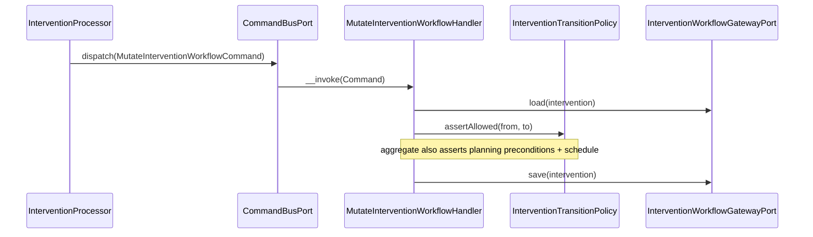

# Intervention Module

## Overview

Intervention coordinates organization-scoped **field interventions**: the workflow
that takes a fire-safety operation from `draft` to `published`, producing real
facilities, equipment and inspections only when the intervention is published.

An intervention is a **staged workspace**. While it is being prepared and executed
it holds *draft* operational resources (work items describing facilities/equipment
to create, inspections to run) and *proposed changes*. Publication is an atomic,
asynchronous step that either fully materializes those drafts into the owning
modules (Facility, Equipment, Inspection) or leaves every record untouched.

Main goals:

- Drive an intervention through a controlled status machine
  (`draft → planned → in_progress → submitted → changes_requested → published`,
  plus `abandoned`) with strong aggregate invariants.
- Hold draft work items and proposed changes off to the side until review.
- Surface blocking **issues** (validation) before publication.
- Publish atomically and asynchronously through a message queue, materializing
  draft resources into Facility / Equipment / Inspection via outbound ports.

## API Endpoints

All paths are prefixed with `/api`. Interventions are organization-scoped through
the required `organization` query parameter on the collection (not a nested URI).
Every operation requires `ROLE_USER`; finer-grained membership/permission checks
are enforced in the application layer (`InterventionMemberPolicy`).

### Interventions

| Method | Path | Description |
| --- | --- | --- |
| POST | `/interventions` | Create intervention (starts as `draft`) |
| GET | `/interventions` | List (filters: `organization` *(required)*, `responsible`, `participant`, `type`, `status`, `site`, `dueAtAfter`, `dueAtBefore`; 30/page, client page size) |
| GET | `/interventions/{id}` | Get intervention |
| PATCH | `/interventions/{id}` | Update fields and/or apply a **status transition** (`nextStatus`) |
| PUT | `/interventions/{id}` | Upsert (offline replay path; `201`) |
| DELETE | `/interventions/{id}` | Delete intervention |
| GET | `/interventions/{id}/issues` | List computed validation issues (blocker/warning/recommendation) |

### Work items (draft scope)

| Method | Path | Description |
| --- | --- | --- |
| POST | `/intervention-work-items` | Add a work item to an intervention |
| GET | `/intervention-work-items` | List (filters: `intervention` *(required)*, `assignee`, `source`, `action`, `status`) |
| GET | `/intervention-work-items/{id}` | Get work item |
| PATCH | `/intervention-work-items/{id}` | Update work item (status: `planned → in_progress → completed`/`skipped`) |
| PUT | `/intervention-work-items/{id}` | Upsert (offline replay path; `201`) |
| DELETE | `/intervention-work-items/{id}` | Delete work item |

### Proposed changes (review)

| Method | Path | Description |
| --- | --- | --- |
| POST | `/intervention-changes` | Propose a change to an existing resource |
| GET | `/intervention-changes` | List (filters: `intervention` *(required)*, `resource`, `status`) |
| GET | `/intervention-changes/{id}` | Get change |
| PATCH | `/intervention-changes/{id}` | Update change status (`proposed → applied`/`rejected`) |
| PUT | `/intervention-changes/{id}` | Upsert (offline replay path; `201`) |
| DELETE | `/intervention-changes/{id}` | Delete change |

### Publication (async)

| Method | Path | Description |
| --- | --- | --- |
| POST | `/publications` | Request publication of an intervention (`202 Accepted`, queued) |
| GET | `/publications/{id}` | Poll publication status (pending → succeeded/failed) |

### Activity feed (comments + system events)

| Method | Path | Description |
| --- | --- | --- |
| GET | `/interventions/{interventionId}/activities` | List the intervention's activity feed, oldest first (30/page, client page size) |
| POST | `/interventions/{interventionId}/comments` | Add a member comment to the intervention |

System activities (`created`, `status_changed`) are recorded automatically by
the workflow gateway inside the same transaction as the underlying mutation —
there is no direct write endpoint for them. `InterventionOutput.commentsCount`
exposes the running comment count on the intervention itself.

### Labels

| Method | Path | Description |
| --- | --- | --- |
| POST | `/intervention-labels` | Create a label (`organization`, `name`, `color`) |
| GET | `/intervention-labels` | List an organization's labels (filter: `organization` *(required)*; ordered `name ASC`; 30/page, client page size) |
| PATCH | `/intervention-labels/{id}` | Update `name` and/or `color` |
| DELETE | `/intervention-labels/{id}` | Delete a label |

Labels are small, reusable `{name, color}` organization-scoped tags
(`name` ≤ 50 chars, `color` a `#rrggbb` hex string), unique per
`(organization, name)` — a duplicate name yields `409 Conflict`. Interventions
carry a `labelIds` array (uuids) on create/update (`CreateInterventionInput`,
`UpdateInterventionInput`); `PATCH` replaces the full assigned set when the
field is present in the merge-patch body. Assigning a label from another
organization is rejected with `422`. Labels are metadata editable in any
non-terminal intervention status (blocked only when `published`/`abandoned`,
via the same `assertMutable` path as other edits) — they are **not** subject
to the `draft`-only planning freeze. `InterventionOutput.labels` exposes the
assigned set as embedded `{id, name, color}` summaries (not IRIs) for
rendering chips without extra requests. Deleting a label removes its
assignments but never the interventions it was attached to.

### Reference

| Method | Path | Description |
| --- | --- | --- |
| GET | `/intervention-types` | List available intervention types |

## Flows

### Create / transition intervention (Command)



### Publish intervention (async)

```mermaid
sequenceDiagram
  participant API as PublicationProcessor
  participant Q as PublicationQueuePort
  participant W as ExecutePublicationHandler
  participant Pub as InterventionDraftPublisher
  participant Own as intervention.draft_publisher (Facility/Equipment/Inspection)
  API->>Q: enqueue(RequestPublicationCommand)  // 202 Accepted
  Q-->>W: ExecutePublicationCommand
  W->>Pub: publish(intervention)
  Pub->>Own: materialize each draft resource
  Note over W,Own: atomic — all drafts persist or none do; status → published
```

## Domain Model

Aggregates and entities:

- `Intervention` — aggregate root (`Domain/Model/Intervention/Intervention.php`)
- `InterventionWorkItem` — a unit of draft scope (a resource to create / inspect)
- `InterventionChange` — a proposed patch to an existing resource
- `Publication` — an async publication attempt for an intervention

`Intervention` main fields:

- `id`, `organizationId`
- `type` (`InterventionType`: `site_setup` | `inventory` | `inspection_campaign`)
- `name` (required, ≤ 160 chars)
- `status` (`InterventionStatus`)
- `siteId` (optional), `responsibleId` (optional), `participants` (`list<string>`)
- `priority` (`InterventionPriority`: `low` | `normal` | `high` | `urgent`)
- `plannedStartAt`, `dueAt` (optional)
- `reviewNote` (optional)
- `revision` (optimistic concurrency; surfaced as `If-Match: "revision-N"`)
- `createdAt`, `updatedAt`

Status transitions (`InterventionTransitionPolicy::assertAllowed`):

- `draft` → `planned`, `abandoned`
- `planned` → `in_progress`, `abandoned`
- `in_progress` → `submitted`, `abandoned`
- `submitted` → `changes_requested`
- `changes_requested` → `in_progress`, `submitted`, `abandoned`
- `published`, `abandoned` → *(terminal)*

`published` is **never** reached by a direct transition — only through the async
publication flow (`POST /publications`).

Aggregate invariants (enforced in `Intervention`):

- **Planning preconditions**: a `site`, a `responsible`, a `plannedStartAt` and a
  `dueAt` are all required before moving to `planned`.
- **Schedule**: `dueAt` must be strictly after `plannedStartAt`.
- **Review note**: required when moving to `changes_requested`.
- **Planning freeze**: site / responsible / participants / priority / schedule are
  mutable only while `draft` (`assertPlanningMutable`); afterwards they are frozen.
- **Immutability**: `published` and `abandoned` interventions are fully immutable
  (`InterventionStatus::isMutable`).

`InterventionWorkItem` main fields:

- `id`, `interventionId`
- `action` (`site_setup` | `inventory` | `inspection`), `source`
- `status` (`planned` | `in_progress` | `completed` | `skipped`)
- `assignee`, `target`, `required`, `skipReason`, `revision`

`InterventionChange` main fields:

- `id`, `interventionId`, `resource`
- `status` (`proposed` | `applied` | `rejected`) — governed by `InterventionChangePolicy`
- patch payload

Issues (`InterventionIssue`, computed — not persisted) carry a `severity`
(`blocker` | `warning` | `recommendation`); a `blocker` prevents publication.

Value objects (`Domain/ValueObject/`): `InterventionStatus`, `InterventionType`,
`InterventionPriority`, `InterventionResourceType` (`facility` | `equipment` | `inspection`).

Activity feed rows (`InterventionActivityRecord`, append-only, no domain
aggregate — persisted directly through `InterventionActivityPort`):

- `id`, `interventionId`, `organizationId` (denormalized)
- `actorId` — the acting **organization member id**, nullable for activities
  that could not be attributed to a member; rendered as a member IRI
  (`/api/organizations/{org}/members/{actorId}`) on read
- `kind` (`comment` | `system`), `event` (`comment` | `created` | `status_changed`)
- `body` (comment text, null for system events), `payload` (structured event
  data, e.g. `{"from": "...", "to": "..."}` for `status_changed`)
- `createdAt`

Labels (`InterventionLabelRecord`, no domain aggregate — persisted directly
through `InterventionLabelPort`, exactly like activities):

- `id`, `organizationId`, `name` (≤ 50 chars), `color` (`#rrggbb`)
- `createdAt`, `updatedAt`
- unique per `(organizationId, name)`

Labels are **record-level metadata** on `InterventionRecord`, not part of the
`Intervention` domain aggregate — the same treatment as the `number` field:
managed directly on the record by the workflow gateway
(`DoctrineInterventionWorkflowGatewayAdapter::createIntervention` /
`updateIntervention`), never through `Domain\Model\Intervention\Intervention`.

## Persistence

- Tables: `interventions`, `intervention_work_items`, `intervention_changes`,
  `intervention_publications`, `intervention_activities`, `intervention_labels`,
  `intervention_label_assignments` (**main** database /
  `doctrine.orm.main_entity_manager`).
- `intervention_label_assignments` is the `Intervention` ↔ `InterventionLabel`
  many-to-many join table, owning side on `InterventionRecord::$labels`; both
  join columns cascade on delete.
- Doctrine records: `src/Intervention/Infrastructure/Persistence/Doctrine/Record`
- Mappers: `InterventionMapper`, `InterventionViewMapper`
  (`.../Persistence/Doctrine/Mapper`). `InterventionViewMapper::interventionView`
  computes `commentsCount` with a direct `intervention_activities` count
  (`kind = 'comment'`) rather than through the cross-module
  `InterventionListMetrics` port, and reads `labels` directly off
  `InterventionRecord::$labels` (bounded per-row lazy load in the list path,
  never fetch-joined into the paginated DQL query).

## Architecture

Hexagonal layering (Domain ← Application ← Infrastructure / Presentation, enforced
by deptrac):

- **Presentation** (`src/Intervention/Presentation/Api`): API Platform resources,
  providers, processors, input/output DTOs, output factories, and the
  `InterventionWorkflowExceptionMapperTrait` (domain-exception → HTTP mapping).
- **Application** (`src/Intervention/Application`): use cases (command/query
  handlers for workflow + publication + activity feed), outbound ports,
  contracts, and services (`InterventionChangeApplication`,
  `InterventionDraftPublisher`, `InterventionIssueFinder`,
  `InterventionMemberPolicy`, `InterventionNotificationService`,
  `InterventionResourceManager`).
- **Domain** (`src/Intervention/Domain`): the `Intervention` aggregate + work item
  / change / publication models, value objects, domain services
  (`InterventionTransitionPolicy`, `InterventionChangePolicy`), and exceptions.
- **Infrastructure** (`src/Intervention/Infrastructure`): Doctrine records / mappers
  and the port adapters (Doctrine gateways, Messenger publication queue).

### Ports & adapters (`config/modules/intervention.yaml`)

| Outbound port | Adapter |
| --- | --- |
| `InterventionResourceGatewayPort` | `DoctrineInterventionResourceGatewayAdapter` |
| `InterventionWorkflowGatewayPort` | `DoctrineInterventionWorkflowGatewayAdapter` |
| `InterventionIssueQueryPort` | `DoctrineInterventionWorkflowGatewayAdapter` |
| `PublicationRepositoryPort` | `DoctrinePublicationAdapter` |
| `PublicationQueuePort` | `MessengerPublicationQueueAdapter` |
| `InterventionActivityPort` | `DoctrineInterventionActivityAdapter` |
| `InterventionLabelPort` | `DoctrineInterventionLabelAdapter` |
| `InterventionEquipmentDraftProviderPort` | `Equipment\...\EquipmentInterventionResourceAdapter` *(cross-module)* |

Label resolution during intervention create/update (asserting each
`labelIds` entry belongs to the intervention's organization) is done directly
against `InterventionLabelRecord` inside
`DoctrineInterventionWorkflowGatewayAdapter`, not through `InterventionLabelPort`
— the gateway already queries records directly elsewhere (e.g.
`assertSiteBelongsToOrganization`).

`InterventionActivityPort::append` is also injected into
`DoctrineInterventionWorkflowGatewayAdapter`, which calls it inside its own
`wrapInTransaction` to record the `created` and `status_changed` system
activities alongside the underlying mutation (same commit/rollback unit).

Tagged-iterator extension points (owning modules plug in):

- `intervention.resource_owner` — resource gateways per resource type,
- `intervention.draft_publisher` — materializes drafts on publication
  (Facility / Equipment / Inspection),
- `intervention.change_applier` — applies proposed changes.

Async handlers are Messenger handlers: `RequestPublication`,
`ExecutePublication`, `GetPublication`, `MutateInterventionWorkflow`,
`GetInterventionWorkflow`, `ListInterventionWorkflow`, `ListInterventionIssues`,
`AddInterventionComment`, `ListInterventionActivities`, `CreateInterventionLabel`,
`UpdateInterventionLabel`, `DeleteInterventionLabel`, `ListInterventionLabels`.

## Error Codes

Domain exceptions are translated to HTTP by
`InterventionWorkflowExceptionMapperTrait::mapWorkflowException`:

| Exception | HTTP |
| --- | --- |
| `InterventionAccessDeniedException` | 403 Forbidden |
| `InterventionNotFoundException` | 404 Not Found |
| `InterventionPreconditionRequiredException` | 428 Precondition Required |
| `InterventionPreconditionFailedException` | 412 Precondition Failed |
| `InterventionValidationException` | 422 Unprocessable Entity |
| `InterventionConflictException` | 409 Conflict |
| `InvalidArgumentException` | 400 Bad Request |

Specializations (`InterventionBlockedException`,
`InterventionResourceNotFoundException`, `PublicationNotFoundException`,
`ClientResourceAlreadyExistsException`) resolve through their parent in the same
mapper (conflict / precondition / not-found families).

## Testing

- Unit: `tests/Unit/Intervention/`
- Run module tests: `make test tests/Unit/Intervention/`
