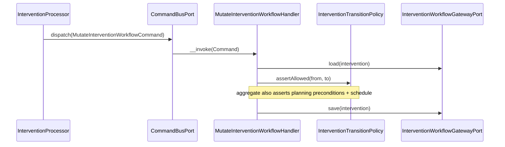

# Intervention Module

## Overview

Intervention coordinates organization-scoped **field interventions**: the workflow
that takes a fire-safety operation from `draft` to `published`, producing real
facilities, equipment and inspections only when the intervention is published.

An intervention is a **staged workspace**. While it is being prepared and executed
it holds *draft* operational resources (work items describing facilities/equipment
to create, inspections to run) and *proposed changes*. Publication is an atomic,
asynchronous step that either fully materializes those drafts into the owning
modules (Facility, Equipment, Inspection) or leaves every record untouched.

Main goals:

- Drive an intervention through a controlled status machine
  (`draft → planned → in_progress → submitted → changes_requested → published`,
  plus `abandoned`) with strong aggregate invariants.
- Hold draft work items and proposed changes off to the side until review.
- Surface blocking **issues** (validation) before publication.
- Publish atomically and asynchronously through a message queue, materializing
  draft resources into Facility / Equipment / Inspection via outbound ports.

## API Endpoints

All paths are prefixed with `/api`. Interventions are organization-scoped through
the required `organization` query parameter on the collection (not a nested URI).
Every operation requires `ROLE_USER`; finer-grained membership/permission checks
are enforced in the application layer (`InterventionMemberPolicy`).

### Interventions

| Method | Path | Description |
| --- | --- | --- |
| POST | `/interventions` | Create intervention (starts as `draft`) |
| GET | `/interventions` | List (filters: `organization` *(required)*, `responsible`, `participant`, `type`, `status`, `site`, `dueAtAfter`, `dueAtBefore`; 30/page, client page size) |
| GET | `/interventions/{id}` | Get intervention |
| PATCH | `/interventions/{id}` | Update fields and/or apply a **status transition** (`nextStatus`) |
| PUT | `/interventions/{id}` | Upsert (offline replay path; `201`) |
| DELETE | `/interventions/{id}` | Delete intervention |
| GET | `/interventions/{id}/issues` | List computed validation issues (blocker/warning/recommendation) |

### Work items (draft scope)

| Method | Path | Description |
| --- | --- | --- |
| POST | `/intervention-work-items` | Add a work item to an intervention |
| GET | `/intervention-work-items` | List (filters: `intervention` *(required)*, `assignee`, `source`, `action`, `status`) |
| GET | `/intervention-work-items/{id}` | Get work item |
| PATCH | `/intervention-work-items/{id}` | Update work item (status: `planned → in_progress → completed`/`skipped`) |
| PUT | `/intervention-work-items/{id}` | Upsert (offline replay path; `201`) |
| DELETE | `/intervention-work-items/{id}` | Delete work item |

### Proposed changes (review)

| Method | Path | Description |
| --- | --- | --- |
| POST | `/intervention-changes` | Propose a change to an existing resource |
| GET | `/intervention-changes` | List (filters: `intervention` *(required)*, `resource`, `status`) |
| GET | `/intervention-changes/{id}` | Get change |
| PATCH | `/intervention-changes/{id}` | Update change status (`proposed → applied`/`rejected`) |
| PUT | `/intervention-changes/{id}` | Upsert (offline replay path; `201`) |
| DELETE | `/intervention-changes/{id}` | Delete change |

### Publication (async)

| Method | Path | Description |
| --- | --- | --- |
| POST | `/publications` | Request publication of an intervention (`202 Accepted`, queued) |
| GET | `/publications/{id}` | Poll publication status (pending → succeeded/failed) |

### Activity feed (comments + system events)

| Method | Path | Description |
| --- | --- | --- |
| GET | `/interventions/{interventionId}/activities` | List the intervention's activity feed, oldest first (30/page, client page size) |
| POST | `/interventions/{interventionId}/comments` | Add a member comment to the intervention |

System activities (`created`, `status_changed`) are recorded automatically by
the workflow gateway inside the same transaction as the underlying mutation —
there is no direct write endpoint for them. `InterventionOutput.commentsCount`
exposes the running comment count on the intervention itself.

**Mentions**: comment bodies may contain `@{memberUuid}` tokens (a plain-text
form that survives rich-text sanitization). After the comment is persisted,
each mentioned member — deduplicated, author excluded — is notified
best-effort (`intervention.comment_mention`) through
`InterventionNotificationService::mentioned()`, which verifies the member is
active AND belongs to the intervention's organization (the ids come from user
input) and delivers in-app + email, each channel honoring its own
organization toggle.

### Labels

| Method | Path | Description |
| --- | --- | --- |
| POST | `/intervention-labels` | Create a label (`organization`, `name`, `color`) |
| GET | `/intervention-labels` | List an organization's labels (filter: `organization` *(required)*; ordered `name ASC`; 30/page, client page size) |
| PATCH | `/intervention-labels/{id}` | Update `name` and/or `color` |
| DELETE | `/intervention-labels/{id}` | Delete a label |

Labels are small, reusable `{name, color}` organization-scoped tags
(`name` ≤ 50 chars, `color` a `#rrggbb` hex string), unique per
`(organization, name)` — a duplicate name yields `409 Conflict`. Interventions
carry a `labelIds` array (uuids) on create/update (`CreateInterventionInput`,
`UpdateInterventionInput`); `PATCH` replaces the full assigned set when the
field is present in the merge-patch body. Assigning a label from another
organization is rejected with `422`. Labels are metadata editable in any
non-terminal intervention status (blocked only when `published`/`abandoned`,
via the same `assertMutable` path as other edits) — they are **not** subject
to the `draft`-only planning freeze. `InterventionOutput.labels` exposes the
assigned set as embedded `{id, name, color}` summaries (not IRIs) for
rendering chips without extra requests. Deleting a label removes its
assignments but never the interventions it was attached to.

### Templates

| Method | Path | Description |
| --- | --- | --- |
| POST | `/intervention-templates` | Create a template (`organization`, `name`, `type`, `priority`, defaults, `duration`, `labelIds`, `items`) |
| GET | `/intervention-templates` | List an organization's templates (filters: `organization` *(required)*, `search`; ordered `name ASC`; 30/page, client page size) |
| GET | `/intervention-templates/{id}` | Get a template |
| PATCH | `/intervention-templates/{id}` | Update fields; `labelIds` and `items` are replaced wholesale when present |
| DELETE | `/intervention-templates/{id}` | Delete a template |
| POST | `/intervention-templates/{id}/instantiate` | Instantiate a template into a real intervention draft (`201`, `{interventionId, number}`) |

Templates (Lot 3; recurring instantiation added in Lot 6 — see the
Recurrences section below) are reusable organization-scoped blueprints for
creating interventions: `name` (2–160
chars, unique per organization — a duplicate yields `409 Conflict`),
`description`, `type` (`InterventionType`), `priority` (`InterventionPriority`,
default `normal`), `defaultSiteId`, `defaultResponsibleId`, `duration` (an
ISO-8601 duration string, e.g. `P14D`, used to derive `dueAt` from
`plannedStartAt` at instantiation), `labelIds`, and an ordered list of `items`
(`action` 1–60 chars, `target`, `resultResource`, `required`,
`defaultAssigneeId`), each seeded as a planned work item on instantiation.
Like labels, templates (`InterventionTemplateRecord` /
`InterventionTemplateItemRecord`) are record-level entities behind
`InterventionTemplatePort` / `DoctrineInterventionTemplateAdapter` — **not**
part of the `Intervention` domain aggregate. Reads require
`organization.interventions.read`; create/update/delete and instantiation
require `organization.interventions.plan` (the "prepare and assign"
permission — distinct from the labels' `organization.interventions.write`).

`POST /intervention-templates/{id}/instantiate` accepts optional overrides
(`name`, `site`, `responsible`, `plannedStartAt`) and always routes through
`InterventionDraftFactoryPort` (`InstantiateInterventionTemplateHandler`) —
the same single programmatic draft-creation path used by other automations —
with `origin: 'intervention:template'`. Before building the draft request the
handler:

- re-validates `defaultResponsibleId` and each item's `defaultAssigneeId`
  against current organization membership, **silently dropping** (never
  blocking) a reference to a member who is no longer active, since a template
  is a reusable blueprint that may outlive the people it once referenced;
- filters `labelIds` down to labels that still exist and still belong to the
  organization, since workflow gateway label resolution rejects unknown ids
  outright;
- derives `dueAt = plannedStartAt + duration` (as a `DateInterval`) only when
  both are present;
- maps `items` to draft work items in position order.

### Recurrences

| Method | Path | Description |
| --- | --- | --- |
| POST | `/intervention-recurrences` | Create a recurrence against an existing template (`organization`, `template`, `name`, `site`, `responsible`, `frequency`, `interval`, `anchorDate`, `timezone`, `leadTimeDays`, `endAt`) |
| GET | `/intervention-recurrences` | List an organization's recurrences (filters: `organization` *(required)*, `isActive`; ordered `name ASC`; 30/page, client page size) |
| GET | `/intervention-recurrences/{id}` | Get a recurrence |
| PATCH | `/intervention-recurrences/{id}` | Update fields (merge-patch); includes the `isActive` toggle |
| DELETE | `/intervention-recurrences/{id}` | Delete a recurrence |

A recurrence (Lot 6) periodically re-instantiates an intervention template on
a schedule: `frequency` (`weekly` | `monthly` | `quarterly` | `semiannual` |
`annual`) multiplied by an `interval` count (e.g. "every 2 months"), anchored
to `anchorDate` and evaluated in the recurrence's own `timezone` (IANA
identifier). `leadTimeDays` (0–90, default 7) is how many days before an
occurrence it becomes due for materialization — the recurring sweep selects
recurrences where `next_occurrence_at - lead_time_days <= now`. `site` and
`responsible` are optional overrides of the template's own defaults, applied
only for occurrences this recurrence materializes. Reads require
`organization.interventions.read`; writes require
`organization.interventions.plan` — the same permissions as templates.
Creating a recurrence computes the initial `next_occurrence_at =
rule.nextAfter(now)`; updating any rule-affecting field (`frequency`,
`interval`, `anchorDate`, `timezone`) recomputes it the same way. The
template must belong to the same organization as the recurrence.

`RecurrenceRule` (`Domain/ValueObject`) is persisted as discrete columns
(`frequency`, `interval_count`, `anchor_date`) — never a freeform rrule
string; `intervention_recurrences.rrule` is a nullable column reserved for a
future expression syntax and is never read today. `RecurrenceRule::nextAfter()`
walks forward from the anchor date by repeatedly adding one step of the rule
(weekly: whole weeks; every other frequency: whole calendar months) until it
lands strictly after the given instant. The month-based frequencies add
calendar months through PHP's native `DateInterval`, which does **not** clamp
end-of-month overflow (e.g. adding one month to January 31st, 2026 overflows
into March 3rd rather than clamping to February 28th) — and because each
step is added onto the *previous* cursor, not re-derived from the anchor day,
an end-of-month anchor permanently drifts after the first short month it
crosses. This is documented, tested behavior, not a bug.

#### Recurring materialization sweep

`Infrastructure/Scheduler/InterventionScheduleProvider` (`#[AsSchedule('intervention')]`)
triggers `MaterializeDueRecurrencesCommand` hourly, consumed from the
`scheduler_intervention` transport the Scheduler component registers
automatically (DSN `schedule://intervention`) — run
`messenger:consume scheduler_intervention` alongside the existing `async`
worker (mirrors the Maintenance module's sweep exactly).
`MaterializeDueRecurrencesHandler` is idempotent and processes every due
recurrence page-wise:

1. Pages through active recurrences whose lead-time window has opened
   (`InterventionRecurrencePort::pageDueForMaterialization`).
2. For each, idempotently claims the `(recurrence, occurrence date)` pair
   FIRST (`reserveRun`) — a unique constraint on
   `intervention_recurrence_runs (recurrence_id, occurrence_date)` is the
   guard, so a Messenger retry or an overlapping sweep tick can never
   materialize the same occurrence twice; a claim miss (`null`) skips the
   recurrence entirely for this tick.
3. Materializes the draft through `InterventionTemplateInstantiator` — the
   same shared core `InstantiateInterventionTemplateHandler` uses — with
   `origin: 'intervention:recurrence'`, a system actor (`actorUserId: null`),
   `plannedStartAt` set to the occurrence instant, and the recurrence's own
   `siteId`/`responsibleId` as overrides.
4. On success: the run is marked `succeeded` with the created intervention
   id, `next_occurrence_at` advances to `rule.nextAfter(occurrence)`, and
   `last_materialized_at` is set.
5. On failure (site archived, template deleted, ...): the run is marked
   `failed` with the error, `next_occurrence_at` still advances (no infinite
   retry on a permanently broken occurrence), and the recurrence's
   responsible member — or the organization's administrators as a fallback
   (`InterventionRecurrenceRecipientResolver`, mirroring
   `MaintenanceReminderRecipientResolver`) — is notified best-effort
   (`intervention.recurrence_failed`) via `InterventionRecurrenceNotifier`.

Every processed occurrence (success or failure) also dispatches
`intervention.recurrence_materialized` for the audit ledger, with a system
actor.

The reservation step (`reserveRun`) deliberately uses a raw DBAL statement
rather than the ORM's `persist()`/`flush()`: the sweep processes many
recurrences per request, and a unique-constraint violation raised during an
ORM `flush()` closes the `EntityManager` for the rest of the request (see
`DoctrinePublicationAdapter::markFailed()`'s `isOpen()` fallback for the same
concern) — a duplicate occurrence claim is an expected, routine outcome
here, not an exceptional one.

### Team assignment (R9)

| Method | Path | Description |
| --- | --- | --- |
| POST | `/interventions/{id}/team-assignments` | Snapshot-expand an Organization team's active members into the intervention's participants |

`AssignInterventionTeamInput{teamId}` → `AssignTeamToInterventionHandler`
resolves the intervention's context (organization, current `participants`)
through the existing `InterventionWorkflowGatewayPort`, checks
`organization.interventions.plan` (the same "prepare and assign" permission
templates/recurrences use), then reads the team's CURRENT active member ids
through Organization's inbound `Organization\Application\Port\Inbound\TeamDirectoryPort`
(`listActiveMemberIds`) — consumed directly cross-module, exactly like
`OrganizationAuthorizationPort`; no new Organization adapter, no Intervention
Domain change. The union of the existing `participants` and the team's
active member ids (deduplicated) is applied through the **existing**
`MutateInterventionWorkflowCommand` (`resource: 'intervention', action: 'update'`,
`payload: ['participants' => ...]`), so numbering, activities, ETag/revision
bumps, and the planning freeze (`Intervention::assertPlanningMutable`) all
apply identically to a manual participants edit: the assignment is only
possible while the intervention is `draft`, otherwise it fails the same way
a manual participants PATCH would (`409 Conflict`). An empty team (no
active members) is rejected with `422 Unprocessable Entity` rather than
silently no-op'ing.

This is a deliberate **snapshot**, not a dynamic/live binding: expansion
happens once, at assignment time. A later team-membership change never
mutates an already-assigned intervention — this keeps behavior
deterministic under the offline/ETag optimistic-concurrency replay model.
Persisting an `assignedTeamId` on interventions for later filtering was
considered and intentionally deferred (would need an Intervention-table
migration and introduce a cross-module dangling-reference risk); not part
of this lot. The team-assignment endpoint itself is not audited, consistent
with intervention planning edits not being audited today.

### Attachments (R11b)

| Method | Path | Description |
| --- | --- | --- |
| POST | `/interventions/{interventionId}/attachments` | Upload a multipart file attachment (execution evidence) |
| GET | `/interventions/{interventionId}/attachments` | List an intervention's attachments |
| GET | `/intervention-attachments/{id}` | Get one attachment |
| DELETE | `/intervention-attachments/{id}` | Delete an attachment (requires `If-Match: "revision-N"`) |

Generalized file attachments directly on an intervention, mirroring the
shared attachment kernel (`src/Shared/MODULE.md`) and the proven
`Equipment\...\EquipmentAttachment` slice. `Intervention\Domain\Model\Attachment\InterventionAttachment`
uses a plain `string $interventionId` (not a dedicated identifier value
object), matching `Intervention\Domain\Model\Intervention\Intervention`'s own
convention. Storage key:
`intervention/{interventionId}/attachments/{attachmentId}_{fileName}`.

**Phase-based write authorization** — no new permission, no new port. Reads
require the flat `organization.interventions.read` permission. Writes
(upload/delete) reuse the EXISTING `Intervention\Application\Service\InterventionResourceManager::mutationPermission(interventionId, userId)`
— the same service `Equipment\Presentation\Api\Processor\Media\MediaProcessor`
already uses for in-intervention equipment media:

1. `InterventionMediaProcessor` resolves the intervention's organization via
   `InterventionResourceManager::interventionContext()` (404 if missing/org
   mismatch).
2. `mutationPermission()` loads+locks the intervention via
   `InterventionResourceGatewayPort::interventionMutationContext()`, rejects
   immutable states (`submitted`/`published`/`abandoned` → 409 Conflict via
   `InterventionConflictException`), and returns the phase-derived permission:
   `organization.interventions.plan` while `draft`, otherwise
   `organization.interventions.execute` — additionally asserting, through
   `InterventionMemberPolicy`, that the caller is the intervention's
   responsible or a participant once it has left `draft`.
3. The processor checks that resolved permission via
   `OrganizationAuthorizationPort::hasPermission()` (403 if missing) before
   dispatching the command. A reviewer holding only
   `organization.interventions.review` (not `.execute`) is therefore rejected
   when uploading during `in_progress`, even though they can read/comment.

`work_item_id` is a **reserved, currently unused** nullable FK column on
`intervention_attachments` (see Persistence) for a future optional
per-work-item attach scope — no endpoint sets or reads it in this lot.

### Reference

| Method | Path | Description |
| --- | --- | --- |
| GET | `/intervention-types` | List available intervention types |

## Flows

### Create / transition intervention (Command)



### Publish intervention (async)

```mermaid
sequenceDiagram
  participant API as PublicationProcessor
  participant Q as PublicationQueuePort
  participant W as ExecutePublicationHandler
  participant Pub as InterventionDraftPublisher
  participant Own as intervention.draft_publisher (Facility/Equipment/Inspection)
  API->>Q: enqueue(RequestPublicationCommand)  // 202 Accepted
  Q-->>W: ExecutePublicationCommand
  W->>Pub: publish(intervention)
  Pub->>Own: materialize each draft resource
  Note over W,Own: atomic — all drafts persist or none do; status → published
```

## Domain Model

Aggregates and entities:

- `Intervention` — aggregate root (`Domain/Model/Intervention/Intervention.php`)
- `InterventionWorkItem` — a unit of draft scope (a resource to create / inspect)
- `InterventionChange` — a proposed patch to an existing resource
- `Publication` — an async publication attempt for an intervention

`Intervention` main fields:

- `id`, `organizationId`
- `type` (`InterventionType`: `site_setup` | `inventory` | `inspection_campaign`)
- `name` (required, ≤ 160 chars)
- `status` (`InterventionStatus`)
- `siteId` (optional), `responsibleId` (optional), `participants` (`list<string>`)
- `priority` (`InterventionPriority`: `low` | `normal` | `high` | `urgent`)
- `plannedStartAt`, `dueAt` (optional)
- `reviewNote` (optional)
- `revision` (optimistic concurrency; surfaced as `If-Match: "revision-N"`)
- `createdAt`, `updatedAt`

Status transitions (`InterventionTransitionPolicy::assertAllowed`):

- `draft` → `planned`, `abandoned`
- `planned` → `in_progress`, `abandoned`
- `in_progress` → `submitted`, `abandoned`
- `submitted` → `changes_requested`
- `changes_requested` → `in_progress`, `submitted`, `abandoned`
- `published`, `abandoned` → *(terminal)*

`published` is **never** reached by a direct transition — only through the async
publication flow (`POST /publications`).

Aggregate invariants (enforced in `Intervention`):

- **Planning preconditions**: a `site`, a `responsible`, a `plannedStartAt` and a
  `dueAt` are all required before moving to `planned`.
- **Schedule**: `dueAt` must be strictly after `plannedStartAt`.
- **Review note**: required when moving to `changes_requested`.
- **Planning freeze**: site / responsible / participants / priority / schedule are
  mutable only while `draft` (`assertPlanningMutable`); afterwards they are frozen.
- **Immutability**: `published` and `abandoned` interventions are fully immutable
  (`InterventionStatus::isMutable`).

`InterventionWorkItem` main fields:

- `id`, `interventionId`
- `action` (`site_setup` | `inventory` | `inspection`), `source`
- `status` (`planned` | `in_progress` | `completed` | `skipped`)
- `assignee`, `target`, `required`, `skipReason`, `revision`

`InterventionChange` main fields:

- `id`, `interventionId`, `resource`
- `status` (`proposed` | `applied` | `rejected`) — governed by `InterventionChangePolicy`
- patch payload

Issues (`InterventionIssue`, computed — not persisted) carry a `severity`
(`blocker` | `warning` | `recommendation`); a `blocker` prevents publication.

Value objects (`Domain/ValueObject/`): `InterventionStatus`, `InterventionType`,
`InterventionPriority`, `InterventionResourceType` (`facility` | `equipment` | `inspection`).

Activity feed rows (`InterventionActivityRecord`, append-only, no domain
aggregate — persisted directly through `InterventionActivityPort`):

- `id`, `interventionId`, `organizationId` (denormalized)
- `actorId` — the acting **organization member id**, nullable for activities
  that could not be attributed to a member; rendered as a member IRI
  (`/api/organizations/{org}/members/{actorId}`) on read
- `kind` (`comment` | `system`), `event` (`comment` | `created` | `status_changed`)
- `body` (comment text, null for system events), `payload` (structured event
  data, e.g. `{"from": "...", "to": "..."}` for `status_changed`)
- `createdAt`

Labels (`InterventionLabelRecord`, no domain aggregate — persisted directly
through `InterventionLabelPort`, exactly like activities):

- `id`, `organizationId`, `name` (≤ 50 chars), `color` (`#rrggbb`)
- `createdAt`, `updatedAt`
- unique per `(organizationId, name)`

Labels are **record-level metadata** on `InterventionRecord`, not part of the
`Intervention` domain aggregate — the same treatment as the `number` field:
managed directly on the record by the workflow gateway
(`DoctrineInterventionWorkflowGatewayAdapter::createIntervention` /
`updateIntervention`), never through `Domain\Model\Intervention\Intervention`.

Templates (`InterventionTemplateRecord` / `InterventionTemplateItemRecord`, no
domain aggregate — persisted directly through `InterventionTemplatePort`,
exactly like labels):

- `InterventionTemplateRecord`: `id`, `organizationId`, `name` (≤ 160 chars),
  `description`, `type`, `priority` (default `normal`), `defaultSiteId`,
  `defaultResponsibleId`, `duration` (ISO-8601 string, nullable), `labelIds`
  (json list), `createdAt`, `updatedAt`; unique per `(organizationId, name)`
- `InterventionTemplateItemRecord`: `id`, `templateId`, `position`, `action`
  (≤ 60 chars), `target`, `resultResource`, `required` (default `true`),
  `defaultAssigneeId`; ordered by `position`, cascade-deleted with the template

## Persistence

- Tables: `interventions`, `intervention_work_items`, `intervention_changes`,
  `intervention_publications`, `intervention_activities`, `intervention_labels`,
  `intervention_label_assignments`, `intervention_templates`,
  `intervention_template_items`, `intervention_recurrences`,
  `intervention_recurrence_runs`, `intervention_attachments` (**main** database /
  `doctrine.orm.main_entity_manager`).
- `intervention_attachments` (R11b): `intervention_id` FK `ON DELETE CASCADE`
  (not null); `work_item_id` FK `ON DELETE CASCADE` (nullable, **reserved and
  currently unused** — see Attachments above; stored as a plain column, not an
  ORM association, so the FK is added directly in the migration rather than
  through a Doctrine relation, mirroring `InterventionRecurrenceRecord::$rrule`);
  unique `storage_path`; `revision` (ETag). Migration:
  `migrations/main/Version20260717111309.php` (shared across the three R11b
  attachment tables). Repository:
  `Intervention\Infrastructure\Persistence\Doctrine\Repository\InterventionAttachmentRepository`.
- `intervention_recurrences.template_id` is a required, non-cascading
  reference (no `onDelete` clause — repo precedent for "required but not
  cascade/set-null", mirroring `UserRecord::$otpSecret`'s `user_id` join): a
  template backing an active recurrence cannot be deleted while the
  recurrence still references it. `intervention_recurrence_runs.recurrence_id`
  cascades on delete. The unique constraint
  `uniq_intervention_recurrence_run_occurrence (recurrence_id, occurrence_date)`
  is the materializer's idempotence guard.
- `intervention_label_assignments` is the `Intervention` ↔ `InterventionLabel`
  many-to-many join table, owning side on `InterventionRecord::$labels`; both
  join columns cascade on delete.
- Doctrine records: `src/Intervention/Infrastructure/Persistence/Doctrine/Record`
- Mappers: `InterventionMapper`, `InterventionViewMapper`
  (`.../Persistence/Doctrine/Mapper`). `InterventionViewMapper::interventionView`
  computes `commentsCount` with a direct `intervention_activities` count
  (`kind = 'comment'`) rather than through the cross-module
  `InterventionListMetrics` port, and reads `labels` directly off
  `InterventionRecord::$labels` (bounded per-row lazy load in the list path,
  never fetch-joined into the paginated DQL query).

## Audit trail

Publication is the single audit point of the intervention write path:
`ExecutePublicationHandler` emits `InterventionPublishedEvent`
(`intervention.published` in the ledger) after `publish()` has committed, and
`InterventionPublicationFailedEvent` (`intervention.publication_failed`, with
the failure reason) after `markFailed()`. The per-resource adapters
(facility/equipment/inspection `apply()` / `publishDrafts`) deliberately never
emit — they run inside the publication transaction while the ledger commits
independently on the auth database. Failures occurring before the intervention
context resolves are not ledgered (no organization scope) but remain on the
publication record's `error` field. Intervention status transitions
(submit/approve/changes_requested/complete/abandon) are not audited yet.

Recurrences (Lot 6) are additionally audited: `CreateInterventionRecurrenceHandler`,
`UpdateInterventionRecurrenceHandler` and `DeleteInterventionRecurrenceHandler`
emit `intervention.recurrence_created` / `_updated` / `_deleted` with the
acting user as actor; `MaterializeDueRecurrencesHandler` emits
`intervention.recurrence_materialized` for every due occurrence it processes
(success or failure) with a system actor.

## Architecture

Hexagonal layering (Domain ← Application ← Infrastructure / Presentation, enforced
by deptrac):

- **Presentation** (`src/Intervention/Presentation/Api`): API Platform resources,
  providers, processors, input/output DTOs, output factories, and the
  `InterventionWorkflowExceptionMapperTrait` (domain-exception → HTTP mapping).
- **Application** (`src/Intervention/Application`): use cases (command/query
  handlers for workflow + publication + activity feed), outbound ports,
  contracts, and services (`InterventionChangeApplication`,
  `InterventionDraftPublisher`, `InterventionIssueFinder`,
  `InterventionMemberPolicy`, `InterventionNotificationService`,
  `InterventionResourceManager`).
- **Domain** (`src/Intervention/Domain`): the `Intervention` aggregate + work item
  / change / publication models, value objects, domain services
  (`InterventionTransitionPolicy`, `InterventionChangePolicy`), and exceptions.
- **Infrastructure** (`src/Intervention/Infrastructure`): Doctrine records / mappers
  and the port adapters (Doctrine gateways, Messenger publication queue).

### Ports & adapters (`config/modules/intervention.yaml`)

| Outbound port | Adapter |
| --- | --- |
| `InterventionResourceGatewayPort` | `DoctrineInterventionResourceGatewayAdapter` |
| `InterventionWorkflowGatewayPort` | `DoctrineInterventionWorkflowGatewayAdapter` |
| `InterventionIssueQueryPort` | `DoctrineInterventionWorkflowGatewayAdapter` |
| `PublicationRepositoryPort` | `DoctrinePublicationAdapter` |
| `PublicationQueuePort` | `MessengerPublicationQueueAdapter` |
| `InterventionActivityPort` | `DoctrineInterventionActivityAdapter` |
| `InterventionLabelPort` | `DoctrineInterventionLabelAdapter` |
| `InterventionTemplatePort` | `DoctrineInterventionTemplateAdapter` |
| `InterventionRecurrencePort` | `DoctrineInterventionRecurrenceAdapter` |
| `InterventionEquipmentDraftProviderPort` | `Equipment\...\EquipmentInterventionResourceAdapter` *(cross-module)* |
| `Organization\Application\Port\Outbound\InterventionStatisticsPort` *(cross-module, consumed by Organization)* | `Intervention\Infrastructure\Adapter\Organization\InterventionStatisticsAdapter` |
| `Equipment\Application\Port\Outbound\InterventionServiceReportPort` *(cross-module, consumed by Equipment)* | `Intervention\Infrastructure\Adapter\Equipment\InterventionServiceReportAdapter` |
| `Organization\Application\Port\Inbound\TeamDirectoryPort` *(cross-module, consumed BY Intervention)* | `Organization\Application\Service\TeamDirectoryService` — R9 team-assignment; consumed directly, no Intervention-side wrapper port, exactly like `OrganizationAuthorizationPort` |
| `Calendar\Application\Port\Outbound\Feed\InterventionCalendarFeedPort` *(cross-module, consumed by Calendar)* | `Intervention\Infrastructure\Adapter\Calendar\InterventionCalendarFeedAdapter` |

`InterventionServiceReportAdapter` (`Infrastructure/Adapter/Equipment/`,
R12) hosts the adapter for Equipment's consumer port
`InterventionServiceReportPort::serviceReport(interventionId)` — mirrors
`Facility\Infrastructure\Adapter\Equipment\FacilityValidationAdapter` (the
provider module hosts the adapter, the consumer module owns the port and
its contract types). Queries `InterventionChangeRecord` directly (main
entity manager) for `status = 'applied'` changes whose `resource` matches
`/api/equipment/{id}` (a single path segment, mirroring
`EquipmentInterventionResourceAdapter::supports()`), across **all**
publications of the intervention — not scoped to one publication, since
each change is applied exactly once and the caller dedups on the change id.
Returns `Equipment\Application\Contract\Intervention\InterventionServiceReport`
(intervention `number` + `responsibleId` as `actorId`) with one
`ServicedEquipmentEntry` per matched change (`action` = the linked work
item's `action` when set, else a patch-derived fallback `status_change`/
`update`; `changeToken` = the change id, used by the caller as the
idempotency token). Registered in `config/modules/intervention.yaml`;
aliased in `config/modules/equipment.yaml`. See the Equipment module's
`MODULE.md` for the full R12 service-history sync flow (trigger event,
best-effort semantics, idempotency).

`InterventionStatisticsAdapter` (`Infrastructure/Adapter/Organization/`) is
the first Organization-facing adapter in this module — mirrors
`Facility\Infrastructure\Adapter\Organization\FacilityStatisticsAdapter`.
It implements the Organization module's `InterventionStatisticsPort`
(`findRecentInterventions(organizationId, limit)`), querying
`InterventionRecord` directly (main entity manager, ordered by `updatedAt`
DESC) and returning `Organization\Application\Contract\Intervention\RecentInterventionSummary`
read models. Feeds the organization dashboard's `recentInterventions`
section (`GetOrganizationDashboardHandler`), gated by
`organization.interventions.read`. Registered in
`config/modules/intervention.yaml`; aliased in
`config/modules/organization.yaml`.

`InterventionCalendarFeedAdapter` (`Infrastructure/Adapter/Calendar/`)
implements the Calendar module's `InterventionCalendarFeedPort`
(`findBetween(organizationId, from, to, limit)`), mirroring
`InterventionStatisticsAdapter`: it queries `InterventionRecord` directly
(main entity manager) rather than through an intermediate repository. An
intervention occurs on the calendar when either its `plannedStartAt` or its
`dueAt` falls within the requested range (`COALESCE(plannedStartAt, dueAt)`
resolves the occurrence instant; `dueAt` also surfaces as the feed item's
`endsAt` when it differs from the resolved start). Registered in
`config/modules/intervention.yaml`; aliased in `config/modules/calendar.yaml`.
See `src/Calendar/MODULE.md`.

Label resolution during intervention create/update (asserting each
`labelIds` entry belongs to the intervention's organization) is done directly
against `InterventionLabelRecord` inside
`DoctrineInterventionWorkflowGatewayAdapter`, not through `InterventionLabelPort`
— the gateway already queries records directly elsewhere (e.g.
`assertSiteBelongsToOrganization`).

`InterventionActivityPort::append` is also injected into
`DoctrineInterventionWorkflowGatewayAdapter`, which calls it inside its own
`wrapInTransaction` to record the `created` and `status_changed` system
activities alongside the underlying mutation (same commit/rollback unit).

Tagged-iterator extension points (owning modules plug in):

- `intervention.resource_owner` — resource gateways per resource type,
- `intervention.draft_publisher` — materializes drafts on publication
  (Facility / Equipment / Inspection),
- `intervention.change_applier` — applies proposed changes.

Async handlers are Messenger handlers: `RequestPublication`,
`ExecutePublication`, `GetPublication`, `MutateInterventionWorkflow`,
`GetInterventionWorkflow`, `ListInterventionWorkflow`, `ListInterventionIssues`,
`AddInterventionComment`, `ListInterventionActivities`, `CreateInterventionLabel`,
`UpdateInterventionLabel`, `DeleteInterventionLabel`, `ListInterventionLabels`,
`CreateInterventionTemplate`, `UpdateInterventionTemplate`,
`DeleteInterventionTemplate`, `InstantiateInterventionTemplate`,
`ListInterventionTemplates`, `GetInterventionTemplate`,
`CreateInterventionRecurrence`, `UpdateInterventionRecurrence`,
`DeleteInterventionRecurrence`, `GetInterventionRecurrence`,
`ListInterventionRecurrences`, `MaterializeDueRecurrences` (triggered by the
hourly scheduler, not the API — see the Recurrences section above),
`AssignTeamToIntervention` (R9 team-assignment; see above).

`InstantiateInterventionTemplateHandler` never creates interventions itself:
it authorizes the request, then delegates the shared instantiation core —
template load, people re-validation/dropping, label filtering, `dueAt`
derivation — to `Application/Service/InterventionTemplateInstantiator`, which
calls `InterventionDraftFactoryPort` — the same single programmatic entry
point the API itself and other automations use — passing
`origin: 'intervention:template'`. `InterventionTemplateInstantiator` is the
SAME service the recurrence materializer (`MaterializeDueRecurrencesHandler`)
uses with `origin: 'intervention:recurrence'`, so both callers share
identical business logic instead of duplicating it.

## Error Codes

Domain exceptions are translated to HTTP by
`InterventionWorkflowExceptionMapperTrait::mapWorkflowException`:

| Exception | HTTP |
| --- | --- |
| `InterventionAccessDeniedException` | 403 Forbidden |
| `InterventionNotFoundException` | 404 Not Found |
| `InterventionPreconditionRequiredException` | 428 Precondition Required |
| `InterventionPreconditionFailedException` | 412 Precondition Failed |
| `InterventionValidationException` | 422 Unprocessable Entity |
| `InterventionConflictException` | 409 Conflict |
| `InvalidArgumentException` | 400 Bad Request |

Specializations (`InterventionBlockedException`,
`InterventionResourceNotFoundException`, `PublicationNotFoundException`,
`ClientResourceAlreadyExistsException`) resolve through their parent in the same
mapper (conflict / precondition / not-found families).

## Testing

- Unit: `tests/Unit/Intervention/`
  - `Application/UseCase/Command/Attachment/{Add,Delete}InterventionAttachment`,
    `Application/UseCase/Query/Attachment/ListInterventionAttachments` —
    org-isolation via `InterventionResourceGatewayPort`, storage rollback on
    DB failure, path-traversal-safe file naming.
  - `Presentation/Api/Processor/Attachment/InterventionMediaProcessorTest` —
    the phase-based authorization matrix: `draft` requires
    `organization.interventions.plan`, `in_progress` requires `.execute` (a
    caller holding only `.review` is rejected with 403), and a `published`
    (immutable) intervention rejects the upload with 409.
  - `Presentation/Api/Provider/Attachment/InterventionMediaProviderTest` —
    flat `organization.interventions.read` enforcement for reads.
- Integration (Doctrine adapters against a real database): `tests/Integration/Intervention/`
  — used for `DoctrineInterventionRecurrenceAdapter`'s `DATE_SUB`-based
  lead-time window selection and the `reserveRun()` idempotence guard, both
  hard to trust from a mock.
- Functional: `tests/Functional/Api/InterventionRecurrenceApiTest.php`,
  `tests/Functional/Api/InterventionTeamAssignmentApiTest.php`,
  `tests/Functional/Api/InterventionAttachmentApiTest.php`
- Run module tests: `make test tests/Unit/Intervention/`
