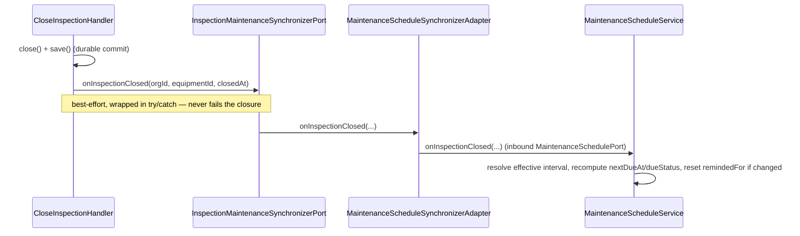

# Maintenance Module

## Overview

Maintenance provides preventive-maintenance scheduling for fire-safety
equipment: one schedule row per tracked piece of equipment, recomputed from
the equipment's inspection history and the organization's compliance policy
(periodicity per equipment type + reminder window), with an optional
per-equipment periodicity override.

Main goals:

- Track each equipment's next due inspection date and due status.
- Recompute schedules event-driven (an inspection closes) and on a recurring
  hourly sweep (bootstrap, decommission cleanup, due-status refresh,
  reminders).
- Let organization managers override the periodicity for a single piece of
  equipment.
- Generate an "inspection campaign" intervention draft from due/overdue
  schedules in one call.

## API Endpoints

| Method | Path | Description | Permission |
| --- | --- | --- | --- |
| GET | `/api/maintenance/schedules` | List schedules (filters: `organization` *(required)*, `facility`, `equipmentType`, `dueStatus`, `dueBefore`; 30/page, client page size) | `organization.maintenance.read` |
| GET | `/api/maintenance/schedules/{id}` | Get a schedule | `organization.maintenance.read` |
| PATCH | `/api/maintenance/schedules/{id}` | Set/clear `intervalOverride` (`null` clears) | `organization.maintenance.manage` |
| POST | `/api/maintenance/campaigns` | Generate an intervention draft from due/overdue schedules matching `facility`/`equipmentType`/`dueBefore`; `201 {interventionId, number, workItemsCount}` | `organization.maintenance.manage` AND `organization.interventions.plan` |

Every operation requires `ROLE_USER` at the resource level; the finer-grained
permission checks above are enforced in the application layer (mirrors the
Intervention module's templates/labels). Every user-facing handler is
scope-aware: the by-id and list schedule handlers decide access through
`OrganizationAuthorizationPort::resolveAccess()`, and the campaign handler —
which must assert two permissions — gates on
`OrganizationAuthorizationPort::isMemberOf()` first. A schedule owned by, or a
listing/campaign scoped to, an organization the caller has no active
membership in yields the same 404 an unknown id produces
(`MaintenanceNotFoundException::withId()` / `::forOrganizationScope()` — a 403
would confirm the record or organization exists), while a member lacking the
required permission gets 403. The invariant is pinned by
`tests/Architecture/Unit/MaintenanceAuthorizationEnforcementTest.php`
(`RecomputeMaintenanceSchedulesHandler`, the user-less system sweep, is the
single justified exemption).

## Flows

### Inspection closes (event-driven hot path)

### Recurring sweep (hourly)

`Infrastructure/Scheduler/MaintenanceScheduleProvider` (`#[AsSchedule('maintenance')]`)
triggers `RecomputeMaintenanceSchedulesCommand` hourly, consumed from the
`scheduler_maintenance` transport the Scheduler component registers
automatically (DSN `schedule://maintenance`) — run
`messenger:consume scheduler_maintenance` alongside the existing `async`
worker. `RecomputeMaintenanceSchedulesHandler` is idempotent and processes
everything page-wise (bounded memory):

1. **Reconcile**: pages through every organization's trackable equipment
   (`MaintenanceEquipmentDirectoryPort`); bootstraps a schedule for equipment
   with none yet (never inspected: `nextDueAt` null, `dueStatus` derived from
   periodicity presence), and drops the schedule of decommissioned equipment.
2. **Recompute**: pages through every schedule, recomputing `dueStatus`
   against the current instant.
3. **Remind**: for schedules entering `due_soon`/`overdue` where
   `remindedFor` doesn't already match `nextDueAt`, sends a
   `maintenance.inspection_due` / `maintenance.inspection_overdue`
   notification to the organization's administrators (`MaintenanceReminderNotifier`
   + `MaintenanceReminderRecipientResolver`), honoring the
   `inspectionDue` category toggle and the `inAppEnabled`/`emailEnabled`
   channels — mirrors `InterventionNotificationService`.

### Generate an inspection campaign (synchronous)

`GenerateInspectionCampaignHandler` gates on
`OrganizationAuthorizationPort::isMemberOf()` first (a non-member gets 404,
see API Endpoints above), then asserts BOTH
`organization.maintenance.manage` and `organization.interventions.plan`
(the draft factory itself does not authorize), selects `due_soon`/`overdue`
schedules matching the given filters, and routes through
`Intervention\Application\Port\Inbound\InterventionDraftFactoryPort` — the
same programmatic draft-creation path other automations use — with
`origin: 'maintenance:campaign'`, one planned `inspection` work item per
equipment (`target: {"equipmentId": "..."}`).

## Architecture

- **Presentation** (`src/Maintenance/Presentation/Api`): `MaintenanceScheduleResource`
  (list/get/patch) and `MaintenanceCampaignResource` (generate), providers,
  processors, input/output DTOs, `ValidPeriodicityOverride` validator (delegates
  to `PeriodicityInterval::fromString()`), `MaintenanceExceptionMapperTrait`.
- **Application** (`src/Maintenance/Application`): use cases (schedule
  list/get/override, campaign generation, the recurring sweep), outbound
  ports, contracts, and services (`MaintenanceScheduleService` — the inbound
  port implementation, `MaintenanceReminderRecipientResolver`,
  `MaintenanceReminderNotifier`).
- **Domain** (`src/Maintenance/Domain`): `MaintenanceDueStatus`,
  `PeriodicityInterval`, `MaintenanceScheduleRecomputePolicy`, exceptions,
  events.
- **Infrastructure** (`src/Maintenance/Infrastructure`): Doctrine record/repository,
  the Inspection-side synchronizer adapter, and the hourly scheduler.

**Documented gap**: `maintenance_schedules.facility_id` is a denormalized,
FK-less string link (see `## Persistence`), and Maintenance has no outbound
dependency port consumed by `Facility\Application\Service\FacilityArchivalGuard`.
Archiving a facility does **not** stop its schedules from generating —
the recurring sweep keeps materializing maintenance work against an archived
facility. Deliberate for now; a follow-up candidate if this proves to matter
in practice.

### Ports & adapters (`config/modules/maintenance.yaml`)

| Port | Adapter |
| --- | --- |
| `MaintenanceScheduleRepositoryPort` (outbound) | `MaintenanceScheduleRepository` |
| `MaintenanceSchedulePort` (inbound) | `MaintenanceScheduleService` |
| `MaintenanceEquipmentDirectoryPort` (outbound, cross-module) | `Equipment\Infrastructure\Adapter\Maintenance\EquipmentMaintenanceDirectoryAdapter` |
| `MaintenanceCompliancePolicyPort` (outbound, cross-module) | `Organization\Infrastructure\Adapter\Maintenance\OrganizationCompliancePolicyAdapter` |
| `Inspection\Application\Port\Outbound\InspectionMaintenanceSynchronizerPort` *(cross-module, consumed by Inspection)* | `Maintenance\Infrastructure\Adapter\Inspection\MaintenanceScheduleSynchronizerAdapter` |
| `Equipment\Application\Port\Outbound\MaintenanceDueStatusPort` *(cross-module, consumed by Equipment)* | `Maintenance\Infrastructure\Adapter\Equipment\EquipmentMaintenanceDueStatusAdapter` |
| `Calendar\Application\Port\Outbound\Feed\MaintenanceCalendarFeedPort` *(cross-module, consumed by Calendar)* | `Maintenance\Infrastructure\Adapter\Calendar\MaintenanceCalendarFeedAdapter` |
| `Assistant\Application\Port\Outbound\AssistantContextProviderPort` *(cross-module, consumed by Assistant, tagged `assistant.context_provider`)* | `Maintenance\Infrastructure\Adapter\Assistant\MaintenanceAssistantContextProviderAdapter` |

`EquipmentMaintenanceDirectoryAdapter` queries `EquipmentRecord` directly
(published records only) rather than growing `EquipmentRepositoryPort`: the
cross-organization paginated listing the sweep needs has no equivalent
there — mirrors `InterventionStatisticsAdapter` querying `InterventionRecord`
directly. `OrganizationCompliancePolicyAdapter` reads the organization's
existing `OrganizationComplianceSettings` value object, mirroring
`OrganizationNotificationPolicyService`.

**L2.10 — per-equipment maintenance due status on `/equipment`**:
`EquipmentMaintenanceDueStatusAdapter` implements the Equipment module's
`MaintenanceDueStatusPort` — the reverse direction of
`MaintenanceEquipmentDirectoryAdapter` above (here Maintenance is the
*provider* of the read model, hosting the adapter, per this repo's
cross-module convention). A single DQL query resolves the whole batch of
requested equipment ids (`s.organization = :organization AND s.equipmentId IN
(:equipmentIds)`), scoped to one organization; equipment ids with no matching
`MaintenanceScheduleRecord` default to `unscheduled` in PHP before the query
even runs, so the returned map always has one entry per requested id.
Covered by an integration test (real DQL, including the cross-organization
scoping guard) — see Testing below.

**Calendar unified feed**: `MaintenanceCalendarFeedAdapter` queries
`MaintenanceScheduleRecord` directly (main entity manager), mirroring
`EquipmentMaintenanceDueStatusAdapter`, since neither `list()` nor
`listDueForCampaign()` on `MaintenanceScheduleRepositoryPort` offers a plain
`nextDueAt` range across every due status. Every due status is included
(not just `due_soon`/`overdue`): navigating the calendar to a past date
range should still surface schedules that were due then. No equipment name
is resolved (would require a per-row cross-module call into Equipment); the
frontend deep-links via `targetId` (the schedule id). Registered in
`config/modules/maintenance.yaml`; aliased in `config/modules/calendar.yaml`.
See `src/Calendar/MODULE.md`.

**Assistant business-context provider (L2.2)**:
`MaintenanceAssistantContextProviderAdapter` implements the Assistant
module's `assistant.context_provider` tagged-iterator seam
(`Assistant\Application\Port\Outbound\AssistantContextProviderPort` — see
`src/Assistant/MODULE.md`), feeding the assistant's "What's blocking the
campaign?" suggested prompt: overdue + due-soon totals plus up to 5 rows of each
(equipment type, due status, due date), soonest-due first. `supports()`
gates on `organization.maintenance.read`. Reuses
`MaintenanceScheduleRepositoryPort::list()` VERBATIM (two calls,
`dueStatus: 'overdue'` and `dueStatus: 'due_soon'`) — no new DQL, so unlike
Inspection's sibling adapter this needed no dedicated integration test.
Registered + tagged (`priority: 10`, the lowest of the three launch
providers — rendered last) in `config/modules/maintenance.yaml`. Never
throws (an internal failure or an "everything up to date" org both return
`AssistantContextFragment::empty()`).

Reused inbound ports from other modules: `Notification\Application\Port\Inbound\NotificationPort`
(reminders) and `Intervention\Application\Port\Inbound\InterventionDraftFactoryPort`
(campaign generation).

## Domain Model

`MaintenanceScheduleRecord` (record-level entity — no domain aggregate, the
same treatment `InterventionTemplateRecord`/`InterventionLabelRecord`
receive; the recompute POLICY lives in the domain service below):

- `id`, `organizationId`, `equipmentId`
- `facilityId` (nullable, denormalized), `equipmentType` (denormalized)
- `intervalOverride` (ISO-8601 duration string, nullable) — per-equipment
  override of the organization's compliance periodicity
- `lastInspectionClosedAt` (nullable)
- `nextDueAt` (nullable) — null when the equipment type is untracked
  (`unscheduled`), or when the equipment has never been inspected while a
  periodicity applies (`overdue`, treated as immediately due)
- `dueStatus` (`unscheduled` | `up_to_date` | `due_soon` | `overdue`)
- `lastRemindedAt` (nullable, observability only)
- `remindedFor` (nullable) — the `nextDueAt` value a reminder has already
  been sent for; the anti-duplicate marker, reset whenever `nextDueAt`
  changes
- `createdAt`, `updatedAt`

Value objects (`Domain/ValueObject`):

- `MaintenanceDueStatus` — the four due status values, with `values()`.
- `PeriodicityInterval` — validates an ISO-8601 duration within
  `[P28D, P10Y]`, mirroring
  `Organization\Domain\ValueObject\OrganizationComplianceSettings::assertPeriodicityInBounds()`.

Domain service (`Domain/Service/MaintenanceScheduleRecomputePolicy`) — pure,
I/O-free recompute rules:

- **Effective interval**: per-schedule override wins over the organization's
  compliance periodicity for the equipment type; neither set means
  untracked.
- **Due status**: `unscheduled` with no effective interval; `overdue` when an
  interval applies but the equipment has never been inspected; otherwise
  `overdue` once now is strictly after the due date, `due_soon` inside the
  organization's reminder window, `up_to_date` otherwise.
- **Reminder re-arming**: `remindedFor` must be reset whenever `nextDueAt`
  changes so a schedule that moved can be reminded again.

## Permissions

`organization.maintenance.read` / `organization.maintenance.manage`
(`Organization\Domain\Catalog\OrganizationPermissionCatalog`).
`organization.maintenance.read` is included in the `member` system role's
canonical permission set (`OrganizationSystemRoleCatalog::permissionsFor()`),
consistent with the other read-only permissions granted to every member.
Canonical system-role permissions are merged in at **read time**
(`OrganizationSystemRoleCatalog::mergePermissions()`, consumed by
`OrganizationMemberRepository::getPermissionNamesForUserInOrganization()`),
so existing organizations' `member` roles pick up the new permission
automatically — no backfill migration is needed.

## Persistence

- Table: `maintenance_schedules` (**main** database), unique
  `(organization_id, equipment_id)`, index
  `(organization_id, due_status, next_due_at)`.
- Doctrine mapping: `src/Maintenance/Infrastructure/Persistence/Doctrine/Record`.
- Repository: `Maintenance\Infrastructure\Persistence\Doctrine\Repository\MaintenanceScheduleRepository`.
- No backfill on migration: the first hourly sweep bootstraps every
  organization's schedules from scratch.

## Configuration

- Service wiring: `config/modules/maintenance.yaml`
- Doctrine mapping (main entity manager): `config/packages/doctrine.yaml`
- Messenger routing: `config/packages/messenger.yaml` (`RecomputeMaintenanceSchedulesCommand` → `async`;
  the schedule itself is consumed from the auto-registered `scheduler_maintenance`
  transport)
- Cross-module wiring (additive): `config/modules/equipment.yaml`,
  `config/modules/organization.yaml`, `config/modules/inspection.yaml`

## Testing

- Unit: `tests/Unit/Maintenance` — including (L2.2)
  `Infrastructure/Adapter/Assistant/MaintenanceAssistantContextProviderAdapterTest.php`
  (permission gate, empty-fragment when nothing is due, soonest-first
  ordering across the merged overdue+due-soon rows, resilience when the
  repository throws) — no new DQL, so a stubbed/mocked
  `MaintenanceScheduleRepositoryPort` fully covers it.
- Integration (real DQL, real database): `tests/Integration/Maintenance/Infrastructure/Adapter/Equipment/EquipmentMaintenanceDueStatusAdapterTest.php`
- Run module tests: `make test tests/Unit/Maintenance/`

## Error Codes

| Exception | HTTP |
| --- | --- |
| `MaintenanceAccessDeniedException` / `Organization\Domain\Exception\OrganizationAccessDeniedException` | 403 Forbidden |
| `MaintenanceNotFoundException` | 404 Not Found |
| `MaintenanceValidationException` | 422 Unprocessable Entity |
| `InvalidArgumentException` | 400 Bad Request |
