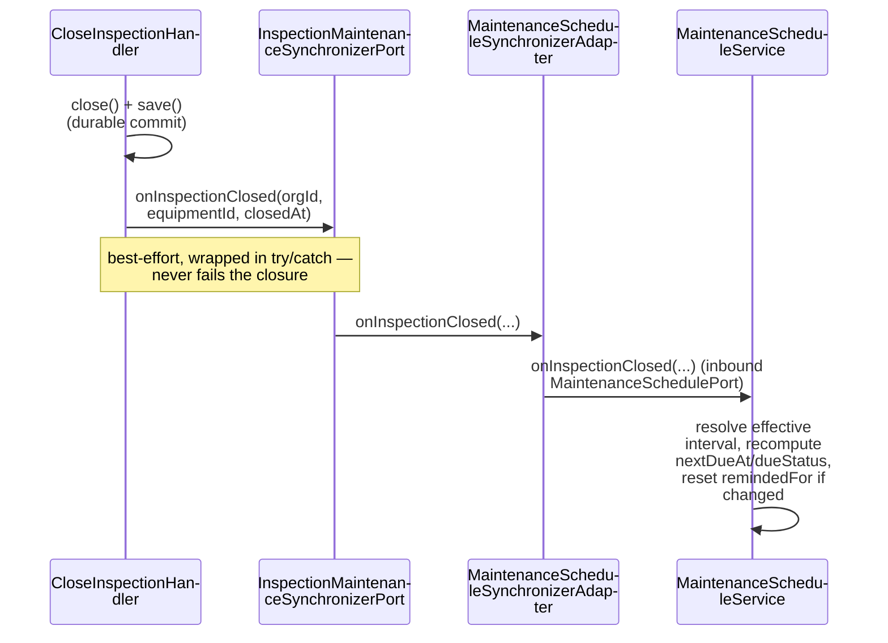

# Maintenance Module

**Reading guide:** [Documentation index](../../docs/README.md) · [Related guide](../../docs/guides/module-development.md).

## Overview

Maintenance owns independent preventive operations for fire-safety equipment.
Each organization explicitly chooses one persisted engine authority: historical
inspection schedules (`legacy`, the compatible default), or equipment plans
(`plans`). A plan owns one control or maintenance operation, its original calendar,
and stable occurrences. Historical schedule rows remain the compatible **control**
projection; servicing operations never contribute to compliance statistics.

Main goals:

- Track each equipment's next due inspection date and due status.
- Recompute schedules event-driven (an inspection closes) and on a recurring
  hourly sweep (bootstrap, decommission cleanup, due-status refresh,
  reminders).
- Let organization managers override the periodicity for a single piece of
  equipment.
- Generate an "inspection campaign" intervention draft from due/overdue
  schedules in one call.

## API Endpoints

The organization-scoped plan base is
`/api/organizations/{organizationId}/maintenance`. All operations require
`ROLE_USER`, then application permission/scope checks (403 for an unentitled
member, 404 outside the organization). Existing schedule routes below remain available.

| Method | Path relative to the plan base | Behavior | Permission |
| --- | --- | --- | --- |
| GET | `/plans` | Bounded page; equipmentId, operationKind, search, page and itemsPerPage filters | maintenance.read |
| POST | `/plans` | Prepare a control or maintenance operation; active defaults to false | maintenance.manage |
| GET / PATCH | `/plans/{id}` | Read/edit configuration; equipment and kind are immutable | maintenance.read / maintenance.manage |
| DELETE | `/plans/{id}` | Archive with 204, retaining readable history; resolve live work first | maintenance.manage |
| GET | `/plans/{id}/preview` | Pure preview of three anchored dates | maintenance.read |
| POST | `/plans/{id}/generate` | Atomically reserve occurrence, seed work and enqueue event; replay returns existing work | maintenance.manage + interventions.plan |
| POST | `/plans/prepare-legacy` | Prepare non-generating historical plans and exact source mapping | maintenance.manage |
| POST | `/plans/activate` | Locked, atomic handover; refuse ambiguous or submitted legacy work | maintenance.manage + interventions.plan |
| GET | `/engine` | Read authority and configured plan count, without mutation | maintenance.read |

Permission names above have the `organization.` prefix. New fixed plans require
equipmentId, name, operationKind (`control` or `maintenance`), interval (`PnD`,
`PnW`, `PnM` or `PnY`, bounded to ten years) and a first calendar anchor.
Use `anchorOn` and `nextDueOn` (`YYYY-MM-DD`) for date pickers. Explicit-offset
`anchorAt` and `nextDueAt` are alternatives, not simultaneous values. The plan
freezes the organization's IANA timezone. UTC persistence is rehydrated into
that original calendar, preserving month-end clamping and DST transitions.
An explicit next due date must be an actual slot of the anchored cadence.
No default frequency is inferred for new operations.

Generate accepts optional name and `retry: true`. An open occurrence with
existing work is replayed; retry is explicit and permitted only after abandonment,
a skipped published task, or unsuccessful servicing. Its original occurrence id
and due date remain unchanged. Outputs expose the server's retryAllowed decision.

`MaintenanceInterventionHistoryPort` publishes occurrence references to the
operational deletion guard. Generated work remains accessible after abandonment:
hard DELETE returns 409, preserving normal replay and retry of the original
occurrence and due date. The old task's occurrence link also retains previous
attempts after a retry moves the current occurrence to a new intervention.

| Method | Path                                | Description                                                                                                                                                                                                                                                                                                                                                                                                       | Permission                                                              |
| ------ | ----------------------------------- | ----------------------------------------------------------------------------------------------------------------------------------------------------------------------------------------------------------------------------------------------------------------------------------------------------------------------------------------------------------------------------------------------------------------- | ----------------------------------------------------------------------- |
| GET    | `/api/maintenance/schedules`        | List schedules (filters: `organization` _(required)_, `facility`, `equipmentType`, `dueStatus`, `dueBefore`; 30/page, client page size)                                                                                                                                                                                                                                                                           | `organization.maintenance.read`                                         |
| GET    | `/api/maintenance/schedules/export` | Streams a bounded, synchronous CSV export of schedules (filters: `organization` _(required)_, `facility`, `equipmentType`, `dueStatus`, `dueBefore` — the same filters as the list endpoint). Bounded to 50 000 matching rows (422 above the cap). Header: `id,equipment_id,equipment_type,equipment_serial,facility,periodicity_override,last_inspection_closed_at,next_due_at,due_status,created_at,updated_at` | `organization.maintenance.read`                                         |
| GET    | `/api/maintenance/schedules/{id}`   | Get a schedule                                                                                                                                                                                                                                                                                                                                                                                                    | `organization.maintenance.read`                                         |
| PATCH  | `/api/maintenance/schedules/{id}`   | Set/clear `intervalOverride` (`null` clears)                                                                                                                                                                                                                                                                                                                                                                      | `organization.maintenance.manage`                                       |
| POST   | `/api/maintenance/campaigns`        | Generate an intervention draft from due/overdue schedules matching `facility`/`equipmentType`/`dueBefore`; `201 {interventionId, number, workItemsCount}`                                                                                                                                                                                                                                                         | `organization.maintenance.manage` AND `organization.interventions.plan` |

Every operation requires `ROLE_USER` at the resource level; the finer-grained
permission checks above are enforced in the application layer (mirrors the
Intervention module's templates/labels). Every user-facing handler is
scope-aware: the by-id and list schedule handlers decide access through
`OrganizationAuthorizationPort::resolveAccess()`, and the campaign handler —
which must assert two permissions — gates on
`OrganizationAuthorizationPort::isMemberOf()` first. A schedule owned by, or a
listing/campaign scoped to, an organization the caller has no active
membership in yields the same 404 an unknown id produces
(`MaintenanceNotFoundException::withId()` / `::forOrganizationScope()` — a 403
would confirm the record or organization exists), while a member lacking the
required permission gets 403. The invariant is pinned by
`tests/Architecture/Unit/MaintenanceAuthorizationEnforcementTest.php`
(`RecomputeMaintenanceSchedulesHandler`, the user-less system sweep, is the
single justified exemption).

## Flows

### Independent operations and safe handover

Prepare legacy plans while `legacy` still owns all old entrypoints. Preparation
copies overrides, known completion/due dates and uniquely links legacyScheduleId;
uninitialized dates stay null unless an explicit first date has been configured.
Activation refreshes these sources while holding the organization transaction
lock shared by historical campaigns, schedule updates and workers. It attaches
each uniquely matching open historical inspection task to its occurrence. More
than one candidate, frozen submitted work or an unmappable control blocks the
entire transaction. Only after mapping succeeds does the authority become plans.
Preparing again and activating preserve the archival decision of an existing
historical candidate; an archived operation cannot regain generation authority.

Old campaign and override endpoints then delegate to the plan engine. The hourly
sweep refreshes the control projection and lifecycle suspension, without running
the historical recomputation/reminder engine for activated organizations. Missing
or retired equipment never causes plan/occurrence history to be deleted.

For fixed calendars, dates advance from the original anchor and clamp to the last
day of a shorter month; missed slots are skipped after a validated completion.
Legacy calendars retain their original sliding DateTime interval calculation and
override/default source. There is one open occurrence per plan, enforced in PostgreSQL.
Fixed-calendar occurrence due dates are returned in the plan's frozen timezone,
including after a UTC database reload. An open occurrence still freezes cadence
and calendar fields while permitting a name-only edit.

Plan campaigns resolve current equipment ownership, facility, type and lifecycle,
then the current historical override/default cadence, before applying scope and
due-date filters. Ineligible operations are skipped. Cadence updates are saved
after the bounded page scan so reordered due dates cannot skip candidates.

MaintenanceOperationsDuePort publishes a bulk owner-provided read contract for
Equipment and reporting: controlDueStatus/controlNextDueAt are independent from
serviceDueStatus/serviceNextDueAt. Historical maintenanceDueStatus remains a control
alias for compatibility. Missing initial dates on active operations are overdue;
archived sites and retired equipment expose unscheduled deadlines without deleting
their plans. Reads never initialize plans, mutate calendars or switch engine authority.

Intervention publication calls MaintenanceOperationResultsPort validateResult and
acknowledgeResult on the same main transaction as the publication. Source equipment,
operation, occurrence, intervention and result identity must match. Control results
complete the occurrence even when adverse; defects remain owned by Inspection.
Failed servicing keeps the occurrence due. Receipts make acknowledgment replay safe.
Standalone inspection closure never acquits an unrelated operation in the plans engine.

### Inspection closes (event-driven hot path)

Inspection closure triggers maintenance synchronization through the published contract. The diagram distinguishes the inspection outcome from the documented best-effort synchronization effect.

```mermaid
---
config:
  sequence:
    wrap: true
---
sequenceDiagram
  participant Insp as CloseInspectionHandler
  participant Sync as InspectionMaintenanceSynchronizerPort
  participant Adp as MaintenanceScheduleSynchronizerAdapter
  participant Svc as MaintenanceScheduleService
  Insp->>Insp: close() + save() (durable commit)
  Insp->>Sync: onInspectionClosed(orgId, equipmentId, closedAt)
  Note over Insp,Sync: best-effort, wrapped in try/catch — never fails the closure
  Sync->>Adp: onInspectionClosed(...)
  Adp->>Svc: onInspectionClosed(...) (inbound MaintenanceSchedulePort)
  Svc->>Svc: resolve effective interval, recompute nextDueAt/dueStatus, reset remindedFor if changed
```

### Recurring sweep (hourly)

`Infrastructure/Scheduler/MaintenanceScheduleProvider` (`#[AsSchedule('maintenance')]`)
triggers `RecomputeMaintenanceSchedulesCommand` hourly, consumed from the
`scheduler_maintenance` transport the Scheduler component registers
automatically (DSN `schedule://maintenance`) — run
`messenger:consume scheduler_maintenance` alongside the existing `async`
worker. `RecomputeMaintenanceSchedulesHandler` is idempotent and processes
everything page-wise (bounded memory):

1. **Reconcile**: pages through every organization's trackable equipment
   (`MaintenanceEquipmentDirectoryPort`); bootstraps a schedule for equipment
   with none yet (never inspected: `nextDueAt` null, `dueStatus` derived from
   periodicity presence), and drops the schedule of decommissioned equipment.
2. **Recompute**: pages through every schedule, recomputing `dueStatus`
   against the current instant.
3. **Remind**: for schedules entering `due_soon`/`overdue` where
   `remindedFor` doesn't already match `nextDueAt`, enqueues a
   `maintenance.inspection_due` / `maintenance.inspection_overdue`
   notification to the organization's administrators (`MaintenanceReminderNotifier`
   - `MaintenanceReminderRecipientResolver`), honoring the
     `inspectionDue` category toggle and the `inAppEnabled`/`emailEnabled`
     channels — mirrors `InterventionNotificationService`.

Each page uses scalar equipment/schedule reads, grouped inspection history and
organization policy reads, sorted advisory locks, and one schedule batch upsert.
These operations retain no managed records and never clear the caller's entity
manager. The source is reloaded after acquiring the locks so an inspection closure
or override cannot be overwritten by an older page. List and campaign ordering
ends with `id ASC`, including equal or absent due dates.

Run a full sweep outside a single enclosing database transaction: transaction
advisory locks release at each page commit. An enclosing transaction retains all
page locks until its own commit and can exhaust PostgreSQL's shared lock budget.
Individual page/equipment operations still join a caller transaction safely and
preserve its managed records and pending changes.

`MaintenanceImportBoundedWorkloadTest` exercises 20,000 published equipment in
three native PostgreSQL sweeps. Its budgets bound SQL by pages, incremental memory
and retained ORM entities. The measured median was 7.568 seconds, approximately
1,300 statements, one pre-existing managed entity and at most 4 MiB additional
memory; `var/maintenance-sweep-benchmark.json` records every sample. Measurements
are specific to the local runner; the performance suite enforces acceptance
budgets separately.

Reminder enqueueing and its schedule marker commit in the same main transaction.
`MaintenanceReminderSubscriber` delivers the queued event after commit. A failed
recipient/channel throws for Messenger retry; preferences or organization policy
suppression completes normally. Stable per-recipient identities use Notification's
durable inbox/channel receipts, retaining completed channels across partial fanout
failure. External acknowledgement loss can still repeat an external delivery.

### Generate an inspection campaign (synchronous)

`GenerateInspectionCampaignHandler` gates on
`OrganizationAuthorizationPort::isMemberOf()` first (a non-member gets 404,
see API Endpoints above), then asserts BOTH
`organization.maintenance.manage` and `organization.interventions.plan`
(the draft factory itself does not authorize), selects `due_soon`/`overdue`
schedules matching the given filters, and routes through
`Intervention\Application\Port\Inbound\InterventionDraftFactoryPort` — the
same programmatic draft-creation path other automations use — with
`origin: 'maintenance:campaign'`, one planned `inspection` work item per
equipment (`target: {"equipmentId": "..."}`).

The handler counts candidates before reading or creating a draft and returns 422
above `maintenance.max_campaign_work_items` (default 25). The bounded read fetches
one extra candidate and repeats the limit check to cover growth after counting.
The PostgreSQL regression exercises the configured limit through the real draft
factory; increasing the limit requires measuring that synchronous creation path.
On the local native PostgreSQL runner, 25 work items took 1.331 seconds while 200
took 41.328 seconds; this measured synchronous cost establishes the default cap.

## Architecture

- **Presentation** (`src/Maintenance/Presentation/Api`): `MaintenanceScheduleResource`
  (list/get/patch) and `MaintenanceCampaignResource` (generate), providers,
  processors, input/output DTOs, `ValidPeriodicityOverride` validator (delegates
  to `PeriodicityInterval::fromString()`), `MaintenanceExceptionMapperTrait`.
- **Application** (`src/Maintenance/Application`): use cases (schedule
  list/get/override, campaign generation, the recurring sweep), outbound
  ports, contracts, and services (`MaintenanceScheduleService` — the inbound
  port implementation, `MaintenanceReminderRecipientResolver`,
  `MaintenanceReminderNotifier`).
- **Domain** (`src/Maintenance/Domain`): `MaintenanceDueStatus`,
  `PeriodicityInterval`, `MaintenanceScheduleRecomputePolicy`, exceptions,
  events.
- **Infrastructure** (`src/Maintenance/Infrastructure`): Doctrine record/repository,
  the Inspection-side synchronizer adapter, and the hourly scheduler.

**Documented gap**: `maintenance_schedules.facility_id` is a denormalized,
FK-less string link (see `## Persistence`), and Maintenance has no outbound
dependency port consumed by `Facility\Application\Service\FacilityArchivalGuard`.
Archiving a facility does **not** stop its schedules from generating —
the recurring sweep keeps materializing maintenance work against an archived
facility. Deliberate for now; a follow-up candidate if this proves to matter
in practice.

### Ports & adapters (`config/modules/maintenance.yaml`)

| Port                                                                                                                                            | Adapter                                                                                   |
| ----------------------------------------------------------------------------------------------------------------------------------------------- | ----------------------------------------------------------------------------------------- |
| `MaintenanceScheduleRepositoryPort` (outbound)                                                                                                  | `MaintenanceScheduleRepository`                                                           |
| `MaintenanceSchedulePort` (inbound)                                                                                                             | `MaintenanceScheduleService`                                                              |
| `MaintenanceEquipmentDirectoryPort` (outbound, cross-module)                                                                                    | `Equipment\Infrastructure\Adapter\Maintenance\EquipmentMaintenanceDirectoryAdapter`       |
| `MaintenanceCompliancePolicyPort` (outbound, cross-module)                                                                                      | `Organization\Infrastructure\Adapter\Maintenance\OrganizationCompliancePolicyAdapter`     |
| `Inspection\Application\Port\Outbound\InspectionMaintenanceSynchronizerPort` _(cross-module, consumed by Inspection)_                           | `Maintenance\Infrastructure\Adapter\Inspection\MaintenanceScheduleSynchronizerAdapter`    |
| `Equipment\Application\Port\Outbound\MaintenanceDueStatusPort` _(cross-module, consumed by Equipment)_                                          | `Maintenance\Infrastructure\Adapter\Equipment\EquipmentMaintenanceDueStatusAdapter`       |
| `Calendar\Application\Port\Outbound\Feed\MaintenanceCalendarFeedPort` _(cross-module, consumed by Calendar)_                                    | `Maintenance\Infrastructure\Adapter\Calendar\MaintenanceCalendarFeedAdapter`              |
| `Assistant\Application\Port\Outbound\AssistantContextProviderPort` _(cross-module, consumed by Assistant, tagged `assistant.context_provider`)_ | `Maintenance\Infrastructure\Adapter\Assistant\MaintenanceAssistantContextProviderAdapter` |
| `MaintenanceEquipmentNamingPort` (outbound, cross-module)                                                                                       | `Equipment\Infrastructure\Adapter\Maintenance\EquipmentMaintenanceNamingAdapter`          |
| `MaintenanceFacilityNamingPort` (outbound, cross-module)                                                                                        | `Facility\Infrastructure\Adapter\Maintenance\FacilityMaintenanceNamingAdapter`            |

**CSV export (`GET /maintenance/schedules/export`)**: mirrors the Intervention
module's `ExportInterventionsHandler`/`ExportInterventionsController` pattern
exactly — a synchronous, streamed CSV (no 202+poll), bounded to
`ExportMaintenanceSchedulesHandler::MAX_EXPORT_ROWS` (50 000) via a cheap
`COUNT` before any row is fetched (`MaintenanceScheduleRepositoryPort::countForExport()`
/ `::listExportCandidates()`, ordered `updatedAt` DESC, `id` ASC), with the
equipment serial number and facility display name resolved in two bulk round
trips — never one query per row — through the two naming ports above. Unlike
the calendar feed adapter (which explicitly skips equipment naming as a
per-row cost), the export's naming stays bulk and is therefore affordable.
The list and export share `facility`, `equipmentType`, `dueStatus` and inclusive
`dueBefore` filters. The `(organization_id, next_due_at)` index supports date-bounded
exports independently of status. The controller dispatches
`MaintenanceSchedulesExportedEvent` (organization id, actor, `csv`, row
count, applied filter _names_ only) after a successful stream, the same
audit-without-raw-values discipline `InterventionsExportedEvent` follows.

`EquipmentMaintenanceDirectoryAdapter` queries `EquipmentRecord` directly
(published records only) rather than growing `EquipmentRepositoryPort`: the
cross-organization paginated listing the sweep needs has no equivalent
there — mirrors `InterventionStatisticsAdapter` querying `InterventionRecord`
directly. `OrganizationCompliancePolicyAdapter` reads the organization's
existing `OrganizationComplianceSettings` value object, mirroring
`OrganizationNotificationPolicyService`.

**L2.10 — per-equipment maintenance due status on `/equipment`**:
`EquipmentMaintenanceDueStatusAdapter` implements the Equipment module's
`MaintenanceDueStatusPort` — the reverse direction of
`MaintenanceEquipmentDirectoryAdapter` above (here Maintenance is the
_provider_ of the read model, hosting the adapter, per this repo's
cross-module convention). A single DQL query resolves the whole batch of
requested equipment ids (`s.organization = :organization AND s.equipmentId IN
(:equipmentIds)`), scoped to one organization; equipment ids with no matching
`MaintenanceScheduleRecord` default to `unscheduled` in PHP before the query
even runs, so the returned map always has one entry per requested id.
Covered by an integration test (real DQL, including the cross-organization
scoping guard) — see Testing below.

**Calendar unified feed**: `MaintenanceCalendarFeedAdapter` queries
`MaintenanceScheduleRecord` directly (main entity manager), mirroring
`EquipmentMaintenanceDueStatusAdapter`, since neither `list()` nor
`listDueForCampaign()` on `MaintenanceScheduleRepositoryPort` offers a plain
`nextDueAt` range across every due status. Every due status is included
(not just `due_soon`/`overdue`): navigating the calendar to a past date
range should still surface schedules that were due then. No equipment name
is resolved (would require a per-row cross-module call into Equipment); the
frontend deep-links via `targetId` (the schedule id). Registered in
`config/modules/maintenance.yaml`; aliased in `config/modules/calendar.yaml`.
See `src/Calendar/MODULE.md`.

**Assistant business-context provider (L2.2)**:
`MaintenanceAssistantContextProviderAdapter` implements the Assistant
module's `assistant.context_provider` tagged-iterator seam
(`Assistant\Application\Port\Outbound\AssistantContextProviderPort` — see
`src/Assistant/MODULE.md`), feeding the assistant's "What's blocking the
campaign?" suggested prompt: overdue + due-soon totals plus up to 5 rows of each
(equipment type, due status, due date), soonest-due first. `supports()`
gates on `organization.maintenance.read`. Reuses
`MaintenanceScheduleRepositoryPort::list()` VERBATIM (two calls,
`dueStatus: 'overdue'` and `dueStatus: 'due_soon'`) — no new DQL, so unlike
Inspection's sibling adapter this needed no dedicated integration test.
Registered + tagged (`priority: 10`, the lowest of the three launch
providers — rendered last) in `config/modules/maintenance.yaml`. Never
throws (an internal failure or an "everything up to date" org both return
`AssistantContextFragment::empty()`).

Reused inbound ports from other modules: `Notification\Application\Port\Inbound\NotificationPort`
(reminders) and `Intervention\Application\Port\Inbound\InterventionDraftFactoryPort`
(campaign generation).

## Domain Model

`MaintenanceScheduleRecord` (record-level entity — no domain aggregate, the
same treatment `InterventionTemplateRecord`/`InterventionLabelRecord`
receive; the recompute POLICY lives in the domain service below):

- `id`, `organizationId`, `equipmentId`
- `facilityId` (nullable, denormalized), `equipmentType` (denormalized)
- `intervalOverride` (ISO-8601 duration string, nullable) — per-equipment
  override of the organization's compliance periodicity
- `lastInspectionClosedAt` (nullable)
- `nextDueAt` (nullable) — null when the equipment type is untracked
  (`unscheduled`), or when the equipment has never been inspected while a
  periodicity applies (`overdue`, treated as immediately due)
- `dueStatus` (`unscheduled` | `up_to_date` | `due_soon` | `overdue`)
- `lastRemindedAt` (nullable, observability only)
- `remindedFor` (nullable) — the `nextDueAt` value a reminder has already
  been queued for; the anti-duplicate marker, reset whenever `nextDueAt`
  changes
- `createdAt`, `updatedAt`

Value objects (`Domain/ValueObject`):

- `MaintenanceDueStatus` — the four due status values, with `values()`.
- `PeriodicityInterval` — validates an ISO-8601 duration within
  `[P28D, P10Y]`, mirroring
  `Organization\Domain\ValueObject\OrganizationComplianceSettings::assertPeriodicityInBounds()`.

Domain service (`Domain/Service/MaintenanceScheduleRecomputePolicy`) — pure,
I/O-free recompute rules:

- **Effective interval**: per-schedule override wins over the organization's
  compliance periodicity for the equipment type; neither set means
  untracked.
- **Due status**: `unscheduled` with no effective interval; `overdue` when an
  interval applies but the equipment has never been inspected; otherwise
  `overdue` once now is strictly after the due date, `due_soon` inside the
  organization's reminder window, `up_to_date` otherwise.
- **Reminder re-arming**: `remindedFor` must be reset whenever `nextDueAt`
  changes so a schedule that moved can be reminded again.

## Permissions

`organization.maintenance.read` / `organization.maintenance.manage`
(`Organization\Domain\Catalog\OrganizationPermissionCatalog`).
`organization.maintenance.read` is included in the `member` system role's
canonical permission set (`OrganizationSystemRoleCatalog::permissionsFor()`),
consistent with the other read-only permissions granted to every member.
Canonical system-role permissions are merged in at **read time**
(`OrganizationSystemRoleCatalog::mergePermissions()`, consumed by
`OrganizationMemberRepository::getPermissionNamesForUserInOrganization()`),
so existing organizations' `member` roles pick up the new permission
automatically — no backfill migration is needed.

## Persistence

- Table: `maintenance_schedules` (**main** database), unique
  `(organization_id, equipment_id)`, index
  `(organization_id, due_status, next_due_at)`.
- Doctrine mapping: `src/Maintenance/Infrastructure/Persistence/Doctrine/Record`.
- Repository: `Maintenance\Infrastructure\Persistence\Doctrine\Repository\MaintenanceScheduleRepository`.
- No backfill on migration: the first hourly sweep bootstraps every
  organization's schedules from scratch.

## Configuration

- Service wiring: `config/modules/maintenance.yaml`
- Plan repository and authority locks: explicit `doctrine.dbal.main_connection`;
  plan-generated events use `TransactionalEventDispatcher` on that same connection.
- Plan and occurrence storage mapping preserves every historical scalar, nullable
  link and UTC timestamp independently of creation validation. Calendar anchors
  and due slots are restored in the plan's frozen timezone; SQL, authority locks
  and transactions remain owned by the repository.
- Facility lifecycle suspension uses the owner-provided ancestry adapter on main;
  organization calendar context uses the published workforce directory port.
- Additive main migrations `Version20261006102000`, `Version20261006102001`
  and `Version20261006102002` (immutable UTC datetime annotations);
  authority defaults to legacy until an explicit successful activation.
- Doctrine mapping (main entity manager): `config/packages/doctrine.yaml`
- Messenger routing: `config/packages/messenger.yaml` (`RecomputeMaintenanceSchedulesCommand` → `async`;
  the schedule itself is consumed from the auto-registered `scheduler_maintenance`
  transport)
- Cross-module wiring (additive): `config/modules/equipment.yaml`,
  `config/modules/organization.yaml`, `config/modules/inspection.yaml`,
  `config/modules/facility.yaml` (the two export naming adapters' entity
  manager arguments)

## Testing

Occurrence retention coverage generates work, refuses task DELETE, abandons the
parent, refuses parent DELETE, then verifies replay and retry keep the original
occurrence and due date while both previous and current work remain accessible.

- New operation coverage: Unit/Maintenance Domain, plan command/query handlers,
  plan processor/provider; Functional/Api/MaintenancePlanApiTest; and the PostgreSQL
  MaintenancePlanRepositoryTest with two real worker connections, the native Doctrine
  outbox sender, rollback visibility and the partial unique open-occurrence constraint.

- Unit: `tests/Unit/Maintenance` — including (L2.2)
  `Infrastructure/Adapter/Assistant/MaintenanceAssistantContextProviderAdapterTest.php`
  (permission gate, empty-fragment when nothing is due, soonest-first
  ordering across the merged overdue+due-soon rows, resilience when the
  repository throws) — no new DQL, so a stubbed/mocked
  `MaintenanceScheduleRepositoryPort` fully covers it.
- Integration (real DQL, real database): `tests/Integration/Maintenance/Infrastructure/Adapter/Equipment/EquipmentMaintenanceDueStatusAdapterTest.php`
- Export coverage: `tests/Unit/Maintenance/Application/UseCase/Query/ExportMaintenanceSchedules/ExportMaintenanceSchedulesHandlerTest.php`
  (403/404/422/success, ports mocked), `tests/Unit/Maintenance/Presentation/Api/Controller/ExportMaintenanceSchedulesControllerTest.php`
  (CSV body — `StreamedResponse::getContent()` is not reliably buffered by the
  functional `KernelBrowser` test client, the same reason the functional test
  below stops at the HTTP-contract level), `tests/Functional/Api/MaintenanceScheduleExportApiTest.php`
  (200 + content type/disposition, 401, 403, 404).
- Run module tests: `php -d memory_limit=1G vendor/bin/phpunit tests/Unit/Maintenance/`

## Error Codes

| Exception                                                                                              | HTTP                     |
| ------------------------------------------------------------------------------------------------------ | ------------------------ |
| `MaintenanceAccessDeniedException` / `Organization\Domain\Exception\OrganizationAccessDeniedException` | 403 Forbidden            |
| `MaintenanceNotFoundException`                                                                         | 404 Not Found            |
| `MaintenanceValidationException`                                                                       | 422 Unprocessable Entity |
| `MaintenanceExportTooLargeException`                                                                   | 422 Unprocessable Entity |
| `InvalidArgumentException`                                                                             | 400 Bad Request          |

## Recalculation and freshness

Equipment persistence emits `EquipmentChangedEvent` into the main transactional outbox,
including publication and import writes. Compliance settings updates enqueue their settings
event before commit. Maintenance reloads current source state on delivery; replayed events
cannot restore a historical policy or move the last closed inspection backwards. Inspection
closure, interval override and equipment recalculation serialize on one main transaction-scoped
lock per organization/equipment. Decommissioned or deleted equipment loses its schedule.
The hourly sweep reconciles facility/type and recalculates next due dates as recovery.

`evaluatedAt` records actual successful evaluation, even when the resulting status is unchanged.
Old rows remain null until evaluated; migration does not synthesize freshness. Compliance reads
per-facility evaluation counts and the oldest timestamp through its owner-published port.
List and CSV export apply the same inclusive `dueBefore` predicate to rows and totals.

Recalculation subscribes to the shared dispatcher's stable event names
`equipment.equipment_changed_event` and `organization.organization_settings_updated_event`.
Both payloads are public Application Contracts. Integration coverage delivers the real
outbox envelope rather than invoking the subscriber directly.
