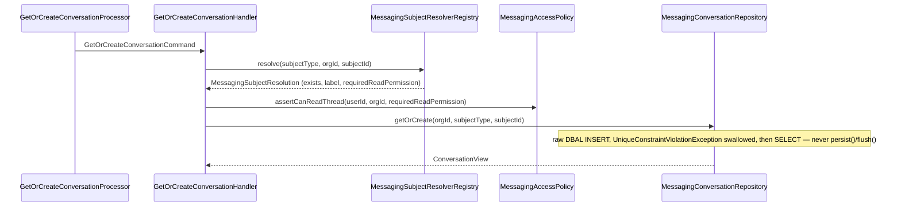
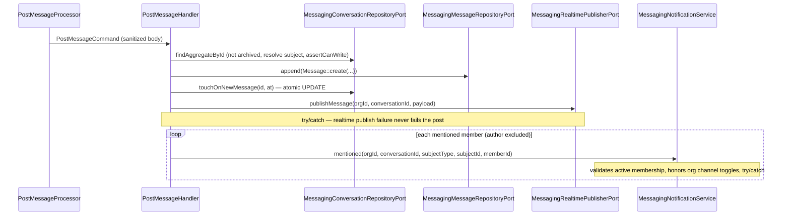

# Messaging Module

## Overview

Messaging hosts contextual discussion threads bound one-to-one to a core-entity
subject (facility | equipment | intervention | non-conformity in v1), with
server-parsed `@{memberUuid}` mentions, tombstone deletes (body retained for
compliance), per-member unread markers, and Mercure real-time push on a private
per-conversation topic.

Main goals:

- Rattach conversations to the entity they concern instead of scattering
  decisions across email/chat.
- Notify mentioned members in-app and by email (per organization toggles).
- Push new/edited/deleted messages in real time to everyone subscribed to the
  conversation.
- Keep a compliance-grade tombstone: a deleted message's body is retained in
  the database, redacted only at the API boundary.

It deliberately does NOT extend `Notification` (a delivery *channel*, not a
conversational space) nor generalize `Intervention`'s append-only activity
feed (different semantics — intervention comments stay where they are).

Beyond subject threads, the module also hosts named group **channels** (v2,
shipped — see "v2 channels" below) and 1-to-1 **direct messages** between two
organization members (L2.4, shipped — see "Direct messages" below). Both are
`Conversation` aggregates with `visibility=PARTICIPANTS`, gated by an
explicit `messaging_participants` row instead of a subject permission, so
every conversation-scoped endpoint (messages, read markers, pins, reactions,
saves, favorites, Mercure subscription) already treats them identically —
only the two CREATION paths differ.

Messages also support **single-level threaded replies** (L2.5, shipped — see
"Threaded replies" below): any root message can be replied to, in any
conversation kind (subject thread, channel, or direct conversation) alike,
since a reply is gated exactly like posting a root message in the SAME
conversation.

Channels can also be nested under another channel (L2.6, shipped — see
"Channel parent/child hierarchy" below): `messaging_conversations.parent_conversation_id`
lets a client group a flat channel list into a tree (e.g. a site channel
with per-discipline child channels underneath), bounded to a small maximum
depth and guarded against cycles and cross-organization parents.

The module also exposes lightweight online presence (L2.7, shipped — see
"Online presence" below): `POST /api/presence/ping` and `GET /api/presence`
are backed entirely by `Shared\Application\Port\Outbound\CachePort` — **there
is no `messaging_presence` table, and none is planned.** Presence is
inherently ephemeral, so a TTL-native cache entry is the correct storage,
not a stopgap.

## API Endpoints

| Method | Path | Description | Permission |
| --- | --- | --- | --- |
| GET | `/api/conversations` | List an organization's conversations (filters: `organization` *(required)*, `subjectType`, `subjectId`, `isArchived`, `unreadOnly`; 30/page, client page size) | `organization.messaging.read` |
| POST | `/api/conversations` | Get-or-create a conversation by subject (`organization`, `subjectType`, `subject` IRIs); `200` (idempotent, not `201`) | `organization.messaging.read` + the subject's own read permission |
| POST | `/api/direct-conversations` | Get-or-create a 1-to-1 direct conversation with another organization member (`organization` IRI, `memberId`); `200` (idempotent, not `201`); L2.4 | `organization.messaging.read` (floor permission — see Permissions); the target member must be an ACTIVE member of the same organization |
| GET | `/api/direct-conversations` | List the acting member's direct conversations in one organization, most recently active first (filters: `organization` *(required)*, `isArchived`; 30/page, client page size); each row carries `counterpartMember` (the OTHER participant's member IRI, since `name` is always null for a DM) | `organization.messaging.read` (an INNER JOIN on `messaging_participants`, exactly like `GET /api/channels`, scopes the result to conversations the caller is a participant of — never another member's DM) |
| GET | `/api/conversations/{id}` | Get a conversation (resolves `subjectLabel` + `unreadCount`) | `organization.messaging.read` + the subject's own read permission |
| PATCH | `/api/conversations/{id}` | Archive/unarchive (`{isArchived}`) | `organization.messaging.manage` |
| PATCH | `/api/conversations/{id}/read` | Mark the acting member's read position (`{lastReadMessageId?}`) | `organization.messaging.read` + the subject's own read permission |
| GET | `/api/conversations/{id}/subscription` | Mercure subscriber JWT scoped to this ONE conversation's private topic | `organization.messaging.read` + the subject's own read permission |
| GET | `/api/conversations/{conversationId}/messages` | List a conversation's messages, oldest first (30/page, client page size) | `organization.messaging.read` + the subject's own read permission |
| POST | `/api/conversations/{conversationId}/messages` | Post a message (`{body}`, sanitized rich text, optional `references[]`); `201` | `organization.messaging.write` + the subject's own read permission |
| PUT | `/api/conversations/{conversationId}/messages/{clientId}` | Post a message under a client-minted id; requires `If-None-Match: *`; `201`, or `409` `/problems/client-resource-already-exists` on replay | same as POST |
| PATCH | `/api/messages/{id}` | Edit own message (`{body}`, optional replacement `references[]`) — author-only | `organization.messaging.write` + the subject's own read permission |
| GET | `/api/conversations/{conversationId}/activity` | Zero-filled UTC daily message counts (`buckets`, default 26, max 366) | same access rule as `ListMessages` |
| GET | `/api/conversations/{conversationId}/links` | URLs extracted from message bodies, newest first (30/page, client page size) | same access rule as `ListMessages` |
| DELETE | `/api/messages/{id}` | Tombstone-delete (author self-delete, or manager moderation); `204` | author, or `organization.messaging.manage` |
| POST | `/api/messages/{id}/replies` | Post a threaded reply to a ROOT message (`{body}`, sanitized rich text); `201`; L2.5 | `organization.messaging.write` + the subject's own read permission — same gate as posting a root message |
| GET | `/api/messages/{id}/replies` | List a message's threaded replies, oldest first (30/page, client page size); L2.5 | same access rule as `ListMessages` |
| POST | `/api/messages/{messageId}/attachments` | Upload a multipart file attachment to a message; `201` | `organization.messaging.write` + the subject's own read permission |
| GET | `/api/conversations/{conversationId}/attachments` | The conversation Files tab, most recently uploaded first (30/page, client page size) | same access rule as `ListMessages` |
| DELETE | `/api/messaging-attachments/{id}` | Delete an attachment (uploader self-delete, or manager moderation); `204`, requires `If-Match` | uploader, or `organization.messaging.manage` |
| GET | `/api/messaging-attachments/{id}/content` | Download an attachment's stored file bytes — streams from the object store with `Content-Type` and `Content-Disposition: attachment; filename="…"` (also `X-Content-Type-Options: nosniff`, `Cache-Control: private, no-store`) | same access rule as `ListMessages` (the owning conversation's read gate) |
| POST | `/api/messages/{id}/pin` | Pin a message in its conversation; idempotent, `200` (not `201` — no new resource URI is created) | `organization.messaging.write` + the subject's own read permission |
| DELETE | `/api/messages/{id}/pin` | Unpin a message; idempotent — unpinning a non-pinned message never errors; `204` | the pinning member, or `organization.messaging.manage` (only enforced when the message IS pinned) |
| GET | `/api/conversations/{conversationId}/pinned-messages` | The conversation Pins tab, most recently pinned first (30/page, client page size) | same access rule as `ListMessages` |
| POST | `/api/messages/{id}/reactions` | React with an emoji (`{emoji}`); idempotent insert, `200` (not `201`) | `organization.messaging.read` + the subject's own read permission — **not** `.write`, see Permissions |
| DELETE | `/api/messages/{id}/reactions/{emoji}` | Remove the ACTING member's own reaction; idempotent — never errors, even if never reacted; `204` | active organization membership only (the primary key ties the delete to the caller — there is no other member's reaction to target) |
| POST | `/api/messages/{id}/save` | Save (bookmark) a message for the acting member; idempotent, `200` (not `201`) | `organization.messaging.read` + the subject's own read permission — same as reacting |
| DELETE | `/api/messages/{id}/save` | Unsave the ACTING member's own save; idempotent — never errors, even after losing access to the message's subject; `204` | active organization membership only |
| GET | `/api/saved-messages` | The acting member's "Saved items" list ACROSS THE WHOLE ORGANIZATION, most recently saved first (filter: `organization` *(required)*; 30/page, client page size) | active organization membership only (see Permissions — deliberately no per-message re-check, mirrors the `ListConversations` list-is-cheaper-than-open stance) |
| POST | `/api/conversations/{id}/favorite` | Favorite a conversation or channel (a channel id IS a conversation id); idempotent, `200` (not `201`) | `organization.messaging.read` + the subject's own read permission, or channel participation |
| DELETE | `/api/conversations/{id}/favorite` | Unfavorite the ACTING member's own favorite; idempotent — never errors, even after losing access to the conversation's subject; `204` | active organization membership only |
| POST | `/api/presence/ping` | Record the ACTING member's own online presence (`organization` IRI only — there is no `memberId` field); `200`; **rate-limited** (`limiter.messaging_presence_ping`, 6/min per user+organization); L2.7 | `organization.messaging.read` (floor permission, see Permissions) |
| GET | `/api/presence` | Multi-get presence for a caller-supplied `memberIds` filter (comma-separated, **required**, max 100 ids — there is NO "list all online members" mode); L2.7 | `organization.messaging.read` (floor permission) |

Every operation requires `ROLE_USER` at the resource level; the finer-grained
permission checks above are enforced in the application layer (mirrors
Maintenance/Intervention).

Structured message references are bounded to five entries and accept only
`non_conformity`, `intervention`, `facility`, or `equipment`. The command
handler resolves every target inside the conversation's organization before
persisting; tombstoned outputs redact the list to `[]`. URLs are extracted
synchronously on post/edit into the satellite `messaging_message_link` table.

`Version20260721090000` is a **main-database-only**, additive migration: it
creates `messaging_message_link` and adds the nullable JSON `references` column
to `messaging_messages`; it never touches auth tables or rewrites existing
rows. After deploying that migration and the compatible backend, run the
resumable, idempotent historical extraction:

```bash
php -d memory_limit=512M bin/console app:messaging:backfill-links --dry-run
php -d memory_limit=512M bin/console app:messaging:backfill-links --batch-size=100
```

The command uses an exclusive message-id cursor (`--after`) and clears links
for tombstoned messages. Structured references cannot be inferred and are not
backfilled.

**List-vs-read asymmetry** (deliberate, for cost): `ListConversations` gates by
`organization.messaging.read` alone, with no per-row subject-permission check.
Opening a specific thread (`GetConversation`, `ListMessages`, the subscription
endpoint) additionally requires the subject's own read permission — so an
archived or subject-restricted thread can appear in a list without ever being
readable.

**`GET /api/conversations` NEVER returns a channel or a direct conversation**
(both are `subjectType IN (CHANNEL, DIRECT)`, filtered out by
`MessagingConversationRepository::list()`) — channels are listed through
`GET /api/channels` instead, and a direct conversation is listed through
`GET /api/direct-conversations` instead (see "Direct messages" below; a
member may also reopen a specific direct conversation idempotently through
`POST /api/direct-conversations`, which resolves to the same conversation
id every time). This is a hard product invariant, not an oversight: a
private 1-to-1 conversation showing up in the organization-wide list would
be a privacy leak even though it stays tenant-correct (still scoped to the
organization) — `GET /api/direct-conversations` itself preserves the same
invariant one level down, by scoping to the CALLER's own participant rows
only (an INNER JOIN on `messaging_participants`, exactly like
`listChannelsForMember()`), so it can never be used to enumerate another
member's direct conversations either.

**`GET /api/conversations/{conversationId}/messages` NEVER returns a threaded
reply** (`parent_message_id NOT NULL`, filtered out by
`MessagingMessageRepository::listByConversation()`, L2.5) — a reply is
fetched through its own parent via `GET /api/messages/{id}/replies` instead.
See "Threaded replies" below.

**`POST` is not replay-safe; `PUT .../messages/{clientId}` is.** The `POST`
route mints the message id server-side, so a client whose response was lost has
no way to retry without creating a second message — nothing on either side can
detect the duplicate. An offline outbox must therefore use the `PUT` twin,
where the client owns the id: `PostMessageHandler::resolveMessageId()` rejects
an already-used id with `MessagingClientMessageAlreadyExistsException`, which
the processor maps to the codebase-wide
`/problems/client-resource-already-exists` problem type (`409`). Callers should
read that conflict as **success** — the message is already stored. The check is
a read-then-write with no transaction; a genuine concurrent double-submit of
the same id still collides on the primary key, which is the database enforcing
the same rule. This mirrors the client-uuid creation already used by Facility,
Equipment, Inspection and Intervention, and reuses their
`CreationPreconditionGuard`.

## Domain Model

`Conversation` aggregate (`Domain/Model/Conversation`): `id`, `organizationId`,
`subjectType` (`MessagingSubjectType`), `subjectId` (nullable — always set in
v1, reserved for v2 channels), `visibility` (`ConversationVisibility::SUBJECT`
in v1, `PARTICIPANTS` reserved), `lastMessageAt`, `messagesCount`,
`isArchived`, timestamps. `archive()`/`unarchive()` are idempotent (return
`false` on a no-op transition so the handler skips re-emitting the domain
event). `touchLastMessage()`/`incrementMessagesCount()` exist for domain
completeness, but the hot path of posting a message updates
`messages_count`/`last_message_at` through a single atomic `UPDATE` (see
`MessagingConversationRepositoryPort::touchOnNewMessage()`), not a
load-modify-save cycle, to stay correct under concurrent posts.
`rename()`/`bindTeam()`/`unbindTeam()` are channel-only mutators (v1
subject-thread conversations have no caller path to them). `setParent()`
(L2.6, channel-only) sets or clears `parentConversationId` — it trusts
whatever id it is given, exactly like `bindTeam()` trusts its team id: ALL
cycle/cross-organization/max-depth validation happens BEFORE it is called,
in `MessagingChannelHierarchyGuard` (see "Channel parent/child hierarchy"
below), never inside the aggregate itself.

`Message` aggregate (`Domain/Model/Message`): `id`, `conversationId`,
`organizationId`, `authorMemberId`, `body`, `mentions` (`list<string>` member
ids), `editedAt`, `deletedAt`/`deletedByMemberId`, timestamps. `edit()`
re-validates the body and recomputes mentions, returning only the *newly
added* mentions (so an edit doesn't re-notify already-mentioned members);
refuses to edit an already-tombstoned message. `tombstone()` sets
`deletedAt`/`deletedByMemberId` (idempotent) — **the body is retained**, never
cleared; redaction happens only in `MessageOutputFactory`. `pin(memberId)`/
`unpin()` (L1.3) set/clear `pinnedAt`/`pinnedByMemberId` — both idempotent
(pinning an already-pinned message keeps the ORIGINAL pinner/timestamp
rather than re-crediting the new caller; unpinning a non-pinned message is a
silent no-op). `pin()` refuses an already-tombstoned message. **A pin is a
property of the CONVERSATION** (every reader sees the same pinned set),
never a per-member concept — do not confuse with a saved message
(`messaging_saved_messages`, private to one member, L1.5). Tombstoning a
PINNED message does NOT auto-unpin it: the pin flag is retained (so a
manager can still find and explicitly unpin it), but the pinned entry
renders with the same `body: null` redaction as any other tombstoned
message in the Pins tab — never a silent content leak.

`parentMessageId` (L2.5, nullable) marks a message as a threaded reply;
`isReply()` returns `true` when it is set. `replyCount` mirrors
`Conversation::$messagesCount`: populated on reconstitution but bumped on the
hot path through a single atomic `UPDATE`
(`MessagingMessageRepositoryPort::incrementReplyCount()`), never a
load-modify-save cycle on the aggregate — `incrementReplyCount()` exists on
`Message` itself only for domain completeness/unit testing, mirroring
`Conversation::incrementMessagesCount()`. Threading is deliberately
**single-level**: `PostReplyHandler` refuses a reply whose PARENT
`isReply()` (a reply to a reply), instead of allowing unbounded nesting —
the safer default. Replying to an already-tombstoned parent is also refused
(mirrors `pin()`/`AddReactionHandler`/`SaveMessageHandler`'s refusal of the
same state); both checks depend on the PARENT's state, so they live in
`PostReplyHandler`, not on `Message` itself. An EXISTING reply remains fully
readable (via `GET /api/messages/{id}/replies`) even after its parent is
later tombstoned — only POSTING a NEW reply to a tombstoned parent is
refused. See "Threaded replies" below.

Value objects (`Domain/ValueObject`): `ConversationId`/`MessageId`
(Uuid-backed), `MessagingSubjectType` (`facility` | `equipment` |
`intervention` | `non_conformity` | `channel` | `direct` — `channel` (v2)
and `direct` (L2.4) are the two cases with no resolver-backed subject; see
"v2 channels" and "Direct messages" below), `ConversationVisibility`
(`subject` | `participants`), `MessageBody` (trims, rejects blank/`>4000` chars),
`MessagingEmoji` (L1.4 — trims, bounds to 32 characters (mirrors
`messaging_reactions.emoji varchar(32)`), and requires EXACTLY one extended
grapheme cluster containing at least one non-ASCII codepoint: this accepts a
ZWJ family sequence, a flag, a skin-tone-modified emoji, or a keycap
sequence like `3️⃣` as a single reaction, while rejecting a pasted sentence,
several emoji in a row, or a bare letter/digit/punctuation mark that also
happens to form one grapheme on its own. Uses `grapheme_strlen()`, provided
by `symfony/polyfill-intl-grapheme` even where `ext-intl` is absent from the
runtime).

**Reactions have NO domain aggregate (L1.4).** `messaging_reactions` is a
pure join table, composite-keyed `(message_id, member_id, emoji)` — exactly
like `messaging_participants` (`MessagingParticipantRepositoryPort`), which
also has no aggregate. There is nothing to load, mutate and save: reacting
is an idempotent `INSERT` and un-reacting is a plain `DELETE`, both
implemented directly against the primary key by
`MessagingReactionRepositoryPort`/`MessagingReactionRepository` — introducing
a read-modify-write aggregate here would be the exact anti-pattern the
composite key is designed to make impossible (see Persistence).

**Saved messages and favorite conversations also have NO domain aggregate
(L1.5)**, for the exact same reason as reactions. `messaging_saved_messages`
(composite PK `member_id, message_id`) and `messaging_conversation_favorites`
(composite PK `conversation_id, member_id`) are pure join tables:
`MessagingSavedMessageRepositoryPort`/`MessagingSavedMessageRepository` and
`MessagingConversationFavoriteRepositoryPort`/`MessagingConversationFavoriteRepository`
each expose an idempotent `INSERT`-style method, a plain `DELETE`-style
method, and a batched id-lookup method (`findSavedMessageIds()`/
`findFavoritedConversationIds()`) — no load-then-save. **A save is private
to one member** (never visible to, or removable by, any other member — the
primary key makes cross-member access structurally impossible). **A
favorite is SIDEBAR ORDERING ONLY and grants no access**: it MUST NEVER be
consulted when authorizing a read — a favorited conversation the member has
since lost access to is denied by `GetConversation`/`GetChannel` exactly as
if it had never been favorited, and never appears in
`ListConversations`/`ListChannels` either, since those queries are already
scoped to what the member can see independent of favorites (see
Permissions/Persistence). This is a deliberate invariant, not an oversight.

`Domain/Service/MentionExtractor` is a pure domain service extracting unique
`@{memberUuid}` tokens — the **exact same regex** as
`Intervention\...\AddInterventionCommentHandler::extractMentions()`, kept in
lock-step on purpose (a house rule forbids importing another module's private
static method).

`Domain/Service/DirectConversationKey` (L2.4) is a pure domain service with a
single static method, `DirectConversationKey::for($memberA, $memberB)`:
sorts the two member ids lexicographically, joins them with `:`, and takes
`substr(hash('sha256', …), 0, 32)`. The sort is what turns it into a PAIR
key instead of a directed one — without it, member A starting a
conversation with member B and member B starting one with member A would
derive two different keys and create two separate conversations. The result
becomes `messaging_conversations.subject_id` for a `subjectType=DIRECT`
conversation, which is what lets `MessagingConversationRepositoryPort::getOrCreate()`'s
EXISTING `UNIQUE (organization_id, subject_type, subject_id)` index (and its
swallowed-`UniqueConstraintViolationException` race handling) give
pair-uniqueness for free — no new index, no new race-handling code. **This
is the one intentionally opaque value in the module**: it is never decoded
back into the two member ids, and a `subject_id IS NULL` + participant-list
convention was deliberately rejected for this, because Postgres treats
`NULL`s as distinct values — that would give NO pair uniqueness at all (two
members could each spawn their own "null-subject" direct conversation for
the same pair). See "Direct messages" below.

`MessagingAttachment` aggregate (`Domain/Model/Attachment`): `id`,
`messageId`, `conversationId`, `organizationId`, `uploadedByMemberId`,
`fileName`, `storagePath`, `mimeType`, `size`, `label`, `uploadedAt` — a file
posted alongside a message, and the row shown in the owning conversation's
Files tab. `MessagingAttachmentId` (Uuid-backed). Mirrors
`Inspection\Domain\Model\Attachment\InspectionAttachment` exactly (create/
reconstitute factories, no framework types); `revision` is a
persistence/Presentation-only concept (the `messaging_attachments.revision`
column, echoed through `MessageAttachmentOutput` for the delete precondition)
and is deliberately NOT part of the aggregate, matching the Inspection
precedent — there is no edit use case, so it never advances past `1`.

## Flows

### Get-or-create a conversation (idempotent)



### Post a message (mention fan-out + realtime, both best-effort)



### Delete a message (self vs. moderation)

`DeleteMessageHandler` resolves the acting member: if the actor IS the
author, it is a **self-delete** (tombstoned, NOT audited). If the actor
holds `organization.messaging.manage` and is NOT the author, it is
**moderation**: tombstoned AND `MessagingMessageModeratedEvent` is
dispatched (audited as `messaging.message_moderated`). Otherwise `403`.

### Pin / unpin a message (L1.3)

`PinMessageHandler` gates EXACTLY like posting a message
(`MessagingAccessPolicy::assertCanWrite`/`assertCanWriteChannel`:
`organization.messaging.write` + the subject's own read permission, or
channel participant write access) — establishing a pin is a write-level
action, so a read-only member cannot alter the shared pinned set. Refuses to
pin an already-tombstoned message; idempotent otherwise (re-pinning an
already-pinned message is a no-op that keeps the original pinner).

`UnpinMessageHandler` mirrors `DeleteMessageHandler`'s self-vs-moderation
split byte for byte, substituting "pinner" for "author": the member who
pinned the message may always unpin it themselves (NOT audited); a manager
(`organization.messaging.manage`) unpinning someone ELSE's pin is
**moderation** and dispatches `MessagingMessageUnpinModeratedEvent` (audited
as `messaging.message_unpin_moderated`) — this is the case called out as
needing the most thought, since silently erasing another member's curation
choice could hide something flagged for team visibility. Unpinning a message
that is NOT currently pinned is a no-op requiring only active organization
membership (no pinner-or-manager check applies, since there is nothing to
authorize the removal of) — this is what makes unpin idempotent per the
lot's requirement.

Both handlers best-effort publish `message.pinned`/`message.unpinned` on the
conversation's Mercure topic (try/catch, never fails the command), mirroring
`PostMessageHandler`/`DeleteMessageHandler`.

`ListPinnedMessagesHandler` (the "Pins" tab) gates identically to
`ListMessagesHandler`/`ListConversationAttachmentsHandler` — a single read
access path for a conversation's content — and delegates to
`MessagingMessageRepositoryPort::listPinnedByConversation()`, which filters
`pinnedAt IS NOT NULL` scoped to the conversation so the query is served by
the partial index `idx_messaging_message_pinned (conversation_id,
pinned_at) WHERE pinned_at IS NOT NULL`.

`pinnedAt`/`pinnedBy` on `MessageOutput` are populated directly from the
same `messaging_messages` row already loaded for every message (no extra
query per message, unlike attachments which need a batched join query) —
`MessageOutputFactory::fromViews()` simply maps the columns it already has.

### React / un-react to a message (L1.4)

`AddReactionHandler` gates by the SAME rule as `ListMessagesHandler` —
`organization.messaging.read` + the subject's own read permission (or
channel participation) via `MessagingAccessPolicy::assertCanReadThread()`/
`assertCanReadChannel()` — deliberately **not** `.write`. A reaction adds no
authored content; it is closer to acknowledging a message than writing one,
and gating it behind `.write` would stop a read-only `member` (the default
system role) from ever giving a 👍, which does not match how reactions
behave in any comparable product. Refuses to react to an already-tombstoned
message (mirrors `PinMessageHandler`). Reacting is then a single idempotent
`MessagingReactionRepositoryPort::add()` call — an `INSERT` on the
`(message_id, member_id, emoji)` primary key with the unique-constraint
violation swallowed — never a load-then-save.

`RemoveReactionHandler` requires only active organization membership
(`MessagingAccessPolicy::resolveActiveMemberId()`, which itself throws for
an inactive caller) — no additional read/write/manage check. The primary
key ties the delete to the ACTING member, so this endpoint can only ever
remove the caller's OWN reaction; unlike pinning or deleting a message,
there is no cross-member moderation surface to gate. Deliberately does
**not** check whether the message is tombstoned — un-reacting must remain
possible even after a message is moderated away so a member can clean up
after themselves; only adding a NEW reaction to a deleted message is
refused. Idempotent: removing a reaction that never existed is a silent
no-op.

Both handlers best-effort publish `message.reaction_added`/
`message.reaction_removed` on the conversation's Mercure topic (try/catch,
never fails the command), mirroring pin/unpin. Neither dispatches an
audited domain event — there is no moderation angle to audit.

`MessageOutputFactory` aggregates `MessageOutput::$reactions` from the flat
`MessagingReactionRepositoryPort::findByMessageIds()` list: grouped by
emoji (`count`), with `reactedByMe` computed against the `currentMemberId`
threaded through every call site that can return a `MessageOutput`
(`ListMessages`, `ListPinnedMessages`, `PostMessage`, `EditMessage`,
`PinMessage`, `AddReaction`) — each already resolves the acting/reading
member for its own authorization, so surfacing it costs nothing extra.
Ordering is `ksort(..., SORT_STRING)` on the emoji itself: deterministic
across requests regardless of reaction insertion order (not "most
popular first" — that ordering would shuffle on every new reaction,
which is worse UX for a small, mostly-static reaction bar). A tombstoned
message's reactions are redacted to `[]` in the output exactly like its
attachments — the persisted rows are retained (so a manager can still see
who reacted before moderating, if ever exposed), but the API contract hides
the message's entire social surface once deleted, not just its body.

### Save / unsave a message, favorite / unfavorite a conversation (L1.5)

`SaveMessageHandler` gates by the SAME rule as `AddReactionHandler` —
`organization.messaging.read` + the subject's own read permission, or
channel participation, via `MessagingAccessPolicy::assertCanReadThread()`/
`assertCanReadChannel()` — a member must already be able to READ a message
to bookmark it (this also prevents blind enumeration of conversations the
caller cannot otherwise open). Refuses to save an already-tombstoned
message (mirrors `PinMessageHandler`/`AddReactionHandler`'s refusal). Saving
is then a single idempotent `MessagingSavedMessageRepositoryPort::save()`
call — an `INSERT` on the `(member_id, message_id)` primary key with the
unique-constraint violation swallowed — never a load-then-save.

`UnsaveMessageHandler` requires ONLY active organization membership
(`MessagingAccessPolicy::resolveActiveMemberId()`), mirroring
`RemoveReactionHandler`'s rationale byte for byte: the primary key ties the
delete to the ACTING member, so there is no cross-member moderation
surface. Deliberately does **not** check tombstone state, and deliberately
does **not** re-verify the caller's current read access to the message's
subject — a member must always be able to remove their OWN save, even after
the message was moderated away or the member's access to its subject was
later revoked, otherwise a stale save could become permanently stuck.
Idempotent: unsaving something never saved is a silent no-op.

`ListSavedMessagesHandler` (the org-wide "Saved items" list) is gated by
active organization membership ALONE — no per-conversation or per-subject
re-check — mirroring `ListConversationsHandler`'s documented
"list-is-cheaper-than-open" stance. This is safe here specifically because
the query is intrinsically scoped to the CALLER's own saved rows: there is
no cross-member exposure to guard against, unlike listing conversations by
subject. A member's saved list MAY therefore include a message whose
subject they have since lost read access to — an accepted, deliberate
trade-off (their own historical bookmark of something they could once read,
never a leak to a DIFFERENT member).

`FavoriteConversationHandler` mirrors `SaveMessageHandler`'s read gate
exactly (a member must already be able to read a conversation to favorite
it). Archived conversations MAY be favorited — favoriting is independent of
archival state. Favoriting is a single idempotent
`MessagingConversationFavoriteRepositoryPort::favorite()` call on the
`(conversation_id, member_id)` primary key.

`UnfavoriteConversationHandler` requires ONLY active organization
membership, mirroring `UnsaveMessageHandler`/`RemoveReactionHandler`'s
rationale: it deliberately does **not** re-verify the caller's current read
access to the conversation's subject, because a member must always be able
to remove a STALE favorite from their sidebar — otherwise, a member who
lost access to a conversation would be permanently stuck with an
unreadable, un-removable favorite. This is the operational half of the
"favorite is never consulted when authorizing a read" invariant: the OTHER
half is that `ListConversations`/`GetConversation`/`ListChannels`/
`GetChannel` compute `isFavorite` only AFTER their existing authorization
already succeeded (see Permissions), so a favorite can decorate a response
but can never grant, extend, or bypass access.

Neither the save/unsave nor the favorite/unfavorite handlers publish
anything on the conversation's Mercure topic, and neither dispatches a
domain event — unlike pin/unpin and react/un-react, these are PURELY
personal, private UI state with no moderation angle; broadcasting them
would leak one member's private bookmarking/ordering choices to every other
conversation participant, which is the opposite of the point.

`MessageOutputFactory::$isSaved` is populated the same way `$reactions` is:
`MessagingSavedMessageRepositoryPort::findSavedMessageIds()` batch-loads,
for the whole page, the subset of message ids the CURRENT member saved, in
one query. Unlike `attachments`/`reactions`, `isSaved` is deliberately
**NOT** redacted when the message is tombstoned — mirroring `pinnedAt`/
`pinnedBy` — because it is the CURRENT member's own private state (never
another member's content), and it must stay visible so the member can still
find and unsave a message after it was later deleted.
`ConversationOutput::$isFavorite`/`ChannelOutput::$isFavorite` are populated
the same way `unreadCount` already is: threaded through the query
Handler → Result → Provider → Factory (`ListConversationsHandler`/
`GetConversationHandler`/`ListChannelsHandler`/`GetChannelHandler` each call
`MessagingConversationFavoriteRepositoryPort::findFavoritedConversationIds()`)
rather than resolved directly inside the Presentation factory the way
`isSaved`/`reactions`/`attachments` are — both patterns already coexisted in
this module before L1.5; the favorite lookup follows the `unreadCount`
precedent because it is single-member-scoped metadata about a conversation
the caller already had to load in the Application layer to authorize the
request in the first place.

### Mercure real-time

`GetMessagingSubscriptionProvider` (clone of Notification's
`GetMercureSubscriptionProvider`) reuses `GetConversationHandler` through the
query bus to enforce the identical access rule, then mints a subscriber JWT
scoped to exactly `/organizations/{orgId}/conversations/{conversationId}` —
**never a wildcard**, so a JWT for one conversation can never read another's
updates (re-tested when v2 introduces `visibility: participants`).
`MercureMessagingRealtimePublisherAdapter` (Messaging-owned, NOT
`NotificationPort`) publishes `message.created` / `message.updated` /
`message.deleted` events with `private: true` on that same topic.

## Architecture

- **Presentation** (`src/Messaging/Presentation/Api`): `ConversationResource`
  (list/get-or-create/get/archive/mark-read/subscription/favorite/
  unfavorite), `MessageResource` (list/post/edit/delete/pin/unpin/
  list-pinned/add-reaction/remove-reaction/save/unsave/list-saved-messages/
  post-reply/list-replies — the last two L2.5),
  `MessagingAttachmentResource` (upload/list Files tab/delete),
  `MessagingAttachmentContentResource` (the binary download
  `GET /messaging-attachments/{id}/content`, on its OWN resource so it never
  perturbs `MessageAttachmentOutput`'s IRI/serialization — the same
  separation `Compliance\...\SafetyRegisterExportResource` uses for a binary
  `Response`), and
  `DirectConversationResource` (L2.4 — a get-or-create endpoint plus its own
  "list mine" collection (`GET /api/direct-conversations`); every other
  conversation-scoped operation reuses `ConversationResource`'s and
  `MessageResource`'s existing routes unchanged, a direct conversation id
  being a conversation id like a channel id), providers, processors,
  input/output DTOs, `MessagingExceptionMapperTrait`.
  Message bodies are sanitized with `@html_sanitizer.sanitizer.messaging.message`
  (identical allowlist to `intervention.comment`) before reaching the
  command. `MessagingMediaProcessor`/`MessagingMediaProvider` mirror
  `Inspection\...\InspectionMediaProcessor`/`InspectionMediaProvider`
  (multipart upload via `Shared\Presentation\Api\Attachment\{UploadedAttachment,
  MultipartAttachmentGuard}`, an `If-Match`/`RevisionGuard` precondition on
  delete) but keep authorization entirely inside the command handlers via
  `MessagingAccessPolicy` — the processor never re-implements a permission
  check. Downloading follows the same delegation on the OPPOSITE (read)
  side: `DownloadMessagingAttachmentController` (a thin invokable controller,
  the binary-`Response` pattern shared with `Audit`/`Compliance`'s export
  controllers) only authenticates and dispatches
  `DownloadMessageAttachmentQuery`; the query handler runs the read gate and
  reads the bytes through `FileStoragePort`, and the shared
  `Shared\Presentation\Api\Attachment\AttachmentDownloadResponder` (the
  read-side counterpart of `MultipartAttachmentGuard`) applies the safe
  header policy — always `Content-Disposition: attachment` +
  `X-Content-Type-Options: nosniff` so a user-uploaded file can never render
  as HTML/SVG in the app origin. `MessageAttachmentOutput` now carries a
  `contentUrl` (`/api/messaging-attachments/{id}/content`), populated by both
  `MessageAttachmentOutputFactory::fromAttachment()` and
  `MessagingMediaProvider::output()`, so the frontend links the file instead
  of showing name/size metadata only — the raw `storagePath` is still never
  exposed. `MessageOutputFactory::fromViews()` batch-loads a whole message
  page's attachments, reactions, AND the current member's saved state in one
  query each (`MessagingAttachmentRepositoryPort::findByMessageIds()`,
  `MessagingReactionRepositoryPort::findByMessageIds()`,
  `MessagingSavedMessageRepositoryPort::findSavedMessageIds()`) to populate
  `MessageOutput::$attachments`/`$reactions`/`$isSaved` without N+1;
  `fromView()` (single message) delegates to it and now always takes the
  CURRENT member's id, so `reactions[].reactedByMe`/`isSaved` are computed
  relative to that member and never leak another member's state.
  `pinnedAt`/`pinnedBy` need no such batching (see Persistence) since they
  are columns on the message row itself. `ConversationOutputFactory::fromView()`/
  `ChannelOutputFactory::fromView()` take an `isFavorite` parameter
  threaded from the query Handler's Result (like `unreadCount`), not
  resolved by the factory itself (unlike `isSaved`) — see Flows.
- **Application** (`src/Messaging/Application`): 37 use cases (24 commands, 13
  queries — L2.4 adds `GetOrCreateDirectConversation`/`ListDirectConversations`
  (the latter a follow-up, see "Direct messages" below), L2.5 adds `PostReply`/
  `ListReplies`, L2.7 adds `PingPresence`/`GetPresence`, plus
  `DownloadMessageAttachment` for the attachment content route), outbound ports,
  contracts, and services (`MessagingSubjectResolverRegistry`,
  `MessagingAccessPolicy`, `MessagingNotificationService`,
  `MessagingPresenceCacheKeys`).
- **Domain** (`src/Messaging/Domain`): `Conversation`, `Message` (L2.5:
  `parentMessageId`/`replyCount`, `isReply()`, `incrementReplyCount()`),
  `MessagingAttachment`, `MentionExtractor`, value objects, exceptions, and
  the audited domain events (`MessagingConversationArchivedEvent`,
  `MessagingMessageModeratedEvent`, `MessagingMessageUnpinModeratedEvent`,
  plus the channel lifecycle events — see Configuration). Saved messages and
  favorite conversations (L1.5) have no domain model at all — see Domain
  Model.
- **Infrastructure** (`src/Messaging/Infrastructure`): Doctrine
  record/repository (main EM), the Mercure realtime adapter, and the
  `inbox.source_provider` adapter for Notification's unified inbox (L1.8b,
  see below).

### Ports & adapters (`config/modules/messaging.yaml`)

| Port | Adapter |
| --- | --- |
| `MessagingConversationRepositoryPort` (outbound) | `MessagingConversationRepository` |
| `MessagingMessageRepositoryPort` (outbound) | `MessagingMessageRepository` |
| `MessagingAttachmentRepositoryPort` (outbound) | `MessagingAttachmentRepository` |
| `MessagingReactionRepositoryPort` (outbound, L1.4) | `MessagingReactionRepository` |
| `MessagingSavedMessageRepositoryPort` (outbound, L1.5) | `MessagingSavedMessageRepository` |
| `MessagingConversationFavoriteRepositoryPort` (outbound, L1.5) | `MessagingConversationFavoriteRepository` |
| `MessagingReadMarkerRepositoryPort` (outbound) | `MessagingReadMarkerRepository` |
| `MessagingRealtimePublisherPort` (outbound) | `MercureMessagingRealtimePublisherAdapter` (`@mercure.hub.default`) |
| `MessagingMemberDirectoryPort` (outbound, cross-module) | `Organization\Infrastructure\Adapter\Messaging\OrganizationMessagingMemberDirectoryAdapter` |
| `MessagingSubjectResolverPort` (outbound, cross-module, tagged `messaging.subject_resolver`) | Facility/Equipment/Intervention/Inspection adapters (see below) |
| `Notification\Application\Port\Outbound\InboxSourceProviderPort` (outbound, cross-module, tagged `inbox.source_provider`, L1.8b) | `Messaging\Infrastructure\Adapter\Notification\MessagingInboxSourceProviderAdapter` (see below) |

Reused inbound ports from other modules:
`Notification\Application\Port\Inbound\NotificationPort` (mention
notifications), `Organization\Application\Port\Inbound\OrganizationAuthorizationPort`
and `OrganizationNotificationPolicyPort`.

Reused outbound port from `Shared` (L2.7, no Messaging-specific port/adapter
introduced): `Shared\Application\Port\Outbound\CachePort`, already aliased
to `Shared\Infrastructure\Symfony\Adapter\Outbound\CacheAdapter` (`cache.app`)
in `config/modules/shared.yaml` — `PingPresenceHandler`/`GetPresenceHandler`
inject it directly, the same "shared port straight into a handler" shape
already used by `Organization\Application\Service\OrganizationAuthorizationService`'s
permission cache.

### The `messaging.subject_resolver` tagged-iterator seam

A copy of the `intervention.resource_owner` pattern: each provider module
hosts its own adapter under `Infrastructure/Adapter/Messaging/`, implementing
`MessagingSubjectResolverPort`, tagged `messaging.subject_resolver` in its own
`config/modules/<module>.yaml`. `MessagingSubjectResolverRegistry` (consumed
via `!tagged_iterator messaging.subject_resolver`) routes a subject type to
the adapter that supports it.

| Subject type | Adapter | Required read permission |
| --- | --- | --- |
| `facility` | `Facility\Infrastructure\Adapter\Messaging\FacilityMessagingSubjectResolverAdapter` | `organization.facilities.read` |
| `equipment` | `Equipment\Infrastructure\Adapter\Messaging\EquipmentMessagingSubjectResolverAdapter` | `organization.equipment.read` |
| `intervention` | `Intervention\Infrastructure\Adapter\Messaging\InterventionMessagingSubjectResolverAdapter` | `organization.interventions.read` |
| `non_conformity` | `Inspection\Infrastructure\Adapter\Messaging\InspectionMessagingSubjectResolverAdapter` | `organization.inspection.read` |

Facility/Equipment additionally require the target record's `recordStatus`
to be `published` (not an in-flight intervention draft); Intervention has no
such split (it IS the workspace) so any intervention in the organization is a
valid subject regardless of workflow status.

### The `inbox.source_provider` seam (L1.8b — Messaging's mention source)

Messaging hosts the `Notification`-consumed adapter for the unified inbox
(`GET /api/inbox`, see `Notification\MODULE.md`'s "Unified Inbox Seam"
section): `Messaging\Infrastructure\Adapter\Notification\MessagingInboxSourceProviderAdapter`
implements `Notification\Application\Port\Outbound\InboxSourceProviderPort`
and is tagged `inbox.source_provider` in Messaging's OWN
`config/modules/messaging.yaml` — `config/modules/notification.yaml` is
never touched to add a source, mirroring how `messaging.subject_resolver`
adapters are hosted by their OWNING module rather than the consumer.

**Only `kind: mention` is live.** `direct_message` and `thread_reply` are
reserved `InboxItem::$kind` values with no backing data model yet:
`MessagingSubjectType` has no direct-message case, and there is no threaded-reply
concept in this module. When either ships, add a sibling
`fetchDirectMessages()`/`fetchThreadReplies()` private method to the adapter
and merge its results into `fetch()` — no rewrite of the mention path.

`fetch()`:

1. Returns `[]` immediately (never throws) when `organizationId` is `null` —
   `MessagingMemberDirectoryPort::resolveActiveMemberId()` always takes an
   organization, so with none given there is no member id to match
   `mentions` against; this source deliberately does not fan out across
   every organization the user belongs to.
2. Returns `[]` when the user lacks `organization.messaging.read`
   (`MessagingAccessPolicy::hasReadPermission()`, a non-throwing twin of
   `assertCanListConversations()` added for this bulk/list-shaped call site)
   or is not an active member of the organization.
3. Calls `MessagingMessageRepositoryPort::listMentionsForMember()` — the ONE
   bounded candidate query: organization scope, own-message exclusion
   (a member is never notified of mentioning themselves), tombstone
   exclusion, the `before` cursor, and `limit` are all pushed down to SQL.
   On Postgres this is a single `EXISTS (SELECT 1 FROM
   json_array_elements_text(m.mentions) ...)` query against the candidate
   ids, then one `IN (:ids)` hydration query — never a query per message.
   The test/dev SQLite connection has no equivalent JSON function reachable
   through DBAL, so it falls back to a portable, bounded DQL query filtered
   in PHP (`listMentionsForMemberPortable()`, test/dev only, mirrors
   `NonConformityRepository`'s Postgres/portable platform-dispatch
   precedent) — production always takes the Postgres path.

   > ⚠️ **The production branch of this query is NOT covered by the test
   > suite.** `.env.test` points both connections at SQLite while dev and
   > production run PostgreSQL, so every test exercises
   > `listMentionsForMemberPortable()` and none ever executes the
   > `json_array_elements_text` path that actually ships. It was verified by
   > hand against the dev Postgres database (syntax, types, and the
   > containment semantics: present → true, absent → false, empty array →
   > false). **Any change to the Postgres branch must be re-verified the same
   > way** — a green suite says nothing about it. This is a repo-wide gap, not
   > specific to this seam: the pg_trgm GIN indexes and the partial indexes on
   > `approval_requests` / `messaging_messages` are equally uncovered.
4. **A mention alone never grants access.** The candidate conversations are
   batch-resolved in two more bounded queries —
   `MessagingConversationRepositoryPort::findSubjectTypesByIds()` and
   `MessagingReadMarkerRepositoryPort::lastReadAtByConversations()` (both
   added for this seam) — then each candidate is authorized: a channel
   (`subjectType=channel`) requires participation
   (`MessagingParticipantRepositoryPort::listChannelIdsForMember()`, ONE
   bulk lookup, never `isParticipant()` per channel) or
   `organization.messaging.manage`; a subject-thread conversation requires
   the subject's own read permission. That permission is looked up from a
   local `subjectType => permission` table duplicated in the adapter
   (`organization.facilities.read`/`.equipment.read`/`.interventions.read`/
   `.inspection.read`) rather than calling
   `MessagingSubjectResolverRegistry::resolve()` per candidate — that
   registry issues a cross-module EXISTENCE query per subject, which is
   exactly the per-row cost this seam must avoid (the same duplication
   rationale as `MentionExtractor`'s regex, see Domain Model). An unresolved
   or unrecognized subject type is excluded, never granted — excluding a
   borderline row is always preferred over including it.
5. Maps each accessible mention to an `InboxItem`: `sourceKey:
   'messaging.mention'`, `id` = message id, `title` a fixed, generic string
   (no subject label is resolved — doing so would mean calling back into
   the subject resolver seam per candidate), `snippet` a bounded
   (`mb_strimwidth`, 160 chars) preview of the message body, `isRead`
   derived from the member's read marker vs. the message's `createdAt`,
   `targetType: 'conversation'`, `targetId` = conversation id.

`MessagingAccessPolicy` gained two non-throwing helpers for this seam (and
any future bulk/list-shaped consumer): `hasReadPermission()` (the
`organization.messaging.read` half of `assertCanReadThread()`/
`assertCanListConversations()`) and a generic `hasPermission()` (delegates
to `OrganizationAuthorizationPort::hasPermission()`, used for the per-subject
permission checks above) — both mirror the existing `hasManagePermission()`
shape rather than introducing a second authorization path.

**`countUnread()` (L1.8b follow-up: `GET /api/inbox/unread-count`)** —
`InboxSourceProviderPort` gained a second seam method
(`Notification\MODULE.md`'s "Unified inbox unread count" section):
`countUnread(userId, organizationId): int`, deliberately NOT
`$limit`-bounded — it must return the true unread count, not a bounded
page's count. `NotificationInboxSourceProviderAdapter` satisfies this with a
single SQL `COUNT`, but a mention's readability additionally depends on the
same per-row, permission-based conversation access `fetch()` applies (step 4
above), which cannot be pushed into a SQL predicate without re-deriving RBAC
rules in the query layer — something this codebase deliberately never does.
`MessagingInboxSourceProviderAdapter::countUnread()` therefore reuses the
same access-check pipeline as `fetch()` (organization/permission/membership
guards, then the bounded `listMentionsForMember()` candidate query capped at
`UNREAD_COUNT_SCAN_LIMIT` = 200, then the same access filtering), and counts
the unread ones within that window. This is an EXACT count up to the cap and
a lower bound beyond it — a documented, deliberate trade-off for a badge
counter (most UIs cap an unread badge display at "99+" anyway). A future lot
could replace this with a dedicated aggregate repository query if exactness
beyond the cap ever becomes a real product requirement; it would need to
either push the access-permission check into SQL (a bigger change this
module has avoided everywhere else) or introduce a materialized
per-member/per-conversation access index.

## Permissions

`organization.messaging.read` / `.write` / `.manage`
(`Organization\Domain\Catalog\OrganizationPermissionCatalog`).
`organization.messaging.read` is included in the `member` system role's
canonical permission set (`OrganizationSystemRoleCatalog::permissionsFor()`);
`.write`/`.manage` are NOT member defaults (mirrors the read-only default
for interventions) — a custom/admin role must grant posting/moderation
rights. Canonical system-role permissions are merged in at **read time**
(`OrganizationSystemRoleCatalog::mergePermissions()`), so existing
organizations' `member` roles pick up the new read permission automatically —
no backfill migration is needed.

Starting a direct conversation (L2.4) reuses `.read` as a FLOOR permission —
no dedicated permission either. **Who may start a direct conversation?**
`GetOrCreateDirectConversationHandler` requires ONLY
`organization.messaging.read` (`MessagingAccessPolicy::assertCanUseMessaging()`),
plus active organization membership for both the caller and the target
member — there is no subject to layer an extra permission on top of, unlike
`assertCanReadThread()`/`assertCanWrite()`. Once created,
`visibility=PARTICIPANTS` means every subsequent action on the conversation
(posting, reading, pinning, reacting, …) is gated by the SAME
`.write`/`.read` + participant rules as a channel — so a `.read`-only member
(the default `member` role) CAN start and open a direct conversation, but
still needs `.write` to actually post in it, exactly mirroring how a
`.read`-only member can be a channel participant without being able to post
there.

Attachments reuse these exact three permissions through
`MessagingAccessPolicy` — no dedicated attachment permission exists.
Uploading (`AddMessageAttachmentHandler`) requires the same write gate as
posting a message (`.write` + the subject's own read permission, or channel
participation). Listing the Files tab (`ListConversationAttachmentsHandler`)
**and downloading a file's bytes** (`DownloadMessageAttachmentHandler`, `GET
/messaging-attachments/{id}/content`) both require the same read gate as
`ListMessagesHandler` — a single read access path for a conversation's
content, so a member who can open the Files tab can download any file listed
in it and no one else can. Deleting (`DeleteMessageAttachmentHandler`)
mirrors `DeleteMessageHandler`'s self-vs-moderation split: the uploading
member may always delete their own upload; deleting someone else's requires
`.manage`.

Pins (L1.3) reuse the same three permissions, no dedicated permission
either. **Who may pin?** `PinMessageHandler` requires `.write` (+ the
subject's own read permission, or channel write participation) — the same
gate as posting a message — so any active contributor can highlight a
message, not just managers; this keeps pinning approachable (Slack-style)
rather than an admin-only curation tool. **Who may unpin — the case
considered hardest:** `UnpinMessageHandler` mirrors
`DeleteMessageHandler`'s self-vs-moderation split exactly: the pinning
member may always remove their OWN pin (self-service, not audited);
removing someone ELSE's pin additionally requires `.manage` and is audited
(`MessagingMessageUnpinModeratedEvent` → `messaging.message_unpin_moderated`)
— a plain `.write` member cannot silently erase another member's curation
choice. Unpinning a message that is not currently pinned bypasses the
pinner-or-manager check entirely (nothing to authorize the removal of) and
never errors, which is what makes the endpoint idempotent.

Reactions (L1.4) deliberately do **not** reuse `.write`. **Who may react?**
`AddReactionHandler` requires only `.read` (+ the subject's own read
permission, or channel participation) — the SAME gate as `ListMessages` —
because a reaction adds no authored content and behaves closer to
acknowledging a message than writing one; gating it behind `.write` would
stop a read-only `member` (the canonical default role) from ever reacting,
which does not match reactions in any comparable product. **Who may
un-react?** Only the reacting member themselves, always — there is no
`.manage` escape hatch and no moderation case, unlike pin/unpin or
delete: the primary key `(message_id, member_id, emoji)` makes it
IMPOSSIBLE to target another member's reaction through
`RemoveReactionHandler`, so the only check left is active organization
membership.

Saved messages and favorite conversations (L1.5) reuse `.read` exactly like
reactions do — no dedicated permission. **Who may save a message / favorite
a conversation?** `SaveMessageHandler`/`FavoriteConversationHandler` both
require `.read` (+ the subject's own read permission, or channel
participation) — the SAME gate as reading — so any member who can open a
conversation can bookmark or star it; a read-only `member` is not blocked.
**Who may unsave / unfavorite?** Only the member themselves, always — like
un-reacting, there is no `.manage` escape hatch and no moderation case,
because the primary keys `(member_id, message_id)`/`(conversation_id,
member_id)` make it IMPOSSIBLE to target another member's save/favorite.
Unlike un-reacting, `UnsaveMessageHandler`/`UnfavoriteConversationHandler`
additionally skip re-verifying the caller's CURRENT read access to the
underlying subject — deliberately, so a member can always clean up a stale
save/favorite after losing access, rather than being permanently stuck with
an un-removable entry. **The favorite invariant, restated:** a favorite is
sidebar ordering only and is consulted NOWHERE in the read-authorization
path of `GetConversation`/`ListConversations`/`GetChannel`/`ListChannels` —
those handlers compute `isFavorite` strictly AFTER their existing
authorization already decided whether the caller may see the row at all.

Online presence (L2.7) reuses `.read` as a FLOOR permission, exactly like
starting a direct conversation — no dedicated permission.
`PingPresenceHandler`/`GetPresenceHandler` both call
`MessagingAccessPolicy::assertCanUseMessaging()` and nothing else: there is
no subject, channel, or per-member-id check layered on top, since presence
carries no content and no per-row access boundary within the organization —
any member who may use messaging at all may ping their own presence and
check any OTHER member's, within the SAME organization only (the
`organizationId` is always part of the cache key, so presence can never
leak across organizations).

## Persistence

- **Online presence (L2.7) has NO table — by design, not by omission.**
  There is no `messaging_presence` row anywhere; every read and write goes
  straight through `Shared\Application\Port\Outbound\CachePort` (see
  "Online presence" above). This is the same "no aggregate/no table where
  none is warranted" philosophy already applied to reactions/saved
  messages/favorites (below), taken one step further: those are pure join
  tables with no domain model, while presence has no PERSISTENCE at all.
- Tables (all **main** database): `messaging_conversations` (unique
  `(organization_id, subject_type, subject_id)`, index
  `(organization_id, is_archived, last_message_at)`, self-FK
  `parent_conversation_id` **`ON DELETE SET NULL`** (scaffolded by
  `Version20260718124213`, **activated by L2.6** — deleting a parent channel
  detaches its children instead of deleting them, see "Channel parent/child
  hierarchy"), index `idx_messaging_conversation_parent`),
  `messaging_messages` (index `(conversation_id, created_at)`, index
  `(organization_id)`, partial index `(conversation_id, pinned_at) WHERE
  pinned_at IS NOT NULL`, self-FK `parent_message_id` **`ON DELETE CASCADE`**
  + index (L2.5, `Version20260718124213`) + `reply_count INT NOT NULL DEFAULT 0`),
  `messaging_read_markers` (composite PK
  `(conversation_id, member_id)`, index `(organization_id, member_id)`),
  `messaging_participants` (composite PK `(conversation_id, member_id)`).
- **v3 satellites** (`Version20260718115756`): `messaging_attachments`
  (`storage_path` unique; `conversation_id` denormalized so the Files tab does
  not join through `messaging_messages`; L1.2 wires the
  `MessagingAttachmentRepositoryPort`/`MessagingAttachmentRepository` slice
  onto this table — see Architecture), `messaging_reactions` (composite PK
  `(message_id, member_id, emoji)` — the emoji is IN the key, which is what
  makes react idempotent and un-react a plain delete, with no read-modify-write
  and therefore no lost update under concurrency), `messaging_saved_messages`
  (composite PK `(member_id, message_id)`) and
  `messaging_conversation_favorites` (composite PK `(conversation_id,
  member_id)`).
- **Saved ≠ pinned.** A save is private to one member
  (`messaging_saved_messages`); a pin is a property of the conversation
  (`messaging_messages.pinned_at`) and is visible to everyone who can read it.
  A favorite is sidebar ordering only and **must never be consulted when
  authorizing a read**.
- **Pinned messages (L1.3) — implemented.** `pinned_at`/`pinned_by_member_id`
  live directly on `messaging_messages` (no join table), so
  `MessageOutputFactory` populates `MessageOutput::$pinnedAt`/`$pinnedBy` from
  the same row already loaded for every message — no per-message query,
  unlike `attachments`/`reactions` which need a batched join.
  `MessagingMessageRepository::listPinnedByConversation()` (the Pins tab)
  filters `m.conversation = :conversation AND m.pinnedAt IS NOT NULL`, which
  compiles to `WHERE conversation_id = ? AND pinned_at IS NOT NULL` —
  column-for-column the partial index
  `idx_messaging_message_pinned (conversation_id, pinned_at) WHERE
  pinned_at IS NOT NULL` declared by `Version20260718115756`.
- **Emoji reactions (L1.4) — implemented.** `messaging_reactions`' composite
  PK `(message_id, member_id, emoji)` means `MessagingReactionRepository::add()`
  is a raw DBAL `INSERT` with `UniqueConstraintViolationException` swallowed
  (mirrors `MessagingParticipantRepository::addParticipant()`), and
  `remove()` a plain `DELETE` scoped to the same three columns — NEITHER
  ever loads a row first, which is what guarantees no lost update when two
  requests race on the same reaction. `findByMessageIds()` is a scalar
  (`IDENTITY(r.message) AS messageId`) `SELECT ... WHERE message_id IN
  (:messageIds)` batched across a whole message page, mirroring
  `MessagingReadMarkerRepository::unreadCounts()` — never full-entity
  hydration, which would otherwise lazy-load the `message` association per
  row. `MessageOutputFactory` aggregates that flat list by emoji
  (count + `reactedByMe`) in PHP, the same division of labor as
  `attachments` (SQL fetches the flat rows scoped correctly; the mapper
  shapes the response).
- **Saved messages + favorite conversations (L1.5) — implemented.**
  `MessagingSavedMessageRepository::save()`/`MessagingConversationFavoriteRepository::favorite()`
  are raw DBAL `INSERT`s with `UniqueConstraintViolationException` swallowed
  (mirrors `MessagingReactionRepository::add()`); `unsave()`/`unfavorite()`
  are plain `DELETE`s scoped to the composite PK — neither ever loads a row
  first. `findSavedMessageIds()`/`findFavoritedConversationIds()` are raw
  DBAL `fetchFirstColumn()` selects with an `IN (:ids)` clause
  (`Doctrine\DBAL\ArrayParameterType::STRING`), batched across a whole
  page/list, mirroring the id-list idiom already used by
  `MessagingParticipantRepository::listMemberIds()`/`listChannelIdsForMember()`
  — never full-entity hydration. **`MessagingMessageRepository::listSavedByMember()`
  (the org-wide "Saved items" list) is a genuinely non-trivial DQL gotcha
  worth calling out**: the natural-looking `SELECT m FROM
  MessagingSavedMessageRecord s INNER JOIN s.message m WHERE ...` throws
  `Cannot select entity through identification variables without choosing
  at least one root entity alias` — DQL refuses to `SELECT` an alias that
  is only reachable via a JOIN off a *different* FROM root. The fix is to
  make `MessagingMessageRecord` (`m`) the DQL ROOT and join
  `MessagingSavedMessageRecord` (`s`) onto it via an explicit `WITH`
  condition (`->from(MessagingMessageRecord::class, 'm')->innerJoin(
  MessagingSavedMessageRecord::class, 's', 'WITH', 's.message = m')`)
  instead of joining through the association. A mocked QueryBuilder in a
  unit test would have asserted the call shape and never caught this — see
  `tests/Integration/Messaging/.../MessagingMessageRepositorySavedTest.php`,
  which executes the real DQL against the test database.
- **Accepted attachment duplication (N=5).** `messaging_attachments` repeats the
  column set of `equipment_/inspection_/intervention_/facility_attachments`
  rather than unifying them. Unifying would touch four modules and four
  migrations — consuming a whole wave's single migration slot — to merge column
  sets that are not actually identical (`inspection_attachments` carries
  `non_conformity_id`). The genuinely shared parts ARE reused:
  `Shared\Domain\Attachment\{AttachmentCategory,AttachmentConstraints,StoragePathScheme}`,
  `Shared\Presentation\Api\Attachment\{UploadedAttachment,MultipartAttachmentGuard}`,
  `FileStoragePort`, and the write-then-persist-with-rollback ordering from
  `AddInspectionAttachmentHandler`. **Revisit at N=6, or at the first request
  for cross-module attachment search.**
- Doctrine mapping: `src/Messaging/Infrastructure/Persistence/Doctrine/Record`.
- **Migrations here are hand-written, not generated.** The `auth` and `main`
  entity managers share one Postgres schema in development, so
  `doctrine:migrations:diff --configuration=config/migrations/main.yaml`
  proposes `DROP TABLE users, sessions, audit_events, otps, clients, …` plus
  unrelated pre-existing metadata drift. Generate for reference if useful, but
  never commit the output unread.
- `getOrCreate()` uses a raw DBAL `INSERT` with the unique-constraint
  violation swallowed (never ORM `persist()`/`flush()`, which would close the
  EntityManager on the conflict) — the same idempotent-reservation precedent
  as `AutomationRunRepository::reserveRun()`. `visibility` is a REQUIRED
  parameter of `getOrCreate()` (both the port and the implementation),
  written verbatim into the `INSERT` — it is never hardcoded/defaulted,
  since a v1 subject thread needs `SUBJECT` and a direct conversation
  (L2.4) needs `PARTICIPANTS` (see "Direct messages"). `getOrCreate()` is
  the ONLY writer of `messaging_conversations.subject_id` for a
  `subjectType=DIRECT` row — it is always
  `Domain\Service\DirectConversationKey::for(...)`'s output, reusing the
  table's EXISTING `uniq_messaging_conversation_org_subject` unique
  constraint for pair-uniqueness (no schema change).
- `list()` filters `c.subjectType NOT IN (CHANNEL, DIRECT)` (widened from a
  single-value `!=` check by L2.4 — see "Direct messages") so
  `GET /api/conversations` stays byte-for-byte the v1 subject-thread
  contract; channels are listed through `listChannelsForMember()` and direct
  conversations are listed through the sibling
  `listDirectConversationsForMember()` (same INNER JOIN shape on
  `messaging_participants`, scoped to `subjectType=DIRECT` instead of
  `CHANNEL`, same `lastMessageAt DESC NULLS LAST` ordering) — see "Direct
  messages" below.
- `touchOnNewMessage()` is a single atomic `UPDATE ... SET messages_count =
  messages_count + 1, last_message_at = :at` — not a load-modify-save cycle.
  Called by BOTH `PostMessageHandler` and `PostReplyHandler` (L2.5), so
  `messages_count` counts every message including replies — see "Threaded
  replies" for why that divergence from the root-list total is accepted.
- `MessagingMessageRepositoryPort::incrementReplyCount()` (L2.5) mirrors
  `touchOnNewMessage()` exactly: a single atomic
  `UPDATE messaging_messages SET reply_count = reply_count + 1 WHERE id =
  :id` on the PARENT row, never a load-modify-save cycle.
  `listByConversation()` gained `AND m.parentMessage IS NULL` (L2.5) — a
  provable no-op on every pre-L2.5 conversation, since every row already has
  `parent_message_id = NULL` there; `listRepliesByParent()` is the new
  counterpart query, scoped by `m.parentMessage = :parent`, oldest first.

## v2 channels — SHIPPED

Channels are **implemented**, not planned. Earlier revisions of this document
described them as reserved for a future v2; that is no longer true and the
stale wording misled at least one audit. What exists today:
`ChannelResource` (create / list / get / update / delete, participants
add / list / remove, team bind-unbind, parent/child hierarchy — see below),
the six channel commands and three channel queries under
`Application/UseCase/*/Channel/`, and the `messaging_participants` table. A
channel id **is** a conversation id, so channels reuse the
`/api/conversations/{id}/...` message, read-marker and Mercure-subscription
endpoints unchanged. Team binding is optional — a channel can hold a purely
manual participant list.

| Method | Path | Description | Permission |
| --- | --- | --- | --- |
| POST | `/api/channels` | Create a named channel; `201` | `organization.messaging.manage` |
| GET | `/api/channels` | List the channels the acting member participates in (filters: `organization` *(required)*, `isArchived`; exposes each channel's `parent` IRI, L2.6) | `organization.messaging.read` |
| GET | `/api/channels/{id}` | Get a channel (participant-gated, or `.manage` bypass) | `organization.messaging.read` + participation, or `.manage` |
| PATCH | `/api/channels/{id}` | Rename and/or archive/unarchive | `organization.messaging.manage` |
| DELETE | `/api/channels/{id}` | Delete a channel; `204` | `organization.messaging.manage` |
| POST | `/api/channels/{id}/participants` | Add a participant; `201` | `organization.messaging.manage` |
| GET | `/api/channels/{id}/participants` | List participants | `organization.messaging.read` + participation, or `.manage` |
| DELETE | `/api/channels/{id}/participants/{memberId}` | Remove a participant; `204` | `organization.messaging.manage` |
| PATCH | `/api/channels/{id}/team` | Bind (or unbind, when `teamId` is null) the channel to an organization team | `organization.messaging.manage` |
| PATCH | `/api/channels/{id}/parent` | Set (or clear, when `parentChannelId` is null) the channel's parent, nesting it under another channel; `409` on a cycle or a max-depth violation, `422` on a non-channel/cross-organization/missing parent; L2.6 | `organization.messaging.manage` |

## Channel parent/child hierarchy (L2.6) — SHIPPED

Channels can be nested under another channel (e.g. a site channel —
"Bâtiment Nord" — with per-discipline child channels underneath —
"Extincteurs — RDC" / "Extincteurs — Étage 2" / "RIA & détection"), letting
a client render a tree instead of a flat list. Schema
(`Version20260718124213`, already applied — no migration was added for this
lot): `messaging_conversations.parent_conversation_id`, a self-referencing
`ManyToOne` (`MessagingConversationRecord::$parentConversation`), **`ON
DELETE SET NULL`** — deliberately NOT cascade. Deleting a parent channel
detaches its children (they become top-level channels), it never deletes
them: a child channel's own history/participants/messages are independent
content that must survive its parent's removal, and the delete of one
channel should never silently cascade into deleting others an operator did
not ask to delete.

`Application/UseCase/Command/Channel/SetChannelParent/SetChannelParentHandler`
(exposed as `PATCH /api/channels/{id}/parent` via `ChannelResource`'s
`messaging_channel_set_parent` operation / `SetChannelParentProcessor`,
mirroring `UpdateChannelHandler`/`BindChannelTeamHandler` byte for byte):

1. Loads `{id}` as a conversation aggregate; 404 if missing or not
   `subjectType=CHANNEL` — **only channels may participate in the hierarchy,
   on EITHER side** (child or parent). A subject thread or a direct
   conversation can never be nested nor receive a child; there is no route
   that would even let one reach this handler with a non-channel `{id}`,
   but the check is repeated here anyway (mirrors every other channel
   command).
2. `MessagingAccessPolicy::assertCanManageChannels()` —
   `organization.messaging.manage`, the same gate as renaming/archiving/
   team-binding a channel (not `.write`: reshaping the hierarchy is a
   governance action, not routine channel use).
3. `parentChannelId: null` **detaches** the channel (`Conversation::setParent(null)`)
   with NO further validation — clearing a parent can never create a cycle,
   exceed the depth limit, or cross an organization boundary, so there is
   nothing to guard.
4. A non-null `parentChannelId` is validated by
   `MessagingChannelHierarchyGuard::assertValidParent()` BEFORE
   `Conversation::setParent()` is ever called — see below.
5. Persists via `MessagingConversationRepositoryPort::save()` (already
   persists a channel's mutable fields; L2.6 adds `parentConversation` to
   that same `UPDATE`), dispatches `MessagingChannelParentChangedEvent`
   (audited as `messaging.channel_parent_changed`, mirrors
   `MessagingChannelTeamBindingChangedEvent`), and returns the fresh
   `ChannelView`.

### `MessagingChannelHierarchyGuard` — the four rules

A dedicated `Application/Service` (constructor-injects only
`MessagingConversationRepositoryPort`) rather than inline validation in the
handler, because the ancestor-chain walk is meaningfully complex and worth
unit-testing in isolation:

1. **Self-parenting** (`parentChannelId === {id}`) — the trivial 1-hop
   cycle — rejected immediately, no query needed.
2. **The candidate parent must exist and be a channel** — a subject thread,
   a direct conversation, or a dangling id are all rejected the same way.
3. **The candidate parent must belong to the SAME organization** as the
   child — nesting across organizations would be a tenant-boundary leak
   disguised as a UI convenience; there is no FK-level guard for this (the
   self-FK does not know about organizations), so it is enforced here in
   application code.
4. **The attach must not create a multi-hop cycle, and must not exceed the
   maximum nesting depth.** A single bounded walk up the candidate parent's
   ancestor chain does both at once: at each step, if the ancestor's id
   equals the CHILD's id, the child is already an ancestor of the candidate
   parent — attaching would loop (`child -> parent -> ... -> child`) — a
   cycle. The walk also counts how many ancestors the candidate parent
   itself has; the child's resulting depth (`parent's ancestor count + 1`)
   must not exceed the maximum.

Rules 1 and 4 are **state-dependent** (the same edit can be valid or
invalid depending on the CURRENT shape of the hierarchy) and throw
`MessagingConflictException` → **`409 Conflict`**. Rules 2 and 3 reject the
input itself regardless of state and throw `MessagingValidationException`
→ **`422 Unprocessable Entity`** — this is the concrete `409`/`422` split
for this lot.

**Maximum depth: 2 ancestors (3 levels total), chosen deliberately.** A
channel may have at most a grandparent (root → parent → child); a
great-grandchild is rejected. The shipped mockup only ever nests one level
deep ("Bâtiment Nord" → its three children), so `2` gives one full level of
headroom (e.g. a site → building → discipline-specific channel) without
inviting an unbounded tree. The bound also keeps two things cheap: the
ancestor-chain walk itself (at most `MAX_ANCESTORS + 1` `findAggregateById()`
round trips per write — this is a single command, not a list endpoint, so
it is not held to the same no-N+1 bar as `GET /api/channels`, see below),
and any future tree-picker UI (shallow enough to render without a
collapsible infinite-nesting widget). Revisit upward only if a real product
need for deeper nesting appears — widening the constant is additive (no
migration), narrowing would first need to handle any existing deeper data.

### Exposing the hierarchy on `GET /api/channels` without N+1

`ChannelOutput::$parent` (the parent channel's IRI, `null` for a top-level
channel) is populated on EVERY channel returned by `GET /api/channels` and
`GET /api/channels/{id}`, from `ChannelView::$parentChannelId` —
`MessagingConversationRepository::channelView()` reads
`$record->parentConversation?->id` directly off the SAME row already loaded
for the list/get (mirrors `organizationId()`'s existing
`$record->organization->id` access on the very same kind of `ManyToOne`
association): Doctrine populates a lazy association proxy's IDENTIFIER
field from the row's own foreign-key column without a separate query, so
reading `->id` off it is not a lazy-load and therefore never an N+1 per row,
exactly like reading `$record->organization->id` already was before this
lot. A client renders the full tree from one flat page by grouping on
`parent` — there is no separate "get children" endpoint, and none is
needed: `GET /api/channels` already returns every channel the member
participates in (parents AND children alike, each carrying its own
`parent` pointer).

If a member participates in a child channel but NOT in its parent, the
parent is simply absent from that member's own `GET /api/channels` page —
the child still carries the parent's id in `parent`, but the client cannot
resolve it to a row it has data for; this mirrors the existing "list is
scoped to what the caller can see" stance for conversations/channels (see
Permissions) and is not treated as an error.

## Direct messages (L2.4) — SHIPPED

1-to-1 private conversations between two organization members. Design
recap: extend `MessagingSubjectType` with a `DIRECT` case and use
`subject_id` as a deterministic pair key (`Domain/Service/DirectConversationKey`,
see Domain Model) instead of the rejected `subject_id = NULL` +
participant-convention alternative (Postgres treats `NULL`s as distinct, so
that would give NO pair uniqueness). This reuses `getOrCreate()`'s existing
`UNIQUE (organization_id, subject_type, subject_id)` index and
swallowed-`UniqueConstraintViolationException` race handling **unchanged** —
no new index, no new concurrency code.

`Application/UseCase/Command/Conversation/GetOrCreateDirectConversation/GetOrCreateDirectConversationHandler`
(exposed as `POST /api/direct-conversations` via `DirectConversationResource`
/ `GetOrCreateDirectConversationProcessor`, mirroring `ChannelResource`'s
dedicated top-level creation endpoint — a direct conversation id **is** a
conversation id, so it reuses every `/api/conversations/{id}/...` and
`/api/messages/{id}/...` endpoint unchanged, exactly like a channel):

1. `MessagingAccessPolicy::assertCanUseMessaging()` — asserts
   `organization.messaging.read`, the floor permission for using messaging
   at all (see Permissions). There is no subject to layer an extra
   permission on top of, unlike `assertCanReadThread()`.
2. `MessagingAccessPolicy::resolveActiveMemberId()` resolves the caller's
   own member id (throws if not an active member of the organization).
3. Rejects starting a direct conversation with oneself
   (`MessagingValidationException`).
4. Rejects a target member that is not an ACTIVE member of the SAME
   organization (`MessagingMemberDirectoryPort::memberIsActive()`,
   `MessagingValidationException`) — a member may only open a DM with an
   active teammate, never an inactive/removed one and never across
   organizations.
5. Derives `subjectId = DirectConversationKey::for($callerMemberId, $otherMemberId)`
   and calls `MessagingConversationRepositoryPort::getOrCreate(organizationId,
   MessagingSubjectType::DIRECT, $subjectId, ConversationVisibility::PARTICIPANTS)`
   — **`ConversationVisibility::PARTICIPANTS` is passed explicitly**, never
   defaulted (see the three mandatory fixes below).
6. **Seeds both members as real `messaging_participants` rows
   (`source: 'manual'`) and both read markers** — but ONLY the first time:
   guarded by `MessagingParticipantRepositoryPort::isParticipant($conversationId,
   $callerMemberId)`, so a member re-opening an EXISTING direct conversation
   (the idempotent "get" path) never has their read marker silently reset to
   "now", which would otherwise hide real unread messages. This mirrors
   `CreateChannelHandler` seeding its creator's read marker, extended to
   BOTH sides in one step since a direct conversation has no separate "join"
   later the way a channel does.

Because `visibility=PARTICIPANTS`, every other Messaging handler that
branches on `ConversationVisibility::PARTICIPANTS` (post/edit/delete a
message, list/pin/unpin, react/un-react, save/unsave, attachments, mark-read,
`GetConversation`, favorite) ALREADY takes its channel-participant
authorization path (`assertCanReadChannel()`/`assertCanWriteChannel()`) for a
direct conversation too, with **zero code changes** in those handlers — this
is also exactly what makes `MessagingSubjectResolverRegistry` a non-issue for
`DIRECT`: no handler ever calls `resolvers->resolve()` for a
`visibility=PARTICIPANTS` conversation in the first place (see the three
mandatory fixes below). A manager (`organization.messaging.manage`) can
therefore read any direct conversation for moderation purposes, exactly as
for a channel — a deliberate consequence of "authorization reads exactly
like a channel", not a special case carved out for direct messages.

**Three fixes this lot required — each would otherwise have been a silent
bug** (documented here since they are easy to reintroduce if this slice is
ever refactored):

1. `MessagingConversationRepository::getOrCreate()` used to hardcode
   `visibility=SUBJECT` in its raw DBAL `INSERT`. Fixed by adding
   `ConversationVisibility $visibility` as a required parameter (both to the
   port and the implementation) — `GetOrCreateConversationHandler` (v1
   subject threads) now passes `ConversationVisibility::SUBJECT` explicitly,
   and `GetOrCreateDirectConversationHandler` passes `PARTICIPANTS`. Without
   this, a direct conversation would have been created SUBJECT-visible,
   silently defeating participant-based access control (any organization
   member with the — nonexistent — `direct` subject read permission could
   have read it; in practice `MessagingSubjectResolverRegistry::resolve()`
   would 404 first, see fix 3).
2. `MessagingConversationRepository::list()` used to filter only
   `c.subjectType != CHANNEL`. The moment `DIRECT` existed, every direct
   conversation would leak into `GET /api/conversations` — tenant-correct
   (still organization-scoped) but product-wrong, and no existing API test
   would have caught it. Widened to `c.subjectType NOT IN (CHANNEL, DIRECT)`.
   Regression-tested by `MessagingConversationRepositoryTest::testListExcludesBothChannelsAndDirectConversations()`
   (Integration, executes the real DQL) and
   `MessagingApiTest::testDirectConversationDoesNotAppearInListConversations()`
   (Functional, a real authenticated `GET /api/conversations` HTTP call).
3. `DIRECT` had to short-circuit `MessagingSubjectResolverRegistry` exactly
   as `CHANNEL` does (there is no resolver for either). This falls out
   structurally from fix 1: every handler that might call
   `resolvers->resolve()` for a loaded conversation gates that call behind
   `if (conversation->visibility() === ConversationVisibility::PARTICIPANTS)`
   — since a direct conversation is ALWAYS created `PARTICIPANTS`-visible,
   none of them ever reach the `resolvers->resolve()` branch for it. Had fix
   1 been missed (visibility silently `SUBJECT`), every one of those
   handlers would have called `resolvers->resolve(MessagingSubjectType::DIRECT,
   …)` — for which no adapter is tagged `messaging.subject_resolver` — and
   thrown `MessagingSubjectNotFoundException` (404) on every single
   conversation-scoped call (open, post, list messages, …) for a direct
   conversation.

### Listing a member's direct conversations — `GET /api/direct-conversations` (follow-up)

A dedicated "list my direct conversations" endpoint, mirroring `GET
/api/channels`: previously deferred (a member could only rediscover an
existing direct conversation idempotently through `POST
/api/direct-conversations`), now shipped because the frontend sidebar's
"Direct messages" section had no way to populate itself — `GET
/api/conversations` deliberately excludes `DIRECT` (see above) and `POST
/api/direct-conversations` has no `GetCollection` counterpart until now.

`Application/UseCase/Query/Conversation/ListDirectConversations/ListDirectConversationsHandler`
(exposed as `GET /api/direct-conversations` via `DirectConversationResource`'s
new `GetCollection` operation / `ListDirectConversationsProvider`, mirroring
`ListChannelsHandler`/`ListChannelsProvider` byte for byte):

1. `MessagingAccessPolicy::assertCanListConversations()` —
   `organization.messaging.read` alone, identical to `ListConversations`/
   `ListChannels` (no per-row check, for cost).
2. `MessagingAccessPolicy::resolveActiveMemberId()` resolves the caller's
   own member id.
3. `MessagingConversationRepositoryPort::listDirectConversationsForMember()`
   (new port method) — an INNER JOIN on `messaging_participants` scoped to
   `subjectType=DIRECT`, most recently active first
   (`lastMessageAt DESC`, NULLs last — the exact same ordering expression as
   `list()`/`listChannelsForMember()`), with an optional `isArchived` filter
   and standard pagination (30/page default, client-adjustable, capped at
   100 — same caps as every other Messaging list). **This INNER JOIN is what
   preserves the privacy invariant** behind excluding `DIRECT` from
   `GET /api/conversations`: a member can only ever list the direct
   conversations THEY participate in, never another member's — there is no
   `organization`-wide direct-conversation listing surface anywhere in this
   module, by design.
4. Batch-enriches the page, reusing existing batch lookups already used by
   `ListConversationsHandler`/`ListChannelsHandler` — no duplicated logic:
   `MessagingReadMarkerRepositoryPort::unreadCounts()` for `unreadCount` and
   `MessagingConversationFavoriteRepositoryPort::findFavoritedConversationIds()`
   for `isFavorite`.
5. **Counterpart resolution (new):** `MessagingParticipantRepositoryPort::findCounterpartMemberIds()`
   (new port method, module-internal — NOT a new cross-module port) batch-resolves,
   for the whole page, the OTHER participant's member id per conversation, via
   a plain `messaging_participants` query (`conversation_id IN (:ids) AND
   member_id != :callerMemberId`) — a direct conversation always has exactly
   two participants (seeded together by `GetOrCreateDirectConversationHandler`),
   so this never needs to decode the opaque `subject_id` pair key (see Domain
   Model) and never costs a query per row.

`ConversationOutput` gains `counterpartMember` (an organization-member IRI),
populated by `ConversationOutputFactory::fromView()`'s new optional
`$counterpartMemberId` parameter — null everywhere except
`GET /api/direct-conversations`. **Deliberately id-only, not a resolved
display name/avatar:** resolving a member's display label would require a
NEW capability on the cross-module `MessagingMemberDirectoryPort`
(Organization owns member display data, not Messaging) — a real N+1 risk if
done per row, and no existing bulk "resolve display labels" method exists on
that port today. Rather than invent one speculatively, this lot exposes only
the counterpart's member id/IRI; the frontend already has (or can fetch) the
organization's member directory to resolve a label from it. Revisit if a
batched label-resolution port becomes a recurring need across modules. A DM
row's `name` stays `null` (mirrors every other direct-conversation read),
and `subject`/`subjectLabel` stay unset (a DM has no resolver-backed
subject) — `counterpartMember` is the ONLY new field a client needs to label
the sidebar row.

## Threaded replies (L2.5) — SHIPPED

A reply to a specific message within its conversation. Schema
(`Version20260718124213`, already applied before this lot — no migration was
added here): `messaging_messages.parent_message_id` (self-FK, indexed,
**`ON DELETE CASCADE`** — deleting a parent message deletes its whole reply
subtree, since a hard `DELETE` on `messaging_messages` never actually happens
today, only tombstoning) and `reply_count` (`INT NOT NULL DEFAULT 0`).

`Application/UseCase/Command/Message/PostReply/PostReplyHandler` (exposed as
`POST /api/messages/{id}/replies` via `MessageResource`'s `post_reply`
operation / `PostReplyProcessor`, `{id}` being the PARENT message):

1. Loads the parent message as an aggregate
   (`MessagingMessageRepositoryPort::findAggregateById()`); 404 if missing.
2. Refuses a tombstoned parent (`MessagingValidationException`) — mirrors
   `PinMessageHandler`/`AddReactionHandler`/`SaveMessageHandler`'s refusal of
   the same state.
3. Refuses a parent that is ITSELF a reply (`Message::isReply()`) —
   **single-level threading is the enforced product decision**: a reply to
   a reply is rejected rather than allowed to nest, the safer default over
   unbounded threads. Reply to the ROOT message instead.
4. Loads the conversation, refuses an archived one — byte-for-byte the same
   check `PostMessageHandler` makes.
5. Gates EXACTLY like `PostMessageHandler`
   (`MessagingAccessPolicy::assertCanWrite()`/`assertCanWriteChannel()`): a
   reply needs `organization.messaging.write` + the subject's own read
   permission (or channel write participation) — the SAME gate as posting a
   root message, since the reply lands in the same conversation.
6. Persists the reply via `Message::create(..., parentMessageId: $id)`, then
   bumps BOTH counters through atomic `UPDATE`s, never a load-modify-save
   cycle: `MessagingConversationRepositoryPort::touchOnNewMessage()` (so a
   conversation with active thread-only activity still sorts to the top —
   **replies DO call `touchOnNewMessage()`**) AND
   `MessagingMessageRepositoryPort::incrementReplyCount()` on the parent.
7. Best-effort realtime-publishes `message.created` (with a `parentMessageId`
   key added to the payload) on the conversation's Mercure topic, and
   notifies `@{memberUuid}` mentions exactly like `PostMessageHandler` —
   try/catch, never fails the reply.

**Deliberately does NOT** fan out a `channelMessagePosted()` notification to
every other channel participant the way posting a ROOT message in a channel
does: a fast back-and-forth reply thread would otherwise spam every
participant on every turn. Mention notifications still fire.

`Application/UseCase/Query/Message/ListReplies/ListRepliesHandler` (exposed
as `GET /api/messages/{id}/replies` via `list_replies` / `ListRepliesProvider`)
gates identically to `ListMessagesHandler`/`ListPinnedMessagesHandler` — a
single read access path for a conversation's content — resolving the parent
message's OWNING conversation to run the same visibility/subject-permission
check, then delegates to
`MessagingMessageRepositoryPort::listRepliesByParent()`, oldest first.
Deliberately does **not** re-check the parent's tombstone state: an EXISTING
reply stays readable even after its parent is later deleted (only posting a
*new* reply to a tombstoned parent is refused, above).

**Three decisions made explicit, since a future refactor could silently
regress any one of them:**

1. **`messages_count` vs. the root-list total.**
   `messaging_conversations.messages_count` counts EVERY message including
   replies (`touchOnNewMessage()` is called unconditionally by both
   `PostMessageHandler` and `PostReplyHandler`), so it no longer equals
   `listByConversation()`'s root-only total once a conversation has any
   reply. **This is accepted, not a bug**: `messages_count` is maintained by
   an atomic `UPDATE` on the hot path, and teaching it to distinguish roots
   from replies would turn a single unconditional `UPDATE` into a
   conditional one — a concurrency risk for no user-facing benefit (nothing
   in this product surfaces "total message count" as a number the user
   would notice is "wrong"). If a root-only counter is ever needed, add a
   NEW column rather than changing this one's semantics.
2. **Pin/react/save/attach a reply exactly like any other message.**
   `PinMessageHandler`, `AddReactionHandler`, `SaveMessageHandler`,
   `AddMessageAttachmentHandler` (and their counterparts) all operate on a
   `messageId` generically, with no branch on `parentMessageId` — a reply
   fully participates in every existing message-scoped operation unchanged.
   `listPinnedByConversation()` is deliberately NOT filtered to exclude
   replies either: a pinned reply is a message worth highlighting like any
   other, and hiding it from the Pins tab would be surprising, not helpful.
3. **`replyCount` is never redacted on tombstone.** Unlike `reactions`/
   `attachments` (redacted to `[]`/hidden when the message is deleted — see
   `MessageOutputFactory`), `MessageOutput::$replyCount` stays visible even
   on a tombstoned parent, mirroring `pinnedAt`/`isSaved`: the reply messages
   are separate, still-readable content (see point above), not part of the
   deleted message's own social surface — hiding the count while
   `GET /api/messages/{id}/replies` still returns the replies would be an
   inconsistent, confusing contract.

**`listByConversation()`'s `AND m.parentMessage IS NULL` filter is a provable
no-op on legacy (pre-L2.5) data**: every conversation created before this lot
has `parent_message_id = NULL` on every row, so offsets, ordering and totals
are byte-for-byte unchanged for them —
`MessagingMessageRepositoryRepliesTest::testListByConversationIsANoOpOnLegacyRootOnlyData()`
pins this claim against the real DQL.

**Deliberately deferred (not in this lot's scope):** a dedicated
"unread replies" counter/badge, and moving/promoting a reply to a root
message. Revisit if/when a richer thread UI is needed.

## Online presence (L2.7) — SHIPPED

A member's online status — **no database table, and none is planned.**
Presence lives entirely in `Shared\Application\Port\Outbound\CachePort`
(Redis in production via `cache.app`'s `when@prod` override in
`config/packages/cache.yaml`; the filesystem adapter in dev/test), keyed
`messaging.presence.{organizationId}.{memberId}`, value = the ISO-8601
last-seen timestamp, **TTL 90 seconds**. Presence is inherently ephemeral:
the client is expected to call `POST /api/presence/ping` roughly every 60
seconds while active, so two consecutive pings always land inside the same
TTL window and keep the entry alive; a member who stops pinging (closes the
tab, loses connectivity) simply reads back as offline once the entry
expires, 30-90 seconds later depending on ping timing. **Losing every
presence entry on a cache flush or Redis restart is CORRECT behaviour, not
data loss** — there is nothing to recover, a member who is actually still
online will re-populate their own entry on their very next ping.

`Application/UseCase/Command/Presence/PingPresence/PingPresenceHandler`
(exposed as `POST /api/presence/ping` via `PresenceResource`'s
`messaging_ping_presence` operation / `PingPresenceProcessor`):

1. `MessagingAccessPolicy::assertCanUseMessaging()` — `organization.messaging.read`,
   the SAME floor permission as starting a direct conversation (see
   Permissions). There is no subject or channel to layer an extra
   permission on top of.
2. `MessagingAccessPolicy::resolveActiveMemberId()` resolves the CALLER's
   own member id — **the request body has no `memberId` field at all**,
   which is what structurally prevents a member from ever pinging presence
   as someone else, rather than relying on a runtime check that could be
   forgotten in a future refactor.
3. Writes `MessagingPresenceCacheKeys::key($organizationId, $memberId) =>
   now (ISO-8601), TTL 90s` via `CachePort::set()` — a plain cache write,
   never a domain event (there is nothing to audit and no aggregate to
   mutate).

`PingPresenceProcessor` additionally enforces `limiter.messaging_presence_ping`
(`config/packages/rate_limiter.yaml`, 6 requests/minute, sliding window) —
**keyed by `{userId}_{organizationId}`, not by IP**, unlike the anonymous
password-reset limiters elsewhere in this codebase
(`RequestPasswordResetProcessor`): this endpoint is always authenticated, so
the user id is already a stable, opaque identity and needs no hashing. An
unthrottled ping would otherwise be a free, repeatable write to the cache
for any authenticated caller — a cheap DoS vector. `6/min` gives roughly one
ping every 10 seconds of headroom over the client's intended ~60s cadence
(covering reconnect bursts/retries) while still bounding abuse.

`Application/UseCase/Query/Presence/GetPresence/GetPresenceHandler` (exposed
as `GET /api/presence` via `messaging_get_presence` / `GetPresenceProvider`):

1. Same `assertCanUseMessaging()` gate as pinging — any member who may use
   messaging at all may check any other member's presence within the SAME
   organization; presence carries no subject/channel angle to further
   restrict it.
2. A caller-supplied, REQUIRED `memberIds` filter (comma-separated bare
   member ids, deduplicated, trimmed, capped at 100 per request by
   `GetPresenceProvider`) is multi-gotten one `CachePort::get()` call per
   id. A member id absent from the cache — never pinged, or its 90s TTL has
   lapsed — resolves to `online: false, lastSeenAt: null`; the two cases
   are indistinguishable by design (a KV cache with a TTL cannot tell
   "never seen" from "seen a while ago" apart, and the product does not
   need to).

**There is deliberately NO "list online members in this organization"
endpoint, and none should ever be added.** A cache is not a queryable index:
short of scanning every possible member id in an organization (which does
not scale and which the cache backend does not even support as a primitive
operation), there is no way to enumerate "every currently-cached key" from
a `CachePort`-shaped abstraction. Building that would require a NEW
database table tracking every member's last-seen timestamp — precisely the
persistence this lot's design exists to avoid. If a future product need
calls for a full online-members list, that is a new design decision (most
likely reintroducing a table), not an incremental extension of this seam —
raise it explicitly rather than backing into it through `GetPresenceHandler`.

**Dev/test caveat, documented so it is never mistaken for a bug:** in
dev/test, `config/packages/cache.yaml` has no `when@dev`/`when@test`
override, so `cache.app` falls back to Symfony's default filesystem
adapter — which is **per PHP-FPM/FrankenPHP worker process**, not shared
across the pool. In a multi-worker dev setup, a ping handled by worker A
and a presence read handled by worker B will not see each other's cache
entries, so presence will appear inconsistent (a member can look offline to
one request and online to the next, or vice versa) purely depending on
which worker served which request. **This is expected in dev/test and is
NOT a bug** — production's `when@prod` override to `cache.adapter.redis`
(`REDIS_URL`) is a single shared store across every worker, so this
inconsistency does not occur there.

```
Key:    messaging.presence.{organizationId}.{memberId}
Value:  ISO-8601 last-seen timestamp (e.g. "2026-07-18T10:00:00+00:00")
TTL:    90 seconds
```

## Configuration

- Service wiring: `config/modules/messaging.yaml` — L2.4 adds
  `GetOrCreateDirectConversationHandler` (`messenger.message_handler`); no
  new port/adapter (reuses `MessagingConversationRepositoryPort`,
  `MessagingParticipantRepositoryPort`, `MessagingReadMarkerRepositoryPort`,
  `MessagingMemberDirectoryPort`, all already wired). L2.5 adds
  `PostReplyHandler`/`ListRepliesHandler` (`messenger.message_handler`) and
  `PostReplyProcessor`'s `$messageSanitizer` binding
  (`@html_sanitizer.sanitizer.messaging.message`, mirrors
  `PostMessageProcessor`/`EditMessageProcessor`); no new port/adapter either
  — L2.5 reuses `MessagingMessageRepositoryPort`
  (`listRepliesByParent()`/`incrementReplyCount()` added to the EXISTING
  port/adapter pair) and `MessagingConversationRepositoryPort`. L2.6 adds
  `SetChannelParentHandler` (`messenger.message_handler`); no new port/adapter
  — reuses `MessagingConversationRepositoryPort` (`save()`/`findAggregateById()`
  already existed, now also read/write `parentConversation`).
  `MessagingChannelHierarchyGuard` (new `Application/Service`) is picked up by
  the existing `Messaging\Application\Service\:` autowired resource — no
  explicit service entry needed. L2.7 adds `PingPresenceHandler`/
  `GetPresenceHandler` (`messenger.message_handler`) — **no new port/adapter**:
  both inject `Shared\Application\Port\Outbound\CachePort` directly (already
  aliased in `config/modules/shared.yaml` to `CacheAdapter`/`cache.app`), the
  same "inject the shared port straight into a handler" pattern already used
  by `Organization\Application\Service\OrganizationAuthorizationService`.
  `MessagingPresenceCacheKeys` (new `Application/Service`) is likewise picked
  up by the existing autowired resource. `PresenceResource`'s two operations
  (`PingPresenceProcessor`/`GetPresenceProvider`) are picked up by the
  existing `Messaging\Presentation\:` autowired resource; `PingPresenceProcessor`'s
  rate limiter is bound in code via `#[Autowire(service:
  'limiter.messaging_presence_ping')]` (mirrors `Auth\...\RequestPasswordResetProcessor`),
  not a `config/modules/messaging.yaml` argument override.
- Doctrine mapping (main entity manager): `config/packages/doctrine.yaml`
- Rich-text sanitizer: `config/packages/html_sanitizer.yaml`
  (`messaging.message`)
- Cross-module wiring (additive): `config/modules/facility.yaml`,
  `config/modules/equipment.yaml`, `config/modules/inspection.yaml`,
  `config/modules/intervention.yaml`, `config/modules/organization.yaml`
- No `messenger.yaml` change: v1 has no async/scheduler route (mentions and
  realtime publish are synchronous, best-effort).
- Rate limiter (L2.7): `config/packages/rate_limiter.yaml` adds
  `messaging_presence_ping` (sliding window, 6/minute, keyed by
  `{userId}_{organizationId}` — see "Online presence" above).
- Cache backend (L2.7, no change needed — reused as-is):
  `config/packages/cache.yaml`'s existing `when@prod` override to
  `cache.adapter.redis` already covers `messaging.presence.*` keys, since
  they share the same default `cache.app` pool as every other `CachePort`
  consumer in this codebase (`OrganizationAuthorizationService`'s
  permission cache, OAuth's `TokenCacheAdapter`, …). Dev/test keep the
  filesystem adapter — see the per-process caveat in "Online presence"
  above.
- No `security.yaml` change: the default `^/api → ROLE_USER` access control
  already covers `/api/conversations`, `/api/messages`,
  `/api/messaging-attachments`, the `/attachments` sub-resources, (L2.4)
  `/api/direct-conversations`, (L2.5) `/api/messages/{id}/replies`, (L2.6)
  `/api/channels/{id}/parent`, and (L2.7) `/api/presence`/`/api/presence/ping`.
- **Migration already applied, do NOT add a new one** for L2.5/L2.6:
  `Version20260718124213` (`messaging_messages.parent_message_id`/
  `reply_count` for L2.5; `messaging_conversations.parent_conversation_id`
  for L2.6 — both columns landed in the SAME migration, activated by two
  different lots). **L2.7 adds NO migration at all** — presence has no
  database table, by design (see "Online presence" above).

## Error Codes

| Exception | HTTP |
| --- | --- |
| `MessagingAccessDeniedException` / `Organization\Domain\Exception\OrganizationAccessDeniedException` | 403 Forbidden |
| `MessagingNotFoundException` / `MessagingSubjectNotFoundException` / `MessagingAttachmentNotFoundException` | 404 Not Found |
| `MessagingValidationException` | 422 Unprocessable Entity |
| `MessagingConflictException` (L2.6 — a channel-hierarchy cycle, self-parenting, or a max-depth violation) | 409 Conflict |
| `InvalidArgumentException` | 400 Bad Request |
| Stale `If-Match` on `DELETE /messaging-attachments/{id}` | 412 Precondition Failed (missing header: 428 Precondition Required) |

## Testing

- Unit: `tests/Unit/Messaging` (+ the four subject-resolver adapters under
  their owning modules' `tests/Unit/<Module>/Infrastructure/Adapter/Messaging`,
  and `tests/Unit/Organization/Infrastructure/Adapter/Messaging`). Attachment
  slice: `Application/UseCase/Command/Attachment/{AddMessageAttachment,
  DeleteMessageAttachment}HandlerTest`,
  `Application/UseCase/Query/Attachment/ListConversationAttachmentsHandlerTest`,
  `Presentation/Api/Processor/Attachment/MessagingMediaProcessorTest`. Pinned
  message slice (L1.3): `Domain/Model/Message/MessageTest` (pin/unpin
  idempotency + reconstitute), `Application/UseCase/Command/Message/
  {PinMessage,UnpinMessage}HandlerTest`,
  `Application/UseCase/Query/Message/ListPinnedMessagesHandlerTest`,
  `Presentation/Api/Processor/Message/{PinMessageProcessor,
  UnpinMessageProcessor}Test`,
  `Presentation/Api/Provider/Message/ListPinnedMessagesProviderTest`. Emoji
  reaction slice (L1.4): `Domain/ValueObject/MessagingEmojiTest` (plausible
  vs. implausible grapheme table tests), `Application/UseCase/Command/
  Message/{AddReaction,RemoveReaction}HandlerTest`,
  `Presentation/Api/Processor/Message/{AddReactionProcessor,
  RemoveReactionProcessor}Test`, and a dedicated
  `Presentation/Api/Factory/MessageOutputFactoryTest` covering the
  aggregation logic itself (count/`reactedByMe` per emoji, deterministic
  ordering, tombstone redaction, no-leak of another member's
  `reactedByMe`, and batching a whole page in one
  `findByMessageIds()` call). Saved messages + favorite conversations slice
  (L1.5): `Application/UseCase/Command/Message/{SaveMessage,UnsaveMessage}
  HandlerTest`, `Application/UseCase/Query/Message/
  ListSavedMessagesHandlerTest`, `Application/UseCase/Command/Conversation/
  {FavoriteConversation,UnfavoriteConversation}HandlerTest`,
  `Presentation/Api/Processor/Message/{SaveMessageProcessor,
  UnsaveMessageProcessor}Test`,
  `Presentation/Api/Provider/Message/ListSavedMessagesProviderTest`,
  `Presentation/Api/Processor/Conversation/{FavoriteConversationProcessor,
  UnfavoriteConversationProcessor}Test`; `MessageOutputFactoryTest` extended
  with `isSaved` cases (marked/not-marked, survives tombstone, batched
  across a page); `ListConversationsHandlerTest`/`GetConversationHandlerTest`
  extended with `favoriteConversationIds`/`isFavorite` assertions. Unified
  inbox mention source (L1.8b):
  `Infrastructure/Adapter/Notification/MessagingInboxSourceProviderAdapterTest`
  (no organization → empty; missing `.read` permission → empty; not an
  active member → empty; cursor/limit forwarded to the repository; a
  subject-thread mention mapped to a correct `InboxItem`; the security case
  — mentioned but lacking the subject's own read permission → excluded — a
  channel mention excluded/included by participation, and included via
  `.manage` without participation; an unresolved subject type excluded;
  `isRead` derived from the read marker; snippet truncation; `countUnread()`:
  no organization/missing permission/not-an-active-member → 0, only
  accessible unread mentions counted, scan limit (200) forwarded to
  `listMentionsForMember()`), plus two new `MessagingAccessPolicyTest` cases
  for `hasReadPermission()`/`hasPermission()`.
  Direct messages slice (L2.4): `Domain/Service/DirectConversationKeyTest`
  (order-independent — A→B and B→A derive the SAME key; deterministic;
  fits the `subject_id` column length; different pairs differ),
  `Application/UseCase/Command/Conversation/GetOrCreateDirectConversation/
  GetOrCreateDirectConversationHandlerTest` (first-open seeds both
  participants + both read markers; a re-open with the caller already a
  participant skips re-seeding — the read-marker-reset regression this
  guard exists for; rejects self-DM; rejects an inactive target member;
  the missing-`.read`-permission path), `Presentation/Api/Processor/
  Conversation/GetOrCreateDirectConversationProcessorTest`, and a new
  `MessagingAccessPolicyTest` case for `assertCanUseMessaging()`. List
  direct conversations follow-up: `Application/UseCase/Query/Conversation/
  ListDirectConversations/ListDirectConversationsHandlerTest` (scopes to the
  acting member's own participant rows; most-recently-active-first ordering;
  `isArchived` filter; pagination; propagates the missing-`.read`-permission
  exception before ever querying), `Presentation/Api/Provider/Conversation/
  ListDirectConversationsProviderTest` (missing `organization` → 400; maps
  `counterpartMember`/`unreadCount`/`isFavorite` onto the page).
  Threaded replies slice (L2.5): `Domain/Model/Message/MessageTest` extended
  with `isReply()`/`parentMessageId()`/`incrementReplyCount()`/reconstitute-
  with-thread-state cases, `Application/UseCase/Command/Message/PostReply/
  PostReplyHandlerTest` (persists + bumps BOTH counters + publishes +
  notifies mentions; parent not found; parent already deleted; parent
  already a reply — the single-level-threading rule; archived conversation;
  realtime-publish failure never fails the reply),
  `Application/UseCase/Query/Message/ListReplies/ListRepliesHandlerTest`
  (returns the page when authorized; parent not found; owning conversation
  not found; missing subject-read-permission), `Presentation/Api/Processor/
  Message/PostReplyProcessorTest`, `Presentation/Api/Provider/Message/
  ListRepliesProviderTest`, and `MessageOutputFactoryTest` extended with
  `replyCount` population + non-redaction-on-tombstone cases. Channel
  parent/child hierarchy slice (L2.6): `Domain/Model/Conversation/
  ConversationTest` extended with `setParent()`/`parentConversationId()`
  (default null on a new channel, set/clear) and a reconstitute-with-parent
  case; `Application/Service/MessagingChannelHierarchyGuardTest`
  (self-parent rejected without a query; missing/non-channel parent;
  cross-organization parent; a root parent accepted; a one-level-deep
  parent accepted — grandchild, still within the limit; the resulting
  depth exceeding the maximum rejected; a multi-hop cycle — the child
  already being an ancestor of the candidate parent — rejected);
  `Application/UseCase/Command/Channel/SetChannelParent/SetChannelParentHandlerTest`
  (sets the parent after guard validation + dispatches the audited event;
  clears the parent on `null` WITHOUT consulting the guard; not-a-channel
  conversation → 404; conversation not found → 404; self-parenting →
  propagates the guard's `MessagingConflictException`);
  `Presentation/Api/Processor/Channel/SetChannelParentProcessorTest`
  (dispatches the command and maps the output's `parent` IRI; detaches on
  null; missing `id`/invalid body → 400; not-found → 404; the new
  `MessagingConflictException` → 409; `MessagingValidationException` → 422).
  Online presence slice (L2.7 — no repository/integration tier at all, since
  there is no table and no DQL to execute against a real database; every
  test mocks/stubs `CachePort` directly):
  `Application/UseCase/Command/Presence/PingPresence/PingPresenceHandlerTest`
  (writes the presence cache key with a 90s TTL; stores an ISO-8601
  timestamp verbatim; propagates the missing-`.read`-permission exception
  before ever touching the cache), `Application/UseCase/Query/Presence/
  GetPresence/GetPresenceHandlerTest` (resolves a mix of online/offline
  member ids from the cache in the SAME order requested; an empty
  `memberIds` list short-circuits without any cache call; propagates the
  missing-`.read`-permission exception), `Presentation/Api/Processor/
  Presence/PingPresenceProcessorTest` (dispatches the command and maps the
  timestamp; invalid body → 400; `MessagingAccessDeniedException` → 403;
  rate-limited → 429, mirroring `RequestPasswordResetProcessorTest`'s
  `InMemoryStorage`-backed rate limiter fixture but keyed by user+organization
  instead of IP), `Presentation/Api/Provider/Presence/GetPresenceProviderTest`
  (parses the comma-separated `memberIds` filter; deduplicates and trims
  ids; missing `organization` → 400; missing `memberIds` → 400 — this is
  what structurally blocks a "list all" call; more than 100 ids → 400).
- Integration: `tests/Integration/Messaging/Infrastructure/Persistence/
  Doctrine/Repository/MessagingMessageRepositoryPinnedTest` executes the REAL
  `listPinnedByConversation()` DQL against the test database (conversation
  scoping, partial-index-friendly filter, most-recently-pinned-first
  ordering, unpin removing a message from the page) — a mocked QueryBuilder
  would assert call shape without ever parsing the DQL.
  `MessagingReactionRepositoryTest` (L1.4) likewise executes the REAL
  `add()`/`remove()`/`findByMessageIds()` against the test database
  (idempotent double-react, idempotent remove-on-nothing, cross-message
  batching, one member's removal never touching another member's row on
  the same message+emoji). `MessagingSavedMessageRepositoryTest`/
  `MessagingConversationFavoriteRepositoryTest` (L1.5) mirror it for
  `save()`/`unsave()`/`findSavedMessageIds()` and
  `favorite()`/`unfavorite()`/`findFavoritedConversationIds()`
  (idempotency, per-member scoping, batching).
  `MessagingMessageRepositorySavedTest` (L1.5) executes the REAL
  `listSavedByMember()` DQL — the one that caught the "cannot SELECT a
  non-root joined alias" DQL error a mocked QueryBuilder would have missed
  (see Persistence): conversation-spanning within one organization,
  cross-organization isolation, most-recently-saved-first ordering, unsave
  removing a message from the page.
  `MessagingMessageRepositoryMentionsTest` (L1.8b) executes the REAL
  `listMentionsForMember()` SQL (Postgres `json_array_elements_text` path)
  against the test database: exact-match only mentions (a similar-but-different
  id never false-positive-matches as a substring), tombstone exclusion,
  own-message exclusion, organization scoping, `before` cursor + newest-first
  ordering, and `limit` — plus `findSubjectTypesByIds()` and
  `lastReadAtByConversations()`, the seam's two other batch-lookups. The test
  suite's connection is SQLite, so these assertions exercise
  `listMentionsForMemberPortable()` (the in-PHP fallback) rather than the
  Postgres path itself — `getDatabasePlatform()->getName()` selects between
  them at runtime (mirrors `NonConformityRepository`'s day-bucketing
  platform dispatch), and both paths share the exact same public contract
  these tests assert against.
  `MessagingConversationRepositoryTest` (L2.4) executes the REAL
  `getOrCreate()`/`list()` DBAL/DQL: `getOrCreate()` persists the CALLER-
  supplied `visibility` instead of a hardcoded `SUBJECT` (a direct
  conversation ends up `PARTICIPANTS`, a subject thread `SUBJECT`);
  `getOrCreate()` is idempotent and order-independent for a direct pair
  (member A's key and member B's key resolve to the SAME conversation);
  `list()` excludes BOTH a channel and a direct conversation while still
  returning a subject-thread conversation — the exact regression fix #2
  exists for, and precisely the kind of bug a mocked QueryBuilder would
  never have caught.
  `MessagingMessageRepositoryRepliesTest` (L2.5) executes the REAL
  `listByConversation()`/`listRepliesByParent()`/`incrementReplyCount()`
  DQL/DBAL: pins the "provable no-op on legacy root-only data" claim for
  `listByConversation()`'s new `parentMessage IS NULL` filter; asserts
  replies are excluded from the root list; asserts `listRepliesByParent()`
  returns only THAT parent's replies, oldest first, never leaking a reply
  to a DIFFERENT parent; asserts `incrementReplyCount()`'s atomic `UPDATE`
  is visible on a fresh `find()` after `EntityManager::clear()`.
  `MessagingConversationRepositoryTest` (L2.6) executes the REAL
  `save()`/`findAggregateById()`/`findChannelById()`/`listChannelsForMember()`
  round trip — a mocked QueryBuilder would never catch a stale
  `parentConversation` mapping: a freshly created channel starts with no
  parent; setting a parent and saving survives a `save()`/
  `EntityManager::clear()`/reload round trip on BOTH the aggregate path
  (`Conversation::parentConversationId()`) and the read-model path
  (`ChannelView::$parentChannelId`); clearing the parent persists as
  `NULL`, not merely in memory; `listChannelsForMember()` (the `GET
  /api/channels` list) exposes the same `parentChannelId` per row as
  `findChannelById()`, proving the hierarchy is servable from the list
  without a query per row.
- Functional: `tests/Functional/Api/MessagingApiTest.php` (thin,
  authentication-required assertions per endpoint, mirrors
  `MaintenanceApiTest`; L1.5 adds the five new save/unsave/list-saved/
  favorite/unfavorite endpoints; L2.4 adds
  `testGetOrCreateDirectConversationRequiresAuthentication`,
  `testListDirectConversationsRequiresAuthentication` (the follow-up
  `GET /api/direct-conversations` endpoint; thin, same rationale — the
  participant-scoping/ordering/counterpart-resolution logic is covered by
  the Unit tier above), plus a deliberately heavier
  `testDirectConversationDoesNotAppearInListConversations` — seeds a real
  organization/member/role and a real subject-thread + direct conversation
  directly via the ORM, authenticates with `KernelBrowser::loginUser()`
  (works against the `api` firewall even though it is `stateless: true` —
  the security token lives in the container, not the session), and asserts
  a real `GET /api/conversations` HTTP response excludes the direct
  conversation while still including the subject thread — this is the
  regression fix #2 exists for, made explicit at the HTTP boundary); L2.5
  adds `testPostReplyRequiresAuthentication`/
  `testListRepliesRequiresAuthentication` (thin, mirrors every other
  endpoint here — the non-trivial DQL/domain behavior is covered by the
  Integration/Unit tiers above instead); L2.6 adds
  `testSetChannelParentRequiresAuthentication` (thin, same rationale — the
  cycle/depth/cross-organization logic is covered by
  `MessagingChannelHierarchyGuardTest`/`SetChannelParentHandlerTest` and the
  real persistence round trip by the Integration tier below); L2.7 adds
  `testPingPresenceRequiresAuthentication`/`testGetPresenceRequiresAuthentication`
  (thin, same rationale — there is no DQL/persistence tier to cover for a
  cache-backed feature with no table, so the Unit tier above is this slice's
  ONLY non-thin coverage).
- Run module tests: `make test tests/Unit/Messaging/`
