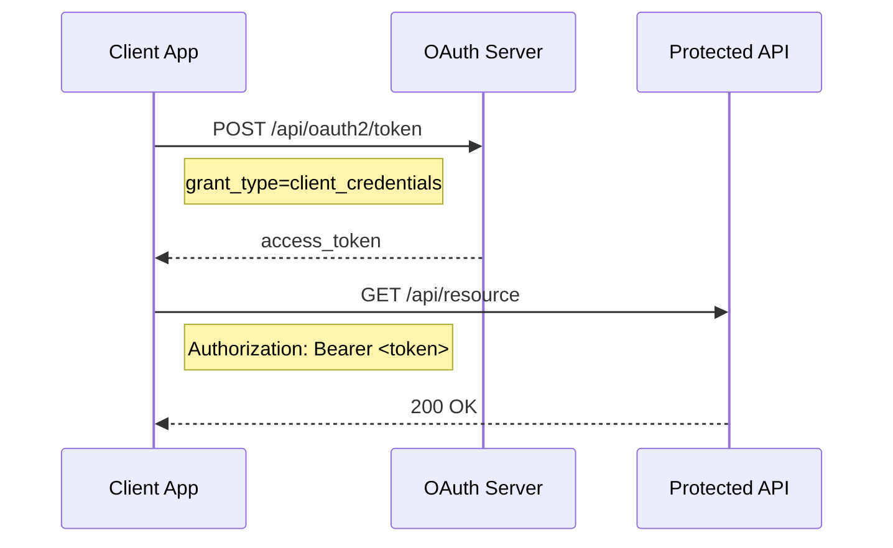
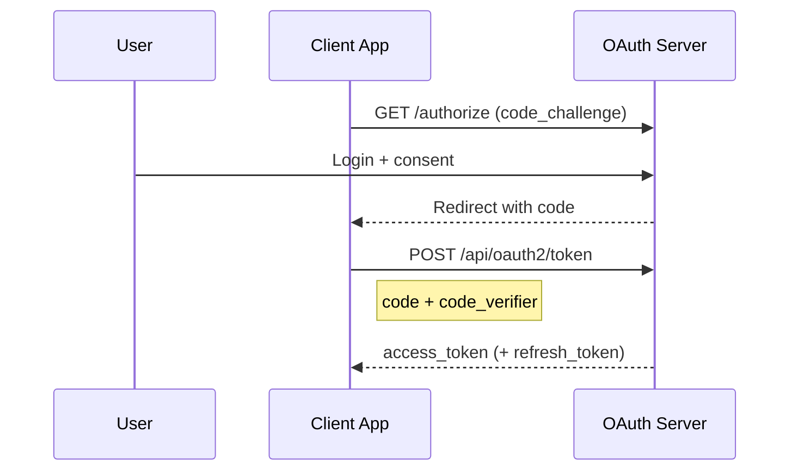
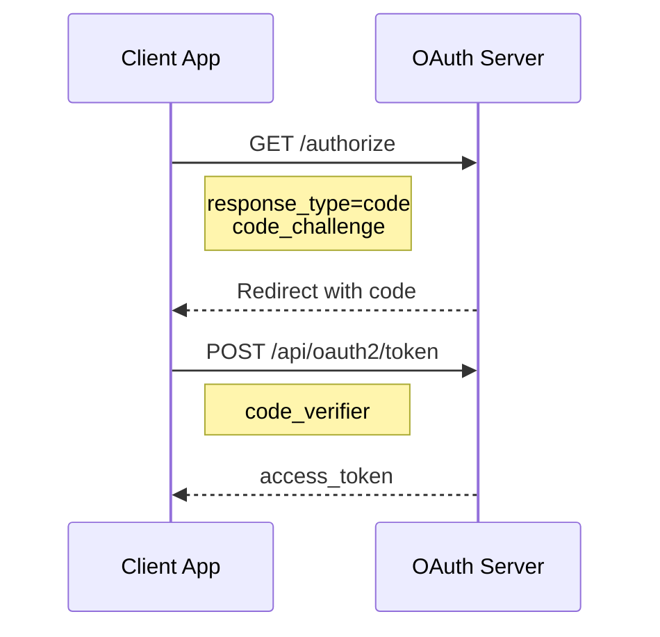
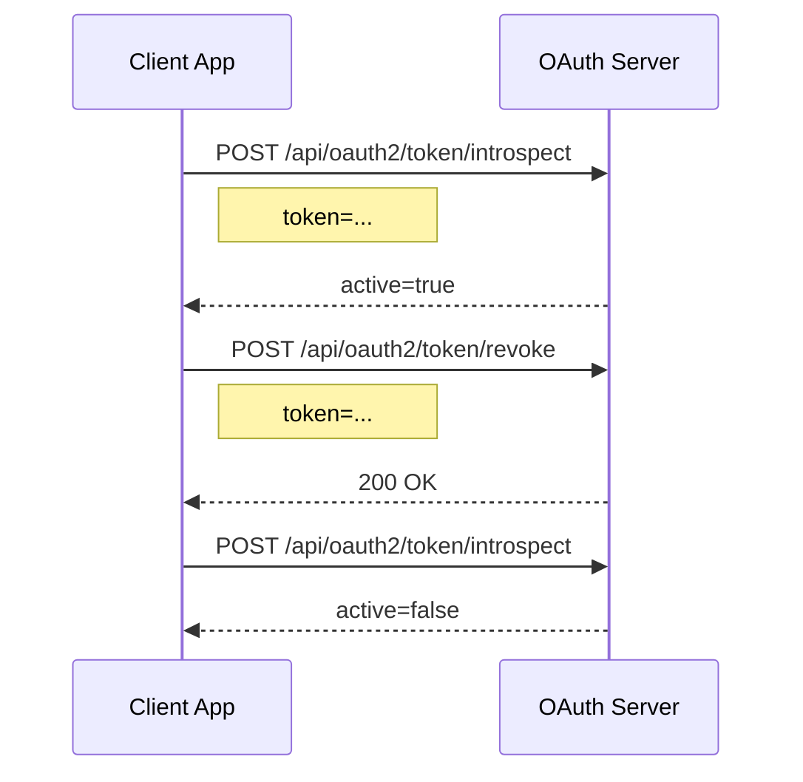
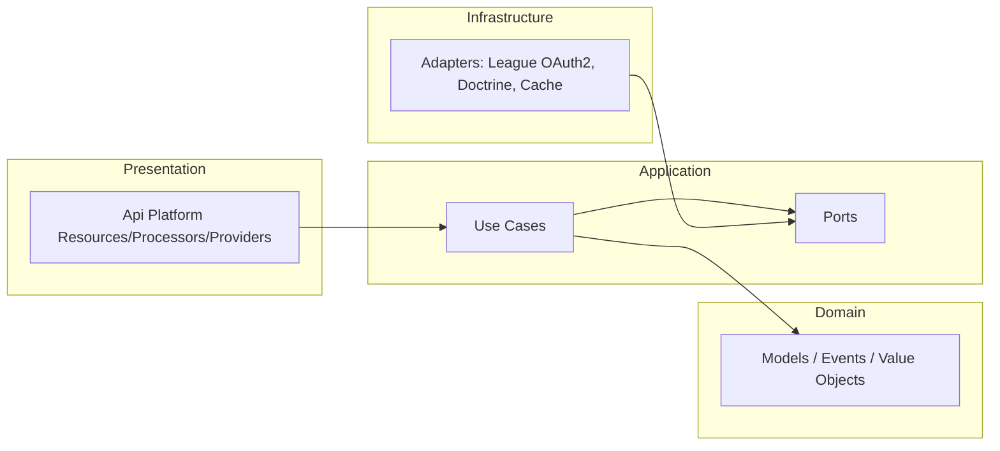

# OAuth Module Documentation

OAuth2 and OpenID Connect provider module for **Fireguard Auth Server**.
Implements OAuth 2.0 (RFC 6749), Token Revocation (RFC 7009), Token Introspection (RFC 7662), and Discovery (RFC 8414 / OpenID Connect Discovery).

---

## Table of Contents

- [Overview](#overview)
- [API Endpoints](#api-endpoints)
  - [OAuth2](#oauth2)
  - [Client Management](#client-management)
  - [Discovery](#discovery)
- [Flows](#flows)
  - [Client Credentials Flow](#client-credentials-flow)
  - [Authorization Code with PKCE Flow](#authorization-code-with-pkce-flow)
  - [Introspection and Revocation Flow](#introspection-and-revocation-flow)
- [Architecture](#architecture)
- [Configuration](#configuration)
- [Testing](#testing)
- [Error Codes](#error-codes)

---

<div align="right"><a href="#oauth-module-documentation">Back to top</a></div>

## Overview

The OAuth module exposes OAuth2 and OpenID Connect endpoints and the client management API. It relies on a hexagonal architecture (ports and adapters) with Api Platform for HTTP exposure and League OAuth2 Server as the core engine.
Request validation is handled by DTO constraints and custom validators, then mapped to OAuth2 error payloads by the API error subscriber to keep RFC 6749 compatibility.

### Features

| Feature | Description |
|---------|-------------|
| Authorization endpoint | Authorization code with PKCE |
| Token issuance | `client_credentials`, `refresh_token`, `authorization_code` |
| Token introspection | RFC 7662 compliant metadata endpoint |
| Token revocation | RFC 7009 compliant revocation endpoint |
| OIDC discovery | OpenID Provider metadata + JWKS |
| Consent management | Consent check and grant endpoints |
| Client management | Register, update, activate, deactivate, regenerate secret |
| Rate limiting | Token, introspection, and revocation endpoints |

---

<div align="right"><a href="#oauth-module-documentation">Back to top</a></div>

## API Endpoints

### OAuth2

| Method | Endpoint | Description | Auth | Rate limit | Notes |
|--------|----------|-------------|------|------------|-------|
| GET | `/api/oauth2/authorize` | Authorize client (code + PKCE) | Bearer access token | N/A | Redirects on success; supports `prompt`/`max_age` |
| POST | `/api/oauth2/token` | Issue access token | Client credentials | `limiter.oauth_token` | Supports multiple grants |
| POST | `/api/oauth2/token/introspect` | Introspect access or refresh token | Client credentials | `limiter.oauth_introspection` | Returns RFC 7662 payload |
| POST | `/api/oauth2/token/revoke` | Revoke access or refresh token | Client credentials | `limiter.oauth_revocation` | RFC 7009 semantics |
| GET | `/api/oauth2/userinfo` | UserInfo (OpenID Connect) | Bearer access token | N/A | Requires user-bound token |
| GET | `/api/oauth2/logout` | End session (OpenID Connect) | N/A | N/A | Supports `id_token_hint` + post-logout redirect |
| GET | `/api/oauth2/consent/check` | Check consent status | Bearer access token | N/A | Query params: `client_id`, `scope` |
| POST | `/api/oauth2/consent/grant` | Grant or deny consent | Bearer access token | N/A | Completes authorization |

Token endpoints accept:
- `application/ld+json`
- `application/json`
- `application/x-www-form-urlencoded` (recommended)
Token endpoints are rate-limited (see `config/packages/rate_limiter.yaml`) and keys are IP-based with client ID included when available.
Rate limiter services are declared in `config/packages/rate_limiter.yaml` and wired in `src/OAuth/Presentation/Api/Processor/Token/IssueTokenProcessor.php`, `src/OAuth/Presentation/Api/Processor/Token/IntrospectTokenProcessor.php`, and `src/OAuth/Presentation/Api/Processor/Token/RevokeTokenProcessor.php`.

> [!NOTE]
> Use `application/x-www-form-urlencoded` for strict OAuth2 clients and to match common SDK behavior.
> When the `authorization_code` grant is used with the `openid` scope, the token response also includes an `id_token`.
> If a refresh token is used and the original scopes include `openid`, a new `id_token` is also returned when a user-bound token is available.
> OIDC claims are scope-gated: `profile` adds name/username/picture claims, and `email` adds email claims.

#### OIDC Scopes & Claims

| Scope | Claims (UserInfo / ID Token) |
| --- | --- |
| `openid` | `sub` |
| `profile` | `preferred_username`, `given_name`, `family_name`, `picture` |
| `email` | `email`, `email_verified` |

Claims are resolved from the user profile and returned via `/api/oauth2/userinfo` and, when applicable, the `id_token`.

#### Default Rate Limits

Values are defined in `config/packages/rate_limiter.yaml`:

| Limiter | Default | Applied to |
| --- | --- | --- |
| `login` | 5 / minute | `/api/auth/login` |
| `oauth_token` | 20 / minute | `/api/oauth2/token` |
| `oauth_introspection` | 60 / minute | `/api/oauth2/token/introspect` |
| `oauth_revocation` | 30 / minute | `/api/oauth2/token/revoke` |

Example (client_credentials):
```json
{
  "grant_type": "client_credentials",
  "client_id": "your-client-id",
  "client_secret": "your-client-secret",
  "scope": "read write"
}
```

### Client Management

| Method | Endpoint | Description | Auth | Notes |
|--------|----------|-------------|------|-------|
| POST | `/api/clients` | Register a client | `clients.create` | Secret returned once |
| GET | `/api/clients/{id}` | Get client details | `clients.read` | No secret in response |
| GET | `/api/clients` | List clients | `clients.read` | Pagination supported |
| PATCH | `/api/clients/{id}` | Update client details | `clients.update` | Validates scopes/grants |
| POST | `/api/clients/{id}/regenerate-secret` | Regenerate client secret | `clients.update` | Secret returned once |
| POST | `/api/clients/{id}/activate` | Activate client | `clients.update` | Re-enables token issuance |
| POST | `/api/clients/{id}/deactivate` | Deactivate client | `clients.update` | Blocks token issuance |
| DELETE | `/api/clients/{id}` | Delete client | `clients.delete` | Removes client data |

Client secrets are only returned at creation or regeneration. Store them securely.
Client endpoints are defined in `src/OAuth/Presentation/Api/Resource/ClientResource.php`.

> [!IMPORTANT]
> The client secret is shown once. Persist it securely and rotate it via the regenerate endpoint if lost.

### Discovery

| Method | Endpoint | Description | Notes |
|--------|----------|-------------|-------|
| GET | `/api/.well-known/openid-configuration` | OpenID Provider metadata | Includes OAuth2 metadata |
| GET | `/api/.well-known/jwks.json` | JSON Web Key Set | Public keys for JWT validation |

Notes:
- `authorization_endpoint` and `end_session_endpoint` are published from `OAUTH_AUTHORIZE_PATH` and `OAUTH_LOGOUT_PATH` when configured.
- Token, introspection, and revocation endpoints are rate-limited via `limiter.oauth_token`, `limiter.oauth_introspection`, and `limiter.oauth_revocation`.
Discovery metadata should reflect supported grants; update it when enabling new grant types.
Discovery responses are built in `src/OAuth/Presentation/Api/Provider/Discovery/OpenIdConfigurationProvider.php`.

> [!NOTE]
> If `OAUTH_AUTHORIZE_PATH` or `OAUTH_LOGOUT_PATH` is set, it overrides the default route or fallback path used in discovery.

---

<div align="right"><a href="#oauth-module-documentation">Back to top</a></div>

## Flows

### Client Credentials Flow



Request/response shape:
```json
// Request
{
  "grant_type": "client_credentials",
  "client_id": "client-id",
  "client_secret": "client-secret",
  "scope": "read write"
}
```
```json
// Response
{
  "access_token": "eyJ...",
  "token_type": "Bearer",
  "expires_in": 3600,
  "scope": "read write"
}
```

### Authorization Code with PKCE Flow





### Introspection and Revocation Flow



Common payloads:
```json
// Introspection request
{
  "token": "eyJ...",
  "token_type_hint": "access_token"
}
```
```json
// Introspection response (active)
{
  "active": true,
  "scope": "read write",
  "client_id": "client-id",
  "token_type": "Bearer",
  "exp": 1710000000,
  "iat": 1709996400,
  "sub": "user-id",
  "iss": "https://auth.example.com",
  "jti": "token-id"
}
```

Introspection responses are cached by token ID for short TTL and invalidated on revocation to avoid stale results.

> [!TIP]
> When debugging token revocation, clear cache entries or lower `TOKEN_CACHE_TTL` in test environments.

---

<div align="right"><a href="#oauth-module-documentation">Back to top</a></div>

## Architecture

The module follows Hexagonal Architecture (Ports and Adapters). Api Platform is the presentation layer; use cases live in the application layer; domain models and events are isolated; infrastructure contains adapters for League OAuth2 Server, Doctrine, and caching.
OAuth errors are produced by domain exceptions and League OAuth2 exceptions, then normalized at the API layer to keep consistent RFC 6749 responses.
OAuth operations are defined in `src/OAuth/Presentation/Api/Resource/OAuth2Resource.php` and `src/OAuth/Presentation/Api/Operation/OAuthOperations.php`.

> [!NOTE]
> Messenger can wrap handler exceptions; these are unwrapped to preserve OAuth error types.



Directory layout:
```
src/OAuth/
  Application/
    Port/
    UseCase/
  Domain/
    Event/
    Exception/
    Model/
    ValueObject/
  Infrastructure/
    Console/
    DataFixtures/
    EventSubscriber/
    Oidc/
      Adapter/
    OAuth2/League/
    Persistence/Doctrine/
  Presentation/
    Api/
      Dto/
      EventSubscriber/
      Operation/
      Processor/
      Provider/
      Resource/
      Serialization/
      Validator/
```

Ports and adapters highlights:
| Port | Responsibility | Adapter |
|------|----------------|---------|
| `AuthorizationServerPort` | Issue access tokens | League OAuth2 server adapter |
| `IdTokenIssuerPort` | Issue OIDC ID tokens | OIDC JWT issuer adapter |
| `OidcUserProviderPort` | Resolve OIDC user identity data | OIDC user provider adapter |
| `TokenRevocationPort` | Revoke access/refresh tokens | OAuth token revocation adapter |
| `TokenCachePort` | Cache introspection results | Cache pool adapter |
| `JwtParserPort` | Parse and validate JWT payloads | JWT parser adapter |

---

<div align="right"><a href="#oauth-module-documentation">Back to top</a></div>

## Configuration

Environment variables (examples):
```env
OAUTH_ISSUER=https://auth.example.com
OAUTH_ENCRYPTION_KEY=base64:...
OAUTH_AUTHORIZE_PATH=/api/oauth2/authorize
OAUTH_LOGOUT_PATH=/api/oauth2/logout
OAUTH_ERROR_URI_BASE=https://datatracker.ietf.org/doc/html/rfc6749

OAUTH2_ACCESS_TOKEN_TTL=3600
OAUTH2_REFRESH_TOKEN_TTL=86400
ID_TOKEN_TTL=3600
```

When adding a new grant type, update the token input validation and discovery metadata accordingly.
Token input validation is defined in `src/OAuth/Presentation/Api/Dto/Input/Token/TokenInput.php` and `src/OAuth/Presentation/Api/Validator/GrantTypeRequirements`.

> [!CAUTION]
> Always align discovery metadata with the enabled grants; clients rely on it to negotiate flows.

---

<div align="right"><a href="#oauth-module-documentation">Back to top</a></div>

## Testing

| Test Type | Directory | Description |
|-----------|-----------|-------------|
| Unit | `tests/Unit/OAuth` | Domain, use cases, and infrastructure units |
| Functional | `tests/Functional/Api` | API contract tests (OAuth2, discovery, clients) |
| E2E | `tests/E2E` | End-to-end OAuth flows |

---

<div align="right"><a href="#oauth-module-documentation">Back to top</a></div>

## Error Codes

OAuth error responses follow RFC 6749 and use:

| HTTP | Code | Description |
|------|------|-------------|
| 400 | `invalid_request` | Missing or invalid parameters |
| 400 | `invalid_grant` | Invalid, expired, or revoked grant |
| 401 | `invalid_client` | Client authentication failed |
| 400 | `unsupported_grant_type` | Unsupported grant type |
| 400 | `invalid_scope` | Invalid or unknown scope |
| 429 | `temporarily_unavailable` | Rate limit exceeded |
| 500 | `server_error` | Unexpected server error |
