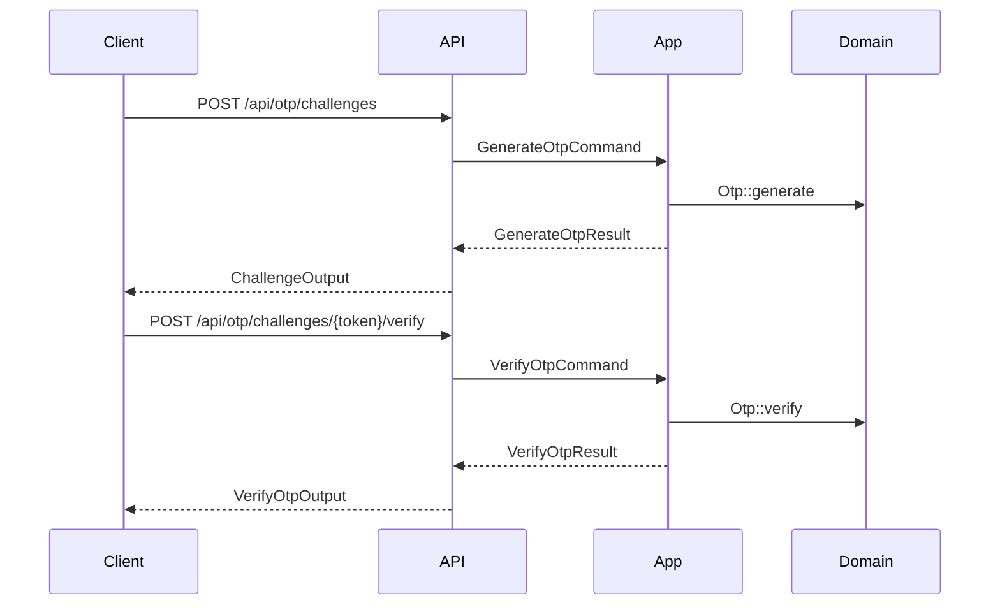
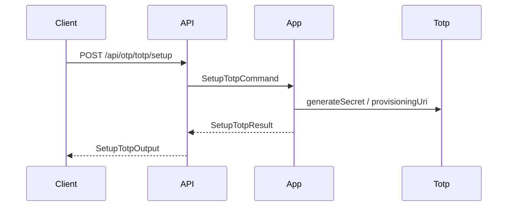

# OTP Module

## Overview

The OTP module provides challenge-based verification for MFA and other
secure flows. It exposes challenge endpoints only (no direct OTP CRUD
endpoints) and offers a clean inbound port for other modules.

All OTP endpoints are protected by RBAC permissions (`otp_*`) and are
intended for authenticated user flows or internal service usage.

## API Endpoints

| Method | Path | Description | Handler |
| --- | --- | --- | --- |
| POST | `/api/otp/challenges` | Create OTP challenge | `CreateChallengeProcessor` |
| GET | `/api/otp/challenges/{token}` | Get challenge status | `GetChallengeStatusProvider` |
| POST | `/api/otp/challenges/{token}/verify` | Verify challenge code | `VerifyOtpProcessor` |
| POST | `/api/otp/challenges/{token}/resend` | Resend challenge code | `ResendChallengeProcessor` |
| GET | `/api/otp/purposes` | List purposes | `ListPurposesProvider` |
| GET | `/api/otp/channels` | List channels | `ListChannelsProvider` |
| POST | `/api/otp/totp/setup` | Setup TOTP | `SetupTotpProcessor` |

## Flows

### Challenge (Email/SMS)

### TOTP Setup

## Architecture

- Hexagonal module with strict layer boundaries.
- Inbound port: `Otp\Application\Port\Inbound\Challenge\OtpChallengePort`.
- Outbound ports: `Otp\Application\Port\Outbound\Challenge\OtpRepositoryPort`, `Otp\Application\Port\Outbound\Challenge\OtpNotifierPort`, `Otp\Application\Port\Outbound\Totp\TotpServicePort`.
- Cross-module contracts are defined in `Otp\Application\Contract`.

## Configuration

- Services: `config/modules/otp.yaml`.
- Notification sender: `MAILER_FROM` (used by `OtpNotifierAdapter`).
- OTP code length: `OTP_CODE_LENGTH` (applies to challenge OTPs like SMS/email).
- TOTP code length: `TOTP_DIGITS` (applies to authenticator app codes). Changing this will invalidate existing TOTP enrollments.

## Testing

- Unit: `tests/Unit/Otp` (handlers, domain, adapters).
- E2E: `tests/E2E/OtpChallengeFlowTest.php`, `tests/E2E/OtpConfigFlowTest.php`, `tests/E2E/TotpFlowTest.php`.

## Error Mapping

- `404 Not Found`: challenge token not found.
- `429 Too Many Requests`: resend cooldown not elapsed.
- `400 Bad Request`: invalid input or unauthenticated user where required.
