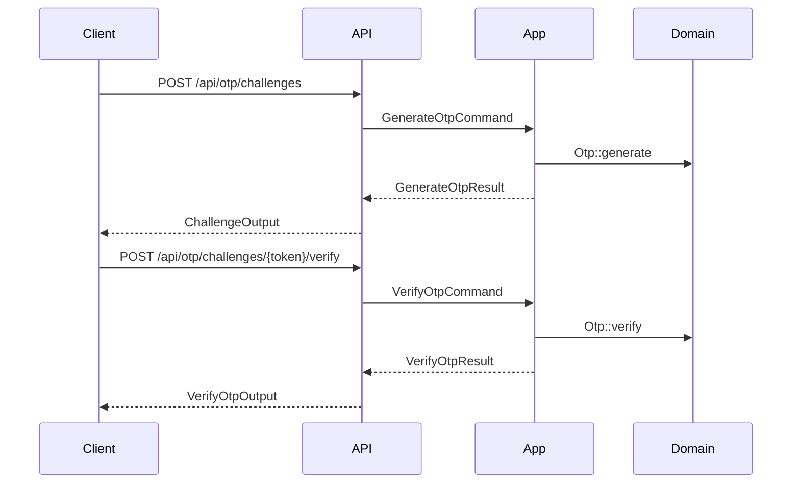
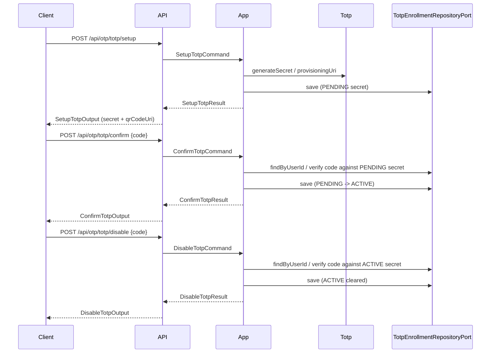

# OTP Module

## Overview

The OTP module provides challenge-based verification for MFA and other
secure flows. It exposes challenge endpoints only (no direct OTP CRUD
endpoints) and offers a clean inbound port for other modules.

All OTP endpoints are protected by RBAC permissions (`otp_*`) and are
intended for authenticated user flows or internal service usage.

## API Endpoints

| Method | Path | Description | Handler |
| --- | --- | --- | --- |
| POST | `/api/otp/challenges` | Create OTP challenge | `CreateChallengeProcessor` |
| GET | `/api/otp/challenges/{token}` | Get challenge status | `GetChallengeStatusProvider` |
| POST | `/api/otp/challenges/{token}/verify` | Verify challenge code | `VerifyOtpProcessor` |
| POST | `/api/otp/challenges/{token}/resend` | Resend challenge code | `ResendChallengeProcessor` |
| GET | `/api/otp/purposes` | List purposes | `ListPurposesProvider` |
| GET | `/api/otp/channels` | List channels | `ListChannelsProvider` |
| POST | `/api/otp/totp/setup` | Setup TOTP (generates a PENDING secret) | `SetupTotpProcessor` |
| POST | `/api/otp/totp/confirm` | Confirm TOTP (activates the PENDING secret) | `ConfirmTotpProcessor` |
| POST | `/api/otp/totp/disable` | Disable TOTP (requires a valid current code) | `DisableTotpProcessor` |

## Flows

### Challenge (Email/SMS)

### TOTP Setup / Confirm / Disable

TOTP enrollment state is stored server-side per user (`totp_enrollments`, auth
database) with an optional ACTIVE (confirmed) secret and an optional PENDING
(unconfirmed) secret, tracked independently. Re-calling setup only replaces
the PENDING secret and leaves any existing ACTIVE secret usable for login
until the new one is confirmed. The client never supplies the secret back to
the server for confirm/disable — only the current authenticator code.

## Architecture

- Hexagonal module with strict layer boundaries.
- Inbound ports: `Otp\Application\Port\Inbound\Challenge\OtpChallengePort`, `Otp\Application\Port\Inbound\Totp\TotpStatusPort` (used by the User module for `/api/me` and, via a small adapter, by the Auth module for login MFA channel selection).
- Outbound ports: `Otp\Application\Port\Outbound\Challenge\OtpRepositoryPort`, `Otp\Application\Port\Outbound\Challenge\OtpNotifierPort`, `Otp\Application\Port\Outbound\Totp\TotpServicePort`, `Otp\Application\Port\Outbound\Totp\TotpEnrollmentRepositoryPort`.
- Cross-module contracts are defined in `Otp\Application\Contract`.
- Cross-module adapter: `Otp\Infrastructure\Adapter\Auth\TotpEnrollmentCheckAdapter` implements `Auth\Application\Port\Outbound\Mfa\TotpEnrollmentCheckPort` (Auth-owned port), delegating to `TotpStatusPort`.
- `Otp\Application\UseCase\Command\Challenge\VerifyOtp\VerifyOtpHandler` checks the OTP's channel: for `totp`, the submitted code is verified against the user's ACTIVE TOTP secret (via `TotpEnrollmentRepositoryPort` + `TotpServicePort`) instead of the challenge's own random code; challenge-level expiry/attempt bookkeeping is unchanged (`Otp::verifyExternal()`).

## Configuration

- Services: `config/modules/otp.yaml`.
- Notification sender: `MAILER_FROM` (used by `OtpNotifierAdapter`).
- Email template: `templates/otp/email/code.html.twig` (rendered by Twig in `OtpNotifierAdapter`).
- OTP code length: `OTP_CODE_LENGTH` (applies to challenge OTPs like SMS/email).
- TOTP code length: `TOTP_DIGITS` (applies to authenticator app codes). Changing this will invalidate existing TOTP enrollments.
- TOTP confirmation max attempts: fixed at 5 (`SetupTotpHandler::DEFAULT_MAX_ATTEMPTS`), reset each time setup is called again.
- Rate limits (`config/packages/rate_limiter.yaml`): `otp_totp_confirm`, `otp_totp_disable` (5/minute per user, mirrors `otp_challenge_verify`).
- Permissions: `otp_totp.setup`, `otp_totp.confirm`, `otp_totp.disable` (see `Authorization\Infrastructure\Catalog\PermissionCatalog`); granted to the default `user` and `admin` roles.
- Secret storage: the base32 TOTP secret is stored as plain text in `totp_enrollments.active_secret` / `.pending_secret` — this mirrors how the existing `otps.code_hash`-adjacent `recipient` and other OTP module fields are stored (no column-level encryption elsewhere in this module or `Session`/`TrustedDevice`). Unlike email/SMS OTP codes (which are Argon2id-hashed via `OtpCode`, since only a one-way equality check is needed), a TOTP secret cannot be hashed because the server must recompute codes from it at verification time; this is standard for TOTP implementations (e.g. Google Authenticator servers). Treat the DB as sensitive and protect it at the infrastructure level (encryption at rest, restricted access) — see `SECURITY.md`.

## Testing

- Unit: `tests/Unit/Otp` (handlers, domain, adapters).
- Functional: `tests/Functional/Api/OtpTotpApiTest.php`.
- E2E: `tests/E2E/OtpChallengeFlowTest.php`, `tests/E2E/OtpConfigFlowTest.php`, `tests/E2E/TotpFlowTest.php`.

## Error Mapping

- `404 Not Found`: challenge token not found; no pending TOTP setup for confirm; TOTP not enabled for disable.
- `422 Unprocessable Entity`: invalid/expired TOTP code on confirm or disable.
- `429 Too Many Requests`: resend cooldown not elapsed; TOTP confirm/disable rate limit exceeded.
- `400 Bad Request`: invalid input or unauthenticated user where required.
