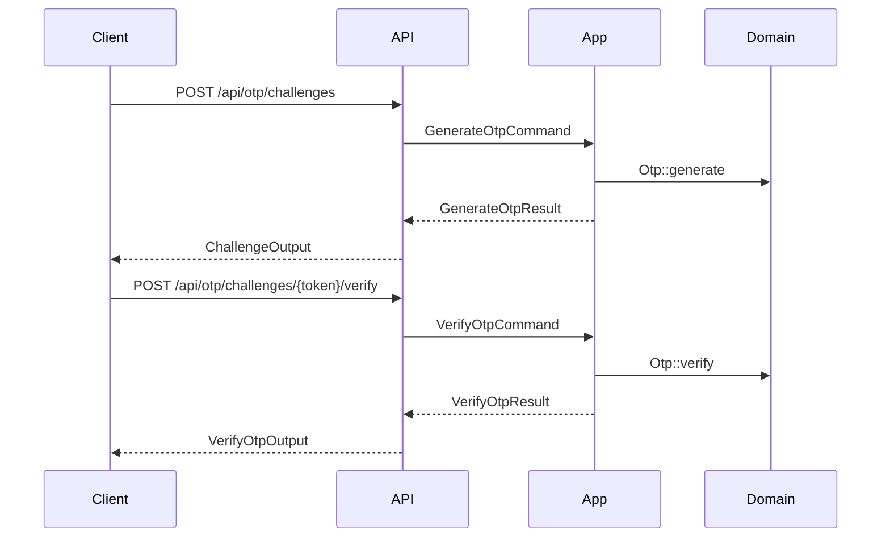
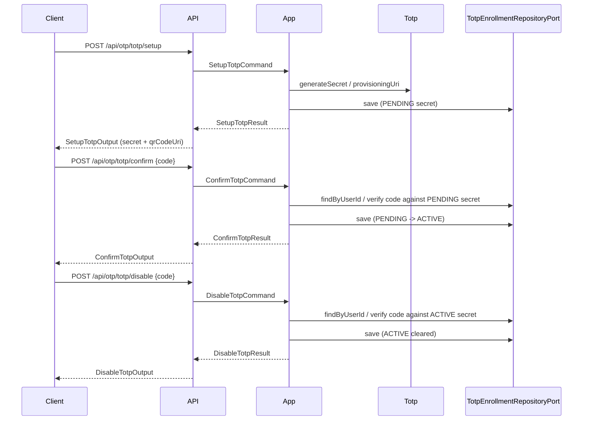

# OTP Module

## Overview

The OTP module provides challenge-based verification for MFA and other
secure flows. It exposes challenge endpoints only (no direct OTP CRUD
endpoints) and offers a clean inbound port for other modules.

All OTP endpoints are protected by RBAC permissions (`otp_*`) and are
intended for authenticated user flows or internal service usage.

## API Endpoints

| Method | Path | Description | Handler |
| --- | --- | --- | --- |
| POST | `/api/otp/challenges` | Create OTP challenge | `CreateChallengeProcessor` |
| GET | `/api/otp/challenges/{token}` | Get challenge status | `GetChallengeStatusProvider` |
| POST | `/api/otp/challenges/{token}/verify` | Verify challenge code | `VerifyOtpProcessor` |
| POST | `/api/otp/challenges/{token}/resend` | Resend challenge code | `ResendChallengeProcessor` |
| GET | `/api/otp/purposes` | List purposes | `ListPurposesProvider` |
| GET | `/api/otp/channels` | List channels | `ListChannelsProvider` |
| POST | `/api/otp/totp/setup` | Setup TOTP (generates a PENDING secret) | `SetupTotpProcessor` |
| POST | `/api/otp/totp/confirm` | Confirm TOTP (activates the PENDING secret) | `ConfirmTotpProcessor` |
| POST | `/api/otp/totp/disable` | Disable TOTP (requires a valid current code) | `DisableTotpProcessor` |

`/api/otp/purposes` and `/api/otp/channels` have **no first-party web consumer**
today. They are retained deliberately as public-API discovery affordances for
external integrators driving the OTP challenge flow, on the same reasoning that
keeps `/api/webhooks/event-types` (see `src/Webhook/MODULE.md`) — a client
composing a challenge needs to know which purposes and channels the server will
accept, and hard-coding them into every integration is what a reference catalog
exists to avoid.

This is a **recorded decision, not an oversight**: the check that surfaced it
counted zero consumers under `src/` in the web application, and the answer was
to write the reason down rather than to delete the endpoints.

## Flows

### Challenge (Email/SMS)

Resend cooldowns and HTTP rate limits expose `rate_limit_exceeded` and
`retryAfterSeconds` through the shared Problem Details boundary, including Auth's
registration, password-reset and MFA resend endpoints. `Retry-After` remains available.

### TOTP Setup / Confirm / Disable

TOTP enrollment state is stored server-side per user (`totp_enrollments`, auth
database) with an optional ACTIVE (confirmed) secret and an optional PENDING
(unconfirmed) secret, tracked independently. Re-calling setup only replaces
the PENDING secret and leaves any existing ACTIVE secret usable for login
until the new one is confirmed. The client never supplies the secret back to
the server for confirm/disable — only the current authenticator code.

### Mailbox possession

The `email_ownership` purpose is separate from registration and sensitive operations.
`EmailOwnershipChallengePort` verifies the account, purpose and current recipient under
an explicit auth transaction with a pessimistic row lock. Failed attempts are committed;
success consumes the code once. The bound recipient is checked before code consumption,
so codes sent to an old address cannot prove the current address. Both email and external
verification reject an already-consumed challenge. No proof is granted by the generic
OTP HTTP endpoints; Auth must confirm it through the User capability.

## Architecture

- Hexagonal module with strict layer boundaries.
- Inbound ports: `Otp\Application\Port\Inbound\Challenge\OtpChallengePort`, `Otp\Application\Port\Inbound\Totp\TotpStatusPort` (used by the User module for `/api/me` and, via a small adapter, by the Auth module for login MFA channel selection).
- Outbound ports: `Otp\Application\Port\Outbound\Challenge\OtpRepositoryPort`, `Otp\Application\Port\Outbound\Challenge\OtpNotifierPort`, `Otp\Application\Port\Outbound\Totp\TotpServicePort`, `Otp\Application\Port\Outbound\Totp\TotpEnrollmentRepositoryPort`.
- Cross-module contracts are defined in `Otp\Application\Contract`.
- Cross-module adapter: `Otp\Infrastructure\Adapter\Auth\TotpEnrollmentCheckAdapter` implements `Auth\Application\Port\Outbound\Mfa\TotpEnrollmentCheckPort` (Auth-owned port), delegating to `TotpStatusPort`.
- `Otp\Application\UseCase\Command\Challenge\VerifyOtp\VerifyOtpHandler` checks the OTP's channel: for `totp`, the submitted code is verified against the user's ACTIVE TOTP secret (via `TotpEnrollmentRepositoryPort` + `TotpServicePort`) instead of the challenge's own random code; challenge-level expiry/attempt bookkeeping is unchanged (`Otp::verifyExternal()`).

## Configuration

- Services: `config/modules/otp.yaml`.
- Notification sender: `MAILER_FROM` (used by `OtpNotifierAdapter`).
- Email template: `templates/otp/email/code.html.twig` (rendered by Twig in `OtpNotifierAdapter`).
- OTP code length: `OTP_CODE_LENGTH` (applies to challenge OTPs like SMS/email).
- TOTP code length: `TOTP_DIGITS` (applies to authenticator app codes). Changing this will invalidate existing TOTP enrollments.
- TOTP confirmation max attempts: fixed at 5 (`SetupTotpHandler::DEFAULT_MAX_ATTEMPTS`), reset each time setup is called again.
- Rate limits (`config/packages/rate_limiter.yaml`): `otp_totp_confirm`, `otp_totp_disable` (5/minute per user, mirrors `otp_challenge_verify`).
- **Disable has a second, persistent brake.** The rate limiter throttles bursts
  but resets every minute, so on its own it left the disable endpoint an
  unbounded oracle: 7 200 guesses a day against a six-digit code. After
  `TotpEnrollment::MAX_DISABLE_ATTEMPTS` (5) wrong codes the enrollment freezes
  for `DISABLE_LOCK_DURATION` (15 minutes), stored on the row
  (`disable_attempts`, `disable_locked_until`) so it survives across requests
  and processes. That is ~480 attempts a day instead of 7 200.

  Two properties are deliberate and should not be "simplified" away:

  - **The freeze refuses the correct code too.** Letting a valid code through
    would leave the freeze no obstacle to the only caller it exists for — the
    one who eventually guesses right.
  - **The freeze is temporary, unlike `confirmPending()`'s permanent lock.**
    Confirmation guards a *pending* secret, and its lock is escaped by
    restarting enrollment. Disabling guards the *active* secret: a permanent
    lock would leave the user unable to turn TOTP off **and** unable to
    re-enroll around it — a dead end only support could open.

  The counter is separate from `attempts`, which belongs to confirmation. One
  shared counter would let a failed disable eat the enrollment's confirmation
  budget, and the two reset on different events.
- Permissions: `otp_totp.setup`, `otp_totp.confirm`, `otp_totp.disable` (see `Authorization\Infrastructure\Catalog\PermissionCatalog`); granted to the default `user` and `admin` roles.
- Secret storage uses the Otp-owned `TotpSecretCipherPort`, implemented by
  AES-256-GCM with a dedicated key ring. Versioned envelopes carry the key identifier;
  their authentication binds the user and active/pending slot. New writes are encrypted
  once `TOTP_ENCRYPTION_WRITE_KEY` is provisioned. Legacy rows remain readable during
  rollout. The durable `secrets_encrypted` marker prevents writes from reverting a
  migrated enrollment to plaintext if configuration is rolled back. Decryption failure
  never falls back to plaintext. Authenticator secrets and enrollment/lockout state stay
  unchanged.

### Encryption deployment and key rotation

1. Apply additive auth migration `Version20260920150000` before the compatible reader.
   It keeps both old columns and adds encrypted active/pending columns plus the marker.
2. Provision `TOTP_ENCRYPTION_KEYS` through the deployment secret store: a JSON object
   mapping key IDs to base64-encoded, randomly generated 32-byte keys, dedicated to Otp.
   Keep `TOTP_ENCRYPTION_WRITE_KEY` empty only during the initial compatible-read rollout.
3. Once every instance can read ciphertext, select the write-key ID. New and updated
   enrollments now use encrypted storage and clear their old values.
4. Run `php -d memory_limit=1G bin/console app:otp:encrypt-secrets --batch-size=100`.
   Each auth transaction locks a bounded batch, authenticates old ciphertext, migrates
   or rotates secrets, verifies the decrypted result, and then commits. Restarting is
   safe; current envelopes are not rewritten. No account IDs or secrets are printed.
5. Run the same command with `--verify-only`; it writes nothing and fails if any row
   still needs migration or if a key/envelope is invalid. Retain the old columns until
   deployment and data verification are complete; remove them only in a later migration.
6. For rotation, add a new key while retaining prior keys, select its ID for writes,
   rerun migration and verification, then retire old keys only after verification and
   the backup/rollback retention window. Backups containing older envelopes need their
   corresponding keys. A rollback must retain this compatible reader and the key ring.
   Schema rollback is explicitly refused once any enrollment has been encrypted.

## Testing

- Unit: `tests/Unit/Otp` (handlers, domain, adapters).
- Functional: `tests/Functional/Api/OtpTotpApiTest.php`.
- E2E: `tests/E2E/OtpChallengeFlowTest.php`, `tests/E2E/OtpConfigFlowTest.php`, `tests/E2E/TotpFlowTest.php`.

## Error Codes

- `404 Not Found`: challenge token not found; no pending TOTP setup for confirm; TOTP not enabled for disable.
- `422 Unprocessable Entity`: invalid/expired TOTP code on confirm or disable.
- `429 Too Many Requests`: resend cooldown not elapsed; TOTP confirm/disable rate limit exceeded; **TOTP disable frozen after 5 wrong codes** (`Retry-After` carries the remaining seconds).
- `400 Bad Request`: invalid input or unauthenticated user where required.
