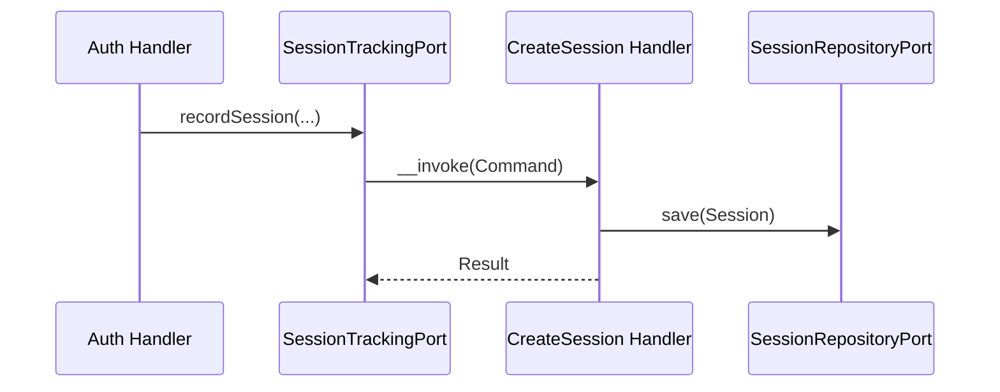
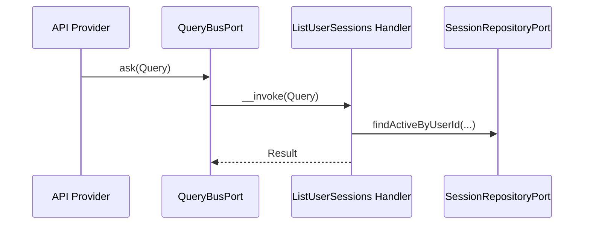

# Session Module

## Overview

Session tracks authenticated user sessions across devices and supports revocation.
It stores session metadata (IP, user agent, device info) and exposes API endpoints
to list and revoke sessions.

## API Endpoints

| Resource | Method | Path | Description |
| --- | --- | --- | --- |
| Session | GET | `/api/sessions` | List active sessions for the current user |
| Session | GET | `/api/sessions/{id}` | Get a session by ID |
| Session | DELETE | `/api/sessions/{id}` | Revoke a session by ID |
| Session | POST | `/api/sessions/revoke-all` | Revoke all sessions for the current user |

## Flows

### Track Session (Command)

### List Sessions (Query)

## Architecture

- Presentation: Api Platform resources, processors, providers, DTOs.
- Application: Use cases (Command/Query), ports.
- Domain: Session aggregate, value objects, domain events.
- Infrastructure: Doctrine repository and mapper.

Key folders:
- `src/Session/Presentation/Api`
- `src/Session/Application/UseCase`
- `src/Session/Domain`
- `src/Session/Infrastructure`

## Configuration

- Service wiring: `config/modules/session.yaml`

## Testing

- Unit: `tests/Unit/Session`
- Run module tests: `make test tests/Unit/Session`
