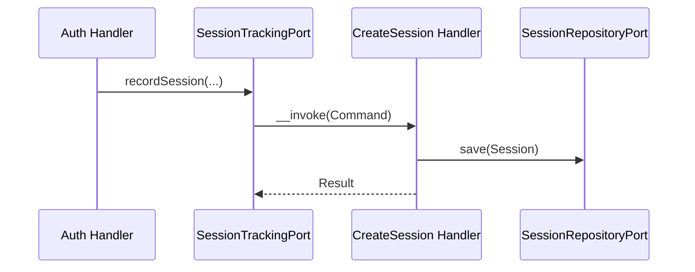
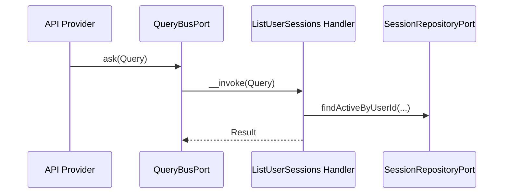
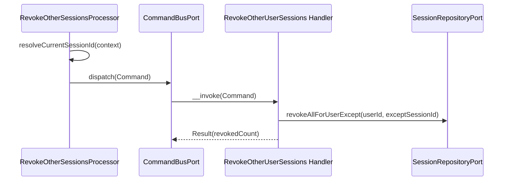

# Session Module

## Overview

Session tracks authenticated user sessions across devices and supports revocation.
It stores session metadata (IP, user agent, device info) and exposes API endpoints
to list and revoke sessions.

## API Endpoints

| Resource | Method | Path | Description |
| --- | --- | --- | --- |
| Session | GET | `/api/sessions` | List active sessions for the current user |
| Session | GET | `/api/sessions/{id}` | Get a session by ID |
| Session | DELETE | `/api/sessions/{id}` | Revoke a session by ID |
| Session | POST | `/api/sessions/revoke-all` | Revoke all sessions for the current user (including the current one) |
| Session | POST | `/api/sessions/revoke-others` | Revoke every session except the current one; returns `{ revokedCount }` |

## Flows

### Track Session (Command)

### List Sessions (Query)

### Revoke Other Sessions (Command)

`POST /sessions/revoke-others` revokes every active session of the caller
**except** the one backing the current request — unlike `revoke-all`, which
also signs out the caller's own device. `RevokeOtherSessionsProcessor`
resolves the current session ID the same way `ListUserSessionsProvider`
computes `isCurrent`: via the shared `ResolvesCurrentSessionId` trait
(`Presentation/Api/Support`), so there is one source of truth for "which
session is this one". Idempotent: revoking twice in a row returns
`revokedCount: 0` on the second call, never an error.

## Architecture

- Presentation: Api Platform resources, processors, providers, DTOs.
- Application: Use cases (Command/Query), ports.
- Domain: Session aggregate, value objects, domain events.
- Infrastructure: Doctrine repository and mapper.

Key folders:
- `src/Session/Presentation/Api`
- `src/Session/Application/UseCase`
- `src/Session/Domain`
- `src/Session/Infrastructure`

## Cross-module consumers

`Session\Application\Port\Outbound\SessionRepositoryPort` (aliased in
`config/modules/session.yaml`) is consumed directly by other modules that need
to revoke sessions as part of their own use case, without reaching into
Session's Domain or Infrastructure:

- `Auth\...\ConfirmPasswordChangeHandler` / `ConfirmPasswordResetHandler` —
  revoke all sessions when the password changes.
- `User\...\DeactivateUserHandler` — revoke all sessions on account
  deactivation (admin and self-service paths) so the user is signed out
  everywhere.

## Configuration

- Service wiring: `config/modules/session.yaml`

## Testing

- Unit: `tests/Unit/Session`
- Integration: `tests/Integration/Session` (Doctrine repository, executed against a
  real entity manager — required for non-trivial DQL such as `revokeAllForUser`
  and `revokeAllForUserExcept`)
- Functional: `tests/Functional/Api/SessionApiTest.php`
- E2E: `tests/E2E/SessionManagementFlowTest.php`
- Run module tests: `make test tests/Unit/Session`
