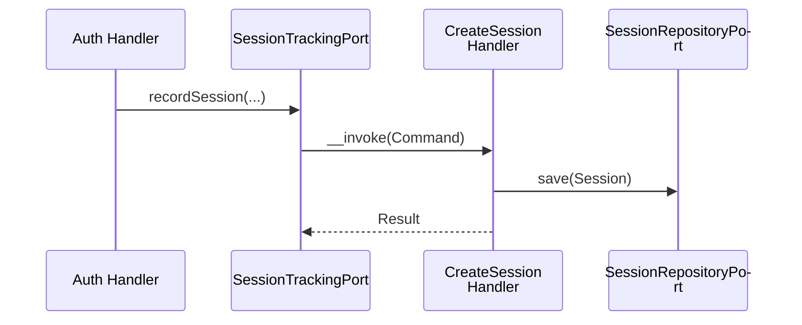
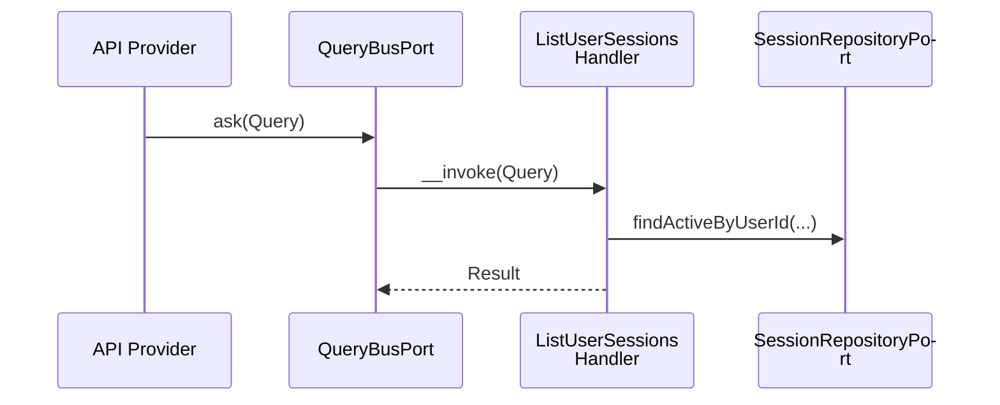
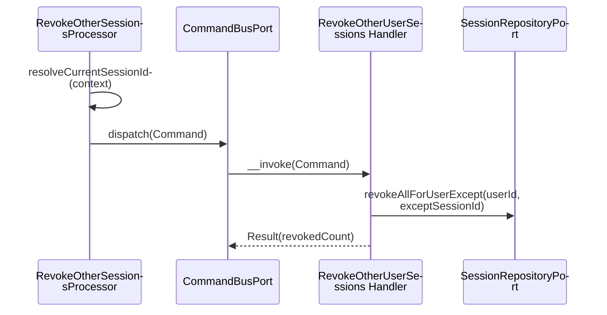

# Session Module

**Reading guide:** [Documentation index](../../docs/README.md) · [Related guide](../../docs/guides/authentication.md).

## Overview

Session tracks authenticated user sessions across devices and supports revocation.
It stores session metadata (IP, user agent, device info) and exposes API endpoints
to list and revoke sessions.

## API Endpoints

`SessionOutput` includes nullable `country` (ISO country code) and `city` in the read group.
Listing remains scoped to the authenticated account. Reading a foreign or missing session by ID
returns the same 404, including for callers with the coarse `sessions.read` permission.

| Resource | Method | Path                          | Description                                                             |
| -------- | ------ | ----------------------------- | ----------------------------------------------------------------------- |
| Session  | GET    | `/api/sessions`               | List active sessions for the current user                               |
| Session  | GET    | `/api/sessions/{id}`          | Get a session by ID                                                     |
| Session  | DELETE | `/api/sessions/{id}`          | Revoke a session by ID                                                  |
| Session  | POST   | `/api/sessions/revoke-all`    | Revoke all sessions for the current user (including the current one)    |
| Session  | POST   | `/api/sessions/revoke-others` | Revoke every session except the current one; returns `{ revokedCount }` |

## Flows

### Sign-in location and erasure

`CreateSessionHandler` snapshots server-side GeoIP once, overriding supplied country/city even
when the lookup returns null. It reuses auth JSON `SessionMetadata`; no schema migration or
legacy backfill occurs. Reads and token rotations do not recalculate geography.
The aggregate clears geography on revoke, including an idempotent revoke. Persistence performs
individual and bulk revocation/erasure atomically, preserving current token pairs and unrelated
JSON metadata. Conditional token rotation cannot revive a revoked row.
`app:geoip:purge-session-locations` clears retained geography of already revoked rows at deployment
and daily. Its CLI-only `--user-id=<verified UUID>` also erases active snapshots for a manually
authorized rights request. It returns counts without exposing account IDs or geography.

### Track Session (Command)

Auth calls the published tracking port and waits for the session record. A persistence failure prevents interactive token issuance.

```mermaid
---
config:
  sequence:
    wrap: true
---
sequenceDiagram
  participant Auth as Auth Handler
  participant Port as SessionTrackingPort
  participant UC as CreateSession Handler
  participant Repo as SessionRepositoryPort
  Auth->>Port: recordSession(...)
  Port->>UC: __invoke(Command)
  UC->>Repo: save(Session)
  UC-->>Port: Result
```

### List Sessions (Query)

The query reads the caller's active session records. API projection marks current-session identity using the shared lookup contract.

```mermaid
---
config:
  sequence:
    wrap: true
---
sequenceDiagram
  participant API as API Provider
  participant Bus as QueryBusPort
  participant UC as ListUserSessions Handler
  participant Repo as SessionRepositoryPort
  API->>Bus: ask(Query)
  Bus->>UC: __invoke(Query)
  UC->>Repo: findActiveByUserId(...)
  UC-->>Bus: Result
```

### Revoke Other Sessions (Command)

`POST /sessions/revoke-others` revokes every active session of the caller
**except** the one backing the current request — unlike `revoke-all`, which
also signs out the caller's own device. `RevokeOtherSessionsProcessor`
resolves the current session ID the same way `ListUserSessionsProvider`
computes `isCurrent`: via the shared `ResolvesCurrentSessionId` trait
(`Presentation/Api/Support`), so there is one source of truth for "which
session is this one". Idempotent: revoking twice in a row returns
`revokedCount: 0` on the second call, never an error.

```mermaid
---
config:
  sequence:
    wrap: true
---
sequenceDiagram
  participant API as RevokeOtherSessionsProcessor
  participant Bus as CommandBusPort
  participant UC as RevokeOtherUserSessions Handler
  participant Repo as SessionRepositoryPort
  API->>API: resolveCurrentSessionId(context)
  API->>Bus: dispatch(Command)
  Bus->>UC: __invoke(Command)
  UC->>Repo: revokeAllForUserExcept(userId, exceptSessionId)
  UC-->>Bus: Result(revokedCount)
```

## Architecture

- Presentation: Api Platform resources, processors, providers, DTOs.
- Application: Use cases (Command/Query), ports.
- Domain: Session aggregate, value objects, domain events.
- Infrastructure: Doctrine repository and mapper.

Key folders:

- `src/Session/Presentation/Api`
- `src/Session/Application/UseCase`
- `src/Session/Domain`
- `src/Session/Infrastructure`

## Cross-module consumers

`Session\Application\Port\Outbound\SessionRepositoryPort` (aliased in
`config/modules/session.yaml`) is consumed directly by other modules that need
to revoke sessions as part of their own use case, without reaching into
Session's Domain or Infrastructure:

- `Auth\...\ConfirmPasswordChangeHandler` / `ConfirmPasswordResetHandler` —
  revoke all sessions when the password changes.
- `User\...\DeactivateUserHandler` — revoke all sessions on account
  deactivation (admin and self-service paths) so the user is signed out
  everywhere.

`Session\Application\Port\Inbound\Tracking\SessionStatusPort` is what makes
those revocations take effect immediately. `Auth`'s `OAuth2Authenticator`
consults it on every request carrying a login-flow (`auth_session`) access
token: those tokens are not rows in the OAuth2 token table, so the session is
the only place their revocation state lives. Before it existed, revoking a
session left the access token usable until it expired.

Interactive authentication uses `activeSessionId(accessTokenId, userId)` and fails
closed unless a current, non-revoked session belongs to the signed subject.
`isAccessTokenRevoked` remains a diagnostic lookup for known revocations; its
`false` for an untracked token is never authorization. Mandatory issuance records
the anchor before returning tokens. Deployment of this change can require a fresh
login for legacy untracked tokens, without changing TOTP enrollments.

`rotateTokens` uses one conditional update on both current token IDs and
`revoked_at IS NULL`. Refreshes and revocations serialize on that row; a replay
cannot fall back to an access-token lookup. Rotation invalidates the old access
token. ORM reads refresh records after SQL mutations to avoid stale revocation
state. The authenticator sets `_fireguard_session_id` only after signature and
owner checks; list/current-device and revoke-others read that verified attribute.
An unresolved current session cannot silently turn revoke-others into revoke-all.

## Configuration

Collection shares the disabled-by-default Shared GeoIP configuration. Session storage and the
purge handler use the explicitly wired auth entity manager. Ansible schedules existing
`app:cleanup:auth-data` daily; the current 90-day inactivity policy requires operator justification.

- Service wiring: `config/modules/session.yaml`

## Testing

GeoIP coverage proves creation override, owner-only API projection, no read/renewal lookup,
all revocation scopes, preserved device metadata and PostgreSQL token-rotation races. Legacy
revoked-location cleanup and account-specific erasure are tested against PostgreSQL.

- Unit: `tests/Unit/Session`
- Integration: `tests/Integration/Session` (Doctrine repository, executed against a
  real entity manager — required for non-trivial DQL such as `revokeAllForUser`
  and `revokeAllForUserExcept`)
- Functional: `tests/Functional/Api/SessionApiTest.php`
- E2E: `tests/E2E/SessionManagementFlowTest.php`
- Run module tests: `php -d memory_limit=1G vendor/bin/phpunit tests/Unit/Session`

## Error Codes

No additional stable module-specific error-code catalog is declared here. The resource security, validation and exception translation define the public HTTP responses; consult this module's endpoint contracts and [OpenAPI schema](../../openapi.json). A future distinct public code must be documented in this section with its triggering condition.
