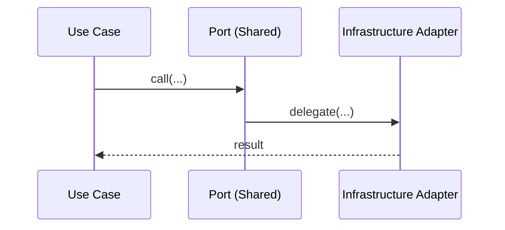
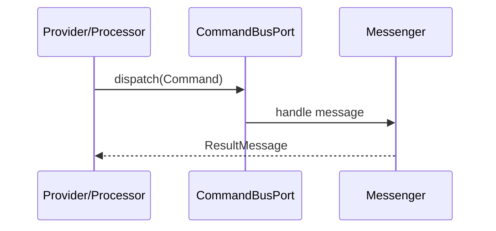

# Shared Module

## Overview

Shared is the repo-wide kernel. It provides stable contracts, base value objects,
ports, and infrastructure adapters used across all modules. It also exposes the
health check endpoint.

## API Endpoints

| Method | Endpoint | Description | Auth |
|--------|----------|-------------|------|
| GET | `/api/health` | Application health check | No |

### Health Check Response

```json
{
  "status": "healthy|degraded|unhealthy",
  "timestamp": "2024-01-01T12:00:00+00:00",
  "database": true,
  "cache": true,
  "version": "1.0.0"
}
```

**Status values:**
- `healthy`: All dependencies are operational
- `degraded`: Non-critical dependency failure (cache)
- `unhealthy`: Critical dependency failure (database)

## Flows

### Outbound Port -> Adapter



### Inbound Bus Port



## Architecture

HTTP 429 responses publish `code: rate_limit_exceeded` and nullable integer
`retryAfterSeconds`, retaining the standard `Retry-After` header. Clients must not
parse human-readable error copy to decide when to retry. Unknown deadlines remain
null. The exception boundary also handles wrapped command failures.

HTTP parameter declarations use API Platform 5 `QueryParameter` and
`HeaderParameter`. `OperationParameterReader` reads the framework-parsed values
for custom providers/processors, retaining undeclared legacy query keys and
bracketed arrays without mutating the request. Existing operations explicitly
retain their provider validation, defaults and conditional-request status codes
(`constraints: []`, no automatic casting). This compatibility boundary prevents
schema-only documentation from changing historical pagination clamping, OAuth
protocol errors or 412/428 responses. New operations declare native constraints
and enable strict query validation. Migrate legacy validation only with endpoint
contract tests covering its current error and access-order semantics.

- Application: message types, ports, contracts (pagination), factories, and shared exceptions.
- Domain: value objects, domain events, traits, and domain services.
- Infrastructure: Symfony adapters, serializer normalizer, event dispatcher/listener,
  and infrastructure exceptions.

Key folders:
- `src/Shared/Application/Contract`
- `src/Shared/Application/Message`
- `src/Shared/Application/Port`
- `src/Shared/Domain/ValueObject`
- `src/Shared/Infrastructure/Symfony/Adapter`

## Configuration

### Durable events and local consumer receipts

`TransactionalEventDispatcher` writes a stable event envelope to the Doctrine
`main_outbox` transport using the same `main` connection as its producer. It
refuses calls outside an active transaction. Publication requests/completions,
non-conformity automation triggers and automation outcomes use this boundary.
Delivery is at least once; workers set a scoped `DurableEventContextPort` identity
and clear it in `finally`, including failures and nested deliveries.

`IdempotentConsumerPort` inserts its receipt and performs local writes in the same
transaction. Its main and auth adapters are explicitly wired: notifications and
automation dispatch receipts live in main, audit receipts in auth. An auth commit
is independent of later main failures, so retries skip already committed audit
work. No transaction or foreign key spans the two databases. Equipment service
history retains its existing per-change deduplication; webhooks reuse the durable
event ID across fan-out retries. Durable subscriber failures propagate to Messenger.

Messenger owns `messenger_messages`, excluded from ORM schema introspection in
both databases. Deploy the additive receipt migrations and run
`messenger:setup-transports main_outbox main_failed failed` before consumers.
`main_outbox` failures go to `main_failed`; other asynchronous work has `failed`
as its default destination. Never prune receipts while retained messages may replay.
External delivery remains at least once where a provider has no idempotency key.

- Service wiring: `config/modules/shared.yaml`
- Parameters: `config/services.yaml` (e.g., `shared.file_storage.base_path`)

`app:fixtures:append <group>` is a dev/test-only, main-database command for opt-in
demo data. Only repeatable fixtures explicitly tagged `app.seed_fixture.append`
are eligible. It runs the selected set in one transaction, never purges data,
never writes auth, and never auto-loads prerequisite fixtures. Unknown groups
fail before database access. The existing `app:fixtures:load` purge/reload
contract is unchanged.

## Object Storage (FileStoragePort backend)

`Shared\Application\Port\Outbound\FileStoragePort` (`write`/`read`/`delete`/`exists`)
is byte-identical to before; only its bound adapter changed. All four current
consumers are untouched: `Equipment` attachment add/delete, `User`
`GetUserAvatarProvider`/`AvatarResizer`, and `Organization`
`GetOrganizationLogoProvider`/`OrganizationLogoResizer`.

- **Adapter**: `Shared\Infrastructure\Symfony\Adapter\Outbound\FlysystemFileStorageAdapter`
  wraps a `League\Flysystem\FilesystemOperator`. Every
  `League\Flysystem\FilesystemException` is caught and re-thrown as the
  existing `Shared\Infrastructure\Exception\FileStorageException`
  (`readFailed`/`writeFailed`/`deleteFailed`), so the write-then-persist
  rollback contract used by handlers (e.g. Equipment's `AddAttachmentHandler`)
  is unchanged. `delete()` stays idempotent (no error on a missing key),
  matching the legacy local-disk adapter — both the Flysystem local adapter
  and the S3 adapter are idempotent on delete by design.
- **Factory**: `Shared\Infrastructure\Storage\FlysystemFactory::create(string $dsn): FilesystemOperator`
  parses the env-driven `STORAGE_DSN` and builds the matching Flysystem
  operator. Two schemes:
  - `local://<path>` — `League\Flysystem\Local\LocalFilesystemAdapter`. A
    relative path resolves against `%kernel.project_dir%` (injected into the
    factory as `$projectDir`); an absolute path (`/abs/...` or `C:\abs\...`)
    is used as-is. The documented default, `local://var/storage`, resolves to
    the exact directory the legacy `FileStorageAdapter` used
    (`shared.file_storage.base_path` = `%kernel.project_dir%/var/storage`),
    so existing keys (equipment attachments, avatar variants, org logos)
    resolve unchanged — **path-compatible, no data migration needed**.
  - `s3://<accessKeyId>:<secretAccessKey>@<bucket>?region=<region>[&endpoint=<url-encoded-endpoint>&use_path_style_endpoint=1]`
    — `League\Flysystem\AsyncAwsS3\AsyncAwsS3Adapter` backed by
    `AsyncAws\S3\S3Client` (async-aws, not the full `aws-sdk-php`, for a
    lighter footprint under FrankenPHP). `endpoint` and
    `use_path_style_endpoint` are optional and needed for MinIO/non-AWS S3.
  - Any other scheme, or a DSN missing a required component (bucket,
    credentials, region for `s3://`; a non-empty path for `local://`), throws
    `InvalidArgumentException`.
- **Wiring** (`config/modules/shared.yaml`): `shared.flysystem.default` is a
  factory service built by `FlysystemFactory::create('%env(STORAGE_DSN)%')`;
  `FlysystemFileStorageAdapter` receives it as `$filesystem`; `FileStoragePort`
  is aliased to `FlysystemFileStorageAdapter`. The legacy
  `Shared\Infrastructure\Symfony\Adapter\Outbound\FileStorageAdapter` class
  stays registered (unbound) as a documented fallback/reference.
- **Env**: `.env` / `.env.test` default to `STORAGE_DSN=local://var/storage`
  (hermetic, no external dependency for dev/test/CI). Production points
  `STORAGE_DSN` at `s3://...` for S3/MinIO — see `OPERATIONS.md`.
- **Migration note**: because storage keys are unchanged and relative, moving
  an existing deployment from local disk to S3/MinIO is a one-time bulk copy
  of `var/storage/**` to the bucket at identical keys (e.g. `aws s3 sync` or
  `mc mirror`) — no `storagePath` column changes, no schema migration. See
  `OPERATIONS.md` for the runbook.

## Attachment Kernel (R11b — generalized per-module attachments)

A thin, **persistence-free** kernel shared by every module's own attachment
slice (Inspection, Intervention, Facility — and optionally Equipment). It is
the single source of truth for the MIME-type/size policy and the storage-path
scheme; it owns no Doctrine entity manager mapping and no table. Each module
still owns its own attachment aggregate, table, repository, use cases and
endpoint end-to-end (see the module's own `MODULE.md`).

- **`Shared\Domain\Attachment\AttachmentCategory`** (enum `IMAGE`|`DOCUMENT`):
  maps a category to its allowed MIME types
  (`image/jpeg`, `image/png`, `image/webp`, `image/gif` for `IMAGE`;
  `application/pdf` for `DOCUMENT`).
- **`Shared\Domain\Attachment\AttachmentConstraints`**: `MAX_SIZE_BYTES` (10 MB)
  and `validate(string $mimeType, int $size): void`, throwing
  `InvalidAttachmentException` (reason `size` or `mime`) on violation. This is
  the only place the MIME/size allow-list is defined — no module keeps its own
  copy. It also owns `MAX_ATTACHMENTS_PER_PARENT` (**25**) and
  `validateCount(int $currentCount): void` (reason `count`): the per-parent
  cardinality cap, enforced by every module's `Add…Attachment` **handler**,
  because the count is a rule over persisted state that the request-scoped
  guard cannot see. One constant for all modules, on purpose — a per-module
  number would drift.
- **`Shared\Domain\Attachment\InvalidAttachmentException`**: `forMimeType()` /
  `forSize()` / `forCount()` factories; `reason(): string` distinguishes the
  three cases for callers that want to branch on it.
- **`Shared\Domain\Attachment\StoragePathScheme::build(module, parentId, attachmentId, fileName): string`**:
  deterministic, path-traversal-safe key
  `{module}/{parentId}/attachments/{attachmentId}_{sanitizedFileName}`
  (`basename()` strips any directory component from the untrusted file name).
  Same shape as the equipment attachment path (`equipment/{id}/attachments/...`),
  so every module's attachments coexist under one storage root/bucket.
- **`Shared\Presentation\Api\Attachment\UploadedAttachment`**: presentation
  read model (`fileName`, `contents`, `mimeType`, `size`, `?label`) produced by
  the guard below.
- **`Shared\Presentation\Api\Attachment\MultipartAttachmentGuard::fromRequest(Request, string $fileField = 'file', string $labelField = 'label'): UploadedAttachment`**:
  extracts the uploaded file, enforces `AttachmentConstraints` **before**
  reading file contents into memory (size is read from `UploadedFile::getSize()`
  filesystem metadata, not by consuming the stream), and returns the validated
  `UploadedAttachment`. Throws `BadRequestHttpException` (missing/invalid file)
  or `UnprocessableEntityHttpException` (MIME/size violation). Consumed by
  every module's `<Module>MediaProcessor`.
- **`Shared\Presentation\Api\EventSubscriber\AttachmentConstraintExceptionSubscriber`**:
  the CENTRAL HTTP mapping for the handler-raised `InvalidAttachmentException`
  (the count cap) — a `KernelEvents::EXCEPTION` subscriber (priority 10,
  before API Platform's own listener, mirroring `OAuthErrorSubscriber`) that
  walks the `getPrevious()` chain (the bus wraps the exception:
  `MessengerRuntimeException` → `HandlerFailedException` → …) and replaces
  the throwable with the same `422` the guard returns for MIME/size, which
  API Platform then normalizes to RFC 7807. No module's processor maps this
  exception locally, per the Presentation-layer rule that domain-exception →
  HTTP mapping is centralized in an EventSubscriber; an already-mapped
  `HttpExceptionInterface` (e.g. the guard's own 422) is left untouched.
  Auto-registered through `config/modules/shared.yaml`'s
  `Shared\Presentation\` resource load (`autoconfigure: true`).

**Equipment was NOT refactored onto this kernel** in R11b: its existing
`AddAttachmentHandler`/`MediaProcessor` inline their own MIME-agnostic
(no validation) path-building logic and predate the kernel. Routing Equipment
through `MultipartAttachmentGuard` is noted as a low-risk, optional follow-up
(would close its current lack of MIME/size validation) but was not required
to ship this lot and was left untouched to minimize blast radius. Equipment
**does** honour `MAX_ATTACHMENTS_PER_PARENT` — the count cap was applied to
all five attachment slices at once so the number cannot diverge.

## Testing

- Unit: `tests/Unit/Shared`
  - `Infrastructure/Storage/FlysystemFactoryTest` — DSN parsing (local vs s3
    selection, relative/absolute local paths, MinIO query params, malformed
    DSNs).
  - `Infrastructure/Symfony/Adapter/Outbound/FlysystemFileStorageAdapterTest` —
    write/read/delete/exists round-trip against a real local Flysystem
    filesystem, plus `FilesystemException` -> `FileStorageException` wrapping.
  - `Domain/Attachment/AttachmentConstraintsTest` — allowed MIME types within
    the size limit, disallowed MIME type / oversize rejection with the right
    `reason()`, boundary at exactly `MAX_SIZE_BYTES`, and `validateCount()`
    boundary at exactly `MAX_ATTACHMENTS_PER_PARENT`.
  - `Domain/Attachment/StoragePathSchemeTest` — deterministic scheme,
    path-traversal stripping (POSIX and Windows-style separators).
  - `Presentation/Api/Attachment/MultipartAttachmentGuardTest` — valid upload
    round-trip (real MIME sniffing via a minimal in-memory GIF fixture),
    missing file, disallowed MIME type, oversize rejection.
- Architecture rules: `tests/Architecture`

## Error Codes

Not applicable.

Outbox envelopes capture only the initiating user id through `CurrentActorPort`. Delivery
restores this context even across nested failures and clears it between messages. Older
envelopes without an actor remain readable and represent system work; an ambient HTTP
identity never replaces a system delivery's actor. No bearer, secret or email is stored.
