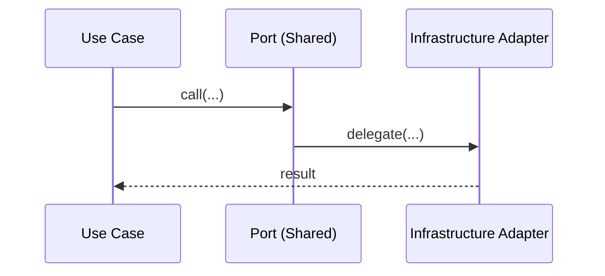
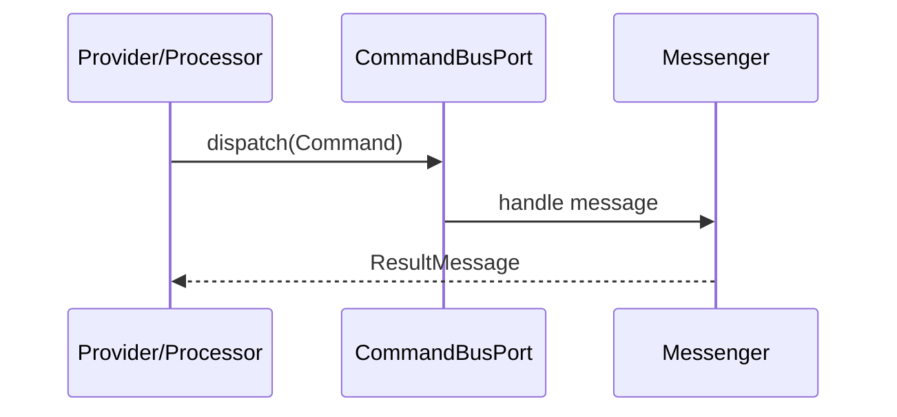

# Shared Module

## Overview

Shared is the repo-wide kernel. It provides stable contracts, base value objects,
ports, and infrastructure adapters used across all modules. It does not contain
business logic or API endpoints.

## API Endpoints

None.

## Flows

### Outbound Port -> Adapter

### Inbound Bus Port

## Architecture

- Application: message types, ports, contracts (pagination), factories, and shared exceptions.
- Domain: value objects, domain events, traits, and domain services.
- Infrastructure: Symfony adapters, serializer normalizer, event dispatcher/listener,
  and infrastructure exceptions.

Key folders:
- `src/Shared/Application/Contract`
- `src/Shared/Application/Message`
- `src/Shared/Application/Port`
- `src/Shared/Domain/ValueObject`
- `src/Shared/Infrastructure/Symfony/Adapter`

## Configuration

- Service wiring: `config/modules/shared.yaml`
- Parameters: `config/services.yaml` (e.g., `shared.file_storage.base_path`)

## Testing

- Unit: `tests/Unit/Shared`
- Architecture rules: `tests/Architecture`

## Error Codes

Not applicable.
