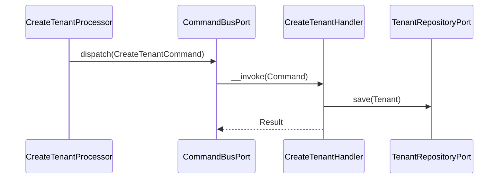
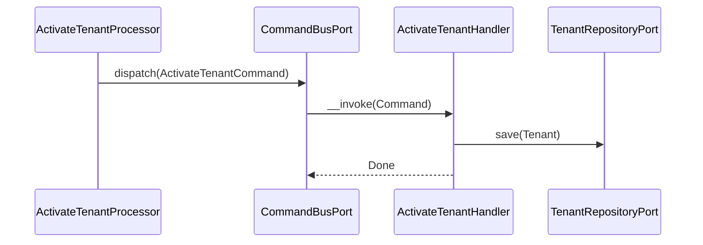
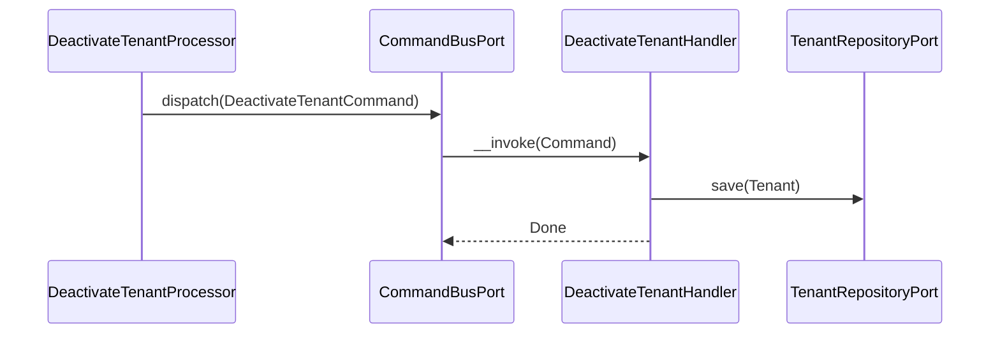
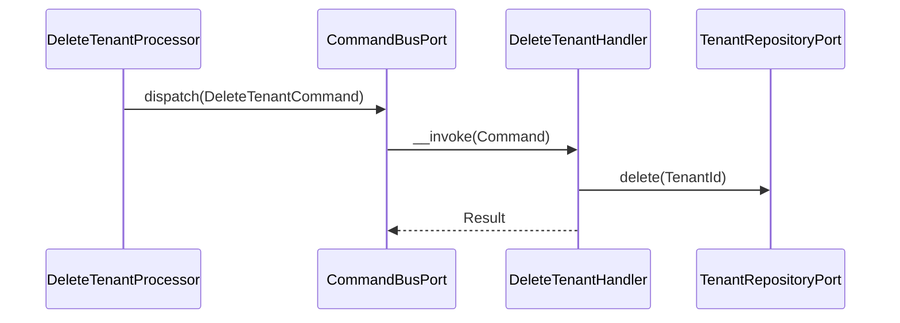
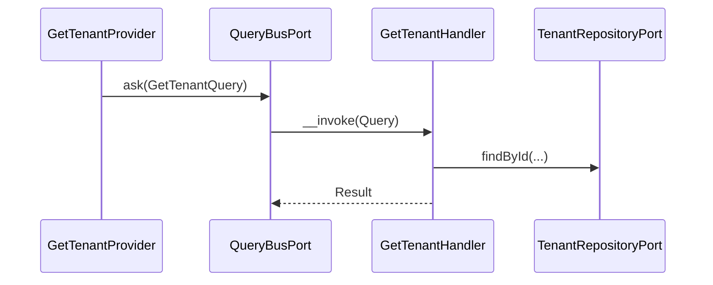
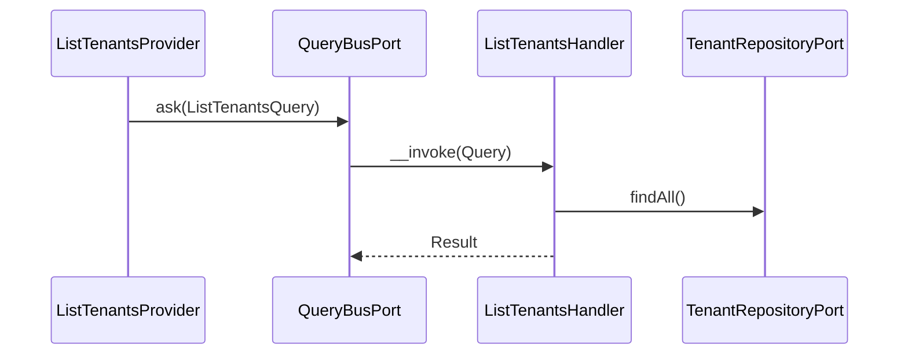

# Tenant Module

## Overview

Tenant manages multi-tenant configuration for the auth server. It stores per-tenant
OAuth settings (token TTLs, PKCE requirements, allowed scopes, optional issuer) and
exposes endpoints to create, read, update, activate/deactivate, and delete tenants.

## API Endpoints

| Resource | Method | Path | Description |
| --- | --- | --- | --- |
| Tenant | GET | `/api/tenants` | List all tenants |
| Tenant | GET | `/api/tenants/{id}` | Get a tenant by ID |
| Tenant | POST | `/api/tenants` | Create a tenant |
| Tenant | PATCH | `/api/tenants/{id}` | Update a tenant |
| Tenant | PUT | `/api/tenants/{id}` | Replace a tenant |
| Tenant | DELETE | `/api/tenants/{id}` | Delete a tenant |
| Tenant | POST | `/api/tenants/{id}/activate` | Activate a tenant |
| Tenant | POST | `/api/tenants/{id}/deactivate` | Deactivate a tenant |

## Settings

| Setting | Default | Constraints | Description |
| --- | --- | --- | --- |
| accessTokenTtl | 3600 | 300 - 86400 | Access token TTL in seconds |
| refreshTokenTtl | 86400 | 3600 - 2592000 | Refresh token TTL in seconds |
| requirePkce | true | - | Enforce PKCE for OAuth2 flows |
| allowPublicClients | false | Requires requirePkce=true | Allow public clients |
| allowedScopes | ["openid","profile","email"] | Non-empty strings | Allowed OAuth2 scopes |
| customIssuer | null | Valid URL when set | Optional custom issuer URL |

## Flows

### Create Tenant (Command)



### Update Tenant (Command)


### Activate Tenant (Command)



### Deactivate Tenant (Command)



### Delete Tenant (Command)



### Get Tenant (Query)



### List Tenants (Query)



## Architecture

- Presentation: Api Platform resources, processors, providers, DTOs.
- Application: Use cases (Command/Query), ports.
- Domain: Tenant aggregate, value objects, domain events.
- Infrastructure: Doctrine repository and mapper.

Key folders:
- `src/Tenant/Presentation/Api`
- `src/Tenant/Application/UseCase`
- `src/Tenant/Domain`
- `src/Tenant/Infrastructure`

## Configuration

- Service wiring: `config/modules/tenant.yaml`
- Doctrine filter: `config/packages/doctrine.yaml` (tenant filter)

## Security Considerations

- Tenant management endpoints require authentication and explicit permissions.
- Public clients must have PKCE enabled (`allowPublicClients` implies `requirePkce`).
- Token TTLs are bounded to prevent unsafe token lifetimes.
- Tenant isolation is enforced via a Doctrine filter using `X-Tenant-Id` (or `X-Tenant`)
  headers and is applied to entities exposing a `tenantId` field.

## API Integration Examples

### Create Tenant

```json
{
  "name": "Acme Corp",
  "accessTokenTtl": 3600,
  "refreshTokenTtl": 86400,
  "requirePkce": true,
  "allowPublicClients": false,
  "allowedScopes": ["openid", "profile", "email"],
  "customIssuer": "https://auth.acme.example"
}
```

### Update Tenant

```json
{
  "name": "Acme Corp EU",
  "accessTokenTtl": 5400,
  "refreshTokenTtl": 172800,
  "requirePkce": true,
  "allowPublicClients": true,
  "allowedScopes": ["openid", "profile"],
  "customIssuer": "https://eu-auth.acme.example"
}
```

### Activate / Deactivate

```
POST /api/tenants/{id}/activate
POST /api/tenants/{id}/deactivate
```

## Testing

- Unit: `tests/Unit/Tenant`
- Run module tests: `make test tests/Unit/Tenant`
