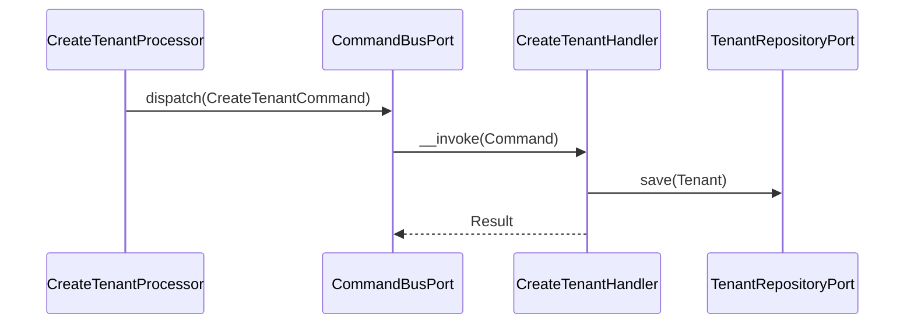
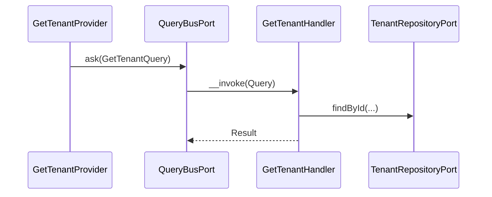
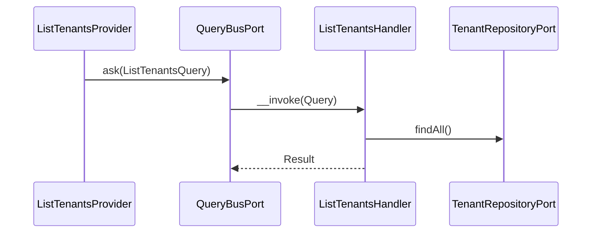

# Tenant Module

## Overview

Tenant manages multi-tenant configuration for the auth server. It stores per-tenant
OAuth settings (token TTLs, PKCE requirements) and exposes endpoints to create and
read tenant configurations.

## API Endpoints

| Resource | Method | Path | Description |
| --- | --- | --- | --- |
| Tenant | GET | `/api/tenants` | List all tenants |
| Tenant | GET | `/api/tenants/{id}` | Get a tenant by ID |
| Tenant | POST | `/api/tenants` | Create a tenant |

## Flows

### Create Tenant (Command)

### Get Tenant (Query)

### List Tenants (Query)

## Architecture

- Presentation: Api Platform resources, processors, providers, DTOs.
- Application: Use cases (Command/Query), ports.
- Domain: Tenant aggregate, value objects, domain events.
- Infrastructure: Doctrine repository and mapper.

Key folders:
- `src/Tenant/Presentation/Api`
- `src/Tenant/Application/UseCase`
- `src/Tenant/Domain`
- `src/Tenant/Infrastructure`

## Configuration

- Service wiring: `config/modules/tenant.yaml`

## Testing

- Unit: `tests/Unit/Tenant`
- Run module tests: `make test tests/Unit/Tenant`
