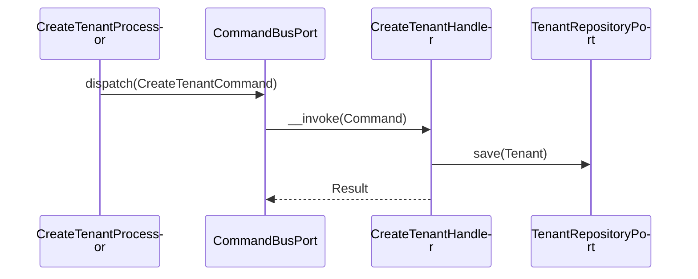
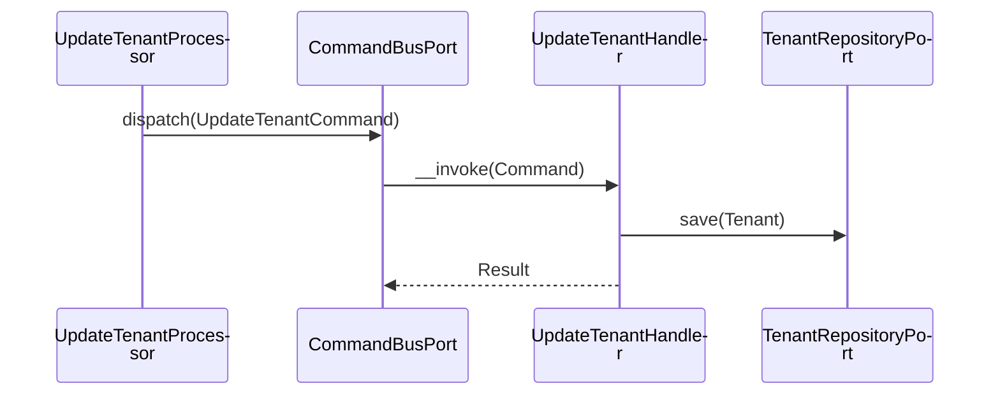
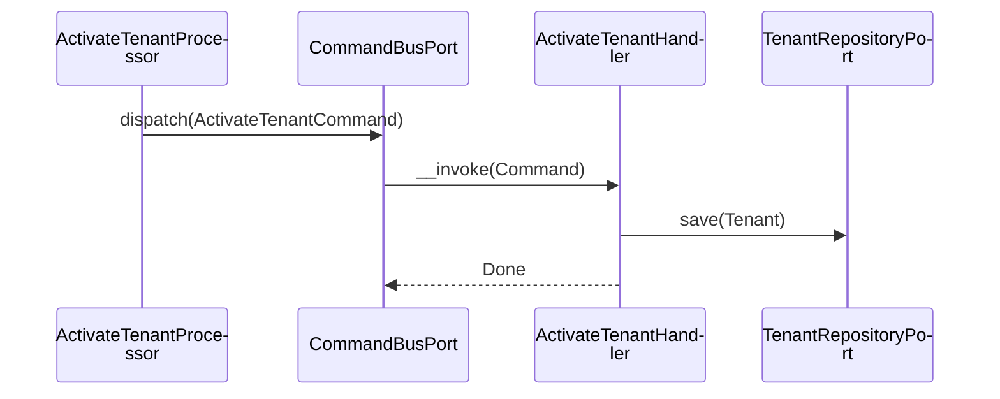
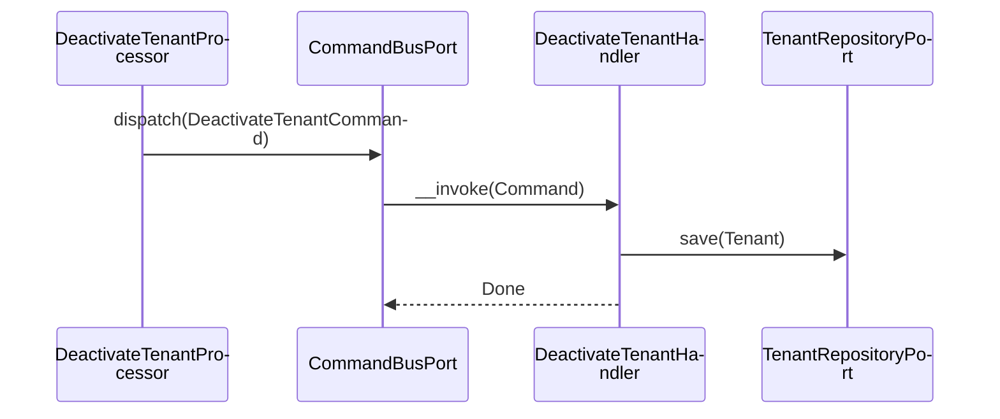
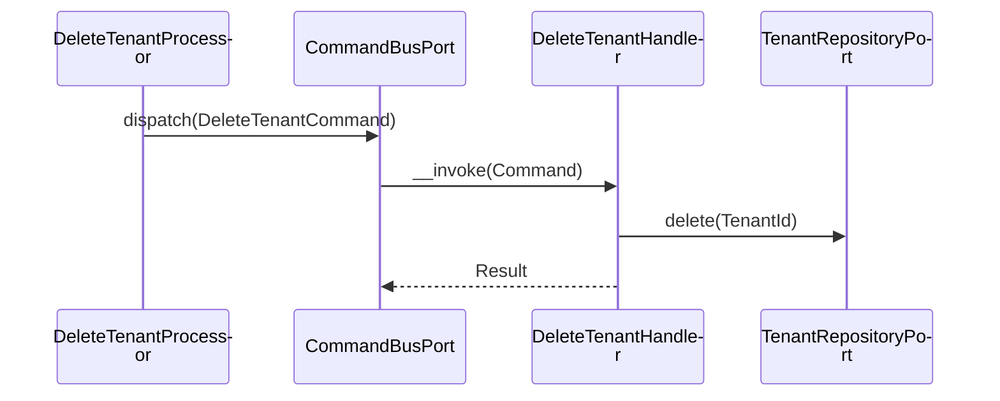
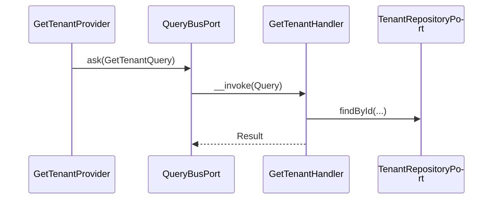
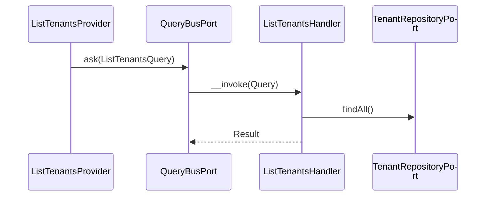

# Tenant Module

**Reading guide:** [Documentation index](../../docs/README.md) · [Related guide](../../docs/guides/organization-and-access.md).

## Overview

Tenant manages multi-tenant configuration for the API. It stores per-tenant
OAuth settings (token TTLs, PKCE requirements, allowed scopes, optional issuer) and
exposes endpoints to create, read, update, activate/deactivate, and delete tenants.

## API Endpoints

| Resource | Method | Path                           | Description         |
| -------- | ------ | ------------------------------ | ------------------- |
| Tenant   | GET    | `/api/tenants`                 | List all tenants    |
| Tenant   | GET    | `/api/tenants/{id}`            | Get a tenant by ID  |
| Tenant   | POST   | `/api/tenants`                 | Create a tenant     |
| Tenant   | PATCH  | `/api/tenants/{id}`            | Update a tenant     |
| Tenant   | PUT    | `/api/tenants/{id}`            | Replace a tenant    |
| Tenant   | DELETE | `/api/tenants/{id}`            | Delete a tenant     |
| Tenant   | POST   | `/api/tenants/{id}/activate`   | Activate a tenant   |
| Tenant   | POST   | `/api/tenants/{id}/deactivate` | Deactivate a tenant |

## Settings

| Setting            | Default                      | Constraints               | Description                   |
| ------------------ | ---------------------------- | ------------------------- | ----------------------------- |
| accessTokenTtl     | 3600                         | 300 - 86400               | Access token TTL in seconds   |
| refreshTokenTtl    | 86400                        | 3600 - 2592000            | Refresh token TTL in seconds  |
| requirePkce        | true                         | -                         | Enforce PKCE for OAuth2 flows |
| allowPublicClients | false                        | Requires requirePkce=true | Allow public clients          |
| allowedScopes      | ["openid","profile","email"] | Non-empty strings         | Allowed OAuth2 scopes         |
| customIssuer       | null                         | Valid URL when set        | Optional custom issuer URL    |

## Flows

### Create Tenant (Command)

The tenant command creates the aggregate through its owned repository. Contextual validation precedes persistence and returned results.


```mermaid
---
config:
  sequence:
    wrap: true
---
sequenceDiagram
  participant API as CreateTenantProcessor
  participant Bus as CommandBusPort
  participant UC as CreateTenantHandler
  participant Repo as TenantRepositoryPort
  API->>Bus: dispatch(CreateTenantCommand)
  Bus->>UC: __invoke(Command)
  UC->>Repo: save(Tenant)
  UC-->>Bus: Result
```

### Update Tenant (Command)

The command loads and updates the tenant under its existing validation contract, then persists through the repository port.


```mermaid
---
config:
  sequence:
    wrap: true
---
sequenceDiagram
  participant API as UpdateTenantProcessor
  participant Bus as CommandBusPort
  participant UC as UpdateTenantHandler
  participant Repo as TenantRepositoryPort
  API->>Bus: dispatch(UpdateTenantCommand)
  Bus->>UC: __invoke(Command)
  UC->>Repo: save(Tenant)
  UC-->>Bus: Result
```

### Activate Tenant (Command)

Activation invokes the tenant domain transition before persisting its result. The HTTP adapter remains a translation boundary.


```mermaid
---
config:
  sequence:
    wrap: true
---
sequenceDiagram
  participant API as ActivateTenantProcessor
  participant Bus as CommandBusPort
  participant UC as ActivateTenantHandler
  participant Repo as TenantRepositoryPort
  API->>Bus: dispatch(ActivateTenantCommand)
  Bus->>UC: __invoke(Command)
  UC->>Repo: save(Tenant)
  UC-->>Bus: Done
```

### Deactivate Tenant (Command)

Deactivation invokes the tenant domain transition before persisting its result. The HTTP adapter remains a translation boundary.


```mermaid
---
config:
  sequence:
    wrap: true
---
sequenceDiagram
  participant API as DeactivateTenantProcessor
  participant Bus as CommandBusPort
  participant UC as DeactivateTenantHandler
  participant Repo as TenantRepositoryPort
  API->>Bus: dispatch(DeactivateTenantCommand)
  Bus->>UC: __invoke(Command)
  UC->>Repo: save(Tenant)
  UC-->>Bus: Done
```

### Delete Tenant (Command)

Deletion is handled by the tenant use case and its repository contract. Repeated/missing-resource behavior follows the endpoint contract.


```mermaid
---
config:
  sequence:
    wrap: true
---
sequenceDiagram
  participant API as DeleteTenantProcessor
  participant Bus as CommandBusPort
  participant UC as DeleteTenantHandler
  participant Repo as TenantRepositoryPort
  API->>Bus: dispatch(DeleteTenantCommand)
  Bus->>UC: __invoke(Command)
  UC->>Repo: delete(TenantId)
  UC-->>Bus: Result
```

### Get Tenant (Query)

The item query reads a tenant through its owner and returns a transport-safe result. It does not mutate lifecycle state.


```mermaid
---
config:
  sequence:
    wrap: true
---
sequenceDiagram
  participant API as GetTenantProvider
  participant Bus as QueryBusPort
  participant UC as GetTenantHandler
  participant Repo as TenantRepositoryPort
  API->>Bus: ask(GetTenantQuery)
  Bus->>UC: __invoke(Query)
  UC->>Repo: findById(...)
  UC-->>Bus: Result
```

### List Tenants (Query)

The collection query reads tenant records with the server query contract. Collection scope and totals are determined before serialization.


```mermaid
---
config:
  sequence:
    wrap: true
---
sequenceDiagram
  participant API as ListTenantsProvider
  participant Bus as QueryBusPort
  participant UC as ListTenantsHandler
  participant Repo as TenantRepositoryPort
  API->>Bus: ask(ListTenantsQuery)
  Bus->>UC: __invoke(Query)
  UC->>Repo: findAll()
  UC-->>Bus: Result
```

## Architecture

- Presentation: Api Platform resources, processors, providers, DTOs.
- Application: Use cases (Command/Query), ports.
- Domain: Tenant aggregate, value objects, domain events.
- Infrastructure: Doctrine repository and mapper.

Key folders:

- `src/Tenant/Presentation/Api`
- `src/Tenant/Application/UseCase`
- `src/Tenant/Domain`
- `src/Tenant/Infrastructure`

## Configuration

- Service wiring: `config/modules/tenant.yaml`
- Doctrine filter: `config/packages/doctrine.yaml` (tenant filter)

## Security Considerations

- Tenant management endpoints require authentication and explicit permissions.
- Public clients must have PKCE enabled (`allowPublicClients` implies `requirePkce`).
- Token TTLs are bounded to prevent unsafe token lifetimes.
- Tenant isolation is enforced via a Doctrine filter using `X-Tenant-Id` (or `X-Tenant`)
  headers (or a `tenantId` query parameter) and is applied to entities exposing a
  `tenantId` field.
- Records carrying `Shared\Infrastructure\Doctrine\Attribute\TenantFilterExempt` opt out
  of that filter. The authorization tables (`roles`, `role_assignments`, `permissions`) do:
  they are read to resolve the caller's own grants, so filtering them by the tenant of the
  request being served stripped those grants and made every permission-gated endpoint answer 403. They are scoped explicitly by their repositories instead.

## API Integration Examples

### Create Tenant

```json
{
  "name": "Acme Corp",
  "accessTokenTtl": 3600,
  "refreshTokenTtl": 86400,
  "requirePkce": true,
  "allowPublicClients": false,
  "allowedScopes": ["openid", "profile", "email"],
  "customIssuer": "https://auth.acme.example"
}
```

### Update Tenant

```json
{
  "name": "Acme Corp EU",
  "accessTokenTtl": 5400,
  "refreshTokenTtl": 172800,
  "requirePkce": true,
  "allowPublicClients": true,
  "allowedScopes": ["openid", "profile"],
  "customIssuer": "https://eu-auth.acme.example"
}
```

### Activate / Deactivate

```
POST /api/tenants/{id}/activate
POST /api/tenants/{id}/deactivate
```

## Testing

- Unit: `tests/Unit/Tenant`
- Run module tests: `php -d memory_limit=1G vendor/bin/phpunit tests/Unit/Tenant`

## Error Codes

No additional stable module-specific error-code catalog is declared here. The resource security, validation and exception translation define the public HTTP responses; consult this module's endpoint contracts and [OpenAPI schema](../../openapi.json). A future distinct public code must be documented in this section with its triggering condition.
