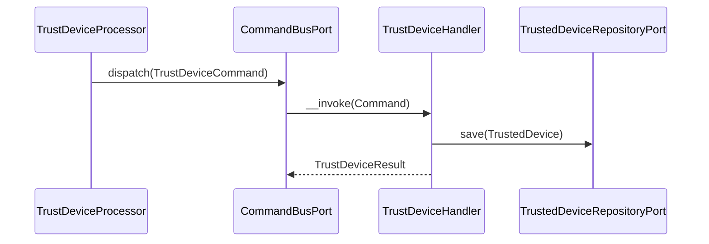
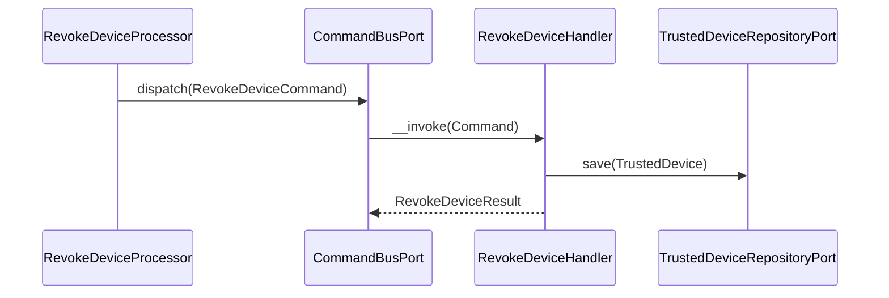
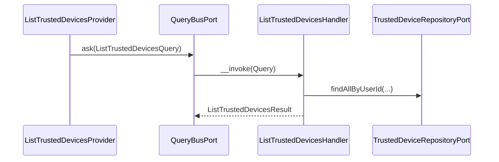

# TrustedDevice Module

## Overview

TrustedDevice manages device trust to allow MFA bypass for known devices.
It issues and revokes trusted device tokens, persists device metadata, and
attaches a secure cookie to the response when a device is trusted.

## API Endpoints

| Resource | Method | Path | Description |
| --- | --- | --- | --- |
| TrustedDevice | POST | `/api/trusted-devices` | Trust the current device |
| TrustedDevice | GET | `/api/trusted-devices` | List trusted devices |
| TrustedDevice | DELETE | `/api/trusted-devices/{id}` | Revoke a trusted device |
| TrustedDevice | POST | `/api/trusted-devices/revoke-all` | Revoke all trusted devices |

## Flows

### Trust Device (Command)

### Revoke Device (Command)

### List Trusted Devices (Query)

## Architecture

- Presentation: Api Platform resources, processors, providers, DTOs, cookie listener.
- Application: Use cases (Command/Query) and ports.
- Domain: TrustedDevice aggregate, value objects, and events.
- Infrastructure: Doctrine repository, mapper, and record.

Key folders:
- `src/TrustedDevice/Presentation/Api`
- `src/TrustedDevice/Application/UseCase`
- `src/TrustedDevice/Domain`
- `src/TrustedDevice/Infrastructure`

## Configuration

- Service wiring: `config/modules/trusted_device.yaml`
- Environment:
  - `TRUSTED_DEVICE_COOKIE_NAME` (cookie base name)
  - `TRUSTED_DEVICE_LIFETIME` (seconds, default 30 days)

## Testing

- E2E: `tests/E2E/TrustedDeviceFlowTest.php`
- Run module tests: `make test tests/E2E/TrustedDeviceFlowTest.php`
