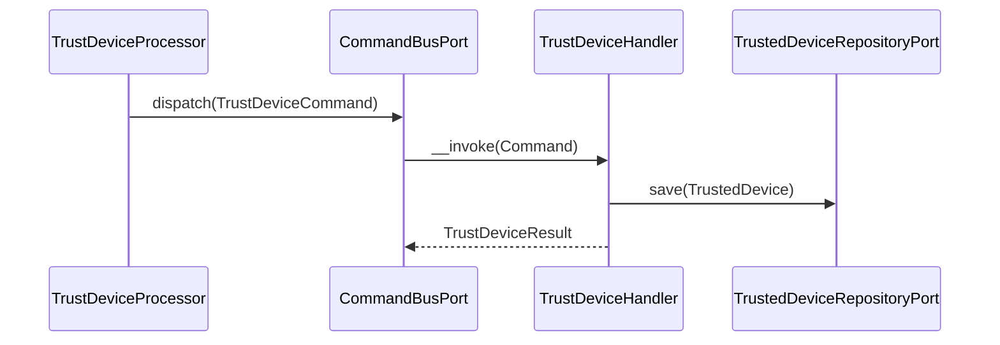
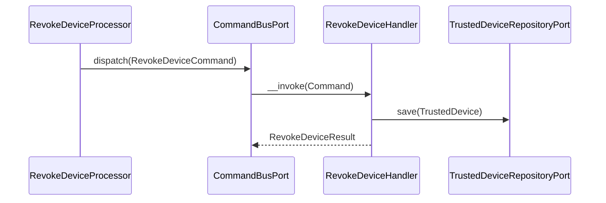
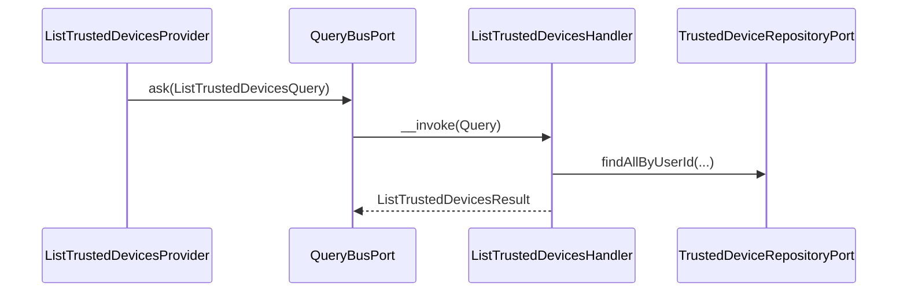

# TrustedDevice Module

**Reading guide:** [Documentation index](../../docs/README.md) · [Related guide](../../docs/guides/authentication.md).

## Overview

TrustedDevice manages device trust to allow MFA bypass for known devices.
It issues and revokes trusted device tokens, persists device metadata, and
attaches a secure cookie to the response when a device is trusted.

## API Endpoints

Operation names use the `trusted_device_` prefix to remain globally unique across
API Platform resources. The public URLs and cookie contract are unchanged.

| Resource      | Method | Path                              | Description                |
| ------------- | ------ | --------------------------------- | -------------------------- |
| TrustedDevice | POST   | `/api/trusted-devices`            | Trust the current device   |
| TrustedDevice | GET    | `/api/trusted-devices`            | List trusted devices       |
| TrustedDevice | DELETE | `/api/trusted-devices/{id}`       | Revoke a trusted device    |
| TrustedDevice | POST   | `/api/trusted-devices/revoke-all` | Revoke all trusted devices |

## Flows

### Trust Device (Command)

Trusting a device records the owner's bounded trust credential after the required identity checks. It does not replace bearer/session authorization.

```mermaid
sequenceDiagram
  participant API as TrustDeviceProcessor
  participant Bus as CommandBusPort
  participant UC as TrustDeviceHandler
  participant Repo as TrustedDeviceRepositoryPort
  API->>Bus: dispatch(TrustDeviceCommand)
  Bus->>UC: __invoke(Command)
  UC->>Repo: save(TrustedDevice)
  UC-->>Bus: TrustDeviceResult
```

### Revoke Device (Command)

The command revokes the selected trust record. Future trust checks observe the revocation while session/token lifecycles remain separately owned.

```mermaid
sequenceDiagram
  participant API as RevokeDeviceProcessor
  participant Bus as CommandBusPort
  participant UC as RevokeDeviceHandler
  participant Repo as TrustedDeviceRepositoryPort
  API->>Bus: dispatch(RevokeDeviceCommand)
  Bus->>UC: __invoke(Command)
  UC->>Repo: save(TrustedDevice)
  UC-->>Bus: RevokeDeviceResult
```

### List Trusted Devices (Query)

The query projects trusted-device records for the authorized caller. Raw trust credentials are not returned by collection serialization.

```mermaid
sequenceDiagram
  participant API as ListTrustedDevicesProvider
  participant Bus as QueryBusPort
  participant UC as ListTrustedDevicesHandler
  participant Repo as TrustedDeviceRepositoryPort
  API->>Bus: ask(ListTrustedDevicesQuery)
  Bus->>UC: __invoke(Query)
  UC->>Repo: findAllByUserId(...)
  UC-->>Bus: ListTrustedDevicesResult
```

## Architecture

- Presentation: Api Platform resources, processors, providers, DTOs, cookie listener.
- Application: Use cases (Command/Query) and ports.
- Domain: TrustedDevice aggregate, value objects, and events.
- Infrastructure: Doctrine repository, mapper, and record.

Key folders:

- `src/TrustedDevice/Presentation/Api`
- `src/TrustedDevice/Application/UseCase`
- `src/TrustedDevice/Domain`
- `src/TrustedDevice/Infrastructure`

## Configuration

- Service wiring: `config/modules/trusted_device.yaml`
- Environment:
  - `TRUSTED_DEVICE_COOKIE_NAME` (cookie base name)
  - `TRUSTED_DEVICE_LIFETIME` (seconds, default 30 days)

## Testing

- E2E: `tests/E2E/TrustedDeviceFlowTest.php`
- Run module tests: `php -d memory_limit=1G vendor/bin/phpunit tests/E2E/TrustedDeviceFlowTest.php`

## Error Codes

No additional stable module-specific error-code catalog is declared here. The resource security, validation and exception translation define the public HTTP responses; consult this module's endpoint contracts and [OpenAPI schema](../../openapi.json). A future distinct public code must be documented in this section with its triggering condition.
