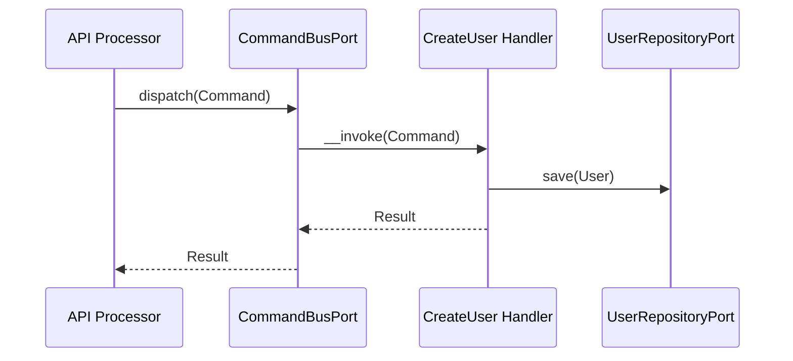
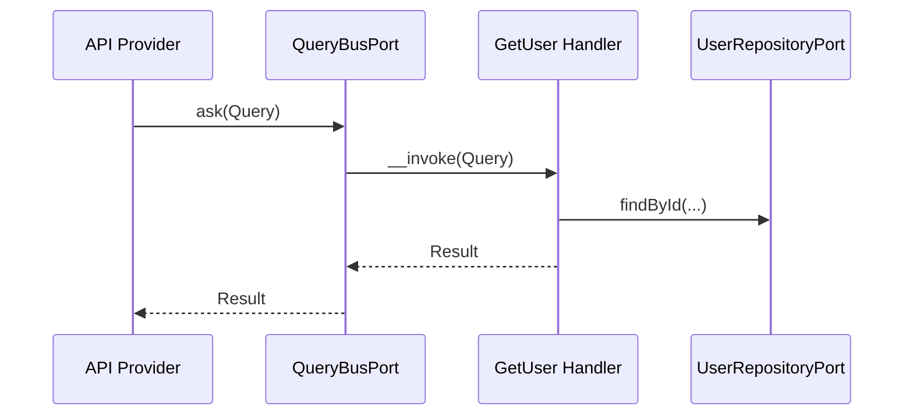

# User Module

## Overview

User manages account lifecycle (provisioning, profile updates, lookup, and deletion).
It owns the User aggregate and exposes Api Platform resources for CRUD operations.
User deletion also purges linked auth data (sessions, consents, tokens, OTPs, trusted devices).

## API Endpoints

| Resource | Method | Path | Description |
| --- | --- | --- | --- |
| CurrentUserProfile | GET | `/api/me` | Get the authenticated user profile with global roles, permissions, and `totpEnabled` (TOTP MFA status) |
| CurrentUserProfile | PATCH | `/api/me` | Update the authenticated user profile (first name, last name, preferred display language) |
| CurrentUserProfile | PUT | `/api/me/avatar` | Replace the authenticated user avatar |
| CurrentUserProfile | POST | `/api/me/deactivate` | Self-service deactivation of the authenticated user's own account (requires `profile.update`) |
| User | POST | `/api/users` | Create a user |
| User | GET | `/api/users/{id}` | Get user details |
| User | GET | `/api/users` | List users |
| User | PATCH | `/api/users/{id}` | Update user profile |
| User | PUT | `/api/users/{id}` | Replace user profile |
| User | DELETE | `/api/users/{id}` | Delete a user |
| User | POST | `/api/users/{id}/activate` | Activate a user |
| User | POST | `/api/users/{id}/deactivate` | Deactivate a user |
| User | POST | `/api/users/{id}/verify-email` | Mark email as verified |

## Flows

### Create User (Command)

### Get User (Query)

## Architecture

- Presentation: Api Platform resources, processors, providers, DTOs.
- Application: Use cases (Command/Query), ports, event handlers, contracts.
- Domain: User aggregate, value objects, domain events.
- Infrastructure: Doctrine repositories, mappers, fixtures, console commands.

Key folders:
- `src/User/Presentation/Api`
- `src/User/Application/UseCase`
- `src/User/Domain`
- `src/User/Infrastructure`
- `src/User/Application/Contract/User/UserView.php`

### Cross-module reads

- `GetCurrentUserProfileHandler` depends directly on `Otp\Application\Port\Inbound\Totp\TotpStatusPort`
  (an inbound port owned by the Otp module) to expose `totpEnabled` on `/api/me`,
  mirroring how it already depends on `Authorization\Application\Port\Inbound\AuthorizationPort`
  for roles/permissions. The User module never reaches into Otp's Domain or
  Infrastructure layers.

### Cross-module writes

- `DeactivateUserHandler` (shared by the admin `POST /users/{id}/deactivate` and the
  self-service `POST /me/deactivate` endpoints) depends directly on
  `Session\Application\Port\Outbound\SessionRepositoryPort` (an outbound port owned
  by the Session module) to revoke all of the user's active sessions on
  deactivation, so "you're signed out everywhere" actually holds for both paths.
  This mirrors the existing precedent in `Auth\...\ConfirmPasswordChangeHandler` /
  `ConfirmPasswordResetHandler`, which already depend on the same port. The User
  module never reaches into Session's Domain or Infrastructure layers.
- Deactivation does **not** touch OAuth2 access/refresh tokens (see the OAuth
  module's `TokenRevocationPort`, used by password-change/reset) and does **not**
  touch organization memberships. Both are intentionally out of scope for this
  use case: memberships are left as-is (an inactive user simply becomes unable to
  authenticate, per `UserStatus::canLogin()`), and any UI/authorization surface
  that lists org members should filter on user status if it needs to hide them.
  A future lot may want to revoke OAuth2 tokens too and/or notify
  organization owners of member deactivation.

### Self-service account deactivation (`POST /me/deactivate`)

- Idempotent: deactivating an already-inactive user is a no-op on the domain
  side (no `UserDeactivatedEvent` re-emitted) but session revocation is always
  attempted defensively.
- Reactivation is **admin-only** (`POST /users/{id}/activate`, requires
  `users.update`). There is no self-service reactivation endpoint, and a
  deactivated user's own JWT — even if not yet expired — never carries the
  `users.update` permission, so a deactivated user cannot reactivate themselves.
- Emits `User\Domain\Event\UserDeactivatedEvent` (aggregate type `user`) on the
  first transition to `inactive`.

## Configuration

- Service wiring: `config/modules/user.yaml`
- Fixtures: `User\Infrastructure\DataFixtures\UserFixtures` — `admin` /
  `testuser`, three legacy demo accounts, the client-credentials user, and the
  `STAFF_SEEDS` demo workforce (password `UserFixtures::STAFF_PASSWORD`).
  The workforce deliberately covers every `UserStatus`: a directory of nothing
  but active accounts never exercises the "cannot log in" and "awaiting
  verification" paths the admin screens are built around.
  `OrganizationFixtures::STAFF_MEMBER_SEEDS` turns the same accounts into
  organization members, mirroring their account state in `isActive`.
  `BULK_STAFF_COUNT` (40) generated accounts on top of those push the user
  directory — and, via `OrganizationFixtures::BULK_MEMBER_COUNT`, the member
  roster — past 50 rows so their admin lists actually paginate.

## Testing

- Unit: `tests/Unit/User`
- Run module tests: `make test tests/Unit/User`

## Error Codes

- `UserAlreadyExistsException` -> user already exists
- `UserNotFoundException` -> user not found
- `InvalidUserException` -> user cannot login
- `InvalidPasswordException` -> password mismatch
