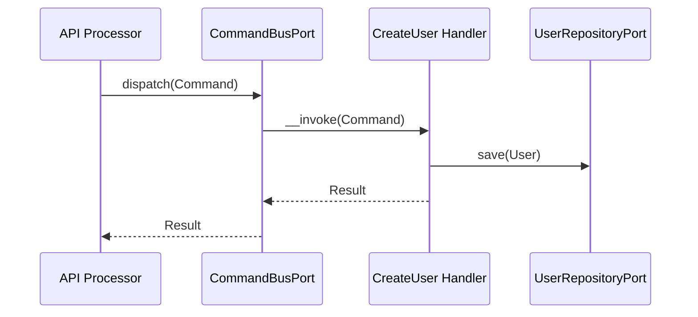
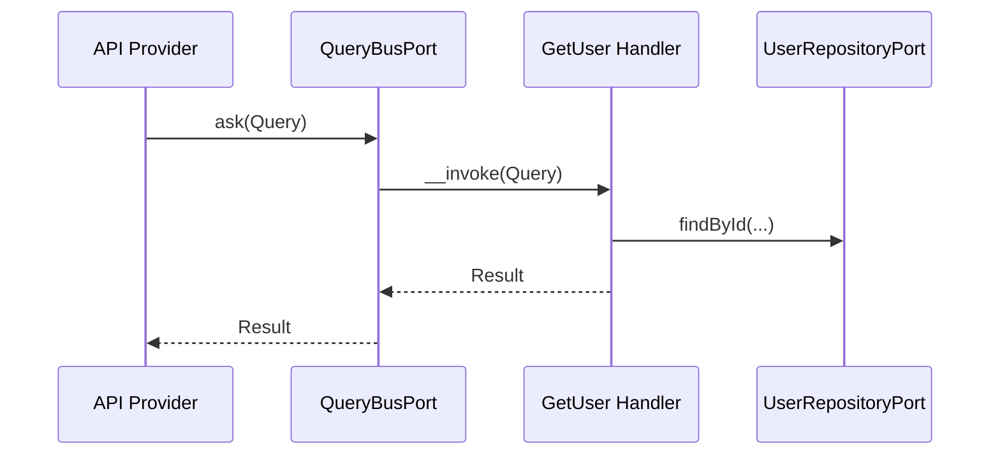
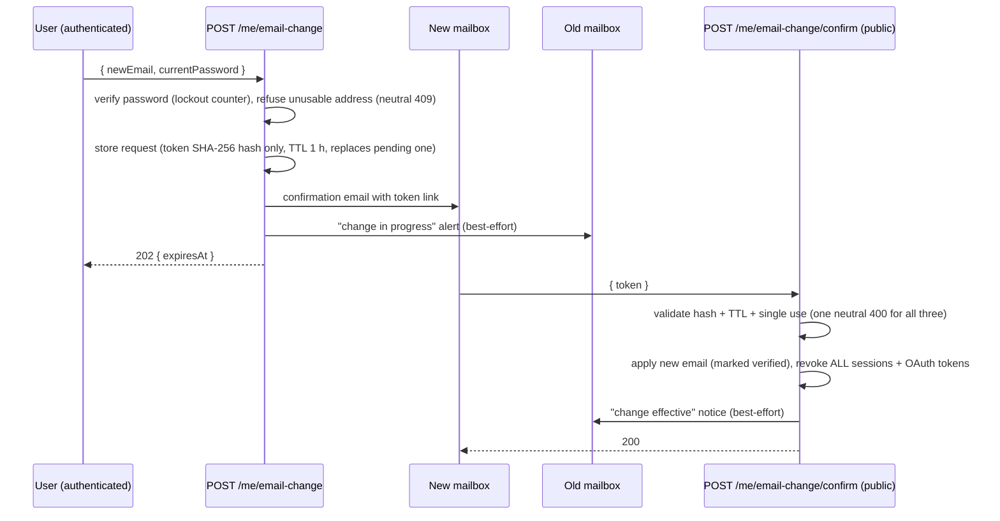

# User Module

## Overview

User manages account lifecycle (provisioning, profile updates, lookup, and deletion).
It owns the User aggregate and exposes Api Platform resources for CRUD operations.
User deletion also purges linked auth data (sessions, consents, tokens, OTPs, trusted devices).

## API Endpoints

| Resource | Method | Path | Description |
| --- | --- | --- | --- |
| CurrentUserProfile | GET | `/api/me` | Get the authenticated user profile with global roles, permissions, and `totpEnabled` (TOTP MFA status) |
| CurrentUserProfile | PATCH | `/api/me` | Update the authenticated user profile (first name, last name, preferred display language) |
| CurrentUserProfile | PUT | `/api/me/avatar` | Replace the authenticated user avatar |
| CurrentUserProfile | POST | `/api/me/deactivate` | Self-service deactivation of the authenticated user's own account (requires `profile.update`) |
| EmailChange | POST | `/api/me/email-change` | Request a sign-in email change (password verified; confirmation link emailed to the new address, alert to the old one) — 202 |
| EmailChange | POST | `/api/me/email-change/confirm` | **Public.** Confirm the change with the emailed token; applies the new email and revokes every session and OAuth token — 200 |
| EmailChange | DELETE | `/api/me/email-change` | Cancel the pending email change request (idempotent) — 204 |
| User | POST | `/api/users` | Create a user |
| User | GET | `/api/users/{id}` | Get user details |
| User | GET | `/api/users` | List users |
| User | PATCH | `/api/users/{id}` | Update user profile |
| User | PUT | `/api/users/{id}` | Replace user profile |
| User | DELETE | `/api/users/{id}` | Delete a user |
| User | POST | `/api/users/{id}/activate` | Activate a user |
| User | POST | `/api/users/{id}/deactivate` | Deactivate a user |
| User | POST | `/api/users/{id}/verify-email` | Mark email as verified |

Removed 2026-08-20: `GET /api/users/statuses` (unconsumed reference catalog; the
frontend's localized typed registries are the source of these values).

## Flows

### Create User (Command)

### Get User (Query)

## Architecture

- Presentation: Api Platform resources, processors, providers, DTOs.
- Application: Use cases (Command/Query), ports, event handlers, contracts.
- Domain: User aggregate, value objects, domain events.
- Infrastructure: Doctrine repositories, mappers, fixtures, console commands.

Key folders:
- `src/User/Presentation/Api`
- `src/User/Application/UseCase`
- `src/User/Domain`
- `src/User/Infrastructure`
- `src/User/Application/Contract/User/UserView.php`

### Cross-module reads

- `GetCurrentUserProfileHandler` depends directly on `Otp\Application\Port\Inbound\Totp\TotpStatusPort`
  (an inbound port owned by the Otp module) to expose `totpEnabled` on `/api/me`,
  mirroring how it already depends on `Authorization\Application\Port\Inbound\AuthorizationPort`
  for roles/permissions. The User module never reaches into Otp's Domain or
  Infrastructure layers.

### Cross-module writes

- `DeactivateUserHandler` (shared by the admin `POST /users/{id}/deactivate` and the
  self-service `POST /me/deactivate` endpoints) depends directly on
  `Session\Application\Port\Outbound\SessionRepositoryPort` (an outbound port owned
  by the Session module) to revoke all of the user's active sessions on
  deactivation, so "you're signed out everywhere" actually holds for both paths.
  This mirrors the existing precedent in `Auth\...\ConfirmPasswordChangeHandler` /
  `ConfirmPasswordResetHandler`, which already depend on the same port. The User
  module never reaches into Session's Domain or Infrastructure layers.
- Deactivation does **not** touch OAuth2 access/refresh tokens (see the OAuth
  module's `TokenRevocationPort`, used by password-change/reset) and does **not**
  touch organization memberships. Both are intentionally out of scope for this
  use case: memberships are left as-is (an inactive user simply becomes unable to
  authenticate, per `UserStatus::canLogin()`), and any UI/authorization surface
  that lists org members should filter on user status if it needs to hide them.
  A future lot may want to revoke OAuth2 tokens too and/or notify
  organization owners of member deactivation.

### Self-service account deactivation (`POST /me/deactivate`)

- Idempotent: deactivating an already-inactive user is a no-op on the domain
  side (no `UserDeactivatedEvent` re-emitted) but session revocation is always
  attempted defensively.
- Reactivation is **admin-only** (`POST /users/{id}/activate`, requires
  `users.update`). There is no self-service reactivation endpoint, and a
  deactivated user's own JWT — even if not yet expired — never carries the
  `users.update` permission, so a deactivated user cannot reactivate themselves.
- Emits `User\Domain\Event\UserDeactivatedEvent` (aggregate type `user`) on the
  first transition to `inactive`.

### Sign-in email change (`/me/email-change`)

Two-step, email-confirmation-protected change of the address used to sign in.

Decisions, recorded:

- **Email-taken oracle.** Public registration answers 409 "An account already
  exists with this email address", so address existence is already public on
  this API. This endpoint keeps the 409 status family for consistency with
  register but answers ONE neutral message — `This email address cannot be
  used.` — for both "taken" and "identical to the current address", so the
  authenticated surface adds no second, richer probing channel.
- **Confirm is public.** The link lands in the new mailbox where no session may
  exist, and the repo's registration email-verification (OTP challenge verify)
  is likewise unauthenticated: possession of the emailed secret is the
  credential. The token is 32 bytes of CSPRNG, stored only as a SHA-256 hash,
  single-use, 1 h TTL; the endpoint is rate limited per IP
  (`email_change_confirm`).
- **All sessions are invalidated on confirm** (imposed policy): the email is
  the sign-in identifier, so the change behaves like the password change
  confirm — `SessionRepositoryPort::revokeAllForUser` +
  `TokenRevocationPort::revokeAllUserTokens`, fail-safe. The user signs in
  again with the new address; a hijacker who raced the flow loses access.
  Note: login-flow session tracking is best-effort, so an access token whose
  session was never recorded remains valid until expiry (see SECURITY.md).
- **One pending request per user** — a new request deletes the previous
  unconfirmed one (`removePendingForUser`), so only the latest token confirms.
- **Confirm re-checks availability**: an address registered by someone else
  between request and confirmation is refused (neutral 409). The pre-check
  still races with concurrent registrations, so the handler saves the user
  FIRST and maps a `users.email` unique-constraint violation to the same
  neutral 409 — the token is only burned (single conditional
  `UPDATE … WHERE confirmed_at IS NULL`, exactly one winner under
  concurrency) after the user save succeeded, so a conflicting save can
  never consume it.
- **Session/token revocation on confirm is best-effort** (documented
  decision): the email change is already durable when revocation runs, so a
  revocation backend failure keeps the 200 — the failure is surfaced as an
  explicit warning log and the sessions/tokens die at their natural expiry.
- **Accepted risk — token in the query string.** The emailed confirmation
  link carries the raw token as a query parameter
  (`…/confirm?token=…`): possession of the emailed secret IS the
  credential, exactly like the registration email-verification flow.
  Mail-scanner prefetch (e.g. Safe Links) that follows the link only loads
  the frontend page — the token is spent by an explicit POST — but a
  scanner that also submits could burn the single-use token: an
  availability risk (the user re-requests), never a confidentiality one,
  since the change lands on the address the user already controls.
  Consigned as accepted.
- **Accepted risk / follow-up — no session-less cancel.** The alert email
  to the old address says a change is in progress but offers no way to
  stop it without signing in; a victim locked out of their session cannot
  cancel from the email alone. Follow-up noted: consider a single-use
  cancel link in the alert email (same hash-only storage discipline as the
  confirm token).
- Audit ledger entries: `user.email_change_requested` / `user.email_change_confirmed`
  / `user.email_change_cancelled`, addresses sanitized + hashed via
  `AuditPiiSanitizer` (never raw in metadata).
- Storage: `user_email_change_requests` (**auth** database, migration
  `DoctrineMigrations\Auth\Version20260828090000`).
- Emails: `user_email_change_confirm.html.twig` (new address, token link) and
  `user_email_change_notice.html.twig` (old address, pending/effective),
  localized en/fr/es (`emailChange.*` keys in `translations/emails.*.yaml`).

## Configuration

- Service wiring: `config/modules/user.yaml`
- Rate limiters (`config/packages/rate_limiter.yaml`): `email_change_request`
  (per user, 5/min) **and** `email_change_request_ip` (per IP, 5/min) on
  `POST /me/email-change` — both dimensions are consumed on every call, same
  budget as `registration` so this endpoint is never the cheaper email-taken
  enumeration channel; `email_change_confirm` (per IP, 30/min) on the public
  confirm endpoint.
- Frontend confirm link base: `%app.frontend_url%` (`APP_FRONTEND_URL`) —
  `<frontend>/account/email-change/confirm?token=...`.
- Fixtures: `User\Infrastructure\DataFixtures\UserFixtures` — `admin` /
  `testuser`, three legacy demo accounts, the client-credentials user, and the
  `STAFF_SEEDS` demo workforce (password `UserFixtures::STAFF_PASSWORD`).
  The workforce deliberately covers every `UserStatus`: a directory of nothing
  but active accounts never exercises the "cannot log in" and "awaiting
  verification" paths the admin screens are built around.
  `OrganizationFixtures::STAFF_MEMBER_SEEDS` turns the same accounts into
  organization members, mirroring their account state in `isActive`.
  `BULK_STAFF_COUNT` (40) generated accounts on top of those push the user
  directory — and, via `OrganizationFixtures::BULK_MEMBER_COUNT`, the member
  roster — past 50 rows so their admin lists actually paginate.

## Testing

- Unit: `tests/Unit/User`
- Run module tests: `make test tests/Unit/User`

## Error Codes

- `UserAlreadyExistsException` -> user already exists
- `UserNotFoundException` -> user not found
- `InvalidUserException` -> user cannot login
- `InvalidPasswordException` -> password mismatch
- `EmailChangeNotAllowedException` -> neutral "this address cannot be used" (409)
- `EmailChangeRequestNotFoundException` -> invalid/expired/reused confirmation token (400)
