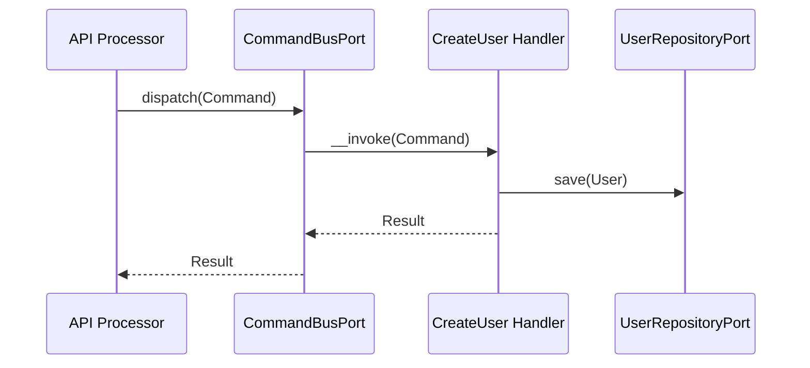
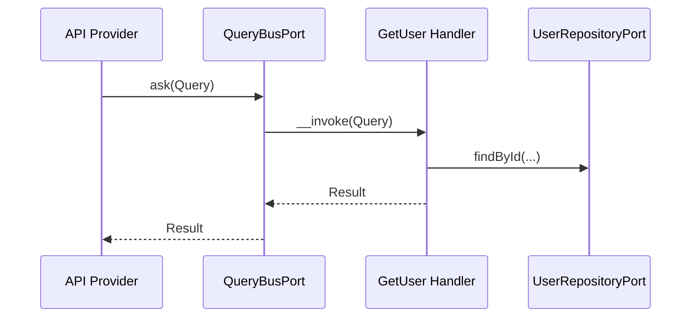

# User Module

## Overview

User manages account lifecycle (provisioning, profile updates, lookup, and deletion).
It owns the User aggregate and exposes Api Platform resources for CRUD operations.
User deletion also purges linked auth data (sessions, consents, tokens, OTPs, trusted devices).

## API Endpoints

| Resource | Method | Path | Description |
| --- | --- | --- | --- |
| CurrentUserProfile | GET | `/api/me` | Get the authenticated user profile with global roles and permissions |
| CurrentUserProfile | PATCH | `/api/me` | Update the authenticated user profile |
| CurrentUserProfile | PUT | `/api/me/avatar` | Replace the authenticated user avatar |
| User | POST | `/api/users` | Create a user |
| User | GET | `/api/users/{id}` | Get user details |
| User | GET | `/api/users` | List users |
| User | PATCH | `/api/users/{id}` | Update user profile |
| User | PUT | `/api/users/{id}` | Replace user profile |
| User | DELETE | `/api/users/{id}` | Delete a user |
| User | POST | `/api/users/{id}/activate` | Activate a user |
| User | POST | `/api/users/{id}/deactivate` | Deactivate a user |
| User | POST | `/api/users/{id}/verify-email` | Mark email as verified |

## Flows

### Create User (Command)

### Get User (Query)

## Architecture

- Presentation: Api Platform resources, processors, providers, DTOs.
- Application: Use cases (Command/Query), ports, event handlers, contracts.
- Domain: User aggregate, value objects, domain events.
- Infrastructure: Doctrine repositories, mappers, fixtures, console commands.

Key folders:
- `src/User/Presentation/Api`
- `src/User/Application/UseCase`
- `src/User/Domain`
- `src/User/Infrastructure`
- `src/User/Application/Contract/User/UserView.php`

## Configuration

- Service wiring: `config/modules/user.yaml`
- Fixtures: `User\Infrastructure\DataFixtures\UserFixtures`

## Testing

- Unit: `tests/Unit/User`
- Run module tests: `make test tests/Unit/User`

## Error Codes

- `UserAlreadyExistsException` -> user already exists
- `UserNotFoundException` -> user not found
- `InvalidUserException` -> user cannot login
- `InvalidPasswordException` -> password mismatch
