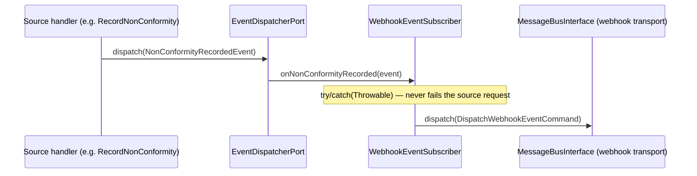
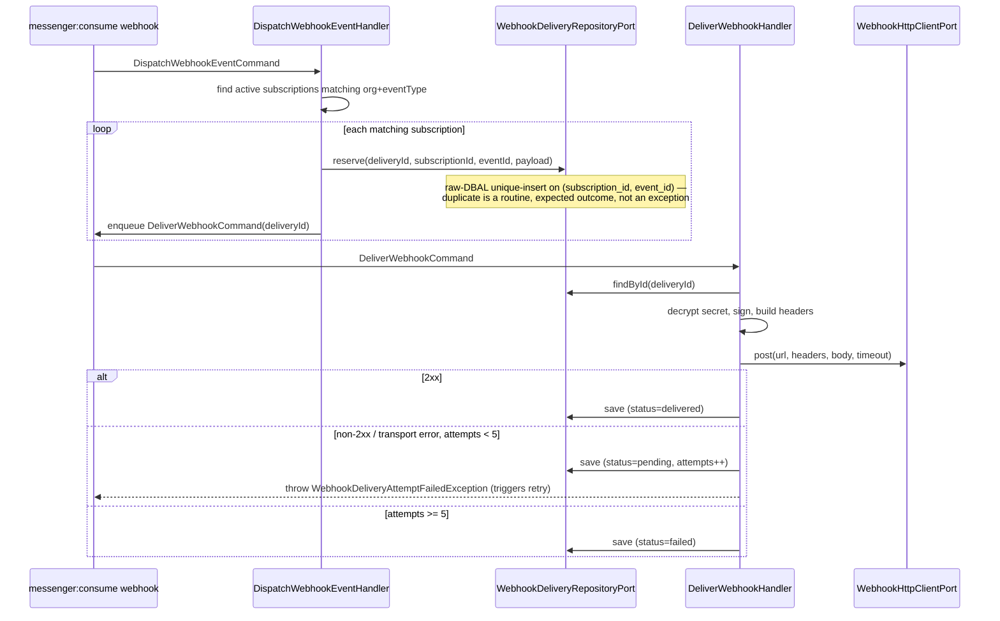

# Webhook Module

## Overview

Webhook lets an organization register outbound HTTP subscriptions that
receive a **curated, stable public contract** of significant events —
equipment lifecycle transitions, inspection/non-conformity events,
intervention publication, maintenance campaign generation, and facility
archival/restoration — as signed, asynchronous, retried POST requests.

Main goals:

- Turn a small, explicit allowlist of internal domain events into a stable
  public event contract, decoupled from internal refactors.
- Deliver asynchronously (never in the triggering request's thread), with
  retry/backoff and a durable per-attempt delivery log.
- Sign every delivery (HMAC-SHA256) so a consumer can verify authenticity
  and detect replay.
- Harden the target URL against SSRF (private/loopback/reserved addresses,
  cloud metadata endpoints) both at subscription time and at send time.

## API Endpoints

| Method | Path | Description | Permission |
| --- | --- | --- | --- |
| POST | `/api/organizations/{organizationId}/webhooks` | Create a subscription; returns the plaintext signing secret once | `organization.webhooks.manage` |
| GET | `/api/organizations/{organizationId}/webhooks` | List an organization's subscriptions | `organization.webhooks.read` |
| GET | `/api/organizations/{organizationId}/webhooks/{webhookId}` | Get a subscription | `organization.webhooks.read` |
| PATCH | `/api/organizations/{organizationId}/webhooks/{webhookId}` | Partially update `url`/`eventTypes`/`isActive`/`description` | `organization.webhooks.manage` |
| DELETE | `/api/organizations/{organizationId}/webhooks/{webhookId}` | Delete a subscription and its delivery log | `organization.webhooks.manage` |
| POST | `/api/organizations/{organizationId}/webhooks/{webhookId}/rotate-secret` | Generate a new signing secret; returns it once | `organization.webhooks.manage` |
| POST | `/api/organizations/{organizationId}/webhooks/{webhookId}/ping` | Enqueue a synthetic `webhook.ping` test delivery | `organization.webhooks.manage` |
| GET | `/api/organizations/{organizationId}/webhooks/{webhookId}/deliveries` | Delivery log (filter: `status`) | `organization.webhooks.read` |
| POST | `/api/organizations/{organizationId}/webhooks/{webhookId}/deliveries/{deliveryId}/redeliver` | Re-enqueue a delivery (any status, including terminally `failed`) | `organization.webhooks.manage` |
| GET | `/api/webhooks/event-types` | Reference catalog of subscribable event types | `ROLE_USER` |

Every operation requires `ROLE_USER` at the resource level; the
finer-grained permission checks above are self-enforced in the application
layer by each handler through `OrganizationAuthorizationPort`, mirroring
Maintenance/Import.

**Deviation from the original lot brief:** the brief's `sharedFilesModified`
sketch suggested a flat `/api/webhooks/**` route family (mirroring Import,
which is org-scoped via a query filter, not a path segment) and routing
`RedeliverWebhookCommand` onto the async `webhook` transport. This module
instead nests every subscription/delivery route under
`/organizations/{organizationId}/webhooks/**`, mirroring
`TeamResource`/`OrganizationRoleResource` (path-based org scoping is the
majority convention for org-owned resources), and keeps
`RedeliverWebhookCommand` **synchronous** (dispatched via `CommandBusPort`
from the API processor) — only the freshly re-armed delivery's
`DeliverWebhookCommand` goes on the async `webhook` transport. Routing
`RedeliverWebhookCommand` itself onto `webhook` would break the endpoint's
synchronous JSON response: `MessengerCommandBusAdapter::dispatch()` requires
a `HandledStamp`, which an async-routed dispatch never produces (see
`Import\Infrastructure\Adapter\Messenger\MessengerImportJobQueueAdapter`'s
docblock for the precedent this avoids replicating).

## Curated event allowlist

`Application\Contract\Event\WebhookEventCatalog` holds the exact internal
dispatcher event names (`<module>.<snake_case_class>`, per
`Shared\Infrastructure\EventDispatcher\SymfonyEventDispatcherAdapter`),
cross-checked against `Audit\Infrastructure\EventSubscriber\AuditEventSubscriber`
which already subscribes to every one of them:

| Public type (`WebhookEventType`) | Internal dispatched event name |
| --- | --- |
| `equipment.commissioned` | `equipment.equipment_commissioned_event` |
| `equipment.decommissioned` | `equipment.equipment_decommissioned_event` |
| `equipment.under_maintenance` | `equipment.equipment_put_under_maintenance_event` |
| `equipment.returned_to_stock` | `equipment.equipment_returned_to_stock_event` |
| `inspection.submitted` | `inspection.inspection_submitted_event` |
| `inspection.closed` | `inspection.inspection_closed_event` |
| `inspection.non_conformity_recorded` | `inspection.non_conformity_recorded_event` |
| `inspection.non_conformity_status_changed` | `inspection.non_conformity_status_changed_event` |
| `intervention.published` | `intervention.intervention_published_event` |
| `maintenance.campaign_generated` | `maintenance.maintenance_campaign_generated_event` |
| `facility.archived` | `facility.facility_archived_event` |
| `facility.restored` | `facility.facility_restored_event` |
| `webhook.ping` | *(never dispatched from a real event — reserved for the test-delivery endpoint)* |

Excluded by policy: every auth/oauth/otp/session event (security-internal),
per-message Messaging events (volume/PII), and Audit's own events. Renaming
a source domain event requires updating both `WebhookEventCatalog` and
`WebhookEventSubscriber` — do not rename without checking both.

## Flow

### Dispatch (event-driven, request thread — enqueue only)



`WebhookEventSubscriber` mirrors `AuditEventSubscriber` exactly (subscribes
to the curated event names, one typed handler method per event, swallows
and logs errors) but dispatches directly onto the raw Symfony message bus —
**not** `CommandBusPort`, which expects a `HandledStamp` an async-routed
dispatch never produces.

### Fan-out + delivery (async, `webhook` transport)



`PingWebhookSubscriptionHandler` and `RedeliverWebhookHandler` join this
same pipeline directly (reserve/reopen + enqueue `DeliverWebhookCommand`),
bypassing the fan-out since they target exactly one subscription.

## Signature & replay protection

- `timestamp` = unix seconds at send time.
- `signedPayload` = `"{timestamp}.{rawJsonBody}"`.
- `signature` = `hash_hmac('sha256', signedPayload, secretPlaintext)`.

Headers sent with every delivery:

| Header | Value |
| --- | --- |
| `Content-Type` | `application/json` |
| `User-Agent` | `FireGuard-Webhooks/1.0` |
| `X-FireGuard-Webhook-Id` | the delivery UUID — the consumer-side idempotency key (retries/redeliveries reuse it) |
| `X-FireGuard-Webhook-Event` | the public event type (e.g. `intervention.published`) |
| `X-FireGuard-Webhook-Timestamp` | the signed unix timestamp |
| `X-FireGuard-Webhook-Signature` | `sha256=<hex hmac>` |

A consumer should reject a delivery if `|now - timestamp| > 300s` (replay
window) and recompute the HMAC over the exact raw request body before
trusting it.

## Payload envelope

```json
{
  "id": "018f...-delivery-uuid",
  "type": "intervention.published",
  "created": "2026-07-18T09:00:00+00:00",
  "organizationId": "018f...-org-uuid",
  "data": { "interventionId": "...", "publicationId": "..." }
}
```

`data` is built by a dedicated block inline in `WebhookEventSubscriber`
(one per curated event, mirroring `AuditEventSubscriber`'s inline metadata
blocks) that reads the TYPED domain event and emits only stable, PII-free
public fields — no emails, no IP addresses, no internal identifiers beyond
the resource IDs already visible through the REST API.

## Secret storage (reversible — deliberate)

A webhook signing secret is stored **encrypted, not hashed** — the opposite
of `Shared\Domain\ValueObject\HashedSecret` used for OAuth client secrets
(one-way, verify-only). HMAC signing must reproduce the plaintext on every
delivery attempt, so `OpensslWebhookSecretCipherAdapter` (AES-256-GCM,
`WEBHOOK_ENCRYPTION_KEY`) encrypts it at rest. A reviewer must **not**
"harden" this into a one-way hash.

- Generated as `whsec_` + `bin2hex(random_bytes(24))` (mirrors Stripe's
  `STRIPE_WEBHOOK_SECRET` convention already used in this codebase).
- Returned in **plaintext exactly once**: at create time and at
  rotate-secret time. Every other read returns `WebhookSubscriptionOutput`,
  which never carries it.
- `WEBHOOK_ENCRYPTION_KEY` (base64-encoded 32 raw bytes) must never be
  logged. **Key-rotation runbook:** rotating this key invalidates every
  previously stored secret (decryption fails); a rotation requires
  re-encrypting every `webhook_subscriptions.secret_ciphertext` row with
  the new key (decrypt-with-old, encrypt-with-new) in the same maintenance
  window, or accepting that every existing subscriber must be re-created.

## SSRF hardening

`Domain\Service\WebhookUrlPolicy` (pure, I/O-free) is shared by three call
sites:

1. `Presentation\Api\Validator\ValidWebhookUrl\ValidWebhookUrlValidator` —
   input-time UX validation (400/422 on a bad URL).
2. `CreateWebhookSubscriptionHandler` / `UpdateWebhookSubscriptionHandler` —
   the **authoritative** business-rule gate; never trust the API layer
   alone.
3. `Infrastructure\Adapter\Http\SymfonyHttpWebhookClientAdapter` — **send-time
   re-validation** of the DNS-resolved address (guards against DNS
   rebinding between subscription creation and delivery time), plus
   `max_redirects: 0` (a malicious 3xx cannot retarget the request).

Rules: `https://` required unless `WEBHOOK_ALLOW_INSECURE_URLS=true` (dev
only — never in prod); the host, once resolved to a literal IP, is rejected
if it falls in a private (RFC 1918/4193), loopback, link-local (which
covers the `169.254.169.254` cloud metadata endpoint), or otherwise
reserved range (`filter_var(..., FILTER_VALIDATE_IP, FILTER_FLAG_NO_PRIV_RANGE
| FILTER_FLAG_NO_RES_RANGE)`).

**Known residual gap:** the send-time re-validation resolves the hostname
once via `gethostbyname()` and then lets `symfony/http-client` perform its
own, separate DNS resolution to actually connect — a narrow TOCTOU window
remains between the two resolutions. Full protection would require pinning
the validated IP for the actual connection (a custom DNS resolver/stream
context), which is a documented follow-up, not built in this lot.

## API tokens (documented decision — no PAT table)

Machine-to-machine REST access reuses the **existing OAuth2
client-credentials grant** (`POST /oauth2/token`, `grant_type=client_credentials`,
already supported by `league/oauth2-server`'s `ClientCredentialsGrant`) —
no new Personal Access Token table was added in this lot. Justification:

- Webhook subscription management and delivery-log reads are human-admin
  tasks, driven by the existing user session + org RBAC
  (`organization.webhooks.{read,manage}`); they need no machine token.
- A webhook **consumer** only needs the HMAC secret to verify inbound
  deliveries — it is never called back by FireGuard for anything else, so
  it needs no API token at all.
- OAuth2 client-credentials tokens are global SSO clients scoped to the
  **auth** database and carry OAuth scopes, not organization RBAC —
  bridging client → organization permission would require new auth-DB
  schema, a new authenticator, and `security.yaml` firewall changes, well
  beyond this lot's need.

If org-scoped programmatic management of webhooks is later required, the
minimal recommended follow-up is an org-scoped service-account token bound
to `{organizationId, permission scopes}` — captured here as a documented
future item, not built now.

## Rate / volume limits

Default (minimal blast radius): `CreateWebhookSubscriptionHandler` rejects
past 20 active subscriptions per organization
(`WebhookValidationException`). No per-org delivery-rate limiter is wired
in this lot; the dedicated `webhook` Messenger transport's own
`retry_strategy` bounds the blast radius of a single unreachable endpoint.
A documented, deferred alternative for monetization: promote the cap to
`OrganizationQuotaCatalog` (a `webhook_subscriptions` resource) enforced via
the existing `OrganizationQuotaLockPort`/409 pattern, gating pro/max plans.

## Architecture

- **Domain** (`src/Webhook/Domain`): `WebhookSubscription` (aggregate:
  create/reconstitute/update/rotateSecret/subscribesTo), `WebhookDelivery`
  (lifecycle aggregate: pending → delivered/failed, mirrors
  `Import\Domain\Model\ImportJob\ImportJob`'s state-machine style),
  `WebhookDeliveryStatus`, `WebhookSubscriptionId`/`WebhookDeliveryId`,
  `WebhookUrlPolicy` (SSRF policy), domain events, exceptions.
- **Application** (`src/Webhook/Application`): `WebhookEventCatalog` /
  `WebhookEventType` / `WebhookPayloadEnvelope` (Contract), outbound ports,
  use cases (subscription CRUD + rotate-secret + ping, delivery
  dispatch/deliver/redeliver, subscription/delivery queries).
- **Infrastructure** (`src/Webhook/Infrastructure`): `WebhookEventSubscriber`,
  `MessengerWebhookDeliveryQueueAdapter`, `SymfonyHttpWebhookClientAdapter`,
  `OpensslWebhookSecretCipherAdapter`, Doctrine Record/Mapper/Repository
  (main entity manager).
- **Presentation** (`src/Webhook/Presentation`): `WebhookSubscriptionResource`,
  `WebhookDeliveryResource`, `WebhookEventTypeResource` (reference catalog),
  processors, providers, Input/Output DTOs, `ValidWebhookUrl` validator,
  `WebhookExceptionMapperTrait`.

### Ports & adapters (`config/modules/webhook.yaml`)

| Port | Adapter |
| --- | --- |
| `WebhookSubscriptionRepositoryPort` | `WebhookSubscriptionRepository` |
| `WebhookDeliveryRepositoryPort` | `WebhookDeliveryRepository` |
| `WebhookDeliveryQueuePort` | `MessengerWebhookDeliveryQueueAdapter` |
| `WebhookSecretCipherPort` | `OpensslWebhookSecretCipherAdapter` |
| `WebhookHttpClientPort` | `SymfonyHttpWebhookClientAdapter` |

Cross-module: every command/query handler self-enforces
`organization.webhooks.{read,manage}` via
`Organization\Application\Port\Inbound\OrganizationAuthorizationPort`
(the Intervention/Maintenance/Import convention).

## Permissions

`organization.webhooks.read` / `organization.webhooks.manage`
(`Organization\Domain\Catalog\OrganizationPermissionCatalog`). **Not**
added to `OrganizationSystemRoleCatalog`'s `member` role — webhooks are an
admin/integration capability, granted only via a custom organization role
or the `organization.*` owner wildcard.

## Persistence

- Tables (**main** database): `webhook_subscriptions` (unique-per-id;
  index `(organization_id, is_active)`; FK `organization_id` →
  `organizations.id` `ON DELETE CASCADE`) and `webhook_deliveries` (unique
  `(subscription_id, event_id)` — the fan-out idempotency guard; index
  `(status, next_retry_at)`; index `(subscription_id, created_at)`; FK
  `subscription_id` → `webhook_subscriptions.id` `ON DELETE CASCADE`; FK
  `organization_id` → `organizations.id` `ON DELETE CASCADE`).
- Doctrine mapping: `src/Webhook/Infrastructure/Persistence/Doctrine/Record`
  (main entity manager). No ORM associations (plain string columns), FKs
  added directly in the migration — mirrors `Import\...\ImportJobRecord`.
- Migration: `migrations/main/Version20260718063344.php`.

## Configuration

- Service wiring: `config/modules/webhook.yaml`.
- Doctrine mapping (main entity manager): `config/packages/doctrine.yaml`.
- Messenger: `config/packages/messenger.yaml` — a dedicated `webhook`
  transport (`retry_strategy`: `max_retries: 5`, `delay: 1000`,
  `multiplier: 3`, `max_delay: 3600000`, `jitter: 0.5`,
  `failure_transport: failed`), routing
  `DispatchWebhookEventCommand`/`DeliverWebhookCommand` onto it. A `failed`
  transport (`doctrine://auth?queue_name=failed`) is the per-transport
  dead-letter backstop for unexpected exhaustion — the auth DB's
  `default_connection`, not the main DB, since this is a generic Messenger
  infrastructure table, not a Webhook-owned one. `when@test` overrides both
  `async` and `webhook` to `in-memory://`.
- Env vars: `WEBHOOK_ENCRYPTION_KEY` (base64, 32 raw bytes),
  `WEBHOOK_ALLOW_INSECURE_URLS` (dev-only http:// toggle),
  `WEBHOOK_HTTP_TIMEOUT` (outbound request timeout, seconds).
- Run `php bin/console app:authz:sync-permissions --update-roles` after
  changing `OrganizationPermissionCatalog` — a no-op for these two
  permissions specifically, since `OrganizationPermissionCatalog` is a
  static catalog (no DB persistence/sync step exists for organization-scoped
  permissions, unlike the platform-level `Authorization` module the sync
  command actually targets); documented here to avoid re-investigating.

## Error Codes

| Exception | HTTP |
| --- | --- |
| `WebhookSubscriptionNotFoundException` / `WebhookDeliveryNotFoundException` | 404 Not Found |
| `Organization\Domain\Exception\OrganizationAccessDeniedException` | 403 Forbidden |
| `WebhookValidationException` | 422 Unprocessable Entity |
| `InvalidArgumentException` | 400 Bad Request |

## Testing

- Unit: `tests/Unit/Webhook`
- Functional: `tests/Functional/Api/WebhookSubscriptionApiTest.php`
- Run module tests: `php vendor/bin/phpunit tests/Unit/Webhook`
